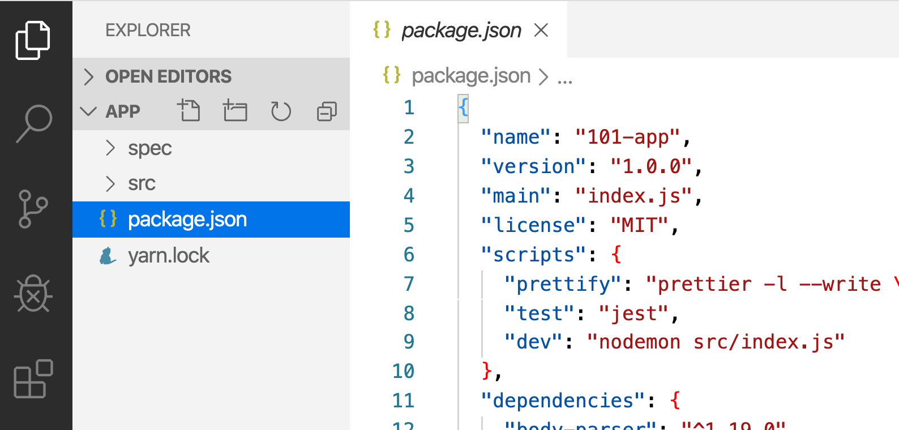
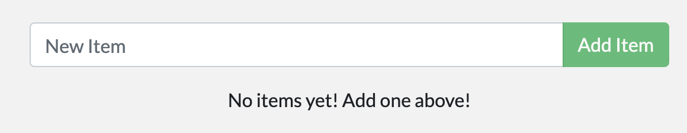
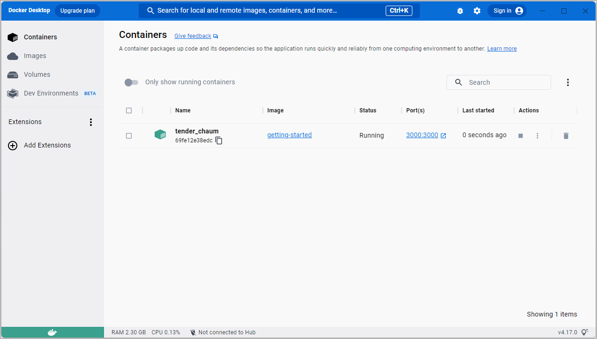

For the rest of this guide, you'll be working with a simple todo
list manager that's running in Node.js. If you're not familiar with Node.js,
don't worry. This guide doesn't require JavaScript experience.

To complete this guide, you'll need the following:

- Docker running locally. Follow the instructions to [download and install Docker](../get-docker.md).
- A [Git client](https://git-scm.com/downloads){:target="_blank" rel="noopener" class="_"}.
- An IDE or a text editor to edit files. Docker recommends using [Visual Studio Code](https://code.visualstudio.com/){:target="_blank" rel="noopener" class="_"}.
- A conceptual understanding of [containers and images](../get-started/overview.md/#docker-objects).

## Get the app

Before you can run the application, you need to get the application source code onto your machine.

1. Clone the [getting-started repository](https://github.com/docker/getting-started/tree/master){:target="_blank" rel="noopener" class="_"} using the following command:

   ```console
   $ git clone https://github.com/docker/getting-started.git
   ```

2. View the contents of the cloned repository. Inside the `getting-started/app` directory you should see `package.json` and two subdirectories (`src` and `spec`).

    {: style="width:650px;margin-top:20px;"}
    {: .text-center }

## Build the app's container image

In order to build the [container image](../get-started/overview.md/#docker-objects){:target="_blank" rel="noopener" class="_"}, you'll need to use a `Dockerfile`. A Dockerfile is simply a text-based file with no file extension. A Dockerfile contains a script of instructions that Docker uses to create a container image.

1. In the `app` directory, the same location as the `package.json` file, create a file named `Dockerfile`. You can use the following commands below to create a Dockerfile based on your operating system.

   <ul class="nav nav-tabs">
     <li class="active"><a data-toggle="tab" data-target="#mac-linux">Mac / Linux</a></li>
     <li><a data-toggle="tab" data-target="#windows">Windows</a></li>
   </ul>
   <div class="tab-content">
   <div id="mac-linux" class="tab-pane fade in active" markdown="1">

    In the terminal, run the following commands listed below.

    Change directory to the `app` directory. Replace `/path/to/app` with the path to your `getting-started/app` directory.
    ```console
    $ cd /path/to/app
    ```
    Create an empty file named `Dockerfile`.
    ```console
    $ touch Dockerfile
    ```

    <hr>
   </div>
   <div id="windows" class="tab-pane fade" markdown="1">

    In the Windows Command Prompt, run the following commands listed below.

    Change directory to the `app` directory. Replace `\path\to\app` with the path to your `getting-started\app` directory.
    ```console
    $ cd \path\to\app
    ```
    Create an empty file named `Dockerfile`.
    ```console
    $ type nul > Dockerfile
    ```
    <hr>
   </div>
   </div>

2. Using a text editor or code editor, add the following contents to the Dockerfile:

   ```dockerfile
   # syntax=docker/dockerfile:1
   
   FROM node:18-alpine
   WORKDIR /app
   COPY . .
   RUN yarn install --production
   CMD ["node", "src/index.js"]
   EXPOSE 3000
   ```
   > **Note**
   >
   > Select an instruction in the Dockerfile example to learn more about the instruction.

3. Build the container image using the following commands:

   In the terminal, change directory to the `getting-started/app` directory. Replace `/path/to/app` with the path to your `getting-started/app` directory.

   ```console
   $ cd /path/to/app
   ```

   Build the container image.
   ```console
   $ docker build -t getting-started .
   ```

   The `docker build` command uses the Dockerfile to build a new container image. You might have noticed that Docker downloaded a lot of "layers". This is because you instructed the builder that you wanted to start from the `node:18-alpine` image. But, since you didn't have that on your machine, Docker needed to download the image.

   After Docker downloaded the image, the instructions from the Dockerfile copied in your application and used `yarn` to install your application's dependencies. The `CMD` directive specifies the default command to run when starting a container from this image.

   Finally, the `-t` flag tags your image. Think of this simply as a human-readable name for the final image. Since you named the image `getting-started`, you can refer to that image when you run a container.

   The `.` at the end of the `docker build` command tells Docker that it should look for the `Dockerfile` in the current directory.

## Start an app container

Now that you have an image, you can run the application in a [container](../get-started/overview.md/#docker-objects){:target="_blank" rel="noopener" class="_"}. To do so, you will use the `docker run` command.

1. Start your container using the `docker run` command and specify the name of the image you just created:

   ```console
   $ docker run -dp 3000:3000 getting-started
   ```

   You use the `-d` flag to run the new container in "detached" mode (in the background). You also use the `-p` flag to create a mapping between the host's port 3000 to the container's port 3000.
   Without the port mapping, you wouldn't be able to access the application.

2. After a few seconds, open your web browser to [http://localhost:3000](http://localhost:3000){:target="_blank" rel="noopener" class="_"}.
   You should see your app.

   {: style="width:450px;margin-top:20px;"}
   {: .text-center }

3. Go ahead and add an item or two and see that it works as you expect. You can mark items as complete and remove items. Your frontend is successfully storing items in the backend.


At this point, you should have a running todo list manager with a few items, all built by you.

If you take a quick look at your Docker Dashboard, you should see at least one container running that is using the `getting-started` image and on port `3000`.



## Next steps

In this short section, you learned the basics about creating a Dockerfile to build a container image. Once you built an image, you started a container and saw the running app.

Next, you're going to make a modification to your app and learn how to update your running application with a new image. Along the way, you'll learn a few other useful commands.

[Update the application](03_updating_app.md){: .button .primary-btn}
