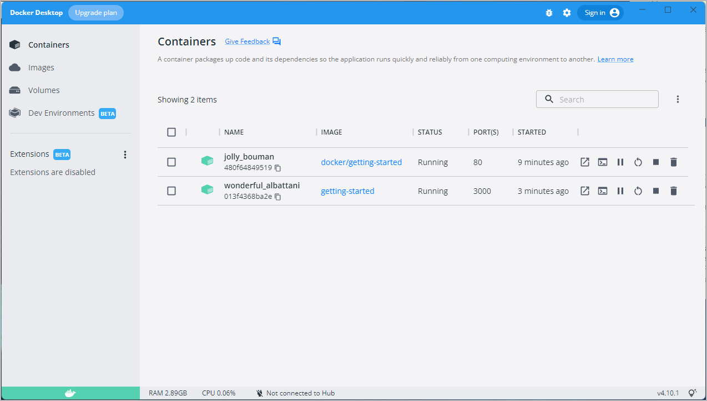

As a small feature request, we've been asked by the product team to
change the "empty text" when we don't have any todo list items. They
would like to change it to the following:

> You have no todo items yet! Add one above!

Pretty simple, right? Let's make the change.

## Update the source code

1. In the `src/static/js/app.js` file, update line 56 to use the new empty text.

    ```diff
    -                <p className="text-center">No items yet! Add one above!</p>
    +                <p className="text-center">You have no todo items yet! Add one above!</p>
    ```

2. Let's build our updated version of the image, using the same command we used before.

    ```console
    $ docker build -t getting-started .
    ```

3. Let's start a new container using the updated code.

    ```console
    $ docker run -dp 3000:3000 getting-started
    ```

**Uh oh!** You probably saw an error like this (the IDs will be different):

```console
docker: Error response from daemon: driver failed programming external connectivity on endpoint laughing_burnell 
(bb242b2ca4d67eba76e79474fb36bb5125708ebdabd7f45c8eaf16caaabde9dd): Bind for 0.0.0.0:3000 failed: port is already allocated.
```

So, what happened? We aren't able to start the new container because our old container is still
running. It is because the container is using the host's port 3000 and
only one process on the machine (containers included) can listen to a specific port. To fix this, 
we need to remove the old container.

## Replace the old container

To remove a container, it first needs to be stopped. Once it has stopped, it can be removed. We have two
ways that we can remove the old container. Feel free to choose the path that you're most comfortable with.

### Remove a container using the CLI

1. Get the ID of the container by using the `docker ps` command.

    ```console
    $ docker ps
    ```

2. Use the `docker stop` command to stop the container.

    ```console
    # Swap out <the-container-id> with the ID from docker ps
    $ docker stop <the-container-id>
    ```

3. Once the container has stopped, you can remove it by using the `docker rm` command.

    ```console
    $ docker rm <the-container-id>
    ```

>**Note**
>
>You can stop and remove a container in a single command by adding the "force" flag
>to the `docker rm` command. For example: `docker rm -f <the-container-id>`
>

### Remove a container using the Docker Dashboard

If you open the Docker dashboard, you can remove a container with two clicks! It's certainly
much easier than having to look up the container ID and remove it.

1. With the dashboard opened, hover over the app container and you'll see a collection of action
    buttons appear on the right.

2. Click on the trash can icon to delete the container. 

3. Confirm the removal and you're done!



### Start the updated app container

1. Now, start your updated app.

    ```console
    $ docker run -dp 3000:3000 getting-started
    ```

2. Refresh your browser on [http://localhost:3000](http://localhost:3000) and you should see your updated help text!

{: style="width:55%" }
{: .text-center }

## Next steps

While you were able to build an update, there were two things you might have noticed:

- All of the existing items in your todo list are gone! That's not a very good app! You'll fix that
shortly.
- There were a lot of steps involved for such a small change. In an upcoming section, you'll learn
how to see code updates without needing to rebuild and start a new container every time you make a change.

Before talking about persistence, you'll see how to share these images with others.

[Sharing the application](04_sharing_app.md){: .button .primary-btn}
