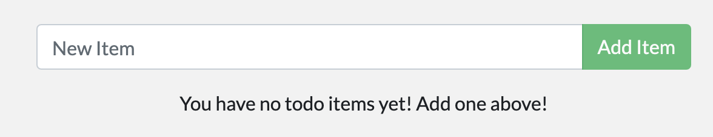

In [part 2](./02_our_app.md), you containerized a todo application. In this part, you will update the application and container image. You will also learn how to stop and remove a container.

## Update the source code

In the steps below, you will change the "empty text" when you don't have any todo list items to "You have no todo items yet! Add one above!"


1. In the `src/static/js/app.js` file, update line 56 to use the new empty text.

    ```diff
    ...
    -                <p className="text-center">No items yet! Add one above!</p>
    +                <p className="text-center">You have no todo items yet! Add one above!</p>
    ...
    ```

2. Build your updated version of the image, using the same `docker build` command you used in [part 2](./02_our_app.md/#build-the-apps-container-image){:target="_blank" rel="noopener" class="_"}.

    ```console
    $ docker build -t getting-started .
    ```

3. Start a new container using the updated code.

    ```console
    $ docker run -dp 3000:3000 getting-started
    ```

You probably saw an error like this (the IDs will be different):

```console
docker: Error response from daemon: driver failed programming external connectivity on endpoint laughing_burnell 
(bb242b2ca4d67eba76e79474fb36bb5125708ebdabd7f45c8eaf16caaabde9dd): Bind for 0.0.0.0:3000 failed: port is already allocated.
```

The error occurred because you aren't able to start the new container while your old container is still running. The reason is that the old container is already using the host's port 3000 and only one process on the machine (containers included) can listen to a specific port. To fix this, you need to remove the old container.

## Remove the old container

To remove a container, you first need to stop it. Once it has stopped, you can remove it. You can remove the old container using the CLI or Docker Desktop's graphical interface. Choose the option that you're most comfortable with.

<ul class="nav nav-tabs">
  <li class="active"><a data-toggle="tab" data-target="#cli">CLI</a></li>
  <li><a data-toggle="tab" data-target="#gui">Docker Desktop</a></li>
</ul>
<div class="tab-content">
<div id="cli" class="tab-pane fade in active" markdown="1">

### Remove a container using the CLI

1. Get the ID of the container by using the `docker ps` command.

    ```console
    $ docker ps
    ```

2. Use the `docker stop` command to stop the container. Replace &lt;the-container-id&gt; with the ID from `docker ps`.

    ```console
    $ docker stop <the-container-id>
    ```

3. Once the container has stopped, you can remove it by using the `docker rm` command.

    ```console
    $ docker rm <the-container-id>
    ```

>**Note**
>
>You can stop and remove a container in a single command by adding the `force` flag to the `docker rm` command. For example: `docker rm -f <the-container-id>`

<hr>
</div>
<div id="gui" class="tab-pane fade" markdown="1">

### Remove a container using Docker Desktop

1. Open Docker Desktop to the **Containers** view.
2. Select the trash can icon under the **Actions** column for the old, currently running container that you want to delete.
3. In the confirmation dialog, select **Delete forever**.

<hr>
</div>
</div>

### Start the updated app container

1. Now, start your updated app using the `docker run` command.

    ```console
    $ docker run -dp 3000:3000 getting-started
    ```

2. Refresh your browser on [http://localhost:3000](http://localhost:3000){:target="_blank" rel="noopener" class="_"} and you should see your updated help text.

{: style="width:55%" }
{: .text-center }

## Next steps

While you were able to build an update, there were two things you might have noticed:

- All of the existing items in your todo list are gone! That's not a very good app! You'll fix that
shortly.
- There were a lot of steps involved for such a small change. In an upcoming section, you'll learn
how to see code updates without needing to rebuild and start a new container every time you make a change.

Before talking about persistence, you'll see how to share these images with others.

[Share the application](04_sharing_app.md){: .button .primary-btn}
