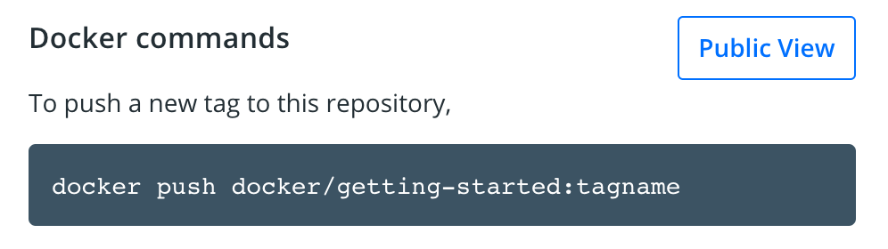
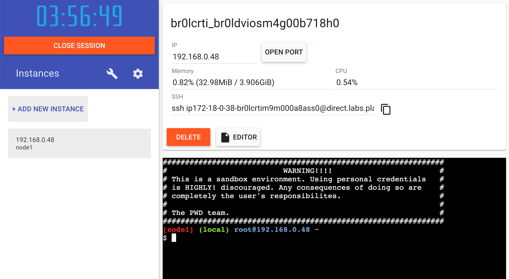

Now that we've built an image, let's share it! To share Docker images, you have to use a Docker
registry. The default registry is Docker Hub and is where all of the images we've used have come from.

> **Docker ID**
>
> A Docker ID allows you to access Docker Hub which is the world's largest library and community for container images. Create a [Docker ID](https://hub.docker.com/signup){:target="_blank" rel="noopener" class="_"} for free if you don't have one.

## Create a repo

To push an image, we first need to create a repository on Docker Hub.

1. [Sign up](https://www.docker.com/pricing?utm_source=docker&utm_medium=webreferral&utm_campaign=docs_driven_upgrade){:target="_blank" rel="noopener" class="_"} or Sign in to [Docker Hub](https://hub.docker.com){:target="_blank" rel="noopener" class="_"}.

2. Click the **Create Repository** button.

3. For the repo name, use `getting-started`. Make sure the Visibility is `Public`.

    > **Private repositories**
    >
    > Did you know that Docker offers private repositories which allows you to restrict content to specific users or teams? Check out the details on the [Docker pricing](https://www.docker.com/pricing?utm_source=docker&utm_medium=webreferral&utm_campaign=docs_driven_upgrade){:target="_blank" rel="noopener" class="_"} page.

4. Click the **Create** button!

If you look at the image below an example **Docker command** can be seen. This command will push to this repo.

{: style=width:75% }
{: .text-center }

## Push the image

1. In the command line, try running the push command you see on Docker Hub. Note that your command
   will be using your namespace, not "docker".

    ```plaintext
    $ docker push docker/getting-started
    The push refers to repository [docker.io/docker/getting-started]
    An image does not exist locally with the tag: docker/getting-started
    ```

    Why did it fail? The push command was looking for an image named docker/getting-started, but
    didn't find one. If you run `docker image ls`, you won't see one either.

    To fix this, we need to "tag" our existing image we've built to give it another name.

2. Login to the Docker Hub using the command `docker login -u YOUR-USER-NAME`.

3. Use the `docker tag` command to give the `getting-started` image a new name. Be sure to swap out
   `YOUR-USER-NAME` with your Docker ID.

    ```console
    $ docker tag getting-started YOUR-USER-NAME/getting-started
    ```
    Learn more about [docker tag](../engine/reference/commandline/tag.md).

4. Now try your push command again. If you're copying the value from Docker Hub, you can drop the 
   `tagname` portion, as we didn't add a tag to the image name. If you don't specify a tag, Docker
   will use a tag called `latest`.

    ```console
    $ docker push YOUR-USER-NAME/getting-started
    ```

## Run the image on a new instance

Now that our image has been built and pushed into a registry, let's try running our app on a brand
new instance that has never seen this container image! To do this, we will use Play with Docker.

1. Open your browser to [Play with Docker](https://labs.play-with-docker.com/){:target="_blank" rel="noopener" class="_"}.

2. Click **Login** and then select **docker** from the drop-down list.

3. Connect with your Docker Hub account.

4. Once you're logged in, click on the **ADD NEW INSTANCE** option on the left side bar. If you don't see it, make your browser a little wider. After a few seconds, a terminal window opens in your browser.

    {: style=width:75% }

5. In the terminal, start your freshly pushed app.

    ```console
    $ docker run -dp 3000:3000 YOUR-USER-NAME/getting-started
    ```

    You should see the image get pulled down and eventually start up!

6. Click on the 3000 badge when it comes up and you should see the app with your modifications! Hooray!
    If the 3000 badge doesn't show up, you can click on the "Open Port" button and type in 3000.


## Next steps

In this section, you learned how to share your images by pushing them to a registry. You then went to a
brand new instance and were able to run the freshly pushed image. This is quite common in CI pipelines,
where the pipeline will create the image and push it to a registry and then the production environment
can use the latest version of the image.

Now you can circle back around to what you noticed at the end of the last
section. As a reminder, you noticed that when you restarted the app, you lost all of your todo list items.
That's obviously not a great user experience, so next you'll learn how you can persist the data across restarts!

[Persist the DB](05_persisting_data.md){: .button  .primary-btn}