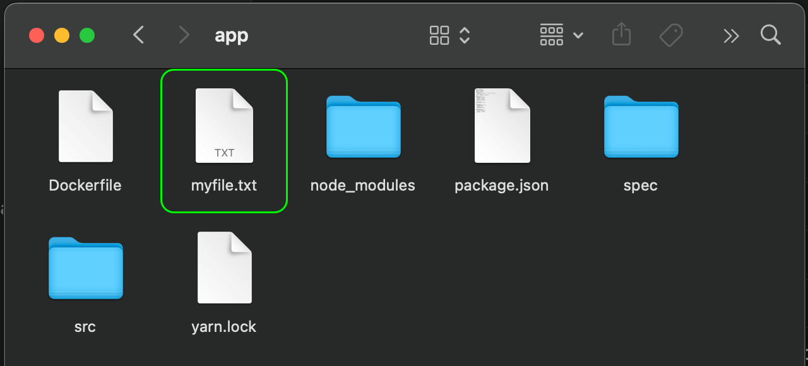
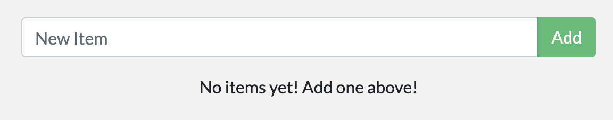

In [part 5](./05_persisting_data.md), we talked about and used a volume mount to persist the
data in our database. A volume mount is a great choice when you need somewhere
persistent to store your application data.

A bind mount is another type of mount, which lets you share a directory from the
host's filesystem into the container. When working on an application, you can
use a bind mount to mount source code into the container. The container sees the
changes you make to the code immediately, as soon as you save a file. This means
that you can run processes in the container that watch for filesystem changes
and respond to them.

In this chapter, we'll see how we can use bind mounts and a tool called
[nodemon](https://npmjs.com/package/nodemon){:target="_blank" rel="noopener"
class="_"} to watch for file changes, and then restart the application
automatically. There are equivalent tools in most other languages and
frameworks.

## Quick volume type comparisons

The following table outlines the main differences between volume mounts and bind
mounts.

|                                              | Named volumes                                      | Bind mounts                                          |
| -------------------------------------------- | -------------------------------------------------- | ---------------------------------------------------- |
| Host location                                | Docker chooses                                     | You decide                                           |
| Mount example (using `--mount`)              | `type=volume,src=my-volume,target=/usr/local/data` | `type=bind,src=/path/to/data,target=/usr/local/data` |
| Populates new volume with container contents | Yes                                                | No                                                   |
| Supports Volume Drivers                      | Yes                                                | No                                                   |

## Trying out bind mounts

Before looking at how we can use bind mounts for developing our application,
let's run a quick experiment to get a practical understanding of how bind mounts
work.

If you're following these steps on Windows, make sure to use PowerShell and not
command prompt (`cmd`).

1. Open a terminal and make sure your current working directory is in the `app`
   directory of the getting started repository.

2. Run the following command to start `bash` in an `ubuntu` container with a
   bind mount.

   ```console
   $ docker run -it --mount type=bind,src="$(pwd)",target=/src ubuntu bash
   ```

   The `--mount` option tells Docker to create a bind mount, where `src` is the
   current working directory on your host machine (`getting-started/app`), and
   `target` is where that directory should appear inside the container (`/src`).

3. After running the command, Docker starts an interactive `bash` session in the
   root directory of the container's filesystem.

   ```console
   root@ac1237fad8db:/# pwd
   /
   root@ac1237fad8db:/# ls
   bin   dev  home  media  opt   root  sbin  srv  tmp  var
   boot  etc  lib   mnt    proc  run   src   sys  usr
   ```

4. Now, change directory in the `src` directory.

   This is the directory that you mounted when starting the container. Listing
   the contents of this directory displays the same files as in the
   `getting-started/app` directory on your host machine.

   ```console
   root@ac1237fad8db:/# cd src
   root@ac1237fad8db:/src# ls
   Dockerfile  node_modules  package.json  spec  src  yarn.lock
   ```

5. Create a new file named `myfile.txt`.

   ```console
   root@ac1237fad8db:/src# touch myfile.txt
   root@ac1237fad8db:/src# ls
   Dockerfile  myfile.txt  node_modules  package.json  spec  src  yarn.lock
   ```

6. Now if you open this directory on the host, you'll see the `myfile.txt` file
   has been created in the directory.

   

7. From the host, delete the `myfile.txt` file.
8. In the container, list the contents of the `app` directory once more. You'll
   see that the file is now gone.

   ```console
   root@ac1237fad8db:/src# ls
   Dockerfile  node_modules  package.json  spec  src  yarn.lock
   ```

9. Stop the interactive container session with `Ctrl` + `D`.

And that's all for a brief introduction to bind mounts. This procedure
demonstrated how files are shared between the host and the container, and how
changes are immediately reflected on both sides. Now let's see how we can use
bind mounts to develop software.

## Run your app in a development container

The following steps describe how to run a development container with a bind
mount that does the following:

- Mount our source code into the container
- Install all dependencies
- Start `nodemon` to watch for filesystem changes

So, let's do it!

1. Make sure you don't have any `getting-started` containers currently running.

2. Run the following command from the `getting-started/app` directory.

   If you are using an Mac or Linux device, then use the following command.

   ```console
   $ docker run -dp 3000:3000 \
       -w /app --mount type=bind,src="$(pwd)",target=/app \
       node:18-alpine \
       sh -c "yarn install && yarn run dev"
   ```

   If you are using Windows, then use the following command in PowerShell.

   ```powershell
   $ docker run -dp 3000:3000 `
       -w /app --mount type=bind,src="$(pwd)",target=/app `
       node:18-alpine `
       sh -c "yarn install && yarn run dev"
   ```

   - `-dp 3000:3000` - same as before. Run in detached (background) mode and
     create a port mapping
   - `-w /app` - sets the "working directory" or the current directory that the
     command will run from
   - `--mount type=bind,src="$(pwd)",target=/app` - bind mount the current
     directory from the host into the `/app` directory in the container
   - `node:18-alpine` - the image to use. Note that this is the base image for
     our app from the Dockerfile
   - `sh -c "yarn install && yarn run dev"` - the command. We're starting a
     shell using `sh` (alpine doesn't have `bash`) and running `yarn install` to
     install packages and then running `yarn run dev` to start the development
     server. If we look in the `package.json`, we'll see that the `dev` script
     starts `nodemon`.

3. You can watch the logs using `docker logs <container-id>`. You'll know you're ready to go
   when you see this:

   ```console
   $ docker logs -f <container-id>
   nodemon src/index.js
   [nodemon] 2.0.20
   [nodemon] to restart at any time, enter `rs`
   [nodemon] watching dir(s): *.*
   [nodemon] starting `node src/index.js`
   Using sqlite database at /etc/todos/todo.db
   Listening on port 3000
   ```

   When you're done watching the logs, exit out by hitting `Ctrl`+`C`.

4. Now, make a change to the app. In the `src/static/js/app.js` file, on line
   109, change the "Add Item" button to simply say "Add":

   ```diff
   - {submitting ? 'Adding...' : 'Add Item'}
   + {submitting ? 'Adding...' : 'Add'}
   ```

   Save the file.

5. Refresh the page in your web browser, and you should see the change reflected
   almost immediately. It might take a few seconds for the Node server to
   restart. If you get an error, try refreshing after a few seconds.

   {:
   style="width:75%;" .text-center}

6. Feel free to make any other changes you'd like to make. Each time you make a
   change and save a file, the `nodemon` process restarts the app inside the
   container automatically. When you're done, stop the container and build your
   new image using:

   ```console
   $ docker build -t getting-started .
   ```

Using bind mounts is common for local development setups. The advantage is that
the development machine doesn't need to have all of the build tools and
environments installed. With a single `docker run` command, dependencies and
tools are pulled and ready to go. We'll talk about Docker Compose in a future
step, as this will help simplify our commands (we're already getting a lot of
flags).

In addition to volume mounts and bind mounts, Docker also supports other mount
types and storage drivers for handling more complex and specialized use cases.
To learn more about the advanced storage concepts, see
[Manage data in Docker](https://docs.docker.com/storage/).

## Next steps

At this point, you can persist your database and respond rapidly to the needs
and demands of your investors and founders. Hooray! But, guess what? You
received great news! Your project has been selected for future development!

In order to prepare for production, you need to migrate your database from
working in SQLite to something that can scale a little better. For simplicity,
you'll keep with a relational database and switch your application to use MySQL.
But, how should you run MySQL? How do you allow the containers to talk to each
other? You'll learn about that next!

[Multi container apps](07_multi_container.md){: .button .primary-btn}
