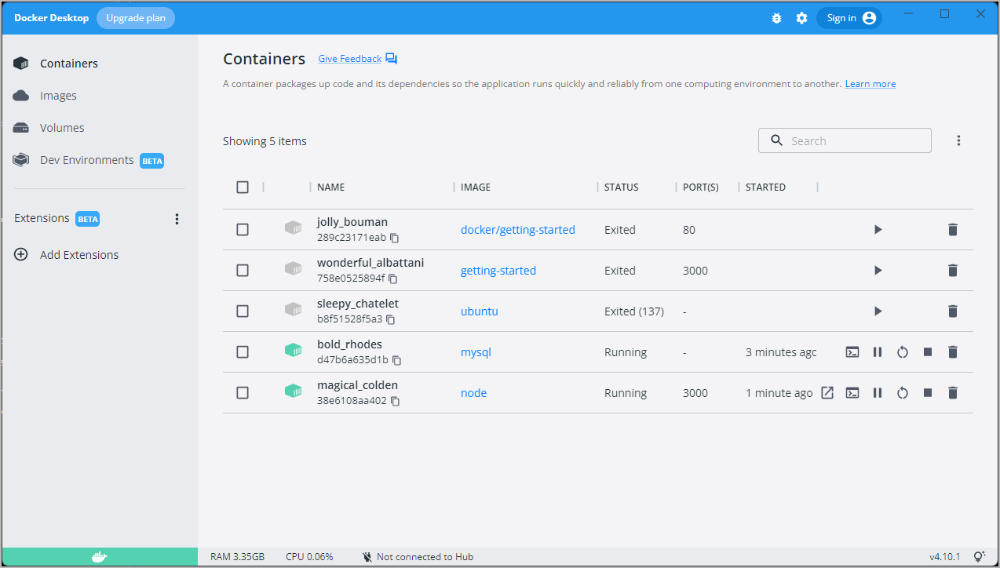

Up to this point, you have been working with single container apps. But, you now want to add MySQL to the
application stack. The following question often arises - "Where will MySQL run? Install it in the same
container or run it separately?" In general, each container should do one thing and do it well. A few reasons:

- There's a good chance you'd have to scale APIs and front-ends differently than databases.
- Separate containers let you version and update versions in isolation.
- While you may use a container for the database locally, you may want to use a managed service.
  for the database in production. You don't want to ship your database engine with your app then.
- Running multiple processes will require a process manager (the container only starts one process), 
  which adds complexity to container startup/shutdown.

And there are more reasons. So, update your application to work like this:


{: .text-center }

## Container networking

Remember that containers, by default, run in isolation and don't know anything about other processes
or containers on the same machine. So, how do you allow one container to talk to another? The answer is
networking. Now, you don't have to be a network engineer (hooray!). Simply remember this rule...

> **Note**
>
> If two containers are on the same network, they can talk to each other. If they aren't, they can't.

## Start MySQL

There are two ways to put a container on a network: 1) Assign it at start or 2) connect an existing container. For now, we will create the network first and attach the MySQL container at startup.

1. Create the network.

    ```console
    $ docker network create todo-app
    ```

2. Start a MySQL container and attach it to the network. You're also going to define a few environment variables that the
  database will use to initialize the database (see the "Environment Variables" section in the [MySQL Docker Hub listing](https://hub.docker.com/_/mysql/)).

   <ul class="nav nav-tabs">
     <li class="active"><a data-toggle="tab" data-target="#tab3" data-group="linux">Mac/Linux</a></li>
     <li><a data-toggle="tab" data-target="#tab4">M1 Mac</a></li>
     <li><a data-toggle="tab" data-target="#tab5" data-group="win">Windows</a></li>
    </ul>
    <div class="tab-content">
    <div id="tab3" class="tab-pane fade in active" markdown="1">
   
    ```console
    $ docker run -d \
        --network todo-app --network-alias mysql \
        -v todo-mysql-data:/var/lib/mysql \
        -e MYSQL_ROOT_PASSWORD=secret \
        -e MYSQL_DATABASE=todos \
        mysql:5.7
    ```
    <hr>
    </div>
    <div id="tab4" class="tab-pane fade" markdown="1">
   
    If you are using an ARM based chip, for example Macbook M1 Chips / Apple Silicon, then use this command.
    
    ```console
    $ docker run -d \
        --network todo-app --network-alias mysql \
        --platform "linux/amd64" \
        -v todo-mysql-data:/var/lib/mysql \
        -e MYSQL_ROOT_PASSWORD=secret \
        -e MYSQL_DATABASE=todos \
        mysql:5.7
    ```
   <hr>
   </div>
    <div id="tab5" class="tab-pane fade" markdown="1">
   
     If you are using Windows then use this command in PowerShell.

    ```powershell
    PS> docker run -d `
        --network todo-app --network-alias mysql `
        -v todo-mysql-data:/var/lib/mysql `
        -e MYSQL_ROOT_PASSWORD=secret `
        -e MYSQL_DATABASE=todos `
        mysql:5.7
    ```
   <hr>
   </div>
   </div>


    You'll also see the command specified the `--network-alias` flag. You'll learn about that in just a moment.

    > **Tip**
    >
    > You'll notice you're using a volume named `todo-mysql-data` here and mounting it at `/var/lib/mysql`, which is where MySQL stores its data. However, you never ran a `docker volume create` command. Docker recognizes that you want to use a named volume and creates one automatically for you.

3. To confirm you have the database up and running, connect to the database and verify it connects.

    ```console
    $ docker exec -it <mysql-container-id> mysql -u root -p
    ```

    When the password prompt comes up, type in `secret`.

4. In the MySQL shell, list the databases and verify you see the `todos` database.

    ```console
    mysql> SHOW DATABASES;
    ```

    You should see output that looks like this:

    ```plaintext
    +--------------------+
    | Database           |
    +--------------------+
    | information_schema |
    | mysql              |
    | performance_schema |
    | sys                |
    | todos              |
    +--------------------+
    5 rows in set (0.00 sec)
    ```

5. For MySQL versions 8.0 and later, run the following commands to ensure that your app can connect later.

   ```console
   mysql> ALTER USER 'root' IDENTIFIED WITH mysql_native_password BY 'secret';
   mysql> flush privileges;
   ```

6. Exit the MySQL shell to return to the shell on your machine.

   ```console
   mysql> exit
   ```

Hooray! You have your `todos` database and it's ready for you to use!

## Connect to MySQL

Now that you know MySQL is up and running, you can use it! But, the question is... how? If you run
another container on the same network, how do you find the container (remember each container has its own IP
address)?

To figure it out, you're going to make use of the [nicolaka/netshoot](https://github.com/nicolaka/netshoot) container,
which ships with a lot of tools that are useful for troubleshooting or debugging networking issues.

1. Start a new container using the nicolaka/netshoot image. Make sure to connect it to the same network.

    ```console
    $ docker run -it --network todo-app nicolaka/netshoot
    ```

2. Inside the container, you're going to use the `dig` command, which is a useful DNS tool. You're going to look up
   the IP address for the hostname `mysql`.

    ```console
    $ dig mysql
    ```

    And you'll get an output like this...

    ```text
    ; <<>> DiG 9.14.1 <<>> mysql
    ;; global options: +cmd
    ;; Got answer:
    ;; ->>HEADER<<- opcode: QUERY, status: NOERROR, id: 32162
    ;; flags: qr rd ra; QUERY: 1, ANSWER: 1, AUTHORITY: 0, ADDITIONAL: 0

    ;; QUESTION SECTION:
    ;mysql.				IN	A

    ;; ANSWER SECTION:
    mysql.			600	IN	A	172.23.0.2

    ;; Query time: 0 msec
    ;; SERVER: 127.0.0.11#53(127.0.0.11)
    ;; WHEN: Tue Oct 01 23:47:24 UTC 2019
    ;; MSG SIZE  rcvd: 44
    ```

    In the `ANSWER SECTION`, you will see an `A` record for `mysql` that resolves to `172.23.0.2`
    (your IP address will most likely have a different value). While `mysql` isn't normally a valid hostname,
    Docker was able to resolve it to the IP address of the container that had that network alias (remember the
    `--network-alias` flag you used earlier?).

    What this means is... your app only simply needs to connect to a host named `mysql` and it'll talk to the
    database! It doesn't get much simpler than that!

## Run your app with MySQL

The todo app supports the setting of a few environment variables to specify MySQL connection settings. They are:

- `MYSQL_HOST` - the hostname for the running MySQL server
- `MYSQL_USER` - the username to use for the connection
- `MYSQL_PASSWORD` - the password to use for the connection
- `MYSQL_DB` - the database to use once connected

> **Note**
>
> While using env vars to set connection settings is generally ok for development, it's **HIGHLY DISCOURAGED**
> when running applications in production. Diogo Monica, the former lead of security at Docker,
> [wrote a fantastic blog post](https://diogomonica.com/2017/03/27/why-you-shouldnt-use-env-variables-for-secret-data/){:target="_blank" rel="noopener" class="_"}
> explaining why.
>
> A more secure mechanism is to use the secret support provided by your container orchestration framework. In most cases,
> these secrets are mounted as files in the running container. You'll see many apps (including the MySQL image and the todo app)
> also support env vars with a `_FILE` suffix to point to a file containing the variable.
>
> As an example, setting the `MYSQL_PASSWORD_FILE` var will cause the app to use the contents of the referenced file
> as the connection password. Docker doesn't do anything to support these env vars. Your app will need to know to look for
> the variable and get the file contents.

With all of that explained, you can start your dev-ready container!

1. Use the following command to specify the environment variables, as well as connect the container to your app network.

   <ul class="nav nav-tabs">
     <li class="active"><a data-toggle="tab" data-target="#tab6" data-group="linux">Mac/Linux</a></li>
     <li><a data-toggle="tab" data-target="#tab7" data-group="win">Windows</a></li>
    </ul>
    <div class="tab-content">
    <div id="tab6" class="tab-pane fade in active" markdown="1">
   
    ```console
    $ docker run -dp 3000:3000 \
      -w /app -v "$(pwd):/app" \
      --network todo-app \
      -e MYSQL_HOST=mysql \
      -e MYSQL_USER=root \
      -e MYSQL_PASSWORD=secret \
      -e MYSQL_DB=todos \
      node:12-alpine \
      sh -c "apk add --no-cache python2 g++ make && yarn install && yarn run dev"
    ```
    <hr>
    </div>
    <div id="tab7" class="tab-pane fade" markdown="1">
   
    If you are using Windows then use this command in PowerShell.

    ```powershell
    PS> docker run -dp 3000:3000 `
      -w /app -v "$(pwd):/app" `
      --network todo-app `
      -e MYSQL_HOST=mysql `
      -e MYSQL_USER=root `
      -e MYSQL_PASSWORD=secret `
      -e MYSQL_DB=todos `
      node:12-alpine `
      sh -c "apk add --no-cache python2 g++ make && yarn install && yarn run dev"
    ```

   <hr>
   </div>
   </div>

2. If you look at the logs for the container (`docker logs <container-id>`), you should see a message indicating it's
   using the mysql database.

    ```console
    $ nodemon src/index.js
    [nodemon] 1.19.2
    [nodemon] to restart at any time, enter `rs`
    [nodemon] watching dir(s): *.*
    [nodemon] starting `node src/index.js`
    Connected to mysql db at host mysql
    Listening on port 3000
    ```

3. Open the app in your browser and add a few items to your todo list.

4. Connect to the mysql database and prove that the items are being written to the database. Remember, the password
   is **secret**.

    ```console
    $ docker exec -it <mysql-container-id> mysql -p todos
    ```

5. In the mysql shell, run the following:

    ```console
    mysql> select * from todo_items;
    +--------------------------------------+--------------------+-----------+
    | id                                   | name               | completed |
    +--------------------------------------+--------------------+-----------+
    | c906ff08-60e6-44e6-8f49-ed56a0853e85 | Do amazing things! |         0 |
    | 2912a79e-8486-4bc3-a4c5-460793a575ab | Be awesome!        |         0 |
    +--------------------------------------+--------------------+-----------+
    ```

    Obviously, your table will look different because it has your items. But, you should see them stored there!

If you take a quick look at the Docker Dashboard, you'll see that you have two app containers running. But, there's
no real indication that they are grouped together in a single app. You'll see how to make that better shortly!



## Next steps

At this point, you have an application that now stores its data in an external database running in a separate
container. You learned a little bit about container networking and saw how service discovery can be performed
using DNS.

But, there's a good chance you are starting to feel a little overwhelmed with everything you need to do to start up
this application. You have to create a network, start containers, specify all of the environment variables, expose
ports, and more! That's a lot to remember and it's certainly making things harder to pass along to someone else.

In the next section, you'll learn about Docker Compose. With Docker Compose, you can share your application stacks in a
much easier way and let others spin them up with a single (and simple) command!


[Use Docker Compose](08_using_compose.md){: .button  .primary-btn}