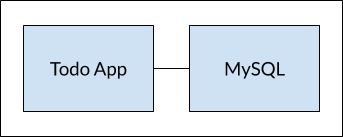

Up to this point, we have been working with single container apps. But, we now want to add MySQL to the
application stack. The following question often arises - "Where will MySQL run? Install it in the same
container or run it separately?" In general, **each container should do one thing and do it well.** A few
reasons:

- There's a good chance you'd have to scale APIs and front-ends differently than databases.
- Separate containers let you version and update versions in isolation.
- While you may use a container for the database locally, you may want to use a managed service
  for the database in production. You don't want to ship your database engine with your app then.
- Running multiple processes will require a process manager (the container only starts one process), 
  which adds complexity to container startup/shutdown.

And there are more reasons. So, we will update our application to work like this:


{: .text-center }

## Container networking

Remember that containers, by default, run in isolation and don't know anything about other processes
or containers on the same machine. So, how do we allow one container to talk to another? The answer is
**networking**. Now, you don't have to be a network engineer (hooray!). Simply remember this rule...

> **Note**
>
> If two containers are on the same network, they can talk to each other. If they aren't, they can't.

## Start MySQL

There are two ways to put a container on a network:
1) Assign it at start or
2) connect an existing container.
For now, we will create the network first and attach the MySQL container at startup.

1. Create the network.

    ```console
    $ docker network create todo-app
    ```

2. Start a MySQL container and attach it to the network. We're also going to define a few environment variables that the
  database will use to initialize the database (see the "Environment Variables" section in the [MySQL Docker Hub listing](https://hub.docker.com/_/mysql/)).

    ```console
    $ docker run -d \
        --network todo-app --network-alias mysql \
        -v todo-mysql-data:/var/lib/mysql \
        -e MYSQL_ROOT_PASSWORD=secret \
        -e MYSQL_DATABASE=todos \
        mysql:8.0
    ```

    If you are using Windows then use this command in PowerShell.

    ```powershell
    $ docker run -d `
        --network todo-app --network-alias mysql `
        -v todo-mysql-data:/var/lib/mysql `
        -e MYSQL_ROOT_PASSWORD=secret `
        -e MYSQL_DATABASE=todos `
        mysql:8.0
    ```

    You'll also see we specified the `--network-alias` flag. We'll come back to that in just a moment.

    > **Tip**
    >
    > You'll notice we're using a volume named `todo-mysql-data` here and mounting it at `/var/lib/mysql`, which is where MySQL stores its data. However, we never ran a `docker volume create` command. Docker recognizes we want to use a named volume and creates one automatically for us.

3. To confirm we have the database up and running, connect to the database and verify it connects.

    ```console
    $ docker exec -it <mysql-container-id> mysql -u root -p
    ```

    When the password prompt comes up, type in **secret**. In the MySQL shell, list the databases and verify
    you see the `todos` database.

    ```console
    mysql> SHOW DATABASES;
    ```

    You should see output that looks like this:

    ```plaintext
    +--------------------+
    | Database           |
    +--------------------+
    | information_schema |
    | mysql              |
    | performance_schema |
    | sys                |
    | todos              |
    +--------------------+
    5 rows in set (0.00 sec)
    ```
Exit the MySQL shell to return to the shell on our machine.

   ```console
   mysql> exit
   ```

   Hooray! We have our `todos` database and it's ready for us to use!

## Connect to MySQL

Now that we know MySQL is up and running, let's use it! But, the question is... how? If we run
another container on the same network, how do we find the container (remember each container has its own IP
address)?

To figure it out, we're going to make use of the [nicolaka/netshoot](https://github.com/nicolaka/netshoot) container,
which ships with a _lot_ of tools that are useful for troubleshooting or debugging networking issues.

1. Start a new container using the nicolaka/netshoot image. Make sure to connect it to the same network.

    ```console
    $ docker run -it --network todo-app nicolaka/netshoot
    ```

2. Inside the container, we're going to use the `dig` command, which is a useful DNS tool. We're going to look up
   the IP address for the hostname `mysql`.

    ```console
    $ dig mysql
    ```

    And you'll get an output like this...

    ```text
    ; <<>> DiG 9.18.8 <<>> mysql
    ;; global options: +cmd
    ;; Got answer:
    ;; ->>HEADER<<- opcode: QUERY, status: NOERROR, id: 32162
    ;; flags: qr rd ra; QUERY: 1, ANSWER: 1, AUTHORITY: 0, ADDITIONAL: 0

    ;; QUESTION SECTION:
    ;mysql.				IN	A

    ;; ANSWER SECTION:
    mysql.			600	IN	A	172.23.0.2

    ;; Query time: 0 msec
    ;; SERVER: 127.0.0.11#53(127.0.0.11)
    ;; WHEN: Tue Oct 01 23:47:24 UTC 2019
    ;; MSG SIZE  rcvd: 44
    ```

    In the "ANSWER SECTION", you will see an `A` record for `mysql` that resolves to `172.23.0.2`
    (your IP address will most likely have a different value). While `mysql` isn't normally a valid hostname,
    Docker was able to resolve it to the IP address of the container that had that network alias (remember the
    `--network-alias` flag we used earlier?).

    What this means is... our app only simply needs to connect to a host named `mysql` and it'll talk to the
    database! It doesn't get much simpler than that!

## Run your app with MySQL

The todo app supports the setting of a few environment variables to specify MySQL connection settings. They are:

- `MYSQL_HOST` - the hostname for the running MySQL server
- `MYSQL_USER` - the username to use for the connection
- `MYSQL_PASSWORD` - the password to use for the connection
- `MYSQL_DB` - the database to use once connected

> **Setting Connection Settings via Env Vars**
>
> While using env vars to set connection settings is generally ok for development, it is **HIGHLY DISCOURAGED**
> when running applications in production. Diogo Monica, a former lead of security at Docker,
> [wrote a fantastic blog post](https://diogomonica.com/2017/03/27/why-you-shouldnt-use-env-variables-for-secret-data/){:target="_blank" rel="noopener" class="_"}
> explaining why.
>
> A more secure mechanism is to use the secret support provided by your container orchestration framework. In most cases,
> these secrets are mounted as files in the running container. You'll see many apps (including the MySQL image and the todo app)
> also support env vars with a `_FILE` suffix to point to a file containing the variable.
>
> As an example, setting the `MYSQL_PASSWORD_FILE` var will cause the app to use the contents of the referenced file
> as the connection password. Docker doesn't do anything to support these env vars. Your app will need to know to look for
> the variable and get the file contents.

With all of that explained, let's start our dev-ready container!

1. **Note**: for MySQL versions 8.0 and higher, make sure to include the following commands in `mysql`.
    ```console
    mysql> ALTER USER 'root' IDENTIFIED WITH mysql_native_password BY 'secret';
    mysql> flush privileges;
    ```
2. We'll specify each of the environment variables above, as well as connect the container to our app network.

    ```console
    $ docker run -dp 3000:3000 \
      -w /app -v "$(pwd):/app" \
      --network todo-app \
      -e MYSQL_HOST=mysql \
      -e MYSQL_USER=root \
      -e MYSQL_PASSWORD=secret \
      -e MYSQL_DB=todos \
      node:18-alpine \
      sh -c "yarn install && yarn run dev"
    ```

    If you are using Windows then use this command in PowerShell.

    ```powershell
    $ docker run -dp 3000:3000 `
      -w /app -v "$(pwd):/app" `
      --network todo-app `
      -e MYSQL_HOST=mysql `
      -e MYSQL_USER=root `
      -e MYSQL_PASSWORD=secret `
      -e MYSQL_DB=todos `
      node:18-alpine `
      sh -c "yarn install && yarn run dev"
    ```
3. If we look at the logs for the container (`docker logs -f <container-id>`), we should see a message indicating it's
   using the mysql database.

    ```console
    $ nodemon src/index.js
    [nodemon] 2.0.20
    [nodemon] to restart at any time, enter `rs`
    [nodemon] watching dir(s): *.*
    [nodemon] starting `node src/index.js`
    Connected to mysql db at host mysql
    Listening on port 3000
    ```

4. Open the app in your browser and add a few items to your todo list.

5. Connect to the mysql database and prove that the items are being written to the database. Remember, the password
   is **secret**.

    ```console
    $ docker exec -it <mysql-container-id> mysql -p todos
    ```

    And in the mysql shell, run the following:

    ```console
    mysql> select * from todo_items;
    +--------------------------------------+--------------------+-----------+
    | id                                   | name               | completed |
    +--------------------------------------+--------------------+-----------+
    | c906ff08-60e6-44e6-8f49-ed56a0853e85 | Do amazing things! |         0 |
    | 2912a79e-8486-4bc3-a4c5-460793a575ab | Be awesome!        |         0 |
    +--------------------------------------+--------------------+-----------+
    ```

    Obviously, your table will look different because it has your items. But, you should see them stored there!

## Next steps

At this point, you have an application that now stores its data in an external database running in a separate
container. You learned a little bit about container networking and service discovery using DNS.

But, there's a good chance you are starting to feel a little overwhelmed with everything you need to do to start up
this application. You have to create a network, start containers, specify all of the environment variables, expose
ports, and more! That's a lot to remember and it's certainly making things harder to pass along to someone else.

In the next section, you'll learn about Docker Compose. With Docker Compose, you can share your application stacks in a
much easier way and let others spin them up with a single (and simple) command!

[Use Docker Compose](08_using_compose.md){: .button  .primary-btn}
