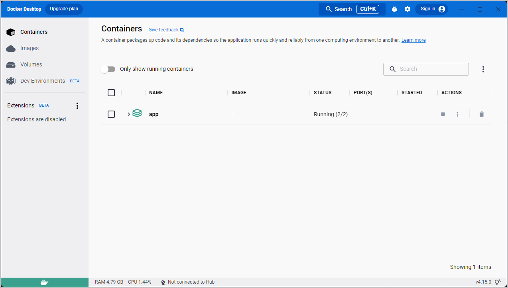
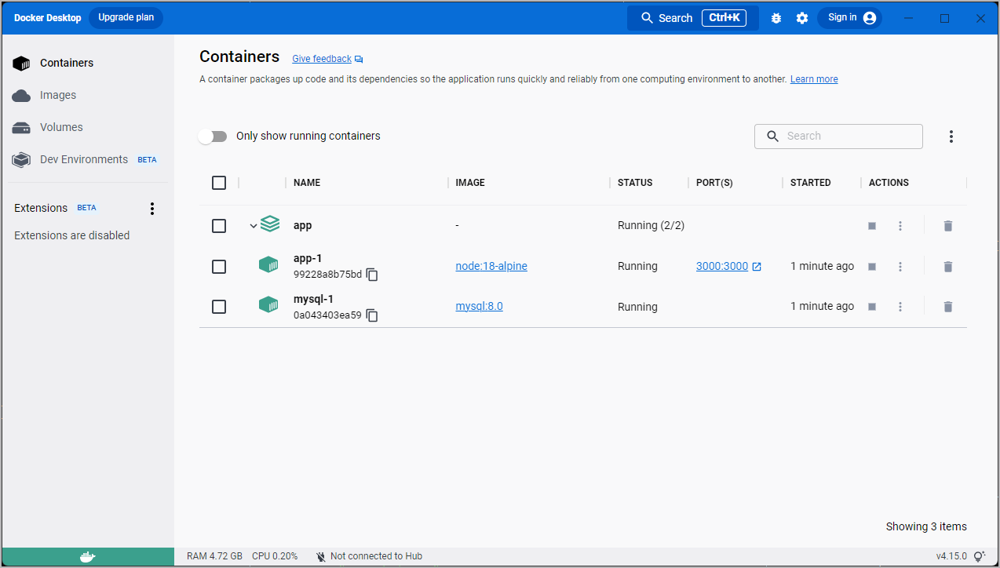

[Docker Compose](../compose/index.md) is a tool that was developed to help define and
share multi-container applications. With Compose, we can create a YAML file to define the services
and with a single command, can spin everything up or tear it all down.

The _big_ advantage of using Compose is you can define your application stack in a file, keep it at the root of
your project repo (it's now version controlled), and easily enable someone else to contribute to your project.
Someone would only need to clone your repo and start the compose app. In fact, you might see quite a few projects
on GitHub/GitLab doing exactly this now.

So, how do we get started?

## Install Docker Compose

If you installed Docker Desktop/Toolbox for either Windows or Mac, you already have Docker Compose!
Play-with-Docker instances already have Docker Compose installed as well. If you are on
a Linux machine, you will need to [install Docker Compose](../compose/install/index.md).

After installation, you should be able to run the following and see version information.

```console
$ docker compose version
```

## Create the Compose file

1. At the root of the `/getting-started/app` folder, create a file named `docker-compose.yml`.

2. In the compose file, we'll start off by defining the list of services (or containers) we want to run as part of our application.

   ```yaml
   services:
   ```

And now, we'll start migrating a service at a time into the compose file.

## Define the app service

To remember, this was the command we were using to define our app container.

```console
$ docker run -dp 3000:3000 \
  -w /app -v "$(pwd):/app" \
  --network todo-app \
  -e MYSQL_HOST=mysql \
  -e MYSQL_USER=root \
  -e MYSQL_PASSWORD=secret \
  -e MYSQL_DB=todos \
  node:18-alpine \
  sh -c "yarn install && yarn run dev"
```

1. First, let's define the service entry and the image for the container. We can pick any name for the service.
   The name will automatically become a network alias, which will be useful when defining our MySQL service.

   ```yaml

   services:
     app:
       image: node:18-alpine
   ```

2. Typically, you will see the `command` close to the `image` definition, although there is no requirement on ordering.
   So, let's go ahead and move that into our file.

   ```yaml
   services:
     app:
       image: node:18-alpine
       command: sh -c "yarn install && yarn run dev"
   ```


3. Let's migrate the `-p 3000:3000` part of the command by defining the `ports` for the service. We will use the
   [short syntax](../compose/compose-file/compose-file-v3.md#short-syntax-1) here, but there is also a more verbose
   [long syntax](../compose/compose-file/compose-file-v3.md#long-syntax-1) available as well.

   ```yaml
   services:
     app:
       image: node:18-alpine
       command: sh -c "yarn install && yarn run dev"
       ports:
         - 3000:3000
   ```
 
4. Next, we'll migrate both the working directory (`-w /app`) and the volume mapping (`-v "$(pwd):/app"`) by using
   the `working_dir` and `volumes` definitions. Volumes also has a [short](../compose/compose-file/compose-file-v3.md#short-syntax-3) and [long](../compose/compose-file/compose-file-v3.md#long-syntax-3) syntax.

    One advantage of Docker Compose volume definitions is we can use relative paths from the current directory.

   ```yaml
   services:
     app:
       image: node:18-alpine
       command: sh -c "yarn install && yarn run dev"
       ports:
         - 3000:3000
       working_dir: /app
       volumes:
         - ./:/app
   ```

5. Finally, we need to migrate the environment variable definitions using the `environment` key.

   ```yaml
   services:
     app:
       image: node:18-alpine
       command: sh -c "yarn install && yarn run dev"
       ports:
         - 3000:3000
       working_dir: /app
       volumes:
         - ./:/app
       environment:
         MYSQL_HOST: mysql
         MYSQL_USER: root
         MYSQL_PASSWORD: secret
         MYSQL_DB: todos
   ```

### Define the MySQL service

Now, it's time to define the MySQL service. The command that we used for that container was the following:

```console
$ docker run -d \
  --network todo-app --network-alias mysql \
  -v todo-mysql-data:/var/lib/mysql \
  -e MYSQL_ROOT_PASSWORD=secret \
  -e MYSQL_DATABASE=todos \
  mysql:8.0
```

1. We will first define the new service and name it `mysql` so it automatically gets the network alias. We'll
   go ahead and specify the image to use as well.

   ```yaml

   services:
     app:
       # The app service definition
     mysql:
       image: mysql:8.0
   ```

2. Next, we'll define the volume mapping. When we ran the container with `docker run`, the named volume was created
   automatically. However, that doesn't happen when running with Compose. We need to define the volume in the top-level
   `volumes:` section and then specify the mountpoint in the service config. By simply providing only the volume name,
   the default options are used. There are [many more options available](../compose/compose-file/compose-file-v3.md#volume-configuration-reference) though.

   ```yaml
   services:
     app:
       # The app service definition
     mysql:
       image: mysql:8.0
       volumes:
         - todo-mysql-data:/var/lib/mysql

   volumes:
     todo-mysql-data:
   ```

3. Finally, we only need to specify the environment variables.

   ```yaml
   services:
     app:
       # The app service definition
     mysql:
       image: mysql:8.0
       volumes:
         - todo-mysql-data:/var/lib/mysql
       environment:
         MYSQL_ROOT_PASSWORD: secret
         MYSQL_DATABASE: todos

   volumes:
     todo-mysql-data:
   ```

At this point, our complete `docker-compose.yml` should look like this:


```yaml
services:
  app:
    image: node:18-alpine
    command: sh -c "yarn install && yarn run dev"
    ports:
      - 3000:3000
    working_dir: /app
    volumes:
      - ./:/app
    environment:
      MYSQL_HOST: mysql
      MYSQL_USER: root
      MYSQL_PASSWORD: secret
      MYSQL_DB: todos

  mysql:
    image: mysql:8.0
    volumes:
      - todo-mysql-data:/var/lib/mysql
    environment:
      MYSQL_ROOT_PASSWORD: secret
      MYSQL_DATABASE: todos

volumes:
  todo-mysql-data:
```

## Run the application stack

Now that we have our `docker-compose.yml` file, we can start it up!

1. Make sure no other copies of the app/db are running first (`docker ps` and `docker rm -f <ids>`).

2. Start up the application stack using the `docker compose up` command. We'll add the `-d` flag to run everything in the
   background.

    ```console
    $ docker compose up -d
    ```

    When we run this, we should see output like this:

    ```plaintext
    Creating network "app_default" with the default driver
    Creating volume "app_todo-mysql-data" with default driver
    Creating app_app_1   ... done
    Creating app_mysql_1 ... done
    ```

    You'll notice that the volume was created as well as a network! By default, Docker Compose automatically creates a network specifically for the application stack (which is why we didn't define one in the compose file).

3. Let's look at the logs using the `docker compose logs -f` command. You'll see the logs from each of the services interleaved
    into a single stream. This is incredibly useful when you want to watch for timing-related issues. The `-f` flag "follows" the
    log, so will give you live output as it's generated.

    If you have run the command already, you'll see output that looks like this:

    ```plaintext
    mysql_1  | 2019-10-03T03:07:16.083639Z 0 [Note] mysqld: ready for connections.
    mysql_1  | Version: '8.0.31'  socket: '/var/run/mysqld/mysqld.sock'  port: 3306  MySQL Community Server (GPL)
    app_1    | Connected to mysql db at host mysql
    app_1    | Listening on port 3000
    ```

    The service name is displayed at the beginning of the line (often colored) to help distinguish messages. If you want to
    view the logs for a specific service, you can add the service name to the end of the logs command (for example,
    `docker compose logs -f app`).

    > **Tip: Waiting for the DB before starting the app**
    >
    > When the app is starting up, it actually sits and waits for MySQL to be up
    > and ready before trying to connect to it. Docker doesn't have any built-in
    > support to wait for another container to be fully up, running, and ready
    > before starting another container. For Node-based projects, you can use
    > the [wait-port](https://github.com/dwmkerr/wait-port){:target="_blank" rel="noopener" class="_"}
    > dependency. Similar projects exist for other languages/frameworks.

4. At this point, you should be able to open your app and see it running. And hey! We're down to a single command!

## See the app stack in Docker Dashboard

If we look at the Docker Dashboard, we'll see that there is a group named **app**. This is the "project name" from Docker
Compose and used to group the containers together. By default, the project name is simply the name of the directory that the
`docker-compose.yml` was located in.



If you click the disclose arrow next to **app**, you will see the two containers we defined in the compose file. The names are also a little
more descriptive, as they follow the pattern of `<service-name>-<replica-number>`. So, it's very easy to
quickly see what container is our app and which container is the mysql database.



## Tear it all down

When you're ready to tear it all down, simply run `docker compose down` or hit the trash can on the Docker Dashboard
for the entire app. The containers will stop and the network will be removed.

>**Warning**
>
>Removing Volumes
>
>By default, named volumes in your compose file are NOT removed when running `docker compose down`. If you want to
>remove the volumes, you will need to add the `--volumes` flag.
>
>The Docker Dashboard does _not_ remove volumes when you delete the app stack.
{: .warning}

Once torn down, you can switch to another project, run `docker compose up` and be ready to contribute to that project! It really
doesn't get much simpler than that!

## Next steps

In this section, you learned about Docker Compose and how it helps you dramatically simplify the defining and
sharing of multi-service applications. You created a Compose file by translating the commands you were
using into the appropriate compose format.

At this point, you're starting to wrap up the tutorial. However, there are a few best practices about
image building you should cover, as there is a big issue with the Dockerfile you've been using. 

[Image-building best practices](09_image_best.md){: .button  .primary-btn}
