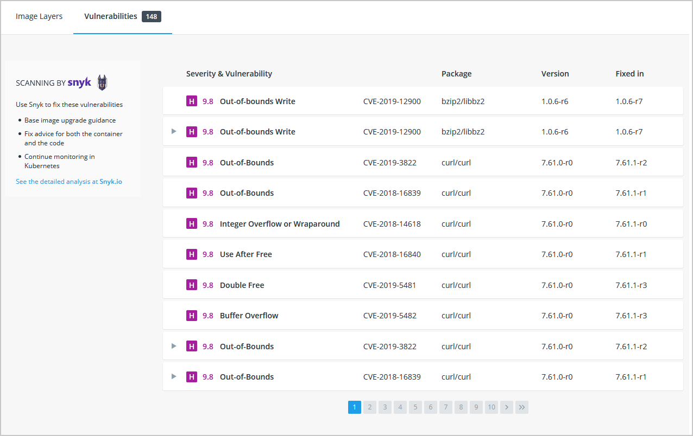

## Security scanning

When you have built an image, it is a good practice to scan it for security vulnerabilities using the `docker scan` command.
Docker has partnered with [Snyk](https://snyk.io){:target="_blank" rel="noopener" class="_"} to provide the vulnerability scanning service.

> **Note**
> 
> You must be logged in to Docker Hub to scan your images. Run the command `docker scan --login`, and then scan your images using
> `docker scan <image-name>`.

For example, to scan the `getting-started` image you created earlier in the tutorial, you can just type

```console
$ docker scan getting-started
```

The scan uses a constantly updated database of vulnerabilities, so the output you see will vary as new
vulnerabilities are discovered, but it might look something like this:

```plaintext
✗ Low severity vulnerability found in freetype/freetype
  Description: CVE-2020-15999
  Info: https://snyk.io/vuln/SNYK-ALPINE310-FREETYPE-1019641
  Introduced through: freetype/freetype@2.10.0-r0, gd/libgd@2.2.5-r2
  From: freetype/freetype@2.10.0-r0
  From: gd/libgd@2.2.5-r2 > freetype/freetype@2.10.0-r0
  Fixed in: 2.10.0-r1

✗ Medium severity vulnerability found in libxml2/libxml2
  Description: Out-of-bounds Read
  Info: https://snyk.io/vuln/SNYK-ALPINE310-LIBXML2-674791
  Introduced through: libxml2/libxml2@2.9.9-r3, libxslt/libxslt@1.1.33-r3, nginx-module-xslt/nginx-module-xslt@1.17.9-r1
  From: libxml2/libxml2@2.9.9-r3
  From: libxslt/libxslt@1.1.33-r3 > libxml2/libxml2@2.9.9-r3
  From: nginx-module-xslt/nginx-module-xslt@1.17.9-r1 > libxml2/libxml2@2.9.9-r3
  Fixed in: 2.9.9-r4
```

The output lists the type of vulnerability, a URL to learn more, and importantly which version of the relevant library
fixes the vulnerability.

There are several other options, which you can read about in the [docker scan documentation](../engine/scan/index.md).

As well as scanning your newly built image on the command line, you can also [configure Docker Hub](../docker-hub/vulnerability-scanning.md)
to scan all newly pushed images automatically, and you can then see the results in both Docker Hub and Docker Desktop.

{: style=width:75% }
{: .text-center }

## Image layering

Did you know that you can look at what makes up an image? Using the `docker image history`
command, you can see the command that was used to create each layer within an image.

1. Use the `docker image history` command to see the layers in the `getting-started` image you
   created earlier in the tutorial.

    ```console
    $ docker image history getting-started
    ```

    You should get output that looks something like this (dates/IDs may be different).

    ```plaintext
    IMAGE               CREATED             CREATED BY                                      SIZE                COMMENT
    a78a40cbf866        18 seconds ago      /bin/sh -c #(nop)  CMD ["node" "src/index.j…    0B                  
    f1d1808565d6        19 seconds ago      /bin/sh -c yarn install --production            85.4MB              
    a2c054d14948        36 seconds ago      /bin/sh -c #(nop) COPY dir:5dc710ad87c789593…   198kB               
    9577ae713121        37 seconds ago      /bin/sh -c #(nop) WORKDIR /app                  0B                  
    b95baba1cfdb        13 days ago         /bin/sh -c #(nop)  CMD ["node"]                 0B                  
    <missing>           13 days ago         /bin/sh -c #(nop)  ENTRYPOINT ["docker-entry…   0B                  
    <missing>           13 days ago         /bin/sh -c #(nop) COPY file:238737301d473041…   116B                
    <missing>           13 days ago         /bin/sh -c apk add --no-cache --virtual .bui…   5.35MB              
    <missing>           13 days ago         /bin/sh -c #(nop)  ENV YARN_VERSION=1.21.1      0B                  
    <missing>           13 days ago         /bin/sh -c addgroup -g 1000 node     && addu…   74.3MB              
    <missing>           13 days ago         /bin/sh -c #(nop)  ENV NODE_VERSION=12.14.1     0B                  
    <missing>           13 days ago         /bin/sh -c #(nop)  CMD ["/bin/sh"]              0B                  
    <missing>           13 days ago         /bin/sh -c #(nop) ADD file:e69d441d729412d24…   5.59MB   
    ```

    Each of the lines represents a layer in the image. The display here shows the base at the bottom with
    the newest layer at the top. Using this, you can also quickly see the size of each layer, helping 
    diagnose large images.

2. You'll notice that several of the lines are truncated. If you add the `--no-trunc` flag, you'll get the
   full output (yes... funny how you use a truncated flag to get untruncated output, huh?)

    ```console
    $ docker image history --no-trunc getting-started
    ```

## Layer caching

Now that you've seen the layering in action, there's an important lesson to learn to help decrease build
times for your container images.

> Once a layer changes, all downstream layers have to be recreated as well

Let's look at the Dockerfile we were using one more time...

```dockerfile
# syntax=docker/dockerfile:1
FROM node:12-alpine
RUN apk add --no-cache python2 g++ make
WORKDIR /app
COPY . .
RUN yarn install --production
CMD ["node", "src/index.js"]
```

Going back to the image history output, we see that each command in the Dockerfile becomes a new layer in the image.
You might remember that when we made a change to the image, the yarn dependencies had to be reinstalled. Is there a
way to fix this? It doesn't make much sense to ship around the same dependencies every time we build, right?

To fix this, we need to restructure our Dockerfile to help support the caching of the dependencies. For Node-based
applications, those dependencies are defined in the `package.json` file. So, what if we copied only that file in first,
install the dependencies, and _then_ copy in everything else? Then, we only recreate the yarn dependencies if there was
a change to the `package.json`. Make sense?

1. Update the Dockerfile to copy in the `package.json` first, install dependencies, and then copy everything else in.

    ```dockerfile
    # syntax=docker/dockerfile:1
    FROM node:12-alpine
    RUN apk add --no-cache python2 g++ make
    WORKDIR /app
    COPY package.json yarn.lock ./
    RUN yarn install --production
    COPY . .
    CMD ["node", "src/index.js"]
    ```

2. Create a file named `.dockerignore` in the same folder as the Dockerfile with the following contents.

    ```ignore
    node_modules
    ```

    `.dockerignore` files are an easy way to selectively copy only image relevant files.
    You can read more about this
    [here](../engine/reference/builder.md#dockerignore-file).
    In this case, the `node_modules` folder should be omitted in the second `COPY` step because otherwise,
    it would possibly overwrite files which were created by the command in the `RUN` step.
    For further details on why this is recommended for Node.js applications and other best practices,
    have a look at their guide on
    [Dockerizing a Node.js web app](https://nodejs.org/en/docs/guides/nodejs-docker-webapp/){:target="_blank" rel="noopener" class="_"}.

3. Build a new image using `docker build`.

    ```console
    $ docker build -t getting-started .
    ```

    You should see output like this...

    ```plaintext
    Sending build context to Docker daemon  219.1kB
    Step 1/6 : FROM node:12-alpine
    ---> b0dc3a5e5e9e
    Step 2/6 : WORKDIR /app
    ---> Using cache
    ---> 9577ae713121
    Step 3/6 : COPY package.json yarn.lock ./
    ---> bd5306f49fc8
    Step 4/6 : RUN yarn install --production
    ---> Running in d53a06c9e4c2
    yarn install v1.17.3
    [1/4] Resolving packages...
    [2/4] Fetching packages...
    info fsevents@1.2.9: The platform "linux" is incompatible with this module.
    info "fsevents@1.2.9" is an optional dependency and failed compatibility check. Excluding it from installation.
    [3/4] Linking dependencies...
    [4/4] Building fresh packages...
    Done in 10.89s.
    Removing intermediate container d53a06c9e4c2
    ---> 4e68fbc2d704
    Step 5/6 : COPY . .
    ---> a239a11f68d8
    Step 6/6 : CMD ["node", "src/index.js"]
    ---> Running in 49999f68df8f
    Removing intermediate container 49999f68df8f
    ---> e709c03bc597
    Successfully built e709c03bc597
    Successfully tagged getting-started:latest
    ```

    You'll see that all layers were rebuilt. Perfectly fine since we changed the Dockerfile quite a bit.

4. Now, make a change to the `src/static/index.html` file (like change the `<title>` to say "The Awesome Todo App").

5. Build the Docker image now using `docker build -t getting-started .` again. This time, your output should look a little different.

    ```plaintext
    Sending build context to Docker daemon  219.1kB
    Step 1/6 : FROM node:12-alpine
    ---> b0dc3a5e5e9e
    Step 2/6 : WORKDIR /app
    ---> Using cache
    ---> 9577ae713121
    Step 3/6 : COPY package.json yarn.lock ./
    ---> Using cache
    ---> bd5306f49fc8
    Step 4/6 : RUN yarn install --production
    ---> Using cache
    ---> 4e68fbc2d704
    Step 5/6 : COPY . .
    ---> cccde25a3d9a
    Step 6/6 : CMD ["node", "src/index.js"]
    ---> Running in 2be75662c150
    Removing intermediate container 2be75662c150
    ---> 458e5c6f080c
    Successfully built 458e5c6f080c
    Successfully tagged getting-started:latest
    ```

    First off, you should notice that the build was MUCH faster! And, you'll see that steps 1-4 all have
    `Using cache`. So, hooray! We're using the build cache. Pushing and pulling this image and updates to it
    will be much faster as well. Hooray!

## Multi-stage builds

While we're not going to dive into it too much in this tutorial, multi-stage builds are an incredibly powerful
tool to help use multiple stages to create an image. There are several advantages for them:

- Separate build-time dependencies from runtime dependencies
- Reduce overall image size by shipping _only_ what your app needs to run

### Maven/Tomcat example

When building Java-based applications, a JDK is needed to compile the source code to Java bytecode. However,
that JDK isn't needed in production. Also, you might be using tools like Maven or Gradle to help build the app.
Those also aren't needed in our final image. Multi-stage builds help.

```dockerfile
# syntax=docker/dockerfile:1
FROM maven AS build
WORKDIR /app
COPY . .
RUN mvn package

FROM tomcat
COPY --from=build /app/target/file.war /usr/local/tomcat/webapps 
```

In this example, we use one stage (called `build`) to perform the actual Java build using Maven. In the second
stage (starting at `FROM tomcat`), we copy in files from the `build` stage. The final image is only the last stage
being created (which can be overridden using the `--target` flag).

### React example

When building React applications, we need a Node environment to compile the JS code (typically JSX), SASS stylesheets,
and more into static HTML, JS, and CSS. If we aren't doing server-side rendering, we don't even need a Node environment
for our production build. Why not ship the static resources in a static nginx container?

```dockerfile
# syntax=docker/dockerfile:1
FROM node:12 AS build
WORKDIR /app
COPY package* yarn.lock ./
RUN yarn install
COPY public ./public
COPY src ./src
RUN yarn run build

FROM nginx:alpine
COPY --from=build /app/build /usr/share/nginx/html
```

Here, we are using a `node:12` image to perform the build (maximizing layer caching) and then copying the output
into an nginx container. Cool, huh?

## Next steps

By understanding a little bit about the structure of images, you can build images faster and ship fewer changes.
Scanning images gives you confidence that the containers you are running and distributing are secure.
Multi-stage builds also help you reduce overall image size and increase final container security by separating
build-time dependencies from runtime dependencies.

In the next section, you'll learn about additional resources you can use to continue learning about containers.

[What next](11_what_next.md){: .button  .primary-btn}