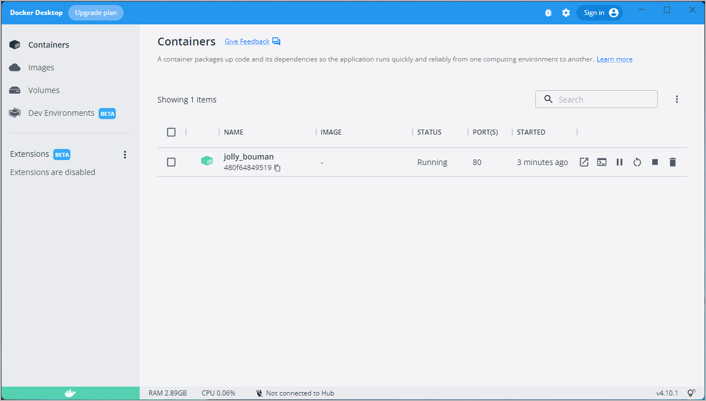

> **Update to the Docker Desktop terms**
>
> Commercial use of Docker Desktop in larger enterprises (more than 250
> employees OR more than $10 million USD in annual revenue) now requires a paid
> subscription.
{: .important}

Welcome! We are excited that you want to learn Docker.

This page contains step-by-step instructions on how to get started with Docker. In this tutorial, you'll learn how to:

- Build and run an image as a container
- Share images using Docker Hub
- Deploy Docker applications using multiple containers with a database
- Run applications using Docker Compose

In addition, you'll also learn about the best practices for building images, including instructions on how to scan your images for security vulnerabilities.

If you are looking for information on how to containerize an application using your favorite language, see [Language-specific getting started guides](../language/index.md).

We also recommend the video walkthrough from DockerCon 2020.

<iframe src="https://www.youtube-nocookie.com/embed/iqqDU2crIEQ?start=30" style="max-width: 100%; aspect-ratio: 16 / 9;" width="560" height="auto" frameborder="0" allow="accelerometer; autoplay; encrypted-media; gyroscope; picture-in-picture" allowfullscreen></iframe>

## Download and install Docker

This tutorial assumes you have a current version of Docker installed on your
machine. If you do not have Docker installed, choose your preferred operating system below to download Docker:

[Mac with Intel chip](https://desktop.docker.com/mac/main/amd64/Docker.dmg?utm_source=docker&utm_medium=webreferral&utm_campaign=docs-driven-download-mac-amd64){: .button .primary-btn }
[Mac with Apple chip](https://desktop.docker.com/mac/main/arm64/Docker.dmg?utm_source=docker&utm_medium=webreferral&utm_campaign=docs-driven-download-mac-arm64){: .button .primary-btn }
[Windows](https://desktop.docker.com/win/main/amd64/Docker%20Desktop%20Installer.exe?utm_source=docker&utm_medium=webreferral&utm_campaign=docs-driven-download-win-amd64){: .button .primary-btn }
[Linux](../desktop/linux/install.md){: .button .primary-btn}

For Docker Desktop installation instructions, see:
 - [Install Docker Desktop on Mac](../desktop/mac/install.md)
 - [Install Docker Desktop on Windows](../desktop/windows/install.md)
 - [Install Docker Desktop on Linux](../desktop/linux/install.md)

## Start the tutorial

If you've already run the command to get started with the tutorial, congratulations! If not, open a command prompt or bash window, and run the command:

```console
$ docker run -d -p 80:80 docker/getting-started
```

You'll notice a few flags being used. Here's some more info on them:

- `-d` - run the container in detached mode (in the background)
- `-p 80:80` - map port 80 of the host to port 80 in the container
- `docker/getting-started` - the image to use

> **Tip**
>
> You can combine single character flags to shorten the full command.
> As an example, the command above could be written as:
>
> ```console
> $ docker run -dp 80:80 docker/getting-started
> ```

## The Docker Dashboard

Before going too far, we want to highlight the Docker Dashboard, which gives
you a quick view of the containers running on your machine. The Docker Dashboard is available for Mac and Windows.
It gives you quick access to container logs, lets you get a shell inside the container, and lets you
easily manage container lifecycles (stop, remove, etc.).

To access the dashboard, follow the instructions in the
[Docker Desktop manual](../desktop/dashboard.md). If you open the dashboard
now, you will see this tutorial running! The container name (`jolly_bouman` below) is a
randomly created name. So, you'll most likely have a different name.



## What is a container?

Now that you've run a container, what _is_ a container? Simply put, a container is
a sandboxed process on your machine that is isolated from all other processes
on the host machine. That isolation leverages [kernel namespaces and cgroups](https://medium.com/@saschagrunert/demystifying-containers-part-i-kernel-space-2c53d6979504),
features that have been in Linux for a long time. Docker has worked to make these
capabilities approachable and easy to use. To summarize, a container:

- is a runnable instance of an image. You can create, start, stop, move, or delete a container using the DockerAPI or CLI.
- can be run on local machines, virtual machines or deployed to the cloud.
- is portable (can be run on any OS).
- is isolated from other containers and runs its own software, binaries, and configurations.

> **Creating containers from scratch**
>
> If you'd like to see how containers are built from scratch, Liz Rice from Aqua Security
> has a fantastic talk in which she creates a container from scratch in Go. While the talk
> does not go into networking, using images for the filesystem, and other advanced topics,
> it gives a _fantastic_ deep dive into how things are working.
>
> <iframe src="https://www.youtube-nocookie.com/embed/8fi7uSYlOdc" style="max-width: 100%; aspect-ratio: 16 / 9;" width="560" height="auto" frameborder="0" allow="accelerometer; autoplay; encrypted-media; gyroscope; picture-in-picture" allowfullscreen></iframe>

## What is a container image?

When running a container, it uses an isolated filesystem. This custom filesystem is provided
by a **container image**. Since the image contains the container's filesystem, it must contain everything
needed to run an application - all dependencies, configuration, scripts, binaries, etc. The
image also contains other configuration for the container, such as environment variables,
a default command to run, and other metadata.

We'll dive deeper into images later on, covering topics such as layering, best practices, and more.

> **Info**
>
> If you're familiar with `chroot`, think of a container as an extended version of `chroot`. The
> filesystem is simply coming from the image. But, a container adds additional isolation not
> available when simply using chroot.

## CLI references

Refer to the following topics for further documentation on all CLI commands used in this article:

- [docker version](../engine/reference/commandline/version.md)
- [docker run](../engine/reference/commandline/run.md)
- [docker image](../engine/reference/commandline/image.md)
- [docker container](../engine/reference/commandline/container.md)

