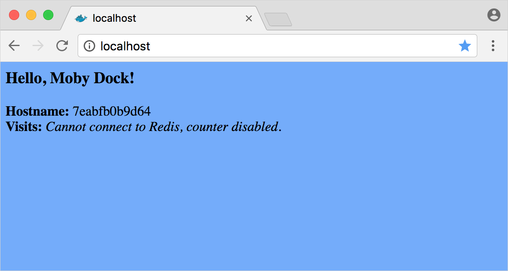



## Prerequisites

This part assumes that you:

- Completed [Part 1](index.md).
- Installed a [maintained version](https://docs.docker.com/engine/installation/#updates-and-patches){: target="_blank" class="_"}
of Docker Community Edition (CE) or Enterprise Edition (EE) on a
[supported platform](https://docs.docker.com/engine/installation/#supported-platforms){: target="_blank" class="_"}.

> For full Kubernetes Integration
>
> [Kubernetes on Docker for Mac](https://docs.docker.com/docker-for-mac/kubernetes/){: target="_blank" class="_"}
is available in
[17.12.0-ce Edge](https://docs.docker.com/docker-for-mac/release-notes/#docker-community-edition-17120-ce-mac45-2018-01-05-edge){: target="_blank" class="_"}
or higher.

## Introduction

This tutorial teaches you how to build a simple Python web application (with
[Flask](http://flask.pocoo.org/){:target="_blank"}) that prints **"Hello, Moby Dock!"**
on a blue canvas. We later add a [Redis](https://hub.docker.com/_/redis/){:target="_blank"}
database to count the number of visitors to our site.

Here in part 2, we start by building a Docker application image, `hellomoby`,
then run it as a single container on localhost. We also tag and push the new
image to Docker's public registry via [Docker Hub](https://hub.docker.com/){:target="_blank"}.

In [Part 3](part3.md), we run our image as a "Docker Service" so we can scale
the number of containers and do other operations. In [Part 4](part4.md), we
employ container orchestration and distribute the multiple containers running
our application across multiple nodes. In [Part 5](part5.md), we add a service
(for a redis database) and rebuild our image as a Docker stack.

- Stack
- Docker Service
- **Container** (you are here)

## Define app image with Dockerfile

Typically, creating a Python application requires that you install a Python
runtime, along with the server, and configure it all _perfectly_ on your
platform for the app to run as expected. With Docker, you simply pull a portable
Python runtime image from [Docker Hub](https://hub.docker.com/_/python/){:target="_blank"}
(or [Docker Store](https://store.docker.com/images/python)) and build it with
your application code (as another image).

To ensure the integrity and portability of an application, we build images with
a [Dockerfile](https://docs.docker.com/engine/userguide/eng-image/dockerfile_best-practices/).
A `Dockerfile` defines the environment inside a container. Access to resources,
such as networking interfaces and disk drives, is virtualized inside this
environment. The container is isolated from the rest of your system, so you must
map ports to the outside world, and be specific about what files you want to
copy into that environment. Let's start.

Create an empty directory and change directories into this new directory:

```shell
$ mkdir ~/hellomoby && cd ~/hellomoby
```

Create a file named "Dockerfile" with the following content and save.

> Our file refers to `app.py` and `requirements.txt` which we have not yet
> created. We do this next.

```dockerfile
## Dockerfile
## Use an official Python runtime as a parent image
FROM python:2.7-slim

## Set the working directory to /app
WORKDIR /app

## Copy the current directory contents into the container at /app
ADD . /app

## Install any needed packages specified in requirements.txt
RUN pip install -r requirements.txt

## Make port 80 available to the world outside this container
EXPOSE 80

## Define environment variable
ENV NAME Moby Dock

## Run app.py when the container launches
CMD ["python", "app.py"]
```

> Are you behind a proxy server?
>
> Proxy servers can block connections to your web app once it’s up and running.
> If you are behind a proxy server, add the following lines to your Dockerfile,
> (before the call to `pip`):
>
> ```conf
> # Set proxy server, replace host:port with values for your servers
> ENV http_proxy host:port
> ENV https_proxy host:port
> ```

## Code, build, and run the app

A Dockerfile defines _how_ to build the Docker image; but we also need to code
the application itself.

### Code the app

Create two more files, `requirements.txt` and `app.py`, and put them in the same
directory as `Dockerfile`.

```
## requirements.txt
flask
redis
```

```python
## app.py
from flask import Flask
from redis import Redis, RedisError
import os
import socket

## Connect to Redis
redis = Redis(host="redis", db=0, socket_connect_timeout=2, socket_timeout=2)

app = Flask(__name__)

@app.route("/")
def hello():
    try:
        visits = redis.incr("counter")
    except RedisError:
        visits = "<i>Cannot connect to Redis, counter disabled.</i>"

    html = "<h3>Hello, {name}!</h3>" \
           "<body bgcolor={bgcolor}>" \
           "<b>Hostname:</b> {hostname}<br/>" \
           "<b>Visits:</b> {visits}"
    return html.format(name=os.getenv("NAME", "whale"), bgcolor='#72AAFD', hostname=socket.gethostname(), visits=visits)

if __name__ == "__main__":
    app.run(host='0.0.0.0', port=80)
```

Scroll up and take another look at `Dockerfile`. The `ADD` command bundles
`app.py` and `requirements.txt` into the build. The `EXPOSE` command makes the
output from `app.py` accessible over HTTP.

The command, `RUN pip install -r requirements.txt`, installs the Python
libraries for Flask and Redis. The app prints the environment variable `NAME`
and the output of the call to `socket.gethostname()`, _which is the container ID._

### Build the app

We are ready to build the app. Make sure you are still at the top level of your
new directory and check your files:

```shell
$ ls
Dockerfile		app.py			requirements.txt
```

Build the image with the files in _this_ directory (`.`) and tag it with a
meaningful name such as `hellomoby`:

```shell
$ docker build ---tag hellomoby .
```

You can find `hellomoby` in your machine's local Docker image registry:

```shell
$ docker image ls
REPOSITORY      TAG          IMAGE ID           CREATED              SIZE
hellomoby       latest       88b087bf9a5e       2 minutes ago        148MB
python          2.7-slim     4fd30fc83117       3 weeks ago          138MB
hello-world     latest       f2a91732366c       6 weeks ago          1.85kB
...
```

### Run the app

Run the app, and use the port flag, `-p`, to map port 4000 on your machine to
port 80 published by the container:

```shell
$ docker run -p 4000:80 hellomoby
```

Point a browser to [http://localhost:4000](http://localhost:4000).

> On Windows 7, with Docker Toolbox, use the Docker Machine IP instead of
> `localhost` (for example, http://192.168.99.100:4000). To find the IP
> address, run `docker-machine ip`.

You should see:

- **Hello, Moby Dock!**  (on a blue canvas)
- **Hostname:** `CONTAINER ID`
- **Visits:** _Cannot connect to Redis, counter disabled._

{:width="500px"}

Python serves your app at http://0.0.0.0:80, but that message comes from
_inside_ the container, so Python does not know you remapped the port to 4000.
Remapping here demonstrates the difference between what you `EXPOSE` within the
`Dockerfile`, and what you _publish_ using `docker run -p`.

> Expected Redis error
>
> Because Redis is not running (as we only installed the Python library, and
> not Redis itself), the attempt to use it here fails. We fix that in [Part 5](part5.md).

Press `CTRL+C` in your terminal to quit.

> On Windows, press `CTRL+C` to get the prompt back, then manually stop the
> running container:
> ```shell
> docker container ls
> docker container stop <CONTAINER ID or NAMES>
> ```

Run the app again in _detached_ mode (with `-d`). The full CONTAINER ID displays
while the container runs in the background:

```shell
$ docker run -d -p 4000:80 hellomoby
7c96ed69a93403785f49b321447f2754d320aaf76fce2fd41e09da62d92af8bf
```

List the abbreviated CONTAINER ID, NAMES, and other info:

```shell
$ docker container ls
CONTAINER ID      IMAGE          COMMAND              CREATED             NAMES
7c96ed69a934      hellomoby      "python app.py"      28 seconds ago      vigilant_mccarthy
```

Refresh the browser at http://localhost:4000 and notice that "Hostname" reflects
the new `CONTAINER ID`. Stop the container using `CONTAINER ID` or `NAMES`:

```shell
$ docker container stop vigilant_mccarthy
```

## Share your image

To demonstrate the portability of your application, first upload the `hellomoby`
image to [Docker Hub](https://hub.docker.com/){:target="_blank"}, delete the
local image, then rerun the application. The Docker CLI pulls the image from the
Docker public registry.

### Log in to Docker Hub

If you don't have a Docker account, sign up for one at
[https://hub.docker.com/](https://hub.docker.com/){: target="_blank"}.
Make note of your username.

Log in to the Docker public registry on your local machine.

```shell
$ docker login
```

### Tag the image

The notation for associating a local image with a repository on a registry is
`username/repository:tag`. The tag is optional, but recommended, as it is
the mechanism that registries use to give Docker images a version.

Create a repository name and tag (and remember to use _your_ Docker account
username):

```shell
$ docker tag hellomoby username/hellomoby:v1
```

> Use meaningful names for the repository and tag. Here, the image is stored in
> the `hellomoby` repository (in your Docker account) and tagged as v1 (for
> version 1).

View your your newly tagged image and notice the duplicate IMAGE ID:

```shell
$ docker image ls
REPOSITORY           TAG          IMAGE ID           CREATED              SIZE
john/hellomoby       v1           88b087bf9a5e       3 minutes ago        148MB
hellomoby            latest       88b087bf9a5e       2 hours ago          148MB
python               2.7-slim     4fd30fc83117       3 weeks ago          138MB
hello-world          latest       f2a91732366c       6 weeks ago          1.85kB
...
```

### Publish the image

Upload your tagged image to the repository: `docker push username/repository:tag`, for example:

```shell
$ docker push john/hellomoby:v1
The push refers to repository [docker.io/john/hellomoby]
c24b3fc5bf45: Pushed
6c3968f050d2: Pushed
b39336ac153e: Pushed
94b0b6f67798: Mounted from library/python
e0c374004259: Mounted from library/python
56ee7573ea0f: Mounted from library/python
cfce7a8ae632: Mounted from library/python
v1: digest: sha256:857747a6dafd94f6452ad025e89b4678256a2e2eebce424b762d46dd4775829f size: 1787
```

Once complete, the results of this upload are publicly available. Log in to
[Docker Hub](https://hub.docker.com/) to see your image and its pull command.

### Run image from remote repository

With your application image in the Docker registry, you can run your app on any
machine with `username/repository:tag`. If the image isn't available locally,
Docker pulls it from the repository. Let's test it.

Stop any running `hellomoby` containers:

```shell
docker container stop CONTAINER_ID
```

> To stop all running containers, run: `docker container stop ($docker ps -q)`

Remove all `hellomoby` images:

```shell
docker image rm username/hellomoby:v1
docker image rm hellomoby:latest
```

Run the `hellomoby` image from your remote repository, for example:

```shell
$ docker run -p 4000:80 john/hellomoby:v1
Unable to find image 'john/hellomoby:v1' locally
v1: Pulling from john/hellomoby
10a267c67f42: Already exists
f68a39a6a5e4: Already exists
9beaffc0cf19: Already exists
3c1fe835fb6b: Already exists
4c9f1fa8fcb8: Already exists
ee7d8f576a14: Already exists
fbccdcced46e: Already exists
Digest: sha256:0601c866aab2adcc6498200efd0f754037e909e5fd42069adeff72d1e2439068
Status: Downloaded newer image for john/hellomoby:v1
 * Running on http://0.0.0.0:80/ (Press CTRL+C to quit)
```

No matter where `docker run` executes, it pulls your image, along with Python
and all the dependencies from `requirements.txt`, and runs your code. It all
travels together in a neat little package, and the host machine does not have to
install anything but Docker to run it.

## Recap and cheat sheet

```shell
## Create working directory and files:
mkdir ~/hellomoby && cd ~/hellomoby
[create Dockerfile, requirements.txt, app.py]

## Build `hellomoby` image and list:
docker build --tag hellomoby .
docker image ls

## Run `hellomoby` image as container and map ports:
docker run -p 4000:80 hellomoby
CTRL+C

## Run again in detached mode then stop container (by ID or NAMES):
docker run -d -p 4000:80 hellomoby
docker container stop CONTAINER_ID

## Login into Docker Hub, then tag and push `hellomboby` (with your username):
docker login
docker tag hellomoby username/hellomoby:v1
docker push username/hellomoby:v1

## Remove local copies of the `hellomoby` image then run from Docker Hub:
docker container stop CONTAINER_ID
#docker container stop ($docker ps -q)
docker image rm username/hellomoby:v1
docker image rm hellomoby:latest
docker run -p 4000:80 username/hellomoby:v1
```

## Conclusion of part two

In the next section, we learn how to scale our application by running the
container in a **Docker service**.

[Continue to Part 3 >>](part3.md){: class="button outline-btn"}
