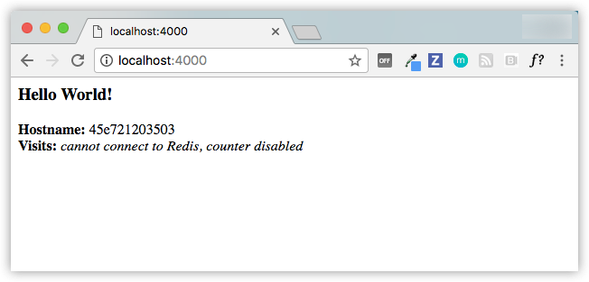



## Prerequisites

- [Install Docker version 1.13 or higher](/engine/installation/).
- Read the orientation in [Part 1](index.md).
- Give your environment a quick test run to make sure you're all set up:

  ```shell
  docker run hello-world
  ```

## Introduction

It's time to begin building an app the Docker way. We start at the bottom of
the hierarchy of such an app, which is a container, which we cover on this page.
Above this level is a service, which defines how containers behave in
production, covered in [Part 3](part3.md). Finally, at the top level is the
stack, defining the interactions of all the services, covered in
[Part 5](part5.md).

- Stack
- Services
- **Container** (you are here)

## Your new development environment

In the past, if you were to start writing a Python app, your first
order of business was to install a Python runtime onto your machine. But,
that creates a situation where the environment on your machine needs to be
perfect for your app to run as expected, and also needs to match your production
environment.

With Docker, you can just grab a portable Python runtime as an image, no
installation necessary. Then, your build can include the base Python image
right alongside your app code, ensuring that your app, its dependencies, and the
runtime, all travel together.

These portable images are defined by something called a `Dockerfile`.

## Define a container with `Dockerfile`

`Dockerfile` defines what goes on in the environment inside your
container. Access to resources like networking interfaces and disk drives is
virtualized inside this environment, which is isolated from the rest of your
system, so you need to map ports to the outside world, and
be specific about what files you want to "copy in" to that environment. However,
after doing that, you can expect that the build of your app defined in this
`Dockerfile` behaves exactly the same wherever it runs.

### `Dockerfile`

Create an empty directory. Change directories (`cd`) into the new directory,
create a file called `Dockerfile`, copy-and-paste the following content into
that file, and save it. Take note of the comments that explain each statement in
your new Dockerfile.

```dockerfile
# Use an official Python runtime as a parent image
FROM python:2.7-slim

# Set the working directory to /app
WORKDIR /app

# Copy the current directory contents into the container at /app
ADD . /app

# Install any needed packages specified in requirements.txt
RUN pip install --trusted-host pypi.python.org -r requirements.txt

# Make port 80 available to the world outside this container
EXPOSE 80

# Define environment variable
ENV NAME World

# Run app.py when the container launches
CMD ["python", "app.py"]
```

This `Dockerfile` refers to a couple of files we haven't created yet, namely
`app.py` and `requirements.txt`. Let's create those next.

## The app itself

Create two more files, `requirements.txt` and `app.py`, and put them in the same
folder with the `Dockerfile`. This completes our app, which as you can see is
quite simple. When the above `Dockerfile` is built into an image, `app.py` and
`requirements.txt` is present because of that `Dockerfile`'s `ADD` command,
and the output from `app.py` is accessible over HTTP thanks to the `EXPOSE`
command.

### `requirements.txt`

```
Flask
Redis
```

### `app.py`

```python
from flask import Flask
from redis import Redis, RedisError
import os
import socket

# Connect to Redis
redis = Redis(host="redis", db=0, socket_connect_timeout=2, socket_timeout=2)

app = Flask(__name__)

@app.route("/")
def hello():
    try:
        visits = redis.incr("counter")
    except RedisError:
        visits = "<i>cannot connect to Redis, counter disabled</i>"

    html = "<h3>Hello {name}!</h3>" \
           "<b>Hostname:</b> {hostname}<br/>" \
           "<b>Visits:</b> {visits}"
    return html.format(name=os.getenv("NAME", "world"), hostname=socket.gethostname(), visits=visits)

if __name__ == "__main__":
    app.run(host='0.0.0.0', port=80)
```

Now we see that `pip install -r requirements.txt` installs the Flask and Redis
libraries for Python, and the app prints the environment variable `NAME`, as
well as the output of a call to `socket.gethostname()`. Finally, because Redis
isn't running (as we've only installed the Python library, and not Redis
itself), we should expect that the attempt to use it here fails and produces
the error message.

> **Note**: Accessing the name of the host when inside a container retrieves the
container ID, which is like the process ID for a running executable.

That's it! You don't need Python or anything in `requirements.txt` on your
system, nor does building or running this image install them on your system. It
doesn't seem like you've really set up an environment with Python and Flask, but
you have.

## Build the app

We are ready to build the app. Make sure you are still at the top level of your new directory. Here's what `ls` should show:

```shell
$ ls
Dockerfile		app.py			requirements.txt
```

Now run the build command. This creates a Docker image, which we're going to
tag using `-t` so it has a friendly name.

```shell
docker build -t friendlyhello .
```

Where is your built image? It's in your machine's local Docker image registry:

```shell
$ docker image ls

REPOSITORY            TAG                 IMAGE ID
friendlyhello         latest              326387cea398

```
>  Troubleshooting for Linux users 
>
> _DNS settings_
>
> Proxy servers can block connections to your web app once it's up and running.
> If you are behind a proxy server, add the following lines to your
> Dockerfile, using the `ENV` command to specify the host and port for your
> proxy servers:
>
> ```conf
> # Set proxy server, replace host:port with values for your servers
> ENV http_proxy host:port
> ENV https_proxy host:port
> ```
>
> _Proxy server settings_
>
> DNS misconfigurations can generate problems with `pip`. You need to set your 
> own DNS server address to make `pip` work properly. You might want 
> to change the DNS settings of the Docker daemon. You can edit (or create) the 
> configurarion file at `/etc/docker/daemon.json` with the `dns` key, as following:
>
> ```json
>{
>   "dns": ["your_dns_address", "8.8.8.8"]
>}
> ```
>
> In the example above, the first element of the list is the address of your DNS
> server. The second item is the Google's DNS which can be used when the first one is
> not available.
>
> Before proceeding, save `daemon.json` and restart the docker service.
>
> `sudo service docker restart`
>
> Once fixed, retry to run the `build` command.

## Run the app

Run the app, mapping your machine's port 4000 to the container's published port
80 using `-p`:

```shell
docker run -p 4000:80 friendlyhello
```

You should see a message that Python is serving your app at `http://0.0.0.0:80`.
But that message is coming from inside the container, which doesn't know you
mapped port 80 of that container to 4000, making the correct URL
`http://localhost:4000`.

Go to that URL in a web browser to see the display content served up on a
web page.



> **Note**: If you are using Docker Toolbox on Windows 7, use the Docker Machine IP
> instead of `localhost`. For example, http://192.168.99.100:4000/. To find the IP
> address, use the command `docker-machine ip`.

You can also use the `curl` command in a shell to view the same content.

```shell
$ curl http://localhost:4000

<h3>Hello World!</h3><b>Hostname:</b> 8fc990912a14<br/><b>Visits:</b> <i>cannot connect to Redis, counter disabled</i>
```

This port remapping of `4000:80` is to demonstrate the difference
between what you `EXPOSE` within the `Dockerfile`, and what you `publish` using
`docker run -p`. In later steps, we just map port 80 on the host to port 80
in the container and use `http://localhost`.

Hit `CTRL+C` in your terminal to quit.

 > On Windows, explicitly stop the container
 >
 > On Windows systems, `CTRL+C` does not stop the container. So, first
 type `CTRL+C` to get the prompt back (or open another shell), then type
 `docker container ls` to list the running containers, followed by
 `docker container stop <Container NAME or ID>` to stop the
 container. Otherwise, you get an error response from the daemon
 when you try to re-run the container in the next step.

Now let's run the app in the background, in detached mode:

```shell
docker run -d -p 4000:80 friendlyhello
```

You get the long container ID for your app and then are kicked back to your
terminal. Your container is running in the background. You can also see the
abbreviated container ID with `docker container ls` (and both work interchangeably when
running commands):

```shell
$ docker container ls
CONTAINER ID        IMAGE               COMMAND             CREATED
1fa4ab2cf395        friendlyhello       "python app.py"     28 seconds ago
```

Notice that `CONTAINER ID` matches what's on `http://localhost:4000`.

Now use `docker container stop` to end the process, using the `CONTAINER ID`, like so:

```shell
docker container stop 1fa4ab2cf395
```

## Share your image

To demonstrate the portability of what we just created, let's upload our built
image and run it somewhere else. After all, you need to know how to push to
registries when you want to deploy containers to production.

A registry is a collection of repositories, and a repository is a collection of
images&#8212;sort of like a GitHub repository, except the code is already built.
An account on a registry can create many repositories. The `docker` CLI uses
Docker's public registry by default.

> **Note**: We use Docker's public registry here just because it's free
and pre-configured, but there are many public ones to choose from, and you can
even set up your own private registry using [Docker Trusted
Registry](/datacenter/dtr/2.2/guides/).

### Log in with your Docker ID

If you don't have a Docker account, sign up for one at
[cloud.docker.com](https://cloud.docker.com/){: target="_blank" class="_" }.
Make note of your username.

Log in to the Docker public registry on your local machine.

```shell
$ docker login
```

### Tag the image

The notation for associating a local image with a repository on a registry is
`username/repository:tag`. The tag is optional, but recommended, since it is
the mechanism that registries use to give Docker images a version. Give the
repository and tag meaningful names for the context, such as
`get-started:part2`. This puts the image in the `get-started` repository and
tag it as `part2`.

Now, put it all together to tag the image. Run `docker tag image` with your
username, repository, and tag names so that the image uploads to your
desired destination. The syntax of the command is:

```shell
docker tag image username/repository:tag
```

For example:

```shell
docker tag friendlyhello john/get-started:part2
```

Run [docker image ls](/engine/reference/commandline/image_ls/) to see your newly
tagged image.

```shell
$ docker image ls

REPOSITORY               TAG                 IMAGE ID            CREATED             SIZE
friendlyhello            latest              d9e555c53008        3 minutes ago       195MB
john/get-started         part2               d9e555c53008        3 minutes ago       195MB
python                   2.7-slim            1c7128a655f6        5 days ago          183MB
...
```

### Publish the image

Upload your tagged image to the repository:

```shell
docker push username/repository:tag
```

Once complete, the results of this upload are publicly available. If you log in
to [Docker Hub](https://hub.docker.com/), you see the new image there, with
its pull command.

### Pull and run the image from the remote repository

From now on, you can use `docker run` and run your app on any machine with this
command:

```shell
docker run -p 4000:80 username/repository:tag
```

If the image isn't available locally on the machine, Docker pulls it from
the repository.

```shell
$ docker run -p 4000:80 john/get-started:part2
Unable to find image 'john/get-started:part2' locally
part2: Pulling from john/get-started
10a267c67f42: Already exists
f68a39a6a5e4: Already exists
9beaffc0cf19: Already exists
3c1fe835fb6b: Already exists
4c9f1fa8fcb8: Already exists
ee7d8f576a14: Already exists
fbccdcced46e: Already exists
Digest: sha256:0601c866aab2adcc6498200efd0f754037e909e5fd42069adeff72d1e2439068
Status: Downloaded newer image for john/get-started:part2
 * Running on http://0.0.0.0:80/ (Press CTRL+C to quit)
```

No matter where `docker run` executes, it pulls your image, along with Python
and all the dependencies from `requirements.txt`, and runs your code. It all
travels together in a neat little package, and you don't need to install
anything on the host machine for Docker to run it.

## Conclusion of part two

That's all for this page. In the next section, we learn how to scale our
application by running this container in a **service**.

[Continue to Part 3 >>](part3.md){: class="button outline-btn"}


## Recap and cheat sheet (optional)

Here's [a terminal recording of what was covered on this
page](https://asciinema.org/a/blkah0l4ds33tbe06y4vkme6g):

<script type="text/javascript"
src="https://asciinema.org/a/blkah0l4ds33tbe06y4vkme6g.js"
id="asciicast-blkah0l4ds33tbe06y4vkme6g" speed="2" async></script>

Here is a list of the basic Docker commands from this page, and some related
ones if you'd like to explore a bit before moving on.

```shell
docker build -t friendlyhello .  # Create image using this directory's Dockerfile
docker run -p 4000:80 friendlyhello  # Run "friendlyname" mapping port 4000 to 80
docker run -d -p 4000:80 friendlyhello         # Same thing, but in detached mode
docker container ls                                # List all running containers
docker container ls -a             # List all containers, even those not running
docker container stop <hash>           # Gracefully stop the specified container
docker container kill <hash>         # Force shutdown of the specified container
docker container rm <hash>        # Remove specified container from this machine
docker container rm $(docker container ls -a -q)         # Remove all containers
docker image ls -a                             # List all images on this machine
docker image rm <image id>            # Remove specified image from this machine
docker image rm $(docker image ls -a -q)   # Remove all images from this machine
docker login             # Log in this CLI session using your Docker credentials
docker tag <image> username/repository:tag  # Tag <image> for upload to registry
docker push username/repository:tag            # Upload tagged image to registry
docker run username/repository:tag                   # Run image from a registry
```
