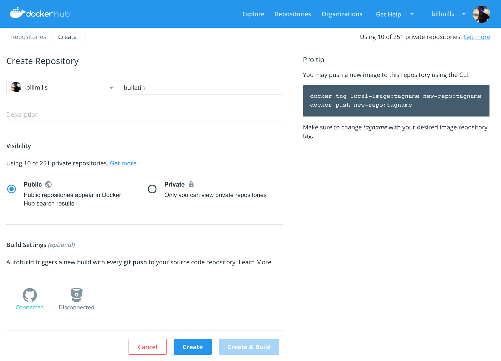



## Prerequisites

Work through the steps to build an image and run it as a containerized application in [Part 2](part2.md).

## Introduction

At this point, you've built a containerized application in [Part 2](part2.md) on your local development machine, thanks to Docker Desktop. The final step in developing a containerized application is to share your images on a registry like [Docker Hub](https://hub.docker.com/), so they can be easily downloaded and run on any destination machine.

## Set up your Docker Hub account

If you don't yet have a Docker ID, follow these steps to set one up; this will allow you to share images on Docker Hub.

1.  Visit the Docker Hub sign up page, [https://hub.docker.com/signup](https://hub.docker.com/signup).

2.  Fill out the form and submit to create your Docker ID.

3.  Verify your email address to complete the registration process.

4.  Click on the Docker icon in your toolbar or system tray, and click **Sign in / Create Docker ID**.

5.  Fill in your new Docker ID and password. After you have successfully authenticated, your Docker ID appears in the Docker Desktop menu in place of the 'Sign in' option you just used.

    > You can do the same thing from the command line by typing `docker login`.

## Create a Docker Hub repository and push your image

At this point, you've set up your Docker Hub account and have connected it to your Docker Desktop. Now let's make our first repo, and share our bulletin board app there.

1.  Click on the Docker icon in your menu bar, and navigate to **Repositories > Create**. You'll be taken to a Docker Hub page to create a new repository.

2.  Fill out the repository name as `bulletinboard`. Leave all the other options alone for now, and click **Create** at the bottom.

    {:width="100%"}

3.  Now you are ready to share your image on Docker Hub, but there's one thing you must do first: images must be *namespaced correctly* to share on Docker Hub. Specifically, you must name images like `<Docker ID>/<Repository Name>:<tag>`. You can relabel your `bulletinboard:1.0` image like this (of course, please replace `gordon` with your Docker ID):

    ```shell
    docker image tag bulletinboard:1.0 gordon/bulletinboard:1.0
    ```

4.  Finally, push your image to Docker Hub:

    ```shell
    docker image push gordon/bulletinboard:1.0
    ```

    Visit your repository in Docker Hub, and you'll see your new image there. Remember, Docker Hub repositories are public by default.

    > **Having trouble pushing?** Remember, you must be signed in to Docker Hub through Docker Desktop or the command line, and you must also name your images correctly, as per the above steps. If the push seemed to work, but you don't see it in Docker Hub, refresh your browser after a couple of minutes and check again.

## Conclusion

Now that your image is available on Docker Hub, you'll be able to run it anywhere. If you try to use it on a new machine that doesn't have it yet, Docker will automatically try and download it from Docker Hub. By moving images around in this way, you no longer need to install any dependencies except Docker on the machines you want to run your software on. The dependencies of containerized applications are completely encapsulated and isolated within your images, which you can share using Docker Hub as described above.

Another thing to keep in mind: at the moment, you've only pushed your image to Docker Hub; what about your Dockerfile? A crucial best practice is to keep these in version control, perhaps alongside your source code for your application. You can add a link or note in your Docker Hub repository description indicating where these files can be found, preserving the record not only of how your image was built, but how it's meant to be run as a full application.

## Where to go next

We recommend that you take a look at the topics in [Develop with Docker](/develop/index.md) to learn how to develop your own applications using Docker.
