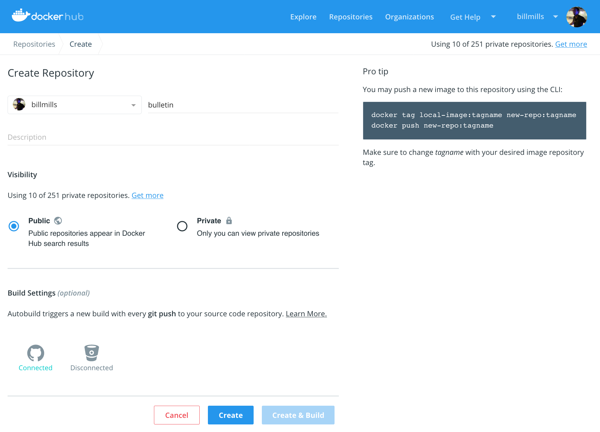



## Prerequisites

- Work through containerizing an application in [Part 2](part2.md).

## Introduction

At this point, you've built a containerized application in [Part 2](part2.md), and potentially run it on Kubernetes in [Part 3](part3.md) or Swarm in [Part 4](part4.md), all on your local development machine thanks to Docker Desktop. The final step in developing a containerized application is to share your images on a registry like [Docker Hub](https://hub.docker.com/), so they can be easily downloaded and run on any destination cluster.

## Setting Up Your Docker Hub Account

If you don't yet have a Docker ID, follow these steps to set one up; this will allow you to share images on Docker Hub.

1.  Visit the Docker Hub sign up page, [https://hub.docker.com/signup](https://hub.docker.com/signup).

2.  Fill out the form and submit to create your Docker ID.

3.  Click on the Docker icon in your toolbar or system tray, and click **Sign In / Create Docker ID**. Fill in your new Docker ID and password. If everything worked, your Docker ID will appear in the Docker Desktop dropdown in place of the 'Sign In' option you just used.

    > You can do the same thing from the command line by typing `docker login`.

## Creating and Pushing to a Docker Hub Repository

At this point, you've set up your Docker Hub account and have connected it to your Docker Desktop. Now let's make our first repo, and share our bulletin board app there.

1.  Click on the Docker icon in your menu bar, and navigate to **Repositories -> Create...**. You'll be taken to a Docker Hub page to create a new repository.

2.  Fill out the Repository Name as `bulletinboard`. Leave all the other options alone for now, and click **Create** at the bottom.

    {:width="100%"}

3.  Now we're ready to share our image on Docker Hub, but there's one thing we must do first: images must be *namespaced correctly* to share on Docker Hub. Specifically, images must be named like `<Docker Hub ID>/<Repository Name>:<tag>`. We can relabel our `bulletinboard:1.0` image like this (of course please replace `gordon` with your Docker ID):

    ```shell
    docker image tag bulletinboard:1.0 gordon/bulletinboard:1.0
    ```

4. Finally, push your image to Docker Hub:

    ```shell
    docker image push gordon/bulletinboard:1.0
    ```

    Visit your repository in Docker Hub, and you'll see your new image there. Remember, Docker Hub repositories are public by default.

    > **Having trouble pushing?** Remember, you must be signed in to Docker Hub through Docker Desktop or the command line, and you must also name your images correctly, per the above steps. If the push seemed to work but you don't see it in Docker Hub, refresh your browser after a couple of minutes and check again.

## Conclusion

Now that your image is available on Docker Hub, you'll be able to run it anywhere; if you try to use it on a new cluster that doesn't have it yet, Docker will automatically try and download it from Docker Hub. By moving images around in this way, we no longer need to install any dependencies except Docker and our orchestrator on the machines we want to run our software on; the dependencies of our containerized applications are completely encapsulated and isolated within our images, which we can share via Docker Hub in the manner above.

Another thing to keep in mind: at the moment, we've only pushed your image to Docker Hub; what about your Dockerfiles, Kube YAML and stack files? A crucial best practice is to keep these in version control, perhaps alongside your source code for your application, and add a link or note in your Docker Hub repository description indicating where these files can be found, preserving the record not only of how your image was built, but how it's meant to be run as a full application.
