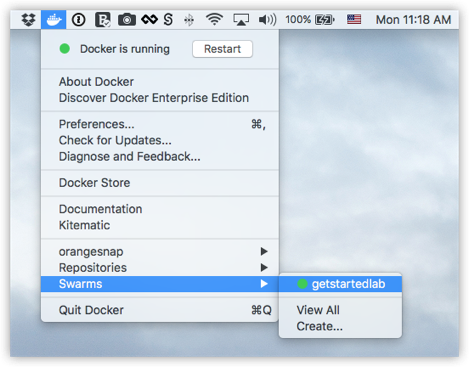
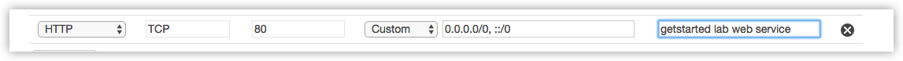
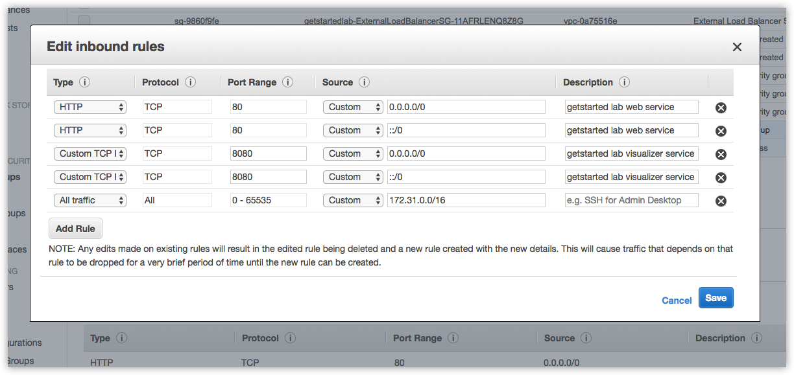
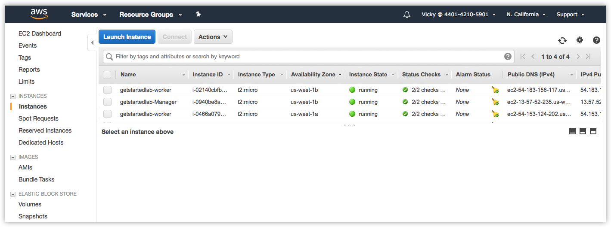



## Prerequisites

- [Install Docker](/install/index.md).
- Get [Docker Compose](/compose/overview.md) as described in [Part 3 prerequisites](/get-started/part3.md#prerequisites).
- Get [Docker Machine](/machine/overview.md) as described in [Part 4 prerequisites](/get-started/part4.md#prerequisites).
- Read the orientation in [Part 1](index.md).
- Learn how to create containers in [Part 2](part2.md).

- Make sure you have published the `friendlyhello` image you created by
[pushing it to a registry](/get-started/part2.md#share-your-image). We use that
shared image here.

- Be sure your image works as a deployed container. Run this command,
slotting in your info for `username`, `repo`, and `tag`: `docker run -p 80:80
username/repo:tag`, then visit `http://localhost/`.

- Have [the final version of `docker-compose.yml` from Part 5](/get-started/part5.md#persist-the-data) handy.

## Introduction

You've been editing the same Compose file for this entire tutorial. Well, we
have good news. That Compose file works just as well in production as it does
on your machine. Here, We go through some options for running your
Dockerized application.

## Choose an option


If you're okay with using Docker Community Edition in
production, you can use Docker Cloud to help manage your app on popular service providers such as Amazon Web Services, DigitalOcean, and Microsoft Azure.

To set up and deploy:

- Connect Docker Cloud with your preferred provider, granting Docker Cloud permission
  to automatically provision and "Dockerize" VMs for you.
- Use Docker Cloud to create your computing resources and create your swarm.
- Deploy your app.

> **Note**: We do not link into the Docker Cloud documentation here; be sure
  to come back to this page after completing each step.

### Connect Docker Cloud

You can run Docker Cloud in [standard
mode](/docker-cloud/infrastructure/index.md) or in [Swarm
mode](/docker-cloud/cloud-swarm/index.md).

If you are running Docker Cloud in standard mode, follow instructions below to
link your service provider to Docker Cloud.

* [Amazon Web Services setup guide](/docker-cloud/cloud-swarm/link-aws-swarm.md){: onclick="ga('send', 'event', 'Get Started Referral', 'Cloud', 'AWS');"}
* [DigitalOcean setup guide](/docker-cloud/infrastructure/link-do.md){: onclick="ga('send', 'event', 'Get Started Referral', 'Cloud', 'DigitalOcean');"}
* [Microsoft Azure setup guide](/docker-cloud/infrastructure/link-azure.md){: onclick="ga('send', 'event', 'Get Started Referral', 'Cloud', 'Azure');"}
* [Packet setup guide](/docker-cloud/infrastructure/link-packet.md){: onclick="ga('send', 'event', 'Get Started Referral', 'Cloud', 'Packet');"}
* [SoftLayer setup guide](/docker-cloud/infrastructure/link-softlayer.md){: onclick="ga('send', 'event', 'Get Started Referral', 'Cloud', 'SoftLayer');"}
* [Use the Docker Cloud Agent to bring your own host](/docker-cloud/infrastructure/byoh.md){: onclick="ga('send', 'event', 'Get Started Referral', 'Cloud', 'BYOH');"}

If you are running in Swarm mode (recommended for Amazon Web Services or
Microsoft Azure), then skip to the next section on how to [create your
swarm](#create-your-swarm).

### Create your swarm

Ready to create a swarm?

* If you're on Amazon Web Services (AWS) you
  can [automatically create a
  swarm on AWS](/docker-cloud/cloud-swarm/create-cloud-swarm-aws/){: onclick="ga('send', 'event', 'Get Started Referral AWS', 'Cloud', 'Create AWS Swarm');"}.

* If you are on Microsoft Azure, you can [automatically create a
swarm on Azure](/docker-cloud/cloud-swarm/create-cloud-swarm-azure/){: onclick="ga('send', 'event', 'Get Started Referral Azure', 'Cloud', 'Create Azure Swarm');"}.

* Otherwise, [create your nodes](/docker-cloud/getting-started/your_first_node/){: onclick="ga('send', 'event', 'Get Started Referral', 'Cloud', 'Create Nodes');"}
  in the Docker Cloud UI, and run the `docker swarm init` and `docker swarm join`
  commands you learned in [part 4](part4.md) over [SSH via Docker
  Cloud](/docker-cloud/infrastructure/ssh-into-a-node/). Finally, [enable Swarm
  Mode](/docker-cloud/cloud-swarm/using-swarm-mode/) by clicking the toggle at
  the top of the screen, and [register the
  swarm](/docker-cloud/cloud-swarm/register-swarms/) you just created.

> **Note**: If you are [Using the Docker Cloud Agent to Bring your Own Host](/docker-cloud/infrastructure/byoh.md){: onclick="ga('send', 'event', 'Get
Started Referral', 'Cloud', 'BYOH');"}, this provider does not support swarm
mode. You can [register your own existing
swarms](/docker-cloud/cloud-swarm/register-swarms/) with Docker Cloud.

### Deploy your app on a cloud provider

1. [Connect to your swarm via Docker
Cloud](/docker-cloud/cloud-swarm/connect-to-swarm.md). There are a couple of different ways to connect:

    * From the Docker Cloud web interface in Swarm mode, select Swarms at
    the top of  the page, click the swarm you want to connect to, and copy-paste the given command into a command line terminal.

    

    Or ...

    *  On Docker for Mac or Docker for Windows, you can [connect to your swarms directly through the desktop app    menus](/docker-cloud/cloud-swarm/connect-to-swarm.md#use-docker-for-mac-or-windows-edge-to-connect-to-swarms).

    

    Either way, this opens a terminal whose context is your local machine,
    but whose Docker commands are routed up to the swarm running on your
    cloud service provider. You directly access both your local file system
    and your remote swarm, enabling pure `docker` commands.

2. Run `docker stack deploy -c docker-compose.yml getstartedlab` to deploy
the app on the cloud hosted swarm.

    ```shell
    docker stack deploy -c docker-compose.yml getstartedlab

    Creating network getstartedlab_webnet
    Creating service getstartedlab_web
    Creating service getstartedlab_visualizer
    Creating service getstartedlab_redis
    ```

    Your app is now running on your cloud provider.

#### Run some swarm commands to verify the deployment

You can use the swarm command line, as you've done already, to browse and manage
the swarm. Here are some examples that should look familiar by now:

* Use `docker node ls` to list the nodes.

    ```shell
    [getstartedlab] ~ $ docker node ls
    ID                            HOSTNAME                                      STATUS              AVAILABILITY        MANAGER STATUS
    9442yi1zie2l34lj01frj3lsn     ip-172-31-5-208.us-west-1.compute.internal    Ready               Active              
    jr02vg153pfx6jr0j66624e8a     ip-172-31-6-237.us-west-1.compute.internal    Ready               Active              
    thpgwmoz3qefdvfzp7d9wzfvi     ip-172-31-18-121.us-west-1.compute.internal   Ready               Active              
    n2bsny0r2b8fey6013kwnom3m *   ip-172-31-20-217.us-west-1.compute.internal   Ready               Active              Leader
    ```

* Use `docker service ls` to list services.

  ```shell
  [getstartedlab] ~/sandbox/getstart $ docker service ls
  ID                  NAME                       MODE                REPLICAS            IMAGE                             PORTS
  x3jyx6uukog9        dockercloud-server-proxy   global              1/1                 dockercloud/server-proxy          *:2376->2376/tcp
  ioipby1vcxzm        getstartedlab_redis        replicated          0/1                 redis:latest                      *:6379->6379/tcp
  u5cxv7ppv5o0        getstartedlab_visualizer   replicated          0/1                 dockersamples/visualizer:stable   *:8080->8080/tcp
  vy7n2piyqrtr        getstartedlab_web          replicated          5/5                 sam/getstarted:part6    *:80->80/tcp
  ```

* Use `docker service ps <service>` to view tasks for a service.

  ```shell
  [getstartedlab] ~/sandbox/getstart $ docker service ps vy7n2piyqrtr
  ID                  NAME                  IMAGE                            NODE                                          DESIRED STATE       CURRENT STATE            ERROR               PORTS
  qrcd4a9lvjel        getstartedlab_web.1   sam/getstarted:part6   ip-172-31-5-208.us-west-1.compute.internal    Running             Running 20 seconds ago                       
  sknya8t4m51u        getstartedlab_web.2   sam/getstarted:part6   ip-172-31-6-237.us-west-1.compute.internal    Running             Running 17 seconds ago                       
  ia730lfnrslg        getstartedlab_web.3   sam/getstarted:part6   ip-172-31-20-217.us-west-1.compute.internal   Running             Running 21 seconds ago                       
  1edaa97h9u4k        getstartedlab_web.4   sam/getstarted:part6   ip-172-31-18-121.us-west-1.compute.internal   Running             Running 21 seconds ago                       
  uh64ez6ahuew        getstartedlab_web.5   sam/getstarted:part6   ip-172-31-18-121.us-west-1.compute.internal   Running             Running 22 seconds ago        
  ```

#### Open ports to services on cloud provider machines

At this point, your app is deployed as a swarm on your cloud provider servers,
as evidenced by the `docker` commands you just ran. But, you still need to
open ports on your cloud servers in order to:

* allow communication between the `redis` service and `web` service on
the worker nodes

* allow inbound traffic to the `web` service on the worker nodes so that
Hello World and Visualizer are accessible from a web browser.

* allow inbound SSH traffic on the server that is running the `manager` (this may be already set on your cloud provider)

{: id="table-of-ports"}

These are the ports you need to expose for each service:

| Service        | Type    | Protocol |  Port   |
| :---           | :---    | :---     | :---    |
| `web`          | HTTP    | TCP      |  80     |
| `visualizer`   | HTTP    | TCP      |  8080   |
| `redis`        | TCP     | TCP      |  6379   |

Methods for doing this vary depending on your cloud provider.

We use Amazon Web Services (AWS) as an example.

> What about the redis service to persist data?
>
> To get the `redis` service working, you need to `ssh` into
the cloud server where the `manager` is running, and make a `data/`
directory in `/home/docker/` before you run `docker stack deploy`.
Another option is to change the data path in the `docker-stack.yml` to
a pre-existing path on the `manager` server. This example does not
include this step, so the `redis` service is not up in the example output.

#### Example: AWS

1.  Log in to the [AWS Console](https://aws.amazon.com/){: target="_blank"
class="_"}, go to the EC2 Dashboard, and click into your **Running Instances**
to view the nodes.

2.  On the left menu, go to Network & Security > **Security Groups**.

    See the security groups related to your swarm
    for `getstartedlab-Manager-<xxx>`, `getstartedlab-Nodes-<xxx>`,
    and `getstartedlab-SwarmWide-<xxx>`.

3.  Select the "Node" security group for the swarm. The group name
is something like this: `getstartedlab-NodeVpcSG-9HV9SMHDZT8C`.

4.  Add Inbound rules for the `web`, `visualizer`, and `redis`
services, setting the Type, Protocol and Port for each as shown in the
[table above](#table-of-ports), and click **Save** to apply the rules.

    

    > **Tip**: When you save the new rules, HTTP and TCP
    ports are auto-created for both IPv4 and IPv6 style addresses.

    

5.  Go to the list of **Running Instances**, get the public DNS name for
one of the workers, and paste it into the address bar of your web browser.

    

    Just as in the previous parts of the tutorial, the Hello World app
    displays on port `80`, and the Visualizer displays on port `8080`.

    

    

### Iteration and cleanup

From here you can do everything you learned about in previous parts of the
tutorial.

* Scale the app by changing the `docker-compose.yml` file and redeploy
on-the-fly with the `docker stack deploy` command.

* Change the app behavior by editing code, then rebuild, and push the new image.
(To do this, follow the same steps you took earlier to [build the
app](part2.md#build-the-app) and [publish the
image](part2.md#publish-the-image)).

* You can tear down the stack with `docker stack rm`. For example:

  ```
  docker stack rm getstartedlab
  ```

Unlike the scenario where you were running the swarm on local Docker machine
VMs, your swarm and any apps deployed on it continue to run on cloud
servers regardless of whether you shut down your local host.



Customers of Docker Enterprise Edition run a stable, commercially-supported
version of Docker Engine, and as an add-on they get our first-class management
software, Docker Datacenter. You can manage every aspect of your application
via UI using Universal Control Plane, run a private image registry with Docker
Trusted Registry, integrate with your LDAP provider, sign production images with
Docker Content Trust, and many other features.

[Take a tour of Docker Enterprise Edition](https://www.docker.com/enterprise-edition){: class="button outline-btn" onclick="ga('send', 'event', 'Get Started Referral', 'Enterprise', 'Take tour');"}


Once you're all set up and Datacenter is running, you can [deploy your Compose
file from directly within the UI](/datacenter/ucp/2.1/guides/user/services/){: onclick="ga('send', 'event', 'Get Started Referral', 'Enterprise', 'Deploy app in UI');"}.


After that, you can see it running, and can change any aspect of the application
you choose, or even edit the Compose file itself.




{{ enterpriseboilerplate }}

The bad news is: the only cloud providers with official Docker
Enterprise editions are Amazon Web Services and Microsoft Azure.

The good news is: there are one-click templates to quickly deploy Docker
Enterprise on each of these providers:

* [Docker Enterprise for AWS](https://store.docker.com/editions/enterprise/docker-ee-aws?tab=description){: onclick="ga('send', 'event', 'Get Started Referral', 'Enterprise', 'EE for AWS');"}
* [Docker Enterprise for Azure](https://store.docker.com/editions/enterprise/docker-ee-azure?tab=description){: onclick="ga('send', 'event', 'Get Started Referral', 'Enterprise', 'EE for Azure');"}

> **Note**: Having trouble with these? View [our setup guide for AWS](/datacenter/install/aws/){: onclick="ga('send', 'event', 'Get Started Referral', 'Enterprise', 'AWS setup guide');"}.
> You can also [view the WIP guide for Microsoft Azure](https://github.com/docker/docker.github.io/pull/2796){: onclick="ga('send', 'event', 'Get Started Referral', 'Enterprise', 'Azure setup guide');"}.

{{ enterprisedeployapp }}


{{ enterpriseboilerplate }}

Bringing your own server to Docker Enterprise and setting up Docker Datacenter
essentially involves two steps:

1. [Get Docker Enterprise Edition for your server's OS from Docker Store](https://store.docker.com/search?offering=enterprise&type=edition){: onclick="ga('send', 'event', 'Get Started Referral', 'Enterprise', 'Get Docker EE for your OS');"}.
2. Follow the [instructions to install Datacenter on your own host](/datacenter/install/linux/){: onclick="ga('send', 'event', 'Get Started Referral', 'Enterprise', 'BYOH setup guide');"}.

> **Note**: Running Windows containers? View our [Windows Server setup guide](/install/windows/docker-ee.md){: onclick="ga('send', 'event', 'Get Started Referral', 'Enterprise', 'Windows Server setup guide');"}.

{{ enterprisedeployapp }}


<ul class="nav nav-tabs">
  <li class="active"><a data-toggle="tab" href="#cloud">Docker CE (Cloud provider)</a></li>
  <li><a data-toggle="tab" href="#enterprisecloud">Enterprise (Cloud provider)</a></li>
  <li><a data-toggle="tab" href="#enterpriseonprem">Enterprise (On-premise)</a></li>
</ul>
<div class="tab-content">
  <div id="cloud" class="tab-pane fade in active" markdown="1">{{ cloud }}</div>
  <div id="enterprisecloud" class="tab-pane fade" markdown="1">{{ enterprisecloud }}</div>
  <div id="enterpriseonprem" class="tab-pane fade" markdown="1">{{ enterpriseonprem }}</div>
</div>

## Congratulations!

You've taken a full-stack, dev-to-deploy tour of the entire Docker platform.

There is much more to the Docker platform than what was covered here, but you
have a good idea of the basics of containers, images, services, swarms, stacks,
scaling, load-balancing, volumes, and placement constraints.

Want to go deeper? Here are some resources we recommend:

- [Samples](/samples/): Our samples include multiple examples of popular software
  running in containers, and some good labs that teach best practices.
- [User Guide](/engine/userguide/): The user guide has several examples that
  explain networking and storage in greater depth than was covered here.
- [Admin Guide](/engine/admin/): Covers how to manage a Dockerized production
  environment.
- [Training](https://training.docker.com/): Official Docker courses that offer
  in-person instruction and virtual classroom environments.
- [Blog](https://blog.docker.com): Covers what's going on with Docker lately.
