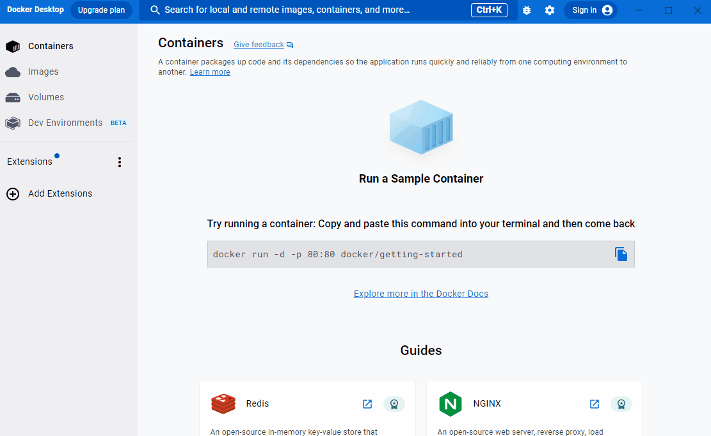
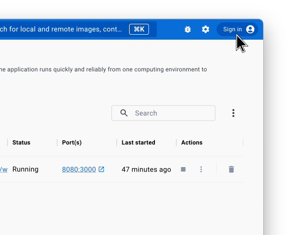
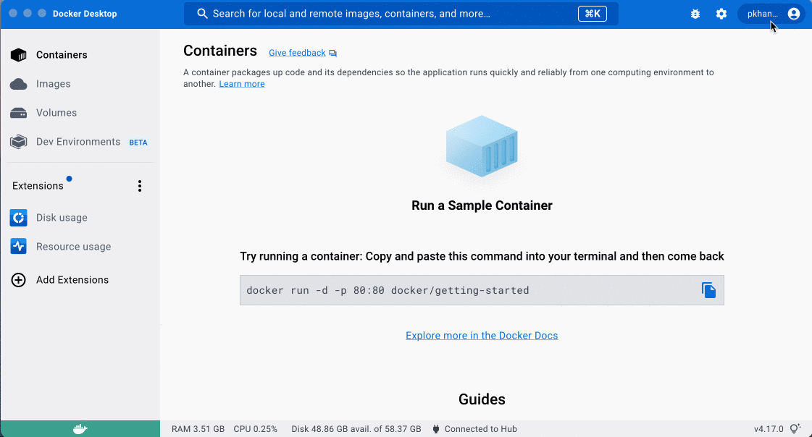

Follow this guide to learn how you can share your packaged application in an image using Docker Hub.

## Step 1: Get an image

Before you publish your image, you need an image to publish. For this guide, use the `welcome-to-docker` image.

To get the image, use Docker Desktop to search for the `welcome-to-docker` image, and then select **Pull**.

{:width="500px"}

## Step 2: Sign in to Docker

To publish images publicly on Docker Hub, you first need an account. Select **Sign in** on the top-right of Docker Desktop to either sign in or create a new account on Docker Hub.



## Step 3: Rename your image

Before you can publish your image to Docker Hub, you need to rename it so that Docker Hub knows that the image is yours. Run the following `docker tag` command in your terminal to rename your image. Replace `YOUR-USERNAME` with your Docker ID.

```console
$ docker tag docker/welcome-to-docker YOUR-USERNAME/welcome-to-docker
```

## Step 4: Push your image to Docker Hub

In Docker Desktop, go to the **Images** tab and find your image. In the **Actions** column, select the **Show image actions** icon and then select **Push to Hub**. Your image uploads to Docker Hub and is publicly available for anyone to use.



## Step 5: Verify the image is on Docker Hub

That's it! Your image is now shared on Docker Hub. In your browser, go to [Docker Hub](https://hub.docker.com){:target="_blank" rel="noopener" class="_"} and verify that you see the `welcome-to-docker` repository.

## What's next

In this guide you learned how to publish your own image to Docker Hub. Continue to the following language-specific guides to learn more about creating images for applications in other languages:

 - [Node.js](../language/nodejs/index.md)
 - [Python](../language/python/index.md)
 - [Go](../language/golang/index.md)
 - [Java](../language/java/index.md)
 - [C# (.NET)](../language/dotnet/index.md)
