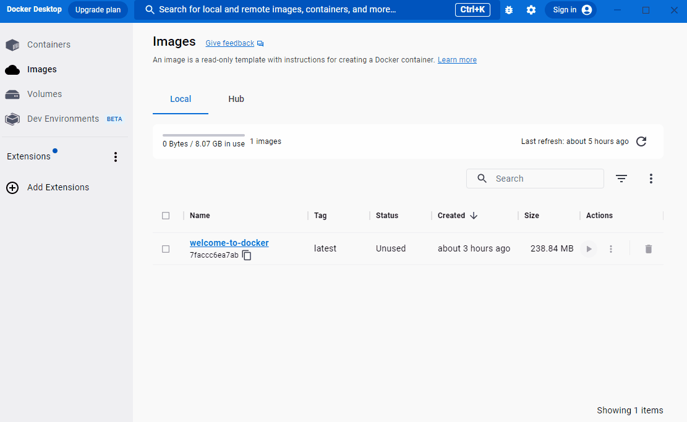

Follow this guide to learn the basic steps of running a container from scratch. This guide uses a sample Node.js application, but it's not necessary to know Node.js.

## Step 1: Get the sample application

If you have git, you can clone the repository for the sample application. Otherwise, you can download the sample application. Choose one of the following options.

   <ul class="nav nav-tabs">
     <li class="active"><a data-toggle="tab" data-target="#git">Clone with git</a></li>
     <li><a data-toggle="tab" data-target="#download">Download</a></li>
   </ul>
  <div class="tab-content">
  <div id="git" class="tab-pane fade in active" markdown="1">

### Clone with git

Use the following command in a terminal to clone the sample application repository.

```console
$ git clone https://github.com/docker/welcome-to-docker
```

   <hr>
  </div>
  <div id="download" class="tab-pane fade" markdown="1">

### Download

If you don't have git, download the source and extract it.

[Download the source](https://github.com/docker/welcome-to-docker/archive/refs/heads/main.zip){: .button .primary-btn}

   <hr>
  </div>
  </div>

## Step 2: Explore the Dockerfile

To run your code in a container, the most fundamental thing you need is a Dockerfile. A Dockerfile describes what goes into a container. Open the sample application in your IDE and then open the `Dockerfile` to explore its contents. Note that this project already has a Dockerfile, but for your own projects you need to create a Dockerfile. A Dockerfile is simply a text file named `Dockerfile` with no file extension.

## Step 3: Build your first image

An image is like a static version of a container. You always need an image to run a container. Once you have a Dockerfile in your repository, run the following `docker build` command in the project folder to create an image.

```console
$ docker build -t welcome-to-docker .
```

Building the image may take some time. After your image is built, you can view your image in the **Images** tab in Docker Desktop.

## Step 4: Run your container

To run your image as a container, go to the **Images** tab, and then select **Run** in the **Actions** column of your image. When the **Optional settings** appear, specify the **Host port** number `8089` and then select **Run**.

{:width="500px"}

## Step 5: Verify that your container is running

You can use Docker Desktop to view and access running containers. Go to the **Containers** tab to view your container and select the link in the **Port(s)** column or go to [http://localhost:8089](http://localhost:8089){:target="_blank" rel="noopener" class="_"} to verify that the application is running.

## What's next

In this guide, you built your own image. When running containers on Docker Desktop, you don’t need to build your own image from scratch. You can also run images created by others on Docker Hub.

[Run Docker Hub images](./run-docker-hub-images.md){: .button .primary-btn}

## Dive deeper

### Language-specific guides

If you want to learn more about creating images for applications in other languages, check out the following language-specific guides:
 - [Node.js](../language/nodejs/index.md)
 - [Python](../language/python/index.md)
 - [Go](../language/golang/index.md)
 - [Java](../language/java/index.md)
 - [C# (.NET)](../language/dotnet/index.md)

### Breaking down the `docker build` command

When you built the image, you used the `docker build` command. Here are what the different parts of the `docker build` command do:
 - `docker build`: This command builds the image. It needs one argument, the source folder for the Dockerfile that needs to be built. In this case, it’s the Dockerfile in the current folder, `.`.
 - `-t welcome-to-docker`: The `-t` flag tags the image with a unique name. In this case, `welcome-to-docker`.
