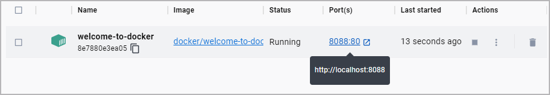
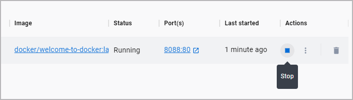

A container is an isolated environment for your code. This means that a container has no knowledge of your operating system, or your files. It runs on the environment provided to you by Docker Desktop. This is why a container usually has everything that your code needs in order to run, down to a base operating system. You can use Docker Desktop to manage and explore your containers.

Continue with the following steps to view and explore an actual container in Docker Desktop.

## Step 0: Set up the container

The first thing you need is a running container. For this guide, you will use a premade container. To get started, start Docker Desktop and then run the following command in your local terminal:

```console
$ docker run -p 8088:80 -d --name welcome-to-docker docker/welcome-to-docker
```

## Step 1: View containers on Docker Desktop

You just ran a container! Open Docker Desktop to take a look. This container runs a simple web server that displays HTML text. When working with Docker, each of part of your app runs in a different container. For example, a different container for the frontend, backend, and database.

{:width="500px"}

## Step 2: View the frontend

The frontend is accessible on port 8088 of your local host. Select the link in the **Port(s)** column of your container, or visit http://localhost:8088  in your browser to check it out.

{:width="500px"}

## Step 3: Explore your container

Docker Desktop allows you to easily view and interact with different aspects of your container. Try it out yourself, select your container to view logs, run commands in your container, and more.

{:width="500px"}

## Step 4: Stop your container

The `welcome-to-docker` container will continue to run until you stop it. To stop the container in Docker Desktop, go to the **Containers** tab and select the **Stop** icon in the **Actions** column of your container.

{:width="500px"}

## What's next

In this guide, you explored what a container is. Next, you'll learn what you need to create your own container.

<div class="component-container">
    <!--start row-->
    <div class="row">
     <div class="col-xs-12 col-sm-12 col-md-12 col-lg-4 block">
        <div class="component">
            <div class="component-icon">
                <a href="/get-started/run-your-own-container/"></a>
            </div>
                <h3 id="run-your-own-container"><a href="/get-started/run-your-own-container">Create and run your own container</a></h3>
            </div>
        </div>
  </div>  
</div>


## Dive deeper

### Breaking down the `docker run` command

When setting up the container, you used the `docker run` command. Here are what the different parts of the command do:

 - `docker run`: This is used to run containers. It needs at least one argument, and that argument is the image you want to run. In this case, it's `docker/welcome-to-docker`.
 - `-p 8088:80`: This lets Docker know that port 80 in the container needs to be accessible from port 8088 on your local host.
 - `-d`: This runs the container detached or in the background.
 - `—-name welcome-to-docker`: This sets the name for your container. If you don’t do so, Docker will select a random name for you.

Keep following [What's next](#whats-next) to learn how to intuitively run an image using the Docker Desktop GUI.