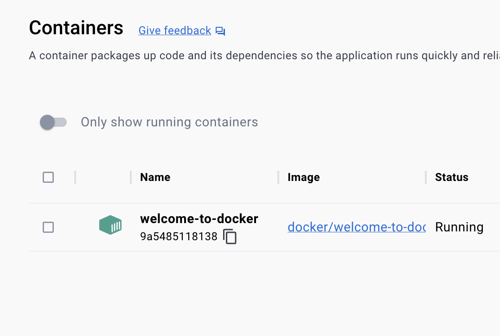
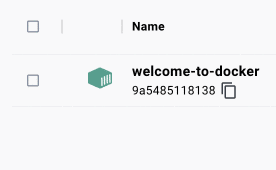
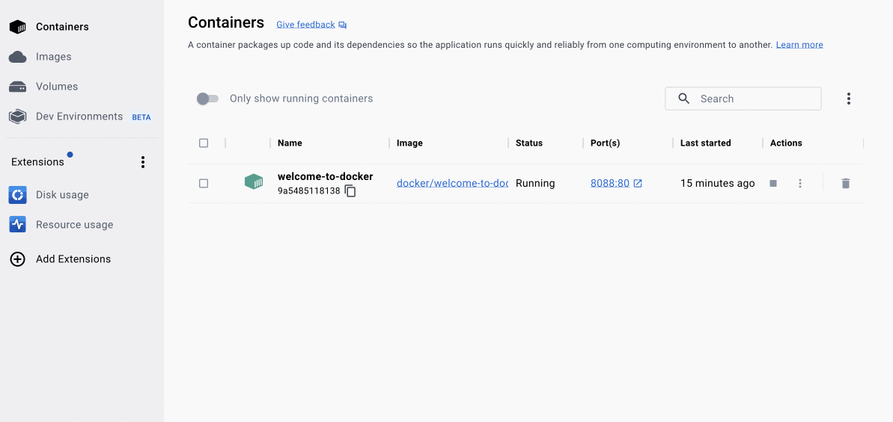

In this guide you'll learn what a running container looks like, and how to use Docker Desktop to inspect it. By the end of the guide, you will have a basic understanding of using containers in Docker Desktop.

## Step 0: Set up the container

The first thing you need is a running container. For this guide, you will use a premade container. To get started, start Docker Desktop and then run the following command in your local terminal:

```console
$ docker run -p 8088:80 --name welcome-to-docker docker/welcome-to-docker
```

> **Breaking down the `docker run` command**
>
> Here are what the different parts of the `docker run` command do:
> - `docker run`: This is used to run containers. It needs at least one argument, and that argument is the image you want to run. In this case, it's `docker/welcome-to-docker`.
> - `-p 8088:80`: This lets Docker know that port 80 in the container needs to be accessible from port 8088 on your local host.
> - `—-name welcome-to-docker`: This sets the name for your container. If you don’t do so, Docker will select a random name for you.

## Step 1: View containers on Docker Desktop

You just ran your first container! Open Docker Desktop to take a look. This container runs a simple web server that displays HTML text. When working with Docker, each of part of your app runs in a different container. For example, a different container for the frontend, backend, and database.

{:width="500px"}

## Step 2: View the frontend

The frontend is accessible on port 8088 of your local host. Select the link in the **Port(s)** column of your container, or visit http://localhost:8088  in your browser to check it out.



## Step 3: Explore your container

A container is an isolated environment for your code. This means that a container has no knowledge of your operating system, or your files. It runs on the environment provided to you by Docker Desktop. This is why a container usually has everything that your code needs in order to run, down to a base operating system. You can use Docker Desktop to manage and explore your containers. Try it out yourself, select your container to view logs, run commands in your container, and more.

{:width="500px"}

## Step 4: stop your container

The `welcome-to-docker` container will continue to run until you stop it. You can use Docker Desktop to quickly stop the container. Go to the **Containers** tab in Docker Desktop and select the **Stop** icon in the **Actions** column of your container.

## What's next

In this guide, you explored what a container is. Next, you'll learn what you need to create your own container.

[Run your own container](run-your-own-container.md){: .button .primary-btn}
