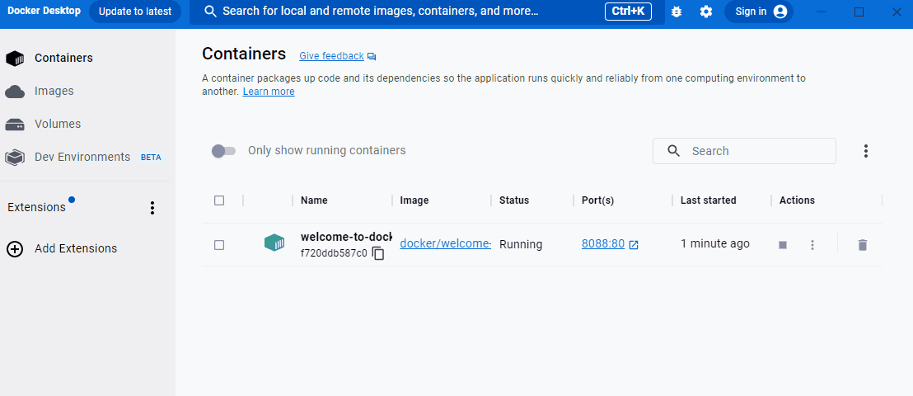

A container is an isolated environment for your code. This means that a container has no knowledge of your operating system, or your files. It runs on the environment provided to you by Docker Desktop. This is why a container usually has everything that your code needs in order to run, down to a base operating system. You can use Docker Desktop to manage and explore your containers.

Continue with the following steps to view and explore an actual container in Docker Desktop.

## Step 1: Set up the guide

The first thing you need is a running container. For this guide, use the premade `welcome-to-docker` container. To get started, start Docker Desktop and then run the following command in your local terminal:

```console
$ docker run -p 8088:80 -d --name welcome-to-docker docker/welcome-to-docker
```

## Step 2: View containers on Docker Desktop

You just ran a container! Open Docker Desktop to take a look. This container runs a simple web server that displays HTML text. When working with more complex projects, you'll run different parts in different containers. For example, a different container for the frontend, backend, and database. In this guide, you only have a simple frontend container.

{:width="500px"}

## Step 3: View the frontend

The frontend is accessible on port 8088 of your local host. Select the link in the **Port(s)** column of your container, or visit [http://localhost:8088](http://localhost:8088){:target="_blank" rel="noopener" class="_"} in your browser to check it out.

{:width="500px"}

## Step 4: Explore your container

Docker Desktop allows you to easily view and interact with different aspects of your container. Try it out yourself. Select your container and then select **Files** to explore your container's isolated file system.

{:width="500px"}

## Step 5: Stop your container

The `welcome-to-docker` container continues to run until you stop it. To stop the container in Docker Desktop, go to the **Containers** tab and select the **Stop** icon in the **Actions** column of your container.

{:width="500px"}

## What's next

In this guide, you explored what a container is. Continue to the next guide to learn what you need to create and run your own container.

[Run your own container](./run-your-own-container.md){: .button .primary-btn}

## Dive deeper

### Breaking down the `docker run` command

When setting up the container, you used the `docker run` command. Here are what the different parts of the command do:

 - `docker run`: This is used to run containers. It needs at least one argument, and that argument is the image you want to run. In this case, it's `docker/welcome-to-docker`.
 - `-p 8088:80`: This lets Docker know that port 80 in the container needs to be accessible from port 8088 on your local host.
 - `-d`: This runs the container detached or in the background.
 - `—-name welcome-to-docker`: This sets the name for your container. If you don’t do so, Docker selects a random name for you.

Continue following [What's next](#whats-next) to learn how to intuitively run an image using the Docker Desktop GUI.