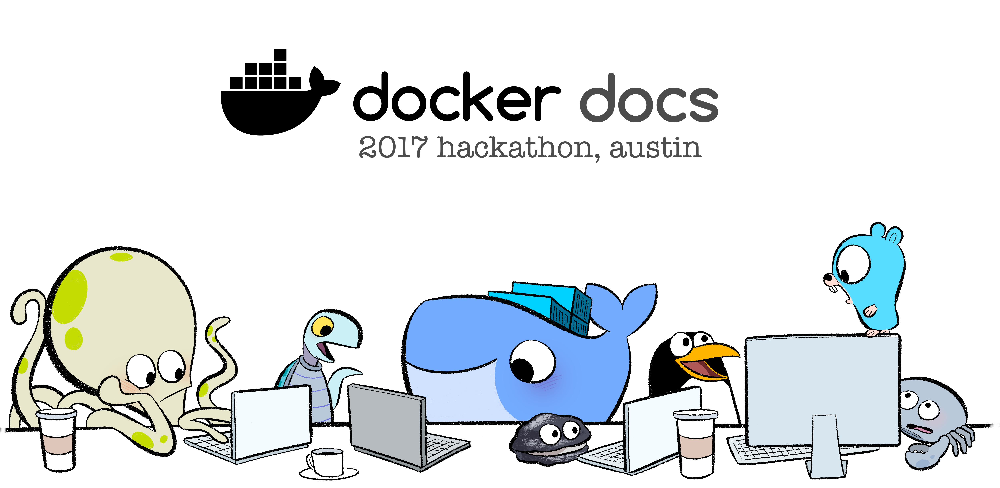

During DockerCon 2017, Docker's docs team will be running our first-ever Docs
hackathon, and you're invited to participate and win prizes -- whether you
attend DockerCon or are just watching the proceedings online. Either way, during
the hackathon, you  will be an honorary member of the docs team, helping us sort
this all out.

<iframe src="https://free.timeanddate.com/countdown/i5ntfxko/n24/cf11/cm0/cu4/ct0/cs0/ca0/cr0/ss0/cac000/cpc000/pcfff/tcfff/fs100/szw320/szh135/tatTime%20until%20Docs%20Hackathon%20kickoff/tac000/tptTime%20since%20Docs%20Hackathon%20started/tpc000/mac000/mpc000/iso2017-04-17T00:00:00" allowTransparency="true" frameborder="0" width="305" height="57"></iframe>

## How it works

We have a number of bugs that have built up in our docs queue on GitHub, and
we have labeled a whole slew of them with [the tag `hackathon`, which you can
see here](https://github.com/docker/docker.github.io/labels/hackathon).

Submit fixes for these bugs, or close them if you do a bit of research it turns
out they aren't actually valid. Every action you take gets you more points, and
the points are redeemable for dollars in [our hackathon store](http://www.cafepress.com/+gifts), and
qualify you for valuable prizes like an Amazon gift card and a personally
engraved trophy.

## Prizes

- **All participants**: Points redeemable for t-shirts, hoodies, sweatshirts,
  mugs, beer steins, pint glasses, flasks, hoodies, stickers, buttons, magnets,
  wall clocks, post-cards, even doggie t-shirts
- **3rd place**: A small trophy with a personal engraving, plus store credit
- **2nd place**: A small trophy with a personal engraving, plus store credit,
  plus a $150 Amazon Gift Card
- **1st place**: A large trophy with a personal engraving, plus store credit,
  plus a $300 Amazon Gift Card

## When?

The docs hackathon is going on from **April 17th thru April 21st, 2017**. This
is the time when it's possible to claim and resolve bugs.

> **Note**: Okay, technically, we won't be tallying until the following Monday,
  April 24th. Just be sure you've submitted your claim form by then. If we don't
  see your work on Monday morning, it won't be counted.

## Where?

### In-person

Attending DockerCon? Come to the fourth floor hack room on Tuesday and Wednesday
from 1pm to 6pm. We'll be there to answer questions and help you.

> **Note**: While the hackathon is officially ongoing all week online, working in
  the hack room with us for these two days is
  by far the best way to participate; the docs team will be on-hand to get you
  started, get you unstuck, and guide you.

### Online

Drop into [the community Slack channel for the docs](https://dockercommunity.slack.com/messages/C2V58TASE) and ask any questions
you have. Otherwise, just go to GitHub and [look at our `hackathon` label](https://github.com/docker/docker.github.io/labels/hackathon)
and come here to claim your points when you're done.

## Claiming a bug

To claim a bug as one that you are working on, so nobody else grabs it out from
under you, type a comment saying you claim it. Respect it

## Claiming your points

Fill out the scoring form, which will be posted in this space when the Hackathon
is ongoing, specifying your GitHub username, the issues you fixed and the pull
requests that fixed them. We'll do all the tallying when the hackathon is over
and whatever your participation level is, you'll get credits at the prize store
and can claim a prize of your choice.
