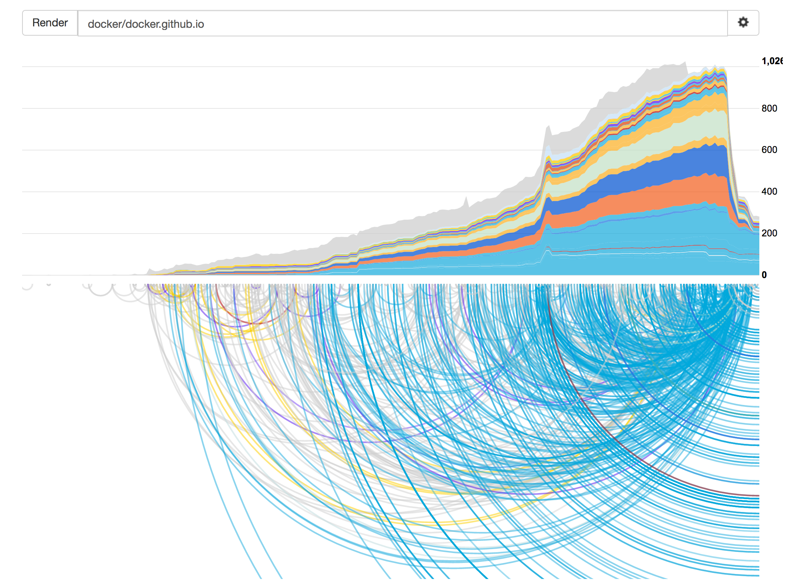
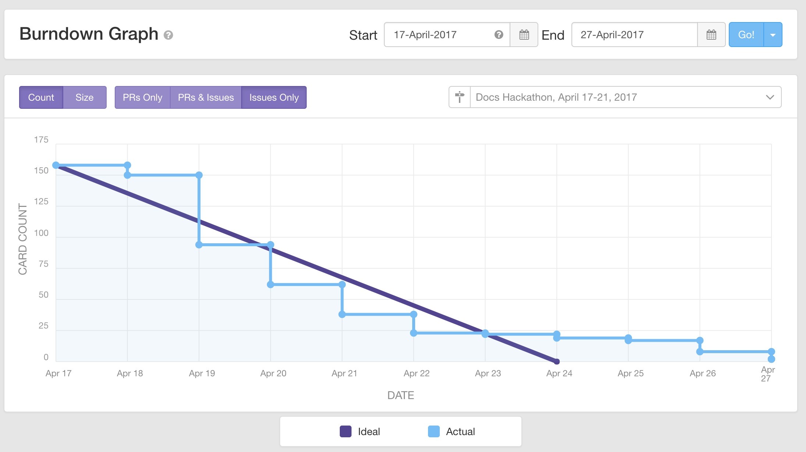

## Docs Hackathon: Winners

Well, it's over.
We had an amazing hackathon on the documentation last week, with over 140 bugs
closed and counting. We couldn't be more thankful for your participation!
If you participated, make sure you
[fill out your report](/hackathon/#claiming-your-points) so you can [get your rewards](http://www.cafepress.com/dockerdocshackathon).

We are so humbled and lucky to have a community like you working with us. From
the bottom of our hearts: thank you!

Let's dive into the results. First up, the point bonus winners:

### Bonuses

There were three bonus categories. You can see the point values from these
bonuses reflected in the [participant report](#raw-results).

#### Largest change in a single fix

This award goes to @allejo, for the site-shifting change in
[pull request #2860](https://github.com/docker/docker.github.io/pull/2860).
A revamp of many aspects of the site's responsive behavior that affected our
CSS, JS, and include/header structure, you can thank @allejo for the site
operating so well in various resolutions now, and keeping the menus working
regardless of viewport size and footer position.

#### Most bugs closed

This award goes to @shubheksha who helped closed a stunning 31 bugs during our
hackathon. For details of all of @shubheksha's contributions, see the
[raw results](#raw-results). Excellent work!

#### Most participation (active every day)

This is tough because we actually had several people who spent time on the
hackathon every single day it was active. So we're going to split this award
four ways:

- @johnharris85
- @shubheksha
- @scjane
- @bdwill

We saw you all, in person, in Slack, or on GitHub, and worked with you the
whole hackathon. 250 points to each of you, and our sincere thanks.

### Overall winners

And now, the moment we've all been waiting for. The top three of the Docs
Hackathon!

#### 3rd place: @johnharris85

Congratulations to @johnharris85, our second runner-up! For your efforts you
get:

- $157.50 in the hackathon swag store
- A trophy with a personal engraving

#### 2nd place: @allejo

Congratulations to @allejo, our runner-up! For your efforts, you get:

- $180 in the hackathon swag store
- A $150 Amazon Gift card
- A trophy with a personal engraving

#### 1st place: @shubeksha

Last but not least, a round of applause for our first-place winner!

Congratulations to @shubeksha! With an amazing 31 bugs closed, Docker thanks you
from the bottom of our hearts. For your efforts you get:

- $275 in the hackathon swag store
- A $300 Amazon gift card
- A large trophy with a personal engraving

Amazing work, @shubeksha, and once again, many thanks to our participants.
We're already planning the next one, so get ready!

## Hackathon impact and results

### Stats

Just a few bits of trivia.

- Total points awarded: 16750
- Total issues closed: 158
- Total participants (not counting Docker employees): 35
- Average points per issue: 106.01
- Average points per participant: 478.57
- Average participation time: 52.2 minutes (based on our estimate that 100
  points = 1 hour of work)

### Visuals

#### Bug count graph

In this graph you can see the pile-up of bugs we were experiencing in
the docs, and the dramatic flurry of activity that closed many of these bugs
during the hackathon. This is actually a graph of the labels attached to bugs;
interact with these results [here](https://9-volt.github.io/bug-life/?repo=docker/docker.github.io).

*Courtesy of [Bug Life](https://9-volt.github.io/)*

#### Bug burndown graph

In this graph you see the ideal line for reaching zero bugs during the
hackathon. Unfortunately it took us a bit longer to reach zero while we graded
and closed lingering PRs. But we did indeed get there!

*Courtesy of [waffle.io](https://waffle.io)*

### Raw results

You can audit our work on GitHub, or with these handy tables.

#### By participant

| Participant | Issues Fixed | Subtotal | Bonus | Final Score |
| ----------- | ------------ | -------- | ----- | ----------- |
| {{ result.person }} | {{ result.issuesfixed }} | {{ result.subtotal }} | {{ result.bonuspoints }} | {{ result.final }} | 

#### By GitHub issue

| Issue(s) | Pull Request(s) | Fixer #1 | Points to #1 | Fixer #2 (if split) | Points to #2 |
| -------- | --------------- | -------- | ------------ | ------------------- | ------------ |
| {{ result.issue }} | {{ result.pr }} | {{ result.fixer1 }} | {{ result.points1 }} | {{ result.fixer2 }} | {{ result.points2 }} |

## Original Hackathon details

During DockerCon 2017, Docker's docs team will be running our first-ever
hackathon, and you're invited to participate and win prizes -- whether you
attend DockerCon or are just watching the proceedings online.

Essentially, it's a bug-bash! We have a number of bugs filed against our docs
up on GitHub for you to grab.

You can participate in one of two ways:

- With the docs team's help in [**the fourth floor hack room at DockerCon on
  Tuesday, April 18th and Wednesday, April 19th, from 1-6pm**](https://dockercon.smarteventscloud.com/connect/sessionDetail.ww?SESSION_ID=116676).
- Online! Right here! During the whole week of DockerCon (April 17th - 21st).

Or, both -- if you want to have the best shot. After all, we won't be in the
hack room 24/7 that whole week.

All participants who show up in the 4th floor hack room at DockerCon will get
[this way-cool magnet](http://www.cafepress.com/dockerdocshackathon.25633054) just for stopping by.

### Quick links

- [Event page on DockerCon website](https://dockercon.smarteventscloud.com/connect/sessionDetail.ww?SESSION_ID=116676)
- [View hackathon bugs on GitHub](https://github.com/docker/docker.github.io/milestone/9)
- [Report your hackathon work](https://goo.gl/forms/oEaQOlKvQj8iJbn53)
- [Browse prizes](http://www.cafepress.com/dockerdocshackathon)
- [#docs on Slack, if you have questions](https://dockercommunity.slack.com/messages/C2V58TASE)
- [Moby Mingle offer](https://mobymingle.dockercon.com/offers/27855) to mentor people to contribute to the Hackathon.

### How it works

We have a number of bugs that have built up in our docs queue on GitHub, and
we have labeled a whole slew of them with [the tag `hackathon`, which you can
see here](https://github.com/docker/docker.github.io/labels/hackathon).

Submit fixes for these bugs, or close them if you do a bit of research it turns
out they aren't actually valid. Every action you take gets you more points, and
the points are redeemable for dollars in [our hackathon store](http://www.cafepress.com/dockerdocshackathon). These points also
qualify you for valuable prizes like an Amazon gift card and a personally
engraved trophy!

### Prizes

- **All participants**: Points are redeemable for t-shirts, hoodies, sweatshirts,
  mugs, beer steins, pint glasses, flasks, hoodies, stickers, buttons, magnets,
  wall clocks, post-cards, and even doggie t-shirts.
- **3rd place**: A small trophy with a personal engraving, plus store credit
- **2nd place**: A small trophy with a personal engraving, plus store credit,
  plus a $150 Amazon Gift Card
- **1st place**: A large trophy with a personal engraving, plus store credit,
  plus a $300 Amazon Gift Card

#### Bonuses

A select few will get bonuses for being extra special contributors:

- Largest single change introduced in a fix (files changed/lines of delta): 1000 points
- Most bugs closed (resolved as no-op or handled): 1000 points
- Most participation (attended all days): 1000 points

#### Choosing a prize

You can see the point values for the bugs in the GitHub queue. Those are worth
cash in our rewards store at http://www.cafepress.com/dockerdocshackathon.

Our points-to-cash conversion rate will be figured out at the end of the
hackathon, and will essentially be a function of the number of points that
hackathon participants logged, and the number of dollars we need to spend on
prizes.

[View our available prizes](http://www.cafepress.com/dockerdocshackathon){: class="button primary-btn"}

### When?

The docs hackathon is going on from **April 17th thru April 21st, 2017**. This
is the time when it's possible to claim and resolve bugs.

> **Note**: Okay, technically, we won't be tallying until the following Monday,
  April 24th. Just be sure you've submitted your claim form by then. If we don't
  see your work on Monday morning, it won't be counted.

### Where?

#### In-person

Attending DockerCon? Come to **the fourth floor hack room on Tuesday and
Wednesday from 1pm to 6pm**. We'll be there to answer questions and help you.

> **Note**: While the hackathon is officially ongoing all week online, working in
  the hack room with us for these two days is
  by far the best way to participate; the docs team will be on-hand to get you
  started, get you unstuck, and guide you.

#### Online

Drop into [the community Slack channel for the docs](https://dockercommunity.slack.com/messages/C2V58TASE) and ask any questions
you have. Otherwise, just go to GitHub and [look at our `hackathon` label](https://github.com/docker/docker.github.io/milestone/9)
and come here to claim your points when you're done.

### Claiming a bug

Whether attending in-person or online, to claim a bug as one that you are
working on (so nobody else grabs it out from under you) you must type a comment
saying you claim it. Respect it when you see other comments claiming a bug.

[View available bugs](https://github.com/docker/docker.github.io/milestone/9){: class="button primary-btn"}

### Claiming your points

Simply fill out this form when you're done participating. We'll take it from
there.

<iframe src="https://docs.google.com/forms/d/e/1FAIpQLSe-vXsZX_u8EoPanCGnBd5eudnaHdJ4dqTumOurt2smCC9gTg/viewform?embedded=true" width="760" height="500" frameborder="0" marginheight="0" marginwidth="0">Loading...</iframe>

### Conversion rate

#### Every 10 points is worth $1 USD in the swag store

You'll see point values for each of the bugs, such as `points/100` and `points/250`. Opening an accepted PR that
fixes these bugs by the end of the hackathon earns you that number of points.

So if you fix a 100-point bug, that's $10 you need to spend in [the swag store](http://www.cafepress.com/dockerdocshackathon).

### Questions?

Ask us anything at docs@docker.com or in [the #docs channel on Slack](https://dockercommunity.slack.com/messages/C2V58TASE).

Thank you for participating in the 2017 Docs Hackathon!

### Legal

Eligibility: Participants must be eighteen (18) years of age or older as of the date of your pull request.

To participate in the Docs Hackathon you must submit a pull request that handles a GitHub issue in the docker/docker.github.io repo that has the label "hackathon" sometime between April 17th thru 22nd.

Multiple entries per person allowed and encouraged.

Participation in the Docs Hackathon and submission of content therein gives Docker rights to use submitted content, including text, code, and images, for potential future promotional marketing activities.

For the purposes of copyright all content submitted to Docker for the Docs Hackathon belongs to Docker.

Winners will be announced the week of April 22nd on [https://docs.docker.com/hackathon](/hackathon/index.md). The winners will be named by GitHub username and contacted via email.
