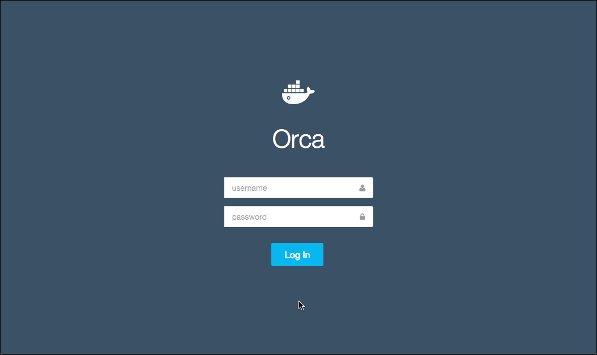
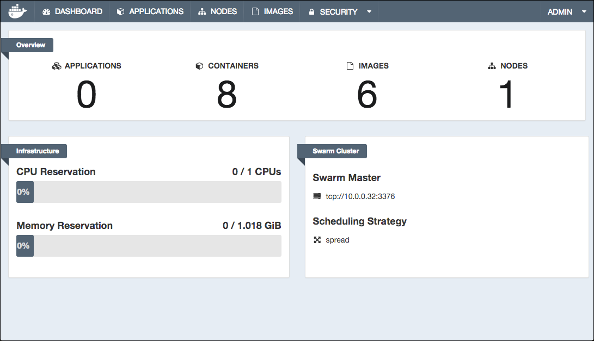
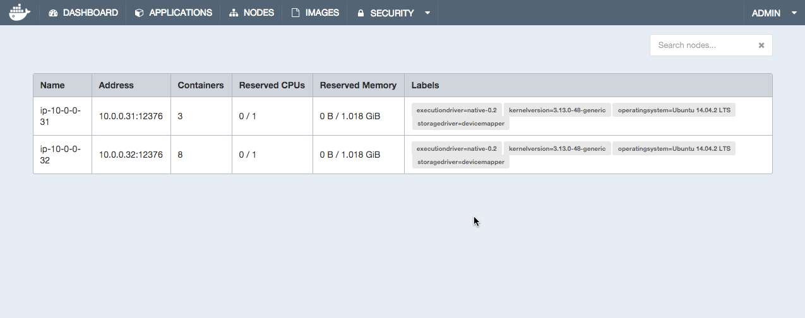

# Docker Orca Quickstart Guide

These instructions explain how to install Orca. An Orca installation consists of an Orca server and one or more nodes. The same machine can serve as both the server and the node. These instructions show you how to install both a host and a node. It contains the following sections:

- [Plan your installation](#plan-your-installation)
- [Step 1: Verify you have the prerequisites](#step-1-verify-you-have-the-prerequisites)
- [Step 2: Configure your network for Orca](#step-2-configure-your-network-for-orca)
- [Step 3: Install Docker Engine v1.9](#step-3-install-docker-engine-v19)
- [Step 4: (optional) Create user-named volumes](#step-4-optional-create-user-named-volumes)
- [Step 5: Install the Orca server](#step-5-install-the-orca-server)
- [Step 6: Set up certs for the Docker CLI](#step-6-set-up-certs-for-the-docker-cli)
- [Step 7: Add a Node to the Orca cluster](#step-7-add-a-node-to-the-orca-cluster)
- [Uninstall](#uninstall)
- [Block Mixpanel analytics](#block-mixpanel-analytics)
- [Installing with your own certificates](#installing-with-your-own-certificates)
- [Where to go next](#where-to-go-next)

## Plan your installation

The Orca installation consists of running the `orca-bootstrap` image using the
Docker Engine CLI. The image launches an interactive script that automates the
Orca setup using a default configurations for both data volumes and certificate
authority (CA).  

The first time you install, you should install in a sandbox environment where
you feel comfortable allowing the installer to use the defaults. After
installing and using the system with the defaults, you can uninstall the sandbox
and try a custom installation. In a custom installation you can:

* customize the port used by the Swarm manager
* create your own data volumes
* use your own certs

This install documentation describes the default installation and the
customization steps.  Customize steps are identified with the keyword
(optional). Make sure you skip these steps when doing the default installation
in your sandbox.

The Orca BETA program makes use of Mixpanel to collect analytics. This feature collects data on your usage of Orca and returns it to Docker. The information is entirely anonymous and does not identify your Company or users. Currently, you cannot turn the collection off but you can block the outgoing messaging. Later in this documentation [XXX](#XXX) explains how.

## Step 1: Verify you have the prerequisites

You can install Orca on your network or on a cloud provider such AWS or Digital Ocean. To install, the server and the nodes can run any of these supported operating systems:

* RHEL 7.0, 7.1
* Ubuntu 14.04 LTS
* CentOS 7.1

Installing Docker Orca requires that you first install the testing Docker Engine v1.9 on both the server and the nodes. The Docker Engine can be local or remote. These instructions assume you are installing both Orca and Docker Engine locally.

Finally, installing Orca requires you to pull an image from the Docker Hub. If you don't already have a Docker Hub account, make sure you [create an account](https://hub.docker.com/). Once you have a Hub account, send an email to <mailto:support@docker.com> with your account name and request access to the Orca BETA image.


## Step 2: Configure your network for Orca

Orca includes Docker Swarm as part of its installation. So, you don't need to install Docker Swarm. You do need to ensure that the Orca server and nodes can communicate across your network. Configure your network making sure to open the following ports:

| Port             | Description     |
|------------------|-----------------|
| `443`            | Orca server     |
| `2376`           | Swarm manager   |
| `12376`          | Engine proxy    |
| `12379`, `12380` | Key Value store |

The communication between the server, nodes, and key value store is all protected by mutual TLS. The Orca installation of Swarm provides TLS for you automatically.

Finally, you can specify a different port for the Swarm manager if you need to. These instructions assume you are using the default `2376` port.

## Step 3: Install Docker Engine v1.9

The BETA program requires that you install the 1.9.0-rc1 version of Docker Engine. Follow the instructions for your particular operating system and ensure you are pointing at the proper repo.

You install the Docker Engine on both the server and each node.

### RHEL 7.0, 7.1

Use the detailed [Red Hat Linux installation
instructions](http://docs.docker.com/installation/rhel/) and refer to this repo to install:

```
[dockerrepo]
name=Docker Repository
baseurl=https://yum.dockerproject.org/repo/testing/centos/7
enabled=1
gpgcheck=1
gpgkey=https://yum.dockerproject.org/gpg
EOF
```

### Ubuntu 14.04 LTS

Use the [detailed Ubuntu installation
instructions](http://docs.docker.com/installation/ubuntulinux/) to refer to this
repo to install:

```
deb https://apt.dockerproject.org/repo ubuntu-trusty testing
```

### CentOS 7.1

Use the [detailed CentOS installation
instructions](http://docs.docker.com/installation/centos/) to refer to this
repo to install:

```
[dockerrepo]
name=Docker Repository
baseurl=https://yum.dockerproject.org/repo/testing/centos/7
enabled=1
gpgcheck=1
gpgkey=https://yum.dockerproject.org/gpg
EOF
```

###


## Step 4: (optional) Create user-named volumes

Orca uses named volumes for persistence of user data.  By default, the
`orca-bootstrap` installer creates for you. It uses the default volume driver and flags. The first time you install, we recommend you skip this step and try it later, on another install. Later, try an install where your try the option to use custom volume driver and create your own volumes.

If you choose this option, create your volumes prior to installing Orca. The volumes Oraca requires are:

| Volume name             | Data                                                                                 |
|-------------------------|--------------------------------------------------------------------------------------|
| `orca-root-ca`          | The certificate and key for the Orca root CA. Do not create this volume if you are using your own certificates.                                      |
| `orca-swarm-root-ca`    | The certificate and key for the Swarm root CA.                                       |
| `orca-server-certs`     | The server certificates for the Orca web server.                                     |
| `orca-swarm-node-certs` | The Swarm certificates for the current node (repeated on every node in the cluster). |
| `orca-config`           | Orca server configuration settings (ID, locations of key services).                  |
| `orca-kv`               | Key value store persistence.                                                         |


## Step 5: Install the Orca server

In this step you install the Orca server. The server includes a running Swarm manager and node as well. To review the installation options before you install, use the following command:

```bash
docker run --rm -it dockerorca/orca-bootstrap install --help
```

When you install, the script prompts you for the following information:

* a password to use for the Orca `admin` account
* your Docker Hub username/password/email
* an alias which is the actual external, publically-accessible IP address or name for the Orca server

When you have the information you'll be prompted for, do the following to install:

1. Log into the system where you mean to install the Orca server.

2. Use the CLI to log into Docker Hub .

  Make sure you use the account which has permissions to the Orca images.

        $ sudo docker login
        Username: moxiegirl
        Password:
        Email: mary@docker.com
        WARNING: login credentials saved in /home/ubuntu/.docker/config.json
        Login Succeeded

3. Run the `orca-bootstrap` installer.

        $ docker run --rm -it \
          -v /var/run/docker.sock:/var/run/docker.sock \
          --name orca-bootstrap \
          dockerorca/orca-bootstrap \
          install -i

    The installer pulls several images and prompts you for the installation values it needs. When it completes, the installer prompts you to login into the Orca GUI.

        INFO[0053] Login to Orca at https://10.0.0.32:443

4. Enter the address into your browser to view the Orca login screen.

  The login screen displays.

    

5. Enter `admin` for the username along with the password you provided to the installer.

  If you didn't enter an admin password, the default password is `orca`
 After you enter the correct credentials, the Orca dashboard displays.

    


## Step 6: Set up certs for the Docker CLI

The first thing you probably want to do is download a client bundle.  The bundle contains the certificates user needs to run the `docker` clients against the Orca server and nodes.

1. If you haven't already done so, log into Orca.

2. Choose **ADMIN > Client bundle** from the menu.

    The browser downloads the `orca-bundle.zip` file.

3. Open the folder containing the download file.

4. Unzip the file to reveal its contents.

        orca-bundle
        ├── ca.pem
        ├── cert.pem
        ├── cert.pub
        ├── env.sh
        └── key.pem

5.  Set up your environment by sourcing the env.sh file.

        $ source env.sh

6.  Use the `docker info` command to get the location of the Swarm managers and engines.

        $ docker info
        Containers: 8
        Images: 6
        Engine Version:
        Role: primary
        Strategy: spread
        Filters: affinity, health, constraint, port, dependency
        Nodes: 1
        ip-10-0-0-32: 10.0.0.32:12376
        └ Containers: 8
        └ Reserved CPUs: 0 / 1
        └ Reserved Memory: 0 B / 1.018 GiB
        └ Labels: executiondriver=native-0.2, kernelversion=3.13.0-48-generic, operatingsystem=Ubuntu 14.04.2 LTS, storagedriver=devicemapper
        CPUs: 1
        Total Memory: 1.018 GiB
        Name: ip-10-0-0-32
        ID: 3JU4:QIXQ:ZFUK:QDOU:7KS7:WTM4:DSDD:NO7W:KP3G:OUVU:YPZS:6LX7
        Labels:
        swarm_master=tcp://10.0.0.32:2376


## Step 7: Add a Node to the Orca cluster

In this step you install an Orca nodes using the `orca-bootstrap join` subcommand. Repeat the instal for each node you want to add. To review join options before installing the node use the following:

```bash
docker run --rm -it dockerorca/orca-bootstrap join --help
```

The installer prompts you for the following information:

* the URL of the Orca server
* the username/password of an Orca administrator account
* your Docker Hub username/password/email
* an alias which is the actual external, publically-accessible IP address or name for the Orca node

When you have the information you'll be prompted for, do the following to install:

1. Log into the system where you mean to install the node.

  If you previously ran `env.sh` make sure you open a new terminal. Alternatively, you can `unset DOCKER_HOST` in your shell.

3. Use the CLI to log into Docker Hub.

        $ sudo docker login
        Username: moxiegirl
        Password:
        Email: mary@docker.com
        WARNING: login credentials saved in /home/ubuntu/.docker/config.json
        Login Succeeded

3. Run the `orca-bootstrap` installer.

        $ docker run --rm -it \
            -v /var/run/docker.sock:/var/run/docker.sock \
            --name orca-bootstrap \
            dockerorca/orca-bootstrap \
            join -i

    The installer pulls several images and prompts you for the installation values it needs. When it completes, the installer notifies you that it is starting swarm.

        INFO[0005] Verifying your system is compatible with Orca
        INFO[0011] Sending add host request to Orca server      
        INFO[0011] Starting local swarm containers  

4. Login into Orca with your browser and go to the **NODES** page.

      The display should include your new node.

      


## Uninstall

The installer can also uninstall Orca from the server and the nodes. To see the uninstall options before you uninstall, use the following:

```bash
docker run --rm -it dockerorca/orca-bootstrap uninstall --help
```

To uninstall, do the following:

1. Log into the node you want to remove Orca from.

2. Enter the following command to uninstall:

        $ docker run --rm -it \
          -v /var/run/docker.sock:/var/run/docker.sock \
          --name orca-bootstrap \
          dockerorca/orca-bootstrap \
          uninstall

3. Repeat the uninstall on each node making sure to save the server till last.

## Block Mixpanel analytics

To block the outflow of Mixplanel analytic data to Docker, do the following:

1. Log into the system running the Orca server.

2. Add a rule to drop the forward to port 80.

        $ iptables -I FORWARD -p tcp --dport 80 -j DROP

Reboots unset this iptables chain, so it is a good idea to add this command to the server's startup script.

## Installing with your own certificates

Orca uses two separate root CAs for access control - one for Swarm, and one for
the Orca server itself.  The dual root certificates supply differentiation
between the Docker remote API access to Orca vs. Swarm.  Unlike Docker Engine or
Docker Swarm, Orca implements ACL and audit logging on a per-user basis.  Swarm
and the Engine proxies trust only the Swarm Root CA, while the Orca server
trusts both Root CAs.  Admins can access Orca, Swarm and the engines while
normal users are only granted access to Orca.

Orca v1.0 supports user provided externally signed certificates
for the Orca server.  This cert is used by Orca's main management web UI
and the Docker remote API. The remote API is visible to the Docker CLI. In this release, the Swarm Root CA is always managed by Orca.

The external Orca Root CA model supports customers managing their own CA, or
purchasing certs from a commercial CA.  When operating in this mode, Orca can
not generate regular user certificates, as those must be managed and signed
externally, however admin account certs can be generated as they are signed by
the internal Swarm Root CA.  Normal user accounts should be signed by the same
external Root CA (or a trusted intermediary), and the public keys manually added
through the UI.

The first time you install, we recommend you skip user-supplied certs and use the default certificates instead. Later, do a second install and try the option to use your own certs.

### Configure user-supplied Certificates

To install Orca with your own external root CA, you create a named volume called
**orca-server-certs** on the same system where you plan to install the Orca
server.

1. Log into the machine where you intend to install Orca.

2. If you haven't already done so, create a named volume called **orca-server-certs**.

3. Ensure the volume's top-level directory contains these files:

  <table>
  <tr>
    <th>File</th>
    <th>Description</th>
  </tr>
  <tr>
    <td><code>ca.pem</code></td>
    <td>Your Root CA Certificate chain (including any intermediaries).</td>
  </tr>
  <tr>
    <td><code>cert.pem</code></td>
    <td>Your signed Orca server cert.</td>
  </tr>
  <tr>
    <td><code>key.pem</code></td>
    <td>Your Orca server private key.</td>
  </tr>
  </table>

4. Follow "Step 5" above to install Orca but pass in an additional `--external-orca-ca` option to the installer, for example:

        docker run --rm -it \
          -v /var/run/docker.sock:/var/run/docker.sock \
          ...snip...
          install -i --external-orca-ca


## Where to go next

During the BETA release program, you'll receive regular assignments. To learn more you can also investigate:

* [How to use the Docker Client](http://docs.docker.com/reference/commandline/cli/)
* [An overview of Docker Swarm](http://docs.docker.com/swarm/)
