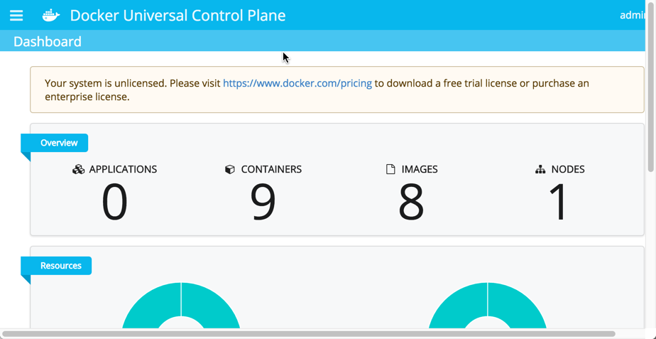
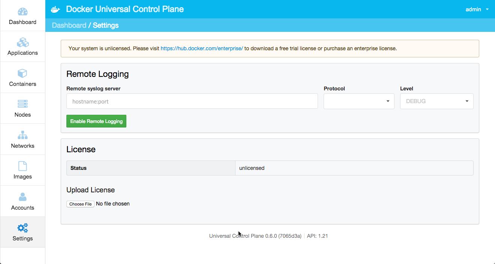
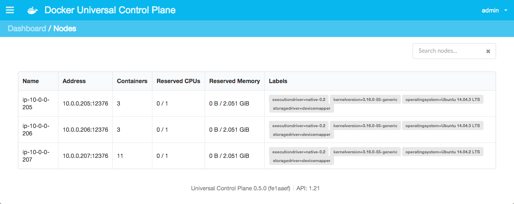

<!--[metadata]>
+++
aliases = ["/ucp/evaluation-install/"]
title = "Evaluate UCP in a sandbox"
description = "Evaluation installation"
keywords = ["tbd, tbd"]
[menu.main]
parent="mn_ucp"
identifier="ucp_evaluate_sandbox"
weight=10
+++
<![end-metadata]-->

# Evaluate UCP in a sandbox

This page helps you to learn about Docker Universal Control Plane (UCP) at a
high-level through installing and running UCP in your local, sandbox
installation. The installation should be done on a Mac OS X or Windows system.
If you are experienced with Linux or a technical DevOps user wanting a technical
deep dive, please feel free to skip this evaluation and go directly to
[Plan a production installation](installation/plan-production-install.md)
and then to [Install UCP for production](installation/install-production.md).

A UCP installation consists of an UCP controller and one or more hosts. These
instructions use Docker Machine, Docker's provisioning tool, to create several
local hosts running Docker Engine. Once you create these hosts, you'll install
UCP and its components on them just as you would in a full-on UCP installation.

>**Note**: This evaluation installs UCP on top of the open source software version of
Docker Engine inside of a VirtualBox VM which is running the small-footprint
`boot2docker.iso` Linux. Such a configuration is **not** supported for UCP in
production.

## Step 1. About this example

This example introduces you to UCP by means of a very simple sandbox example.
You'll create a small UCP installation, deploy a container through UCP, and
examine the interface.

For this evaluation installation, you'll use Machine to create two VirtualBox
VMs. Each VM runs small foot-print Linux image called `boot2docker.iso`. Machine
provisions each VM with the open source Docker Engine.

You'll use each of these VMs as a node in a simple UCP installation. The
installation will have a controller and a node. The installation rests on top of
a Docker Swarm cluster. The UCP installation process by default secures the cluster via self-signed TLS certificates.

This example is intended as an introduction for non-technical users wanting to
explore UCP for themselves. If you are a highly technical user intending to act as
UCP administration operator, you may prefer to skip this and go straight to
[Plan a production installation](installation/plan-production-install.md).

>**Note**: The command examples in this page were tested for a Mac OSX environment.
If you are in another, you may need to adjust the commands to use analogous
commands for you environment.

## Step 2. Verify the prerequisites

Because Docker Engine and UCP both rely on Linux-specific features, you can't
run natively in Mac or Windows. Instead, you must install the Docker Toolbox
application. The application installs a VirtualBox Virtual Machine (VM), the
Docker Engine itself, and the Docker Toolbox management tool. These tools enable
you to run Engine CLI commands from your Mac OS X or Windows shell.

Your Mac must be running OS X 10.8 "Mountain Lion" or higher to perform this
procedure. To check your Mac OS X version, see <a href="https://docs.docker.com/mac/step_one/" target="_blank">the Docker Engine getting started on Mac</a>.

On Windows, your machine must have a 64-bit operating system running
Windows 7 or higher. Additionally, you must make sure that virtualization is
enabled on your machine. For information on how to check for virtualization, see <a href="https://docs.docker.com/windows/step_one/" target="_blank">the Docker Engine getting started on Windows</a>.

If you haven't already done so, make you have installed Docker Toolbox on your local <a href="https://docs.docker.com/engine/installation/mac/" target="_blank">Mac OS X</a> or <a href="https://docs.docker.com/engine/installation/windows/" target="_blank">Windows machine</a>.  After a successful installation, continue to the next step.

## Step 3. Provision hosts with Engine

In this step, you provision two VMs for your UCP installation. This step is
purely to enable your evaluation. You would never run UCP in production on local
VMs with the open source Engine.

In a production installation, you would use enterprise-grade Linux servers as
your nodes. These nodes could be on your company's private network or in the
cloud.  UCP requires that each node be installed with the Commercially Supported
Docker Engine (CS Engine).

Set up the nodes for your evaluation:

1. Open a terminal on your computer.

2. Use Docker Machine to list any VMs in VirtualBox.

  		$ docker-machine ls
  		NAME         ACTIVE   DRIVER       STATE     URL                         SWARM
  		default    *        virtualbox   Running   tcp://192.168.99.100:2376  

3. Create a VM named `node1`.  

    UCP runs best with a minimum of 1.50 GB in memory and requires a minimum of
    3.00 GB disk space. When you create your virtual host, you supply options to
    size it appropriately.

        $ docker-machine create -d virtualbox \
        --virtualbox-memory "2000" \
        --virtualbox-disk-size "5000" node1
        Running pre-create checks...
        Creating machine...
        (node1) Copying /Users/mary/.docker/machine/cache/boot2docker.iso to /Users/mary/.docker/machine/machines/node1/boot2docker.iso...
        (node1) Creating VirtualBox VM...
        (node1) Creating SSH key...
        (node1) Starting the VM...
        (node1) Waiting for an IP...
        Waiting for machine to be running, this may take a few minutes...
        Machine is running, waiting for SSH to be available...
        Detecting operating system of created instance...
        Detecting the provisioner...
        Provisioning with boot2docker...
        Copying certs to the local machine directory...
        Copying certs to the remote machine...
        Setting Docker configuration on the remote daemon...
        Checking connection to Docker...
        Docker is up and running!
        To see how to connect Docker to this machine, run: docker-machine env node1

4. Create a VM named `node2`.  

        $ docker-machine create -d virtualbox \
        --virtualbox-memory "2000" node2

5. Use the Machine `ls` command to list your hosts.

        NAME         ACTIVE   DRIVER       STATE     URL                         SWARM   DOCKER    ERRORS
        node1        -        virtualbox   Running   tcp://192.168.99.104:2376           v1.10.0   
        node2        -        virtualbox   Running   tcp://192.168.99.102:2376           v1.10.0   

    At this point, all the nodes are in the `Running` state. You have your hosts provisioned, now you are ready to install UCP itself.

## Step 4. Learn about the ucp tool

You install UCP by using the Engine CLI to run the `ucp` tool. The `ucp` tool is
an image with subcommands to `install` a UCP controller or `join` a node to a
UCP controller. The general format of these commands are:

| Docker client | `run` command with options | `ucp` image  | Subcommand with options |
|:--------------|:---------------------------|:-------------|:------------------------|
| `docker`      | `run --rm -it`             | `docker/ucp` | `install --help`        |
| `docker`      | `run --rm -it`             | `docker/ucp` | `join --help`           |
| `docker`      | `run --rm -it`             | `docker/ucp` | `uninstall --help`      |

You can these subcommands interactively by passing them the `-i` option or by
passing command-line options. The `ucp` tool is designed to make UCP easier to
install than many enterprise-grade applications. In interactive mode the tool
works to discover your network topology and suggest default answers to you. This
evaluation uses the interactive method.

Regardless of how you use the `docker/ucp` tool, the default install supplies
some quick default options for both data volumes and the certificate authority
(CA). In a production installation you can optionally:

* use the high availability feature
* customize the port used by the UCP web application
* customize the port used by the Swarm manager
* create your own data volumes
* use your own TLS certificates

You'll learn more about these when you <a
href="https://docs.docker.com/ucp/plan-production-install/" target="_blank">Plan
a production installation</a>. For now, in this evaluation sandbox installation,
you'll use all the default values with one exception, you'll specify a custom
port for the Swarm manager.

## Step 5. Install the UCP controller

In this step, you install the UCP controller on the `node1` you provisioned
earlier. A controller serves the UCP application and runs the processes that
manage an installation's Docker objects.

In a production installation, a system administrator can implement
UCP's high availability feature. High availability allows you to designate
several nodes as controller replicas. In this way, if one controller fails
a replica node is ready to take its place.  

For this evaluation, you won't need that level of robustness. A single
host for the controller suffices.

1. If you don't already have one, open a terminal on your computer.

2. Connect the terminal environment to the `node1` you created.

    a. Use `docker-machine env` command to get the settings.

        $ docker-machine env node1
        export DOCKER_TLS_VERIFY="1"
        export DOCKER_HOST="tcp://192.168.99.103:2376"
        export DOCKER_CERT_PATH="/Users/mary/.docker/machine/machines/node1"
        export DOCKER_MACHINE_NAME="node1"
        # Run this command to configure your shell:
        # eval $(docker-machine env node1)

    b. Run the `eval` command to set your environment.

        $ eval $(docker-machine env node1)

    c. Verify that `node1` has an active environment.

        $ docker-machine ls
        NAME         ACTIVE   DRIVER       STATE     URL                         SWARM   DOCKER    ERRORS
        node1        *        virtualbox   Running   tcp://192.168.99.104:2376           v1.10.0   
        node2        -        virtualbox   Running   tcp://192.168.99.102:2376           v1.10.0   

      An `*` (asterisk) in the `ACTIVE` field indicates that the `node1` environment is active.

    The client will send the `docker` commands in the following steps to the Docker Engine on on `node1`.

3. Start the `ucp` tool to install interactively.

    >**Note**: If you are on a Windows system, your shell can't resolve the
    `$(docker-machine ip node2)` variable. So, replace it with the actual IP
    address.

        $ docker run --rm -it \
        -v /var/run/docker.sock:/var/run/docker.sock \
        --name ucp docker/ucp install -i \
        --swarm-port 3376 --host-address $(docker-machine ip node1)
        Unable to find image 'docker/ucp:latest' locally
        latest: Pulling from docker/ucp
        0198ad4008dc: Pull complete
        291084ae72f3: Pull complete
        Digest: sha256:28b6c9640e5af0caf2b2acbbbfd7c07bdbec6b170f04cbaeea7bb4909d74898d
        INFO[0000] Verifying your system is compatible with UCP

    The first time you run the `ucp` tool, the `docker run` command pulls its
    image from the Docker Hub. The image contains the `ucp` tool. The tool
    downloads if needed and then verifies your system supports UCP. The tool is
    designed to discover the information it needs if it can. This reduces the
    change for human error or mistakes during the install.

4. Enter a UCP password when prompted and then confirm it.

        Please choose your initial UCP admin password:
        Confirm your initial password:
        INFO[0016] Pulling required images... (this may take a while)

    The UCP system relies on a set of Docker images running in containers. The `ucp` installer gets the latest official UCP images.

    The system prompts you for Subject alternative names (SANs). UCP requires
    that all clients, including the Docker Engine, use a Swarm TLS certificate
    chain signed by the UCP Swarm Root CA. You can provide the certificate
    system with subject alternative names or SANs. The SANs are used to set up
    individual "leaf certificates." In this sandbox, you've already provided the IP address and the `ucp` tool discovered this for you and shows it in the controller list.

        WARN[0004] None of the hostnames we'll be using in the UCP certificates
        [controller 127.0.0.1 172.17.0.1 192.168.99.106] contain a domain
        component.  Your generated certs may fail TLS validation unless you only
        use one of these shortnames or IPs to connect.  You can use the --san
        flag to add more aliases

        You may enter additional aliases (SANs) now or press enter to proceed
        with the above list.
        Additional aliases:

5. Press enter to proceed with the list the `ucp` tool provided.

        INFO[0005] Installing UCP with host address 192.168.99.106 - If this is
        incorrect, please specify an alternative address with the
        '--host-address' flag
        WARN[0000] None of the hostnames we'll be using in the UCP certificates
        [controller 127.0.0.1 172.17.0.1 192.168.99.106 192.168.99.106] contain
        a domain component.  Your generated certs may fail TLS validation unless
        you only use one of these shortnames or IPs to connect.  You can use the
        --san flag to add more aliases
        INFO[0001] Generating Swarm Root CA
        INFO[0022] Generating UCP Root CA
        INFO[0024] Deploying UCP Containers
        INFO[0028] UCP instance ID: CJQN:ZQVX:B6CC:KFD3:IXN5:FGLF:GXMN:WALD:QFHU:QLSX:ZCBY:CAL7
        INFO[0028] UCP Server SSL: SHA1 Fingerprint=02:36:16:93:B4:21:B7:AD:0A:6C:0F:3C:99:75:18:5D:5A:F7:C4:0C
        INFO[0028] Login as "admin"/(your admin password) to UCP at https://192.168.99.106:443

    When it completes, the `ucp` tool prompts you to login into the UCP GUI
    gives you its location. You'll do this and install a license in Step 5,
    below.

## Step 6. License your installation

In this step, you log into UCP, get a license, and install it. Docker allows you to run an evaluation version of UCP with a single controller and node for up to 30 days.

1. Enter the address into your browser to view the UCP login screen.

    Your browser may warn you about the connection. The warning appears because,
    in this evaluation installation, the UCP certificate was issued by a
    built-in certificate authority (CA). Your actions with the install actually
    created the certificate. If you are concerned, the certificate's fingerprint
    is displayed during install and you can compare it.  

2. Click the **Advanced** link and then the **Proceed to** link.

    The login screen displays.

    

5. Enter `admin` for the username along with the password you provided to the `install`.

    After you enter the correct credentials, the UCP dashboard prompts for a
    license.

        

6. Press *Skip for now* to continue to the dashboard.

    

    The dashboard shows a single node, your controller node. It also shows you a
    banner saying that you need a license.

6. Follow the link on the UCP **Dashboard** to the Docker website to get a trial license.

    You must fill out a short form. After you complete the form, you are prompted with some **Installation Steps**.

7. Press **Next** until you reach the **Add License** step.

    

8. Press the **Download License** button.

    Your browser downloads a `docker_subscription.lic` file.

9. Save the file to a safe location.

10. Return to the UCP Dashboard.

11. Choose **Settings** from the "hamburger" menu on the left side.

    As you move through UCP, the header changes to display the appropriate
    breadcrumbs. In this case you are on the **Dashboard/Settings*** page.  

12. Scroll down to the **License** section and click **Choose File**.

    Locate and upload your file.

    

    Once you upload the file, the license message disappears from UCP.

Take a minute and explore UCP. At this point, you have a single controller
running. How many nodes is that? What makes a controller is the containers it
runs. Locate the Containers page and show the system containers on your
controller. You'll know you've succeeded if you see this list:

The containers reflect the architecture of UCP.  The containers are running
Swarm, a key-value store process, and some containers with certificate volumes.
Explore the other resources.   

## Step 7. Join a node

In this step, you join your UCP `node2` to the controller using the `ucp join`
subcommand. In a UCP production installation, you'd do this step for each node
you want to add.

1. If you don't already have one, open a terminal on your computer.

2. Connect the terminal environment to the `node2` you provisioned earlier.

    a. Use `docker-machine env` command to get the settings.

        $ docker-machine env node2
        export DOCKER_TLS_VERIFY="1"
        export DOCKER_HOST="tcp://192.168.99.104:2376"
        export DOCKER_CERT_PATH="/Users/mary/.docker/machine/machines/node2"
        export DOCKER_MACHINE_NAME="node2"
        # Run this command to configure your shell:
        # eval $(docker-machine env node2)

    b. Run the `eval` command to set your environment.

        $ eval $(docker-machine env node2)

    The client will send the `docker` commands in the following steps to the Docker Engine on on `controller`.

2. Run the `docker/ucp join` command.

    >**Note**: If you are on a Windows system, your shell can't resolve the
    `$(docker-machine ip node2)` variable. So, replace it with the actual IP
    address.

        $ docker run --rm -it \
        -v /var/run/docker.sock:/var/run/docker.sock \
        --name ucp docker/ucp join -i \
        --host-address $(docker-machine ip node2)

    The `join` pulls several images and prompts you for the UCL of the UCP Server.

        Unable to find image 'docker/ucp:latest' locally
        latest: Pulling from docker/ucp
        0198ad4008dc: Pull complete
        291084ae72f3: Pull complete
        Digest: sha256:28b6c9640e5af0caf2b2acbbbfd7c07bdbec6b170f04cbaeea7bb4909d74898d
        Status: Downloaded newer image for docker/ucp:latest
        Please enter the URL to your UCP Server:

3. Enter the URL of your server to continue.

        Orca server https://192.168.99.106
        Subject: ucp
        Issuer: UCP Root CA
        SHA1 Fingerprint=02:36:16:93:B4:21:B7:AD:0A:6C:0F:3C:99:75:18:5D:5A:F7:C4:0C
        Do you want to trust this server and proceed with the join? (y/n):

    The system prompts you to join the server.

4. Press `y` to continue and the tool prompts you for the username and password for your UCP server.

        Please enter your UCP Admin username: admin
        Please enter your UCP Admin password:
        INFO[0027] Pulling required images... (this may take a while)
        WARN[0070] None of the hostnames we'll be using in the UCP certificates [node1 127.0.0.1 172.17.0.1 192.168.99.108] contain a domain component.  Your generated certs may fail TLS validation unless you only use one of these shortnames or IPs to connect.  You can use the --san flag to add more aliases
        You may enter additional aliases (SANs) now or press enter to proceed with the above list.
        Additional aliases:

    The system continues and prompts you for SANs. In this sandbox, you've already provided the IP address and the `ucp` tool discovered this for you and shows it in the controller list.

5. Press enter to proceed without providing a SAN.

        WARN[0000] None of the hostnames we'll be using in the UCP certificates
        [node1 127.0.0.1 172.17.0.1 192.168.99.108 192.168.99.108] contain a
        domain component.  Your generated certs may fail TLS validation unless you
        only use one of these shortnames or IPs to connect.  You can use the --san
        flag to add more aliases        
        INFO[0000] This engine will join UCP and advertise itself with host
        address 192.168.99.108 - If this is incorrect, please specify an
        alternative address with the '--host-address' flag  
        INFO[0000] Verifying your system is compatible with UCP
        INFO[0011] Starting local swarm containers   ’

4. Login into UCP with your browser and check to make sure your new node appears.

    The page should display your new node.

      

## Step 8. Deploy a container

UCP allows you to deploy and manage "Dockerized" applications in production. An
application is built up using Docker objects, such as images and containers, and
Docker resources, such as volumes and networks.

UCP deploys and manages these objects and resources using remote API calls the
Engine daemons running on the nodes. For example, the `run` action may deploy an
image in a Docker container. That image might define a service such as an Nginix
web server or a database like Postgres.

A UCP operator initiates Engine actions through the UCP dashboard or through the
Docker Engine CLI. In this step, you deploy a container through the UCP
dashboard.  The container will run an Nginx server, so you'll need to launch the
`nginx` image inside of it.

1. Log into the UCP **Dashboard**.

2. Click **Containers**.

    The system displays the **Containers** page. UCP runs some containers that
    support its own operations. These are called "system" containers and they
    are hidden by default.

3. Click **+ Deploy Container**.

    The system displays a dialog with several fields. Using the dialog requires some basic knowledge of Docker objects and their attributes. A UCP admin or operator would typically have this knowledge.  For now, you'll just follow along.

4. Enter `nginx` for the image name.

    An image is simply predefined software you want to run. The software might
    be an actual standalone application or maybe some component software necessary
    to support a complex service.

5. Enter `nginx_server` for the container name.

    This name just identifies the container on your network.

6. Click **Publish Ports** from the **Overview** menu.

    A Docker container, like it sounds, is securely isolated from other processes on your network. In fact, the container has its own internal network configuration. If you want to access to a service inside a container, you need to expose a container's port. This container port maps to a port on the node. The node is hosting an instance of Docker Engine, so its port is called the **Host Port**.  

7. Enter `443` in the **Port** and in the **Host Port** field.

8. Use the plus sign to add another **Port**.

9. For this port, enter `80` in the **Port** and **Host Port** field.

    When you are done, your dialog looks like the following:

    

10. Click **Run Container** to deploy your container.

    

## Step 9. View a running service

At this point, you have deployed a container and you should see the application running. Recall that you deployed an Nginx web server. That server comes with a default page. In this step, you open the running server.

1. Make sure you are still on the **Containers** page.

2. Select the edit icon on the container.

    

    The system displays the container's details and some operations you can run on the container.

3. Scroll down to the ports section.

    You'll see an IP address with port `80` for the server.

4. Copy the IP address to your browser and paste the information you copied.

    You should see the welcome message for nginx.

    

## Step 10. Download a client bundle

In this step, you download the *client bundle*. Each node in your UCP cluster is running Engine. A UCP operator can use the Engine CLI client instead of UCP to interact with the Docker objects and resources UCP manages. To issue commands to a UCP node, your local shell environment must be configured with the same security certificates as the UCP application itself.  The client bundle contains the certificates and a script to configure a shell environment.

Download the bundle and configure your environment.

1. If you haven't already done so, log into UCP.

2. Choose **admin > Profile** from the right-hand menu.

    Any user can download their certificates. So, if you were logged in under a user name such as `davey` the path to download bundle is **davey > Profile**. Since you are logged in as `admin`, the path is `admin`.

3. Click **Create Client Bundle**.

    The browser downloads the `ucp-bundle-admin.zip` file.

4. Open a new shell on your local machine.

5. Make sure your shell is does not have an active Docker Machine host.

        $ docker-machine ls
        NAME    ACTIVE   DRIVER       STATE     URL                         SWARM   DOCKER    ERRORS
        moxie   -        virtualbox   Stopped                                       Unknown   
        test    -        virtualbox   Running   tcp://192.168.99.100:2376           v1.10.1  

    While Machine has a stopped and running host, neither is active in the shell. You know this because neither host shows an * (asterisk) indicating the shell is configured.

4. Create a directory to hold the deploy information.

        $ mkdir deploy-app

4. Navigate to where the bundle was downloaded, and unzip the client bundle

    		$ unzip bundle.zip
    		Archive:  bundle.zip
     		extracting: ca.pem
    		extracting: cert.pem
    		extracting: key.pem
     		extracting: cert.pub
    		extracting: env.sh

5. Change into the directory that was created when the bundle was unzipped

6. Execute the `env.sh` script to set the appropriate environment variables for your UCP deployment.

    		$ source env.sh

    If you are on Windows, you may need to set the environment variables manually.

7. Run `docker info` to examine the UCP deployment.

    Your output should show that you are managing UCP vs. a single node.

        $ docker info
        Containers: 12
         Running: 0
         Paused: 0
         Stopped: 0
        Images: 17
        Role: primary
        Strategy: spread
        Filters: health, port, dependency, affinity, constraint
        Nodes: 2
         node1: 192.168.99.106:12376
          └ Status: Healthy
          └ Containers: 9
          └ Reserved CPUs: 0 / 1
          └ Reserved Memory: 0 B / 3.01 GiB
          └ Labels: executiondriver=native-0.2, kernelversion=4.1.17-boot2docker, operatingsystem=Boot2Docker 1.10.0 (TCL 6.4.1); master : b09ed60 - Thu Feb  4 20:16:08 UTC 2016, provider=virtualbox, storagedriver=aufs
          └ Error: (none)
          └ UpdatedAt: 2016-02-09T12:03:16Z
         node2: 192.168.99.107:12376
          └ Status: Healthy
          └ Containers: 3
          └ Reserved CPUs: 0 / 1
          └ Reserved Memory: 0 B / 4.956 GiB
          └ Labels: executiondriver=native-0.2, kernelversion=4.1.17-boot2docker, operatingsystem=Boot2Docker 1.10.0 (TCL 6.4.1); master : b09ed60 - Thu Feb  4 20:16:08 UTC 2016, provider=virtualbox, storagedriver=aufs
          └ Error: (none)
          └ UpdatedAt: 2016-02-09T12:03:11Z
        Cluster Managers: 1
         192.168.99.106: Healthy
          └ Orca Controller: https://192.168.99.106:443
          └ Swarm Manager: tcp://192.168.99.106:3376
          └ KV: etcd://192.168.99.106:12379
        Plugins:
         Volume:
         Network:
        CPUs: 2
        Total Memory: 7.966 GiB
        Name: ucp-controller-node1
        ID: P5QI:ZFCX:ELZ6:RX2F:ADCT:SJ7X:LAMQ:AA4L:ZWGR:IA5V:CXDE:FTT2
        WARNING: No oom kill disable support
        WARNING: No cpu cfs quota support
        WARNING: No cpu cfs period support
        WARNING: No cpu shares support
        WARNING: No cpuset support
        Labels:
         com.docker.ucp.license_key=p3vPAznHhbitGG_KM36NvCWDiDDEU7aP_Y9z4i7V4DNb
         com.docker.ucp.license_max_engines=1
         com.docker.ucp.license_expires=2016-11-11 00:53:53 +0000 UTC

## Step 11. Deploy with the CLI

In this exercise, you'll launch another Nginx container. Only this time, you'll use the Engine CLI. Then, you'll look at the result in the UCP dashboard.

1. Connect the terminal environment to the `node2`.

        $ eval "$(docker-machine env node2)"

2. Change to your user `$HOME` directory.

        $ cd $HOME

2. Make a `site` directory.

        $ mkdir site

3. Change into the `site` directory.

        $ cd site

4. Create an `index.html` file.

        $ echo "my new site" > index.html

5. Start a new `nginx` container and replace the `html` folder with your `site` directory.

        $ docker run -d -P -v $HOME/site:/usr/share/nginx/html --name mysite nginx

  This command runs an `nginx` image in a container called `mysite`. The `-P` tells the Engine to expose all the ports on the container.

6. Open the UCP dashboard in your browser.

7. Navigate to the **Containers** page and locate your `mysite` container.

    

8. Scroll down to the ports section.

    You'll see an IP address with port `80/tcp` for the server. This time, you'll
    find that the port mapped on this container than the one created yourself.
    That's because the command didn't explicitly map a port, so the Engine chose
    mapped the default Nginx port `80` inside the container to an arbitrary port
    on the node.

4. Copy the IP address to your browser and paste the information you copied.

    You should see your `index.html` file display instead of the standard Nginx welcome.

    

## Explore UCP

At this point, you've completed the guided tour of a UCP installation. You've
learned how to create a UCP installation by creating two nodes and designating
one of them as a controller. You've created a container running a simple web
server both using UCP and directly on the command line.  You used UCP to get
information about what you created.

In a real UCP production installation, UCP admins and operators are expected to
do similar work every day. While the applications they launch will be more
complicated, the interaction channels a user can take, the GUI or the
certificate bundle plus a command line, remain the same.

Take some time to explore UCP some more. Investigate the documentation for other
activities you can perform with UCP.

## Where to Go Next

* [UCP architecture](architecture.md)
* [UCP system requirements](installation/system-requirements.md)
