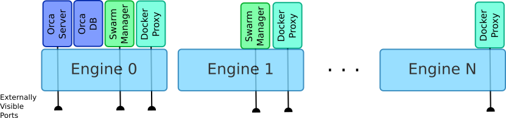

# Installation and Upgrade of Orca



Not shown in the diagram is the orca-bootstrap container, which is
only used during **install**, **upgrade**, **join**, and **uninstall**
operartions.  The remainder of this document describes the business
logic that resides largely within this bootstrapper.


## Known gaps

* Swarm must talk to consul with TLS enabled - https://github.com/docker/swarm/issues/404 - slated for 1.9

## Assumptions

* Orca will not be HA in v1
* We wont use data volume containers, but instead host volume mounts
* Our goal is to get as close to a full end-to-end deployment as possible (from bare-metal up to orca)
    * Advanced customers may be able to cherry-pick, but that's not the focus in v1
    * We'll deploy an internal consul instance for swarm (not HA)
    * Bare-metal ISO based installer not (yet) covered in this document
* Swarm requires a common single CA "on both sides" (incoming client communication and outgoing engine communication)
* Swarm Managers must have visibility to all the engines (or proxies) and be secured with TLS.  All Engines/Proxies must trust the CA who signed the swarm cert
* Swarm manager and docker proxy may fold into one component, but this shouldn't fundamentally change the flow
* We'll "own" two internal root CAs for orca/swarm to provide access control
    * Set up so that certs can be replaced post v1
    * We'll store the certs in a host volume mount
    * The volume could be swapped out for a keywhiz volume mount in the future (unclear if we can write to it though...)
    * Laying the groundwork of a central CA for our managed swarm will enable keywhiz for secret management post v1
* Installation logic should be idempotent, and not clobber any pertinent state unless the user asks us to


## Images

The following images are used in developer mode.  In general, the names will morph to docker/orca-xxx at GA.

* progrium/consul
* dockerorca/orca-proxy
* dockerorca/orca
* dockerorca/rethinkdb
* swarm
* dockerorca/orca-cfssl


## User Entrypoint

All scenarios described below start with the same user visible action, run on a system with a local docker.sock

```bash
curl https://get.docker.com/orca | bash
```

* This could also be run through notary to verify it wasn't tampered with
* If we meet our stretch goal of the ISO based installer, this script would be bundled there and run after the engine comes up.
* Business logic in this script will be kept to a minimum, most logic resides within the bootstrap container
    * Ideally it should be possible to run the container "by hand" (as long as the right flags are passed to docker run) and have it work
* The bootstrap container uses a two-phase model to abstract away the version specific details of volume mounts or other flags required by the system.
    * During implementation, if this becomes unwieldy, we'll just have the script launch "phase 2" automatically

## Common Flags

Where possible, common flags will be used across subcommands for consistency.  The following list represents the initial set we expect to implement for v1

* **--debug**  Enable more verbose output, typically useful for developers, or support if something fails unexpectedly
* **--help** Display usage information for the command
* **--jsonlog** Change the log format to be machine parseable (expected to be useful for our (future) GUI installer)
* **--interactive** Run the bootstrap code in interactive mode, prompting for required information, or confirmation on dangerous operations.


## Deploy Orca

Description:  Deploy orca+swarm onto a single "local" engine.  Once deployed, additional engines can be added to the swarm.


Use-case specific flags:

* --image-version: Specify an exact version to pull, default is "latest"
* --fresh-install: destroy any existing state and orca containers on this node and deploy fresh.  Default is to leave any state if detected, and if existing containers are detected, to redeploy them.
* --san: Specify additional alternate names for the certificate.  Useful if the docker host doesn't have a FQDN
* --host-address: Specify the visible IP/hostname for this engine.  Useful for NAT or other network topologies where the docker engine doesn't know what the actual external IP is for the system.
* --swarm-port: Allows the user to specify an alternate swarm port.  By default, we try to claim the standard/well-known docker TLS port
* --preserve-certs: Allow re-use of existing certs on the host.
* --external-orca-ca: Allow the user to "bring your own" CA for Orca (swarm's CA is still internal for v1)

Steps:

1. (script) Load local images if --image-dir specified
2. (script) Prompt user for the admin password they want
    * Implementation details TBD: most likely pre-hash/salt, store in a file, and mount it, then the container removes the file once it's loaded up
3. (script) Launch phase 1 container
    * Do:
    ```bash
docker run --rm -t \
    -v /var/run/docker.sock:/var/run/docker.sock \
    docker/orca-bootstrap [flags]
```
4. (Phase 1) Pre-flight checks
    * Verify that /var/run/docker.sock is present
    * Check minimum version of docker engine
    * Find ourself running on the engine, determine image in use
    * Check for available ports for all our services, fail fast if they're taken
    * Check for existing orca (fail if --upgrade wasn't passed - see upgrade flows below)
5. Launch phase2 container
    * Same image as phase1, with additional mounts so the user doesn't have to get all the extra host mounts right
    * Phase 1 Blocks until phase 2 finishes or fails, passing output through to user
    ```bash
docker run --rm -t \
    -v /var/run/docker.sock:/var/run/docker.sock \
    -v /etc/docker/ssl/orca:/etc/docker/ssl/orca \
    -v $DB_PATH_TBD:... \
    -v $CONSUL_DATA_TBD:...
    -v ...any other paths... \
    docker/orca-bootstrap $PHASE1_FLAGS
```
6. Check for images on the engine, pull if missing
    * If this fails, inform user to "docker login" using their hub credentials and try again
7. Stop any existing orca containers already running on the host
8. (conditional) clobber existing state if requested
9. Generate Root CA and certs if not present in host volume path: /etc/docker/ssl/orca
    * Orca CA cert
    * Swarm CA cert
10. Generate cert for proxy/swarm manager signed by Swarm CA
11. Deploy proxy with random exposed port
12. Verify we can see the proxy we just deployed using the engines external IP
    * if not warn user firewall settings may need to be opened for port XXX (moot in bare metal case - should never fail)
13. Deploy Consul
    * Use swarm CA for TLS configuration so it will only allow connections from swarm CA signed certs
        * https://www.consul.io/docs/agent/encryption.html
        * Map specific pem files, not the whole dir so unnecessary private keys aren't leaked
    * Data directory mounted to host (to allow upgrades without loss of context)
    * **Recommend mapping to non-standard ports so end-customer consul deployed with default ports on the same node works**
    * RPC: 8300 - required
    * HTTP API: 8500? - might not be needed
    * DNS: 8600? - probably not needed
14. Deploy swarm manager pointed at proxy and consul external port(s)
    * Bind to port 2376 so this becomes the "default" way to talk to this node
15. Verify we can see the swarm manager we just deployed
    * if not warn user firewall settings may need to be opened for port XXX (moot in baremetal case)
16. Deploy DB with host volume mount for data directory
17. Deploy Orca server
    * Linked to DB, pointed at consul external port
    * Bind 80/443, use random ports if unavailable
19. Verify the Orca server is up
20. Report the Orca server cert fingerprint (via host path to prevent man-in-the-middle) for later in-browser TOFU
21. Report the URL to connect to Orca


## Add Host To Orca

Description:  Used to add a single "local" engine to an existing orca swarm.


Use-case specific flags:

* --url: Specify the orca to join
* --fingerprint: Specify the TLS fingerprint of the orca to join (or use interactive to avoid cut-and-paste error)
* --image-version: Specify an exact version to pull, default is "latest"
* --fresh-install: destroy any existing state and orca containers on this node and deploy fresh.  Default is to leave any state if detected, and if existing containers are detected, to redeploy them.
* --san: Specify additional alternate names for the certificate.  Useful if the docker host doesn't have a FQDN
* --host-address: Specify the visible IP/hostname for this engine.  Useful for NAT or other network topologies where the docker engine doesn't know what the actual external IP is for the system.


Steps:

1. (script) TOFU to the URL in question if not already trusted, prompt user to accept
    * record CA public cert in /etc/docker/ssl/orca
    * **Note: Probably have to run our nested container to accomplish this cross-platform**
2. (script) Prompt user for admin credentials once cert trusted, load into shell environment
3. (script) Load local images if --image-dir specified
4. (script) Launch phase 1
    * Do:
    ```bash
docker run --rm -t \
    -e ORCA_ADMIN_USER \
    -e ORCA_ADMIN_PASSWORD \
    -v /var/run/docker.sock:/var/run/docker.sock \
    -v /etc/docker/ssl/orca:/etc/docker/ssl/orca \
    docker/orca-bootstrap --join https://myorca [--swarm "label"]
```
5. (Phase 1) Pre-flight checks
    * Verify that /var/run/docker.sock is present
    * Check minimum version of docker engine
    * Find ourself running on the engine, determine image in use
    * Check for available ports for all our services, fail fast if they're taken
6. (Phase 1) Call some low-cost API on orca to verify admin credentials so we can fail fast
7. (Phase 1) Check for required images on the engine, pull if missing
    * If this fails, inform user to "docker login" using their hub credentials and try again
8. Launch phase2 container
    * Same image as phase1, with additional mounts
    * Phase 1 Blocks until phase 2 finishes or fails, passing output through to user
    ```bash
docker run --rm -t \
    -e ORCA_ADMIN_USER \
    -e ORCA_ADMIN_PASSWORD \
    -v /var/run/docker.sock:/var/run/docker.sock \
    -v /etc/docker/ssl/orca:/etc/docker/ssl/orca \
    docker/orca-bootstrap $PHASE1_FLAGS
```
9. Generate new key pair and generate CSR for swarm/proxy
10. Call Orca API using admin credentials, request to add host, passing CSR
    * Use /etc/docker/ssl/orca CA to verify TLS connection to server
    * (server) verifies permissions to add host
    * (server) signs CSR using swarm CA
    * (server) returns signed cert, swarm number (always 0 in v1?), location of consul (and any other config required...)
11. Plase certs in /etc/docker/ssl/orca -- match swarm number from orca
12. Deploy proxy with random exposed port
13. Verify we can see the proxy we just deployed
    * if not warn user firewall settings may need to be opened for port XXX (moot in bare metal case - should never fail)
14. Deploy swarm manager pointed at proxy, with config details returned by orca server
    * Bind to port 2376 so this becomes the "default" way to talk to this node
15. Verify we can see the swarm manager we just deployed
    * if not warn user firewall settings may need to be opened for port XXX (moot in baremetal case)
16. Verify host appears in Orca


Potential Refinements:
* Consider allowing certificate based auth, might make it easier to generate short-lived certs to use in scripted install/add-host (PXE boot scenarios in the future...)


## Upgrade/Patch a single node deployment

Identical to deployment flow above.

## Upgrade/Patch an Existing multi-node Orca deployment

Description: Pointed at an existing deployment, upgrade all the orca and swarm related components while persisting the configuration state of the system


Use-case specific flags:

* --upgrade: Upgrade an entire orca cluster

Precondition:

* User can run script on the master node, or with DOCKER\_HOST pointed at orca or the swarm with an admin account

Steps:

1. (script) Load local images if --image-dir specified
2. (script) Launch phase 1 (with affinity to the orca server)
    * Do:
    ```bash
docker run --rm -t \
    -v /var/run/docker.sock:/var/run/docker.sock \
    -e affinity:container=orca-server \
    docker/orca-bootstrap --update [flags]
```
3. (Phase 1) Pre-flight checks
    * Verify that /var/run/docker.sock is present
    * Check minimum version of docker engine
    * Find ourself running on the engine, determine image in use
    * Find orca and/or swarm nodes on this engine, and determine their IP addresses
4. Launch phase2 container
    * Same image as phase1, with additional mounts so the user doesn't have to get all the extra host mounts right
    * Phase 1 Blocks until phase 2 finishes or fails, passing output through to user
    ```bash
docker run --rm -t \
    -e affinity:container=orca-server \
    -v /var/run/docker.sock:/var/run/docker.sock \
    -v /etc/docker/ssl/orca:/etc/docker/ssl/orca \
    docker/orca-bootstrap --phase2 $PHASE1_FLAGS
```
5. Generate temporary swarm client cert signed by the existing swarm CA (so we can connect to swarm directly)
    * Use direct /etc/docker/ssl/swarm# access and cfssl
6. Connect to primary swarm manager
7. distribute/pull images
    * Look for images on the local engine, if present, distribute to the swarm
    * If images not present on local engine, pull on the swarm
8. Stop consul, rm consul, start consul
9. For each secondary node (skip the primary)
    * Deploy new proxy, verify it can be reached
    * Shutdown manager on this node
    * Deploy new manager, pointed at new proxy, verify it can be reached
    * Shutdown old proxy
    * Remove old proxy and manager
10. **Can we trigger a manager switch for swarm at this point?**
11. Stop and remove Orca server and db
12. Start Orca db and server
13. Stop primary swarm manager
14. Switch to communicating with secondary swarm manager
15. On old primary node
    * Deploy new proxy, verify it can be reached
    * Deploy new manager, pointed at new proxy, verify it can be reached
    * Shutdown old proxy
    * Remove old proxy and manager
16. Health check swarm/orca
17. Discard temporary swarm connection cert


## Remove host from Orca

* Ultimately we should use OCSP and revoke the swarm certificate for the node
    * Probably not doable in v1 timeframe
* Uninstall on the individual engine (see below) probably sufficient for v1
    * Will destroy the proxy/swarm manager on that node, and wipe the local copy of the swarm certificate

## Uninstall Orca

Description: Run on an engine, clear all orca content from the individual system (will not touch other engines, or customer workloads running on the engine)

Use-case specific flags:

* --uninstall: Remove any orca components running on this engine

Steps:

1. (script) Launch phase 1 container
    * Do:
    ```bash
docker run --rm -t \
    -v /var/run/docker.sock:/var/run/docker.sock \
    docker/orca-bootstrap --uninstall [flags]
```
2. (Phase 1) Pre-flight checks
    * Verify that /var/run/docker.sock is present
    * Check minimum version of docker engine
    * Find ourself running on the engine, determine image in use
3. Launch phase2 container
    * Same image as phase1, with additional mounts so the user doesn't have to get all the extra host mounts right
    * Phase 1 Blocks until phase 2 finishes or fails, passing output through to user
    ```bash
docker run --rm -t \
    -v /var/run/docker.sock:/var/run/docker.sock \
    -v /etc/docker/ssl/orca:/etc/docker/ssl/orca \
    -v $DB_PATH_TBD:... \
    -v $CONSUL_DATA_TBD:...
    -v ...any other paths... \
    docker/orca-bootstrap --phase2 $PHASE1_FLAGS
```
4. Stop all orca containers on the host (except the bootstrappers)
5. Clear certs in /etc/docker/ssl/orca
6. Remove any other data directories (consul, db, etc.) if detected on the host
7. Remove all orca containers
8. Remove orca images (except bootstrapper, since it's still running)


## Potential Refinements
* Include another curl|bash style script for "env" like "docker-machine env <machine>"
    * eval "$(curl -u myorcauser https://myorca/env | bash)" – generate user cert (if not already generated) download it, store it in ~/.docker/orca\_$NAME and echo the eval goop to set up the environment to use it
* Allow pluggable KV store
    * Start with single node consul, but let user re-wire post initial deployment with their own HA consul, or alternative
* Have bootstrapper spit out progress reporting information to stdout with a common pattern so GUI installer can generate reasonable progress bars and status messages
* Gather desired initial admin password from user in GUI and feed that through to the bootstrapper via environment variable, then set up orca with that password instead of the static default


## Installation Matrix

This table captures the potential installation scenarios we could support.
All scenarios assume an orca managed swarm.  We do not plan to support
an externally managed swarm in the 1.0 timeframe.  Our goal is to focus
on the "Internal self-signed Root CA" model for v1.


||Self signed Swarm cert, unable to sign new certs|Internal self-signed Root CA (aka cfssl or equiv)|External Root CA, our cert can sign as an intermediary|External Root CA, our cert can't sign|
|---|---|---|---|---|---|
| Install On swarm|N|N|N|N|
| Install On local engine|Y|Y|Y|Y|
| Install On remote engine, self signed|Y|Y|Y|Y|
| Install On remote engine, external CA|Y|Y|Y (could skip proxy)|Y (must skip proxy)|
| Install On orca|N|N|N|N|
| Add Host via orca, local engine |N|Y|Y|N|
| Add Host via orca, Remote engine, self signed cert|N|Y|Y|N|
| Add Host via orca, Remote Engine, external CA|N|Y|Y (could skip proxy)|Y (must skip proxy)|
| Add Host external (not through orca), local engine |N|N|Maybe, via kv?|Maybe, via kv?|
| Add Host external (not through orca), Remote engine, self signed cert|N|N|Maybe, via kv?|Maybe, via kv?|
| Add Host external (not through orca), Remote Engine, external CA|N|N|Maybe, via kv?|Maybe, via kv?|
| Upgrade/Patch Orca|Y|Y|Y|Y|
| Upgrade/Patch OrcaSwarm|Y|Y|Y|Y|
