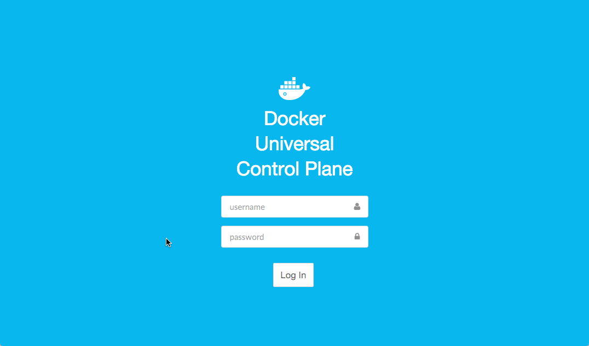

<!--[metadata]>
+++
aliases = [ "/ucp/production-install/"]
title = "Install UCP for production"
description = "Learn how to install Docker Universal Control Plane on production"
keywords = ["Universal Control Plane, UCP, install"]
[menu.main]
parent="mn_ucp_installation"
weight=20
+++
<![end-metadata]-->

# Install UCP for production

Docker Universal Control Plane (UCP) is a containerized application that can be
installed on-premises or on a cloud infrastructure.

The first step in installing UCP, is ensuring your
infrastructure has all the [requirements UCP needs to run](system-requirements).
Once that is done, use these instructions to install UCP.

## Step 1: Install CS Docker on all nodes

UCP requires you to install Docker CS Engine 1.10 or above on all nodes of
your UCP cluster.

For each node that you want to add to the UCP cluster, install the CS Docker
Engine.

## Step 2: Customize named volumes

This step is optional.

Docker UCP uses [named volumes](../architecture.md) to persist data. If you want
to customize the volume drivers and flags of these volumes, you can create the
volumes before installing UCP.

If the volumes don't exist, when installing UCP they are
created with the default volume driver and flags.


## Step 3: Customize the CA used

The UCP cluster uses TLS to secure all communications. Two Certificate
Authorities (CA) are used for this:

* Cluster root CA: generates certificates for new nodes joining the cluster and
admin user bundles.
* Client root CA: generates non-admin user bundles.

You can customize UCP to use certificates signed by an external Certificate
Authority. These certificates are used instead of the ones generated by the
client root CA. That way you can use a certificate from a CA that your
browsers and client tools already trust.

If you want to use your own certificates:

1. Log into the host where you intend to instal UCP.

2. Create a volume with the name `ucp-controller-server-certs`.

3. Add the following files to the volume top-level directory:

    | File     | Description                                                    |
    |:---------|:---------------------------------------------------------------|
    | ca.pem   | Your Root CA Certificate chain, including any intermediaries.  |
    | cert.pem | Your signed UCP controller certificate.                        |
    | key.pem  | Your UCP controller private key.                               |


## Step 4: Install the UCP controller

To install UCP you use the `docker/ucp` image. This image has commands to
install, configure, and backup UCP. To find what commands and options are
available, check the [reference documentation](../reference/install.md), or run:

```bash
$ docker run --rm -it docker/ucp --help
```

To install UCP:

1. Log in to the machine where you want to install UCP.

2. Use the `docker/ucp install` command to install UCP.

    In this example we'll be running the install command interactively, so that
    the command prompts for the necessary configuration values.
    You can also use flags to pass values to the install command.

    ```bash
    $ docker run --rm -it --name ucp \
      -v /var/run/docker.sock:/var/run/docker.sock
      docker/ucp install -i
    ```

    If you are using server certificates signed by an external CA, include
    the `--external-server-cert` option at the end of the command.

3. Check that the UCP web application is running.

    In your browser, navigate to the address where you've installed UCP.
    If you're not using your own certificates, your browser warns that UCP is
    an unsafe site.

    

## Step 5: License your installation

Now that your UCP controller is installed, you need to license it.
[Learn how to license your installation](license.md).

## Step 6: Backup the controller CAs

Docker UCP has support for high-availability. For an highly available
installation, you add more controller nodes to the UCP cluster. The controller
nodes are replicas of each other.
[Learn more about high-availability](../high-availability/set-up-high-availability.md).

When configuring UCP for high-availability, you need to ensure the CAs running
on each UCP controller node are interchangeable. This is done by using the same
certificates and keys for every CA on the cluster.
[Learn how to replicate the CAs for high availability](../high-availability/replicate-cas.md).

## Step 7: Add controller replicas to the UCP cluster

To add more controller nodes to the cluster, use the
`docker/ucp join --replica` command. To find what commands and options are
available, check the [reference documentation](../reference/join.md), or run:

```bash
$ docker run --rm -it docker/ucp join --help
```

For each node that you want to install as a controller replica:

1. Log into that node.

2. Use the join command with the replica option:

    In this example we'll be running the join command interactively, so that
    the command prompts for the necessary configuration values.
    You can also use flags to pass values to the install command.

    ```bash
    $ docker run --rm -it --name ucp \
      -v /var/run/docker.sock:/var/run/docker.sock \
      docker/ucp join -i --replica
    ```

3. Repeat steps 1 and 2 on the other nodes you want to set up as replicas.

    For high availability, make sure to set up 3, 5, or 7 controller nodes.
    [Learn more about high-availability](../high-availability/set-up-high-availability.md).

4. Check the cluster state.

    The Dashboard page of UCP should list all your controller nodes.

    


## Step 8: Add more nodes to the UCP cluster

Now you can add additional nodes to your UCP cluster. These are the nodes that
will be running your containers.

For each node that you want to add to your UCP cluster:

1. Log into that node.

2. Use the join command, to join the node to the cluster:

    ```bash
    $ docker run --rm -it --name ucp \
      -v /var/run/docker.sock:/var/run/docker.sock \
      docker/ucp join -i
    ```

3. Repeat steps 1 and 2 on the other nodes you want to add to your UCP cluster.

4. Check the cluster state.

    The Dashboard page of UCP should list all your controller nodes.

    

## Step 9. Download an admin user bundle

To validate that your cluster is correctly configured, you should try accessing
the cluster with the Docker CLI client. For this, you'll need to get a client
certificate bundle.
[Learn more about user bundles](../access-ucp/cli-based-access.md).


## Where to go next

* [Deploy an app from the UI](../applications/deploy-app-ui.md)
* [Monitor a UCP cluster](../monitor/monitor-ucp.md)
