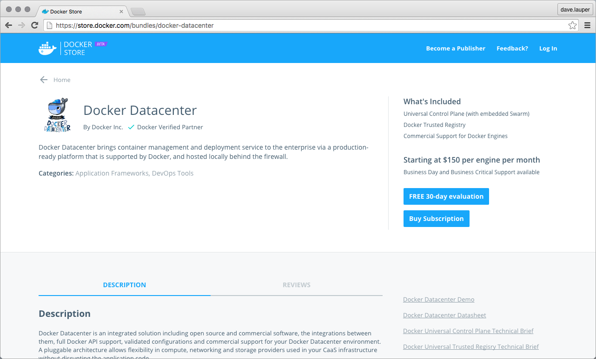

<!--[metadata]>
+++
title = "License UCP"
description = "Learn how to license your Docker Universal Control Plane installation."
keywords = ["Universal Control Plane, UCP, install, license"]
[menu.main]
parent="mn_ucp_installation"
identifier="ucp_license"
weight=40
+++
<![end-metadata]-->

# License UCP

After installing Docker Universal Control Plane, you need to license your
installation. If you just want to try UCP, you can
[get a trial license](https://www.docker.com/pricing).

## Download your license

When your license is issued, you can download it on Docker Hub. On Docker Hub,
navigate to your profile settings. Then click the
[Licenses tab](https://hub.docker.com/account/licenses/).

## License your installation

Once you've downloaded the license file, you can apply it to your UCP
installation. On your browser, navigate to UCP, and then go to the **Settings
page**.

On the **License** page you can upload the new license.

Click **Upload License** for the changes to take effect.

## Where to go next

* [Install UCP](install-production.md)
* [Install UCP offline](install-offline.md)
