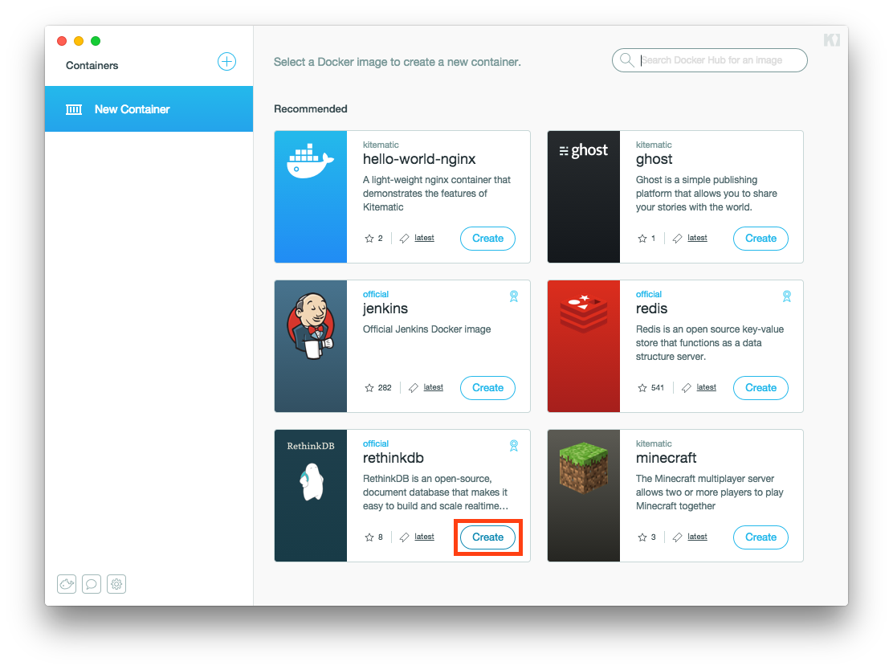
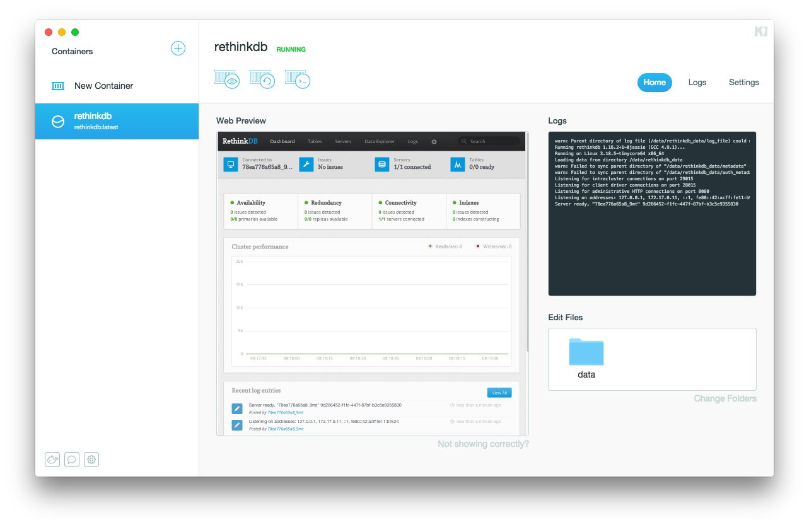
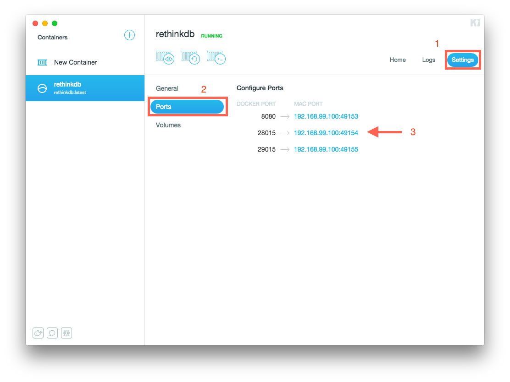
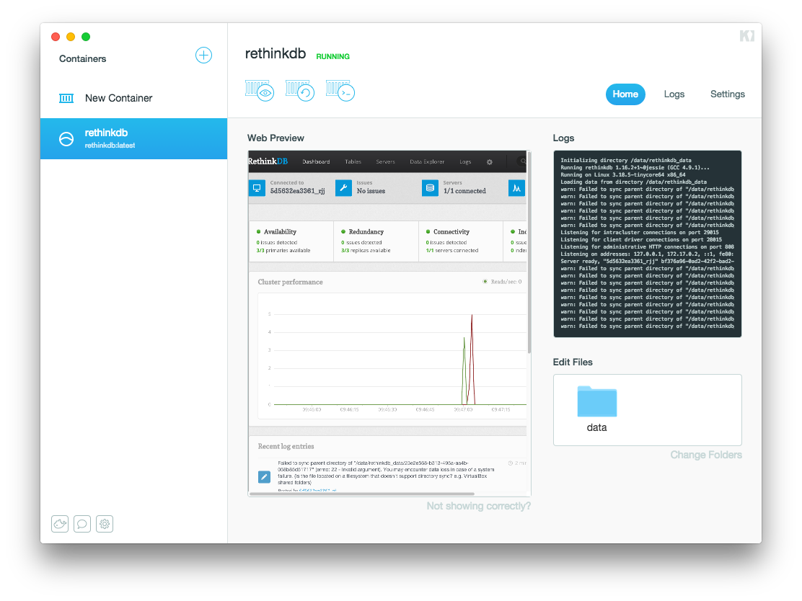

This tutorial guides you through these steps:

- Create a RethinkDB Container for Development
- (Advanced) Clone a small Node.js application and write data into RethinkDB.

### Set up RethinkDB in Kitematic

First, if you haven't yet done so, [download and start Kitematic](index.md).
Once open, the app should look like this:

Click on the _Create_ button of the `rethinkdb` image listing in the recommended
list as shown above. This downloads and runs a RethinkDB container within a few
minutes. Once it's done, a local RethinkDB database is up and running.

Let's start using it to develop a node.js app. For now, let's figure out which
IP address and port RethinkDB is listening on. To find out, click the `Settings`
tab and then the `Ports` section:

You can see there that for RethinkDB port `28015`, the container is listening on
host `localhost` and port `32783` (in this example - ports may be different
for you). This means you can now reach RethinkDB via a client driver at
`127.0.0.1:32783`. Again, this IP address may be different for you.

### (Advanced) Save Data into RethinkDB with a local Node.js App

Now, create the RethinkDB example chat application running on your local
macOS system to test drive your new containerized database.

First, if you don't have it yet, [download and install
Node.js](http://nodejs.org/).

> **Note**: This example needs Xcode installed.

In your terminal, type:

     $ export RDB_HOST=127.0.0.1 # replace with IP from above step
     $ export RDB_PORT=32783 # replace with Port from above step
     $ git clone https://github.com/rethinkdb/rethinkdb-example-nodejs-chat
     $ cd rethinkdb-example-nodejs-chat
     $ npm install
     $ npm start

Now, point your browser to `http://localhost:8000`. Congratulations, you've
successfully used a RethinkDB container in Kitematic to build a real-time chat
app. Happy coding!

