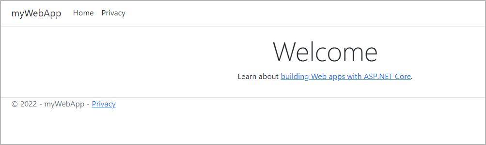



## Prerequisites

Work through the orientation and setup in Get started [Part 1](../../get-started/index.md) to understand Docker concepts.



## Overview

Now that we have a good overview of containers and the Docker platform, let’s take a look at building our first image. An image includes everything needed to run an application - the code or binary, runtime, dependencies, and any other file system objects required.

To complete this tutorial, you need the following:

- .NET SDK version 6.0 or later. [Download .NET SDK](https://dotnet.microsoft.com/download){: target="_blank" rel="noopener" class="_"}.
- Docker running locally. Follow the instructions to [download and install Docker](../../get-docker.md).
- An IDE or a text editor to edit files. We recommend using [Visual Studio Code](https://code.visualstudio.com/){: target="_blank" rel="noopener" class="_"}.

## Sample application

For our sample application, let’s create a simple application from a template using .NET. Create a directory in your local machine named `dotnet-docker`. Open a terminal and change to that directory. Run the following `dotnet new` command to create a C# app using the ASP.NET Core Web App template.

```console
$ mkdir dotnet-docker
$ cd dotnet-docker
$ dotnet new webApp -n myWebApp -o src --no-https
```

Output similar to the following appears.

```console
The template ASP.NET Core Web App was created successfully.
This template contains technologies from parties other than Microsoft, see https://aka.ms/aspnetcore/6.0-third-party-notices for details.
```

The command will create a new directory called `src`. View the `src` directory and verify the contents. You should see the following directories and files.

```shell
├── Pages
│ ├── Error.cshtml
│ ├── Error.cshtml.cs
│ ├── Index.cshtml
│ ├── Index.cshtml.cs
│ ├── Privacy.cshtml
│ ├── Privacy.cshtml.cs
│ ├── Shared
│ ├── _ViewImports.cshtml
│ └── _ViewStart.cshtml
├── Program.cs
├── Properties
│ └── launchSettings.json
├── appsettings.Development.json
├── appsettings.json
├── myWebApp.csproj
├── obj
│ ├── myWebApp.csproj.nuget.dgspec.json
│ ├── myWebApp.csproj.nuget.g.props
│ ├── myWebApp.csproj.nuget.g.targets
│ ├── project.assets.json
│ └── project.nuget.cache
└── wwwroot
├── css
├── favicon.ico
├── js
└── lib
```

## Test the application

Let’s start our application and make sure it’s running properly. Open your terminal and navigate to the `src` directory and use the `dotnet watch run` command.

```console
$ cd /path/to/dotnet-docker/src
$ dotnet watch run
```

Output similar to the following appears.

```console
dotnet watch 🔥 Hot reload enabled. For a list of supported edits, see https://aka.ms/dotnet/hot-reload. 
  💡 Press "Ctrl + R" to restart.
dotnet watch 🔧 Building...
  Determining projects to restore...
  All projects are up-to-date for restore.
  myWebApp -> \Users\path\dotnet-docker\src\bin\Debug\net6.0\myWebApp.dll
dotnet watch 🚀 Started
info: Microsoft.Hosting.Lifetime[14]
      Now listening on: http://localhost:5267
info: Microsoft.Hosting.Lifetime[0]
      Application started. Press Ctrl+C to shut down.
info: Microsoft.Hosting.Lifetime[0]
      Hosting environment: Development
info: Microsoft.Hosting.Lifetime[0]
      Content root path: \path\to\dotnet-docker\src\
```

Your web browser will open and display the following page.



Press Ctrl+C in the terminal window to stop the application.

## Create a Dockerfile

Now that our application is running properly, let’s take a look at creating a Dockerfile.



Next, we need to add a line in our Dockerfile that tells Docker what image
we would like to use to build our application.

```dockerfile
# syntax=docker/dockerfile:1

FROM mcr.microsoft.com/dotnet/sdk:6.0 as build-env
```

Docker images can be inherited from other images. Therefore, instead of creating our own image, we’ll use the official .NET SDK image that already has all the tools and packages that we need to build a .NET application.

We will use a multi-stage build and define a stage for building the application.We define a `build-env` stage in our Dockerfile using `as`.

> **Note**
>
> To learn more about multi-stage builds, see [Use multi-stage builds](../../develop/develop-images/multistage-build.md).

To make things easier when running the rest of our commands, let’s create a working directory for our source files. This instructs Docker to use this path as the default location for all subsequent commands. By doing this, we do not have to type out full file paths but can use relative paths based on the working directory.

```dockerfile
WORKDIR /src
```

Although not necessary, the commands below will copy only the csproj files and then run `dotnet restore`. Each command creates a new container layer. To speed the building of containers, Docker caches these layers. Since these files won't change often, we can take advantage of the caching by copying these files and running restore as separate commands.


```dockerfile
COPY src/*.csproj .
RUN dotnet restore
```

Next, you'll need to copy the rest of your source files into the image. The line below will copy the files from the `src` directory on your local machine to a directory called `src` in the image.

```dockerfile
COPY src ./src
```

Next, you'll need to run the `dotnet publish` command to build the project.

```dockerfile
RUN dotnet publish -c Release -o /publish
```

Next, you'll specify the image that you'll use to run the application, and define it as the `runtime` stage.

```dockerfile
FROM mcr.microsoft.com/dotnet/aspnet:6.0 as runtime
```

Next, specify the working directory for this stage.

```dockerfile
WORKDIR /app
```

Next, copy the /publish directory from the build-env stage into the runtime image.

```dockerfile
COPY --from=build-env /publish .
```

Expose port 80 to incoming requests.

```dockerfile
EXPOSE 80
```

Now, all we have to do is to tell Docker what command we want to run when our image is executed inside a container. We do this using the ENTRYPOINT command.

```dockerfile
ENTRYPOINT ["dotnet", "myWebApp.dll"]
```

Here's the complete Dockerfile.

```dockerfile
# syntax=docker/dockerfile:1

FROM mcr.microsoft.com/dotnet/sdk:6.0 as build-env
WORKDIR /src
COPY src/*.csproj .
RUN dotnet restore
COPY src .
RUN dotnet publish -c Release -o /publish

FROM mcr.microsoft.com/dotnet/aspnet:6.0 as runtime
WORKDIR /publish
COPY --from=build-env /publish .
EXPOSE 80
ENTRYPOINT ["dotnet", "myWebApp.dll"]
```

## .dockerignore file

To make your build context as small as possible, add a .dockerignore file to your `dotnet-docker` folder and copy the following into it.

```console
bin/
obj/
```

> **Note**
>
> To learn more about .dockerignore, see [.dockerignore file](../../engine/reference/builder.md/#dockerignore-file).


### Directory structure

Just to recap, we created a directory in our local machine called `dotnet-docker` and created a simple .NET application in the `src` folder. We also created a Dockerfile containing the commands to build an image as well as a .dockerignore file. The `dotnet-docker` directory structure should now look like:

```shell
├── dotnet-docker
│ ├── src/
│ ├── Dockerfile
│ ├── .dockerignore
```

## Build an image

Now that we’ve created our Dockerfile, let’s build our image. To do this, we use the `docker build` command. The `docker build` command builds Docker images from a Dockerfile and a “context”. A build’s context is the set of files located in the specified PATH or URL. The Docker build process can access any of the files located in this context.

The build command optionally takes a `--tag` flag. The tag is used to set the name of the image and an optional tag in the format `name:tag`. We’ll leave off the optional `tag` for now to help simplify things. If you do not pass a tag, Docker uses “latest” as its default tag.

Let’s build our first Docker image. Change directory to the `dotnet-docker` directory and run `docker build`.

```console
$ cd /path/to/dotnet-docker
$ docker build --tag dotnet-docker .
```

## View local images

To see a list of images we have on our local machine, we have two options. One is to use the CLI and the other is to use [Docker Desktop](../../desktop/use-desktop/images.md). As we are currently working in the terminal let’s take a look at listing images using the CLI.

To list images, simply run the `docker images` command.

```console
$ docker images
REPOSITORY      TAG               IMAGE ID       CREATED         SIZE
dotnet-docker   latest            8cae92a8fbd6   3 minutes ago   216MB
```

You should see at least one image listed, the image we just built `dotnet-docker:latest`.

## Tag images

As mentioned earlier, an image name is made up of slash-separated name components. Name components may contain lowercase letters, digits and separators. A separator is defined as a period, one or two underscores, or one or more dashes. A name component may not start or end with a separator.

An image is made up of a manifest and a list of layers. Do not worry too much about manifests and layers at this point other than a “tag” points to a combination of these artifacts. You can have multiple tags for an image. Let’s create a second tag for the image we built and take a look at its layers.

To create a new tag for the image we’ve built above, run the following command.

```console
$ docker tag dotnet-docker:latest dotnet-docker:v1.0.0
```

The `docker tag` command creates a new tag for an image. It does not create a new image. The tag points to the same image and is just another way to reference the image.

Now, run the `docker images` command to see a list of our local images.

```console
$ docker images
REPOSITORY      TAG               IMAGE ID       CREATED         SIZE
dotnet-docker   latest            8cae92a8fbd6   4 minutes ago   216MB
dotnet-docker   v1.0.0            8cae92a8fbd6   4 minutes ago   216MB
```

You can see that we have two images that start with `dotnet-docker`. We know they are the same image because if you take a look at the `IMAGE ID` column, you can see that the values are the same for the two images.

Let’s remove the tag that we just created. To do this, we’ll use the `rmi` command. The `rmi` command stands for remove image.

```console
$ docker rmi dotnet-docker:v1.0.0
Untagged: dotnet-docker:v1.0.0
```

Note that the response from Docker tells us that the image has not been removed but only “untagged”. You can check this by running the `docker images` command.

```console
$ docker images
REPOSITORY      TAG               IMAGE ID       CREATED         SIZE
dotnet-docker   latest            8cae92a8fbd6   6 minutes ago   216MB
```

Our image that was tagged with `:v1.0.0` has been removed, but we still have the `dotnet-docker:latest` tag available on our machine.

## Next steps

In this module, we took a look at setting up our example .NET application that we will use for the rest of the tutorial. We also created a Dockerfile that we used to build our Docker image. Then, we took a look at tagging our images and removing images. In the next module we’ll take a look at how to:

[Run your image as a container](run-containers.md){: .button .primary-btn}

## Feedback

Help us improve this topic by providing your feedback. Let us know what you think by creating an issue in the [Docker Docs](https://github.com/docker/docker.github.io/issues/new?title=[dotnet%20docs%20feedback]){:target="_blank" rel="noopener" class="_"} GitHub repository. Alternatively, [create a PR](https://github.com/docker/docker.github.io/pulls){:target="_blank" rel="noopener" class="_"} to suggest updates.
