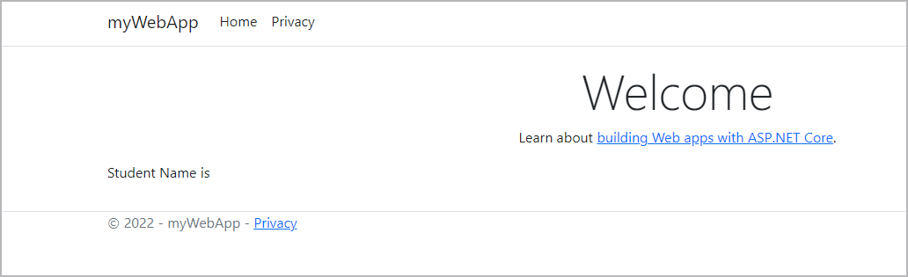
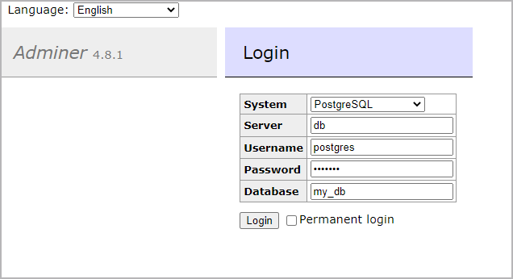
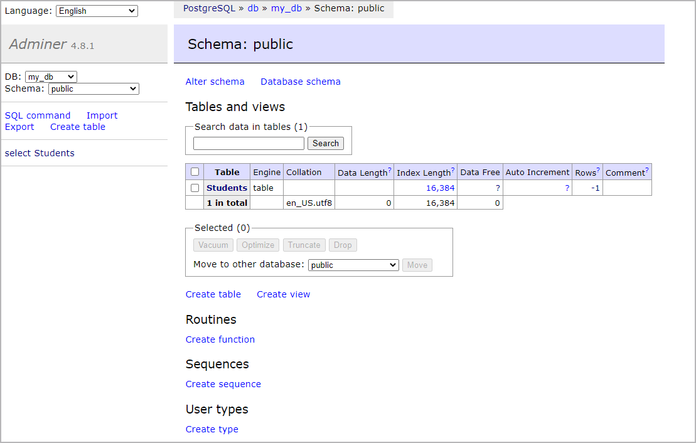
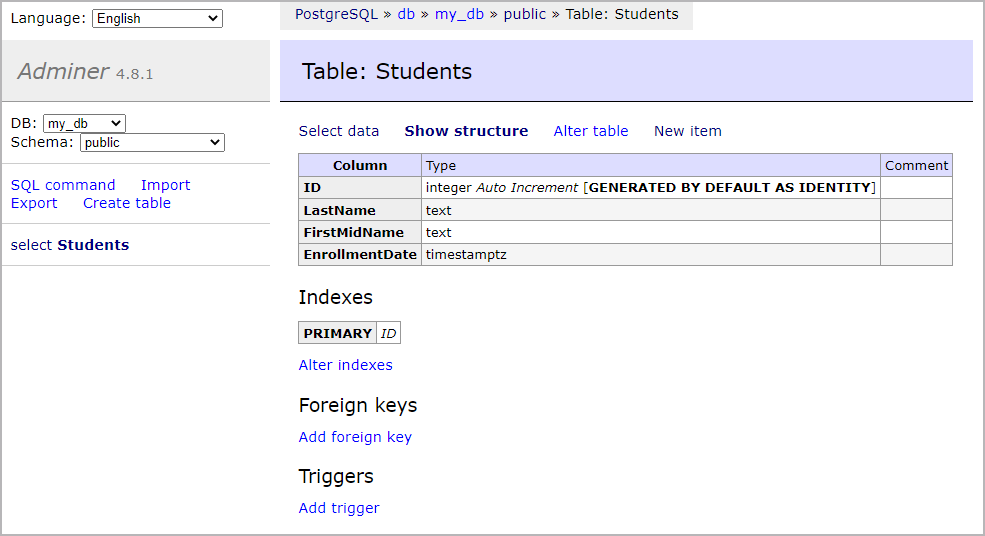
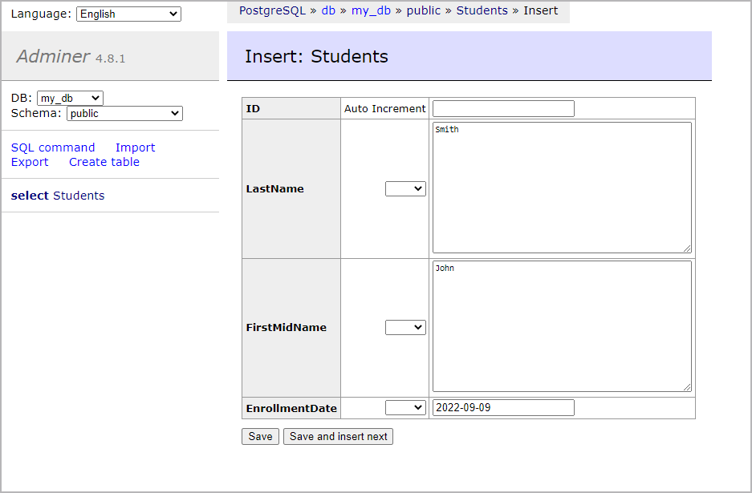
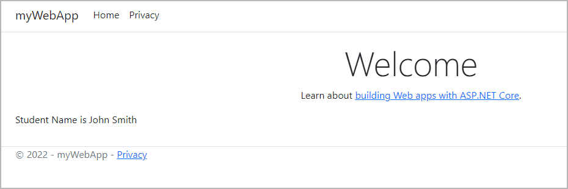



## Prerequisites

Work through the steps to build an image and run it as a containerized application in [Run your image as a container](run-containers.md).

## Introduction

In this module, we’ll walk through setting up a local development environment for the application we built in the previous modules. We’ll use Docker to build our images and Docker Compose to make everything a whole lot easier.

## Run a database in a container

First, we’ll take a look at running a database in a container and how we use volumes and networking to persist our data and allow our application to talk with the database. Then we’ll pull everything together into a Compose file which allows us to setup and run a local development environment with one command. 

Instead of downloading PostgreSQL, installing, configuring, and then running the PostgreSQL database as a service, we can use the Docker Official Image for PostgreSQL and run it in a container.

Before we run PostgreSQL in a container, we'll create a volume that Docker can manage to store our persistent data. Let’s use the managed volumes feature that Docker provides instead of using bind mounts. You can read all about [Using volumes](../../storage/volumes.md) in our documentation.

Let’s create our data volume now.

```console
$ docker volume create postgres-data
```

Now we’ll create a network that our application and database will use to talk to each other. The network is called a user-defined bridge network and gives us a nice DNS lookup service which we can use when creating our connection string.

```console
$ docker network create postgres-net
```

Now we can run PostgreSQL in a container and attach to the volume and network we created above. Docker pulls the image from Hub and runs it for you locally.
In the following command, option `-v` is for starting the container with the volume. For more information, see [Docker volumes](../../storage/volumes.md).

```console
$ docker run --rm -d -v postgres-data:/var/lib/postgresql/data \
  --network postgres-net \
  --name db \
  -e POSTGRES_USER=postgres \
  -e POSTGRES_PASSWORD=example \
  postgres
```

Now, let’s make sure that our PostgreSQL database is running and that we can connect to it. Connect to the running PostgreSQL database inside the container using the following command:

```console
$ docker exec -ti db psql -U postgres
psql (14.5 (Debian 14.5-1.pgdg110+1))
Type "help" for help.

postgres=#
```

Press CTRL-D to exit the interactive terminal.


## Update the application to connect to the database

In the above command, we logged in to the PostgreSQL database by passing the `psql` command to the `db` container.

Next, we'll update the sample application we created in the [Build images](build-images.md#sample-application) module. 

Let's add a package to allow the app to talk to a database and update the source files. On your local machine, open a terminal, change directory to the `src` directory and run the following command:

```console
$ cd /path/to/dotnet-docker/src
$ dotnet add package Npgsql.EntityFrameworkCore.PostgreSQL
```

In the `src` directory, create a `Models` folder. Inside the `Models` folder create a file named `Student.cs` and add the following code to `Student.cs`:

```c#
using System;
using System.Collections.Generic;
namespace myWebApp.Models
{
  public class Student
  {
    public int ID { get; set; }
    public string LastName { get; set; }
    public string FirstMidName { get; set; }
    public DateTime EnrollmentDate { get; set; }
  }
}
```
Save and close the `Student.cs` file.

In the `src` directory, create a `Data` folder. Inside the `Data` folder create a file named `SchoolContext.cs` and add the following code to `SchoolContext.cs`:

```c#
using Microsoft.EntityFrameworkCore;
namespace myWebApp.Data
{
   public class SchoolContext : DbContext
   {
      public SchoolContext(DbContextOptions<SchoolContext> options) : base(options) { }
      public DbSet<Models.Student>? Students { get; set; }
   }
}
```

Save and close the `SchoolContext.cs` file.

In the `Program.cs` file located in the `src` directory, replace the contents with the following code:

```c#
using Microsoft.EntityFrameworkCore;
using myWebApp.Models;
using myWebApp.Data;

var builder = WebApplication.CreateBuilder(args);
builder.Services.AddRazorPages();
// Add services to the container.
builder.Services.AddDbContext<SchoolContext>(options =>
   options.UseNpgsql(builder.Configuration.GetConnectionString("SchoolContext")));

var app = builder.Build();
using (var scope = app.Services.CreateScope())
{
   var services = scope.ServiceProvider;
   try
   {
       // add 10 seconds delay to ensure the db server is up to accept connections
       // this won't be needed in real world application
       System.Threading.Thread.Sleep(10000);
       var context = services.GetRequiredService<SchoolContext>();
       var created = context.Database.EnsureCreated();

   }
   catch (Exception ex)
   {
       var logger = services.GetRequiredService<ILogger<Program>>();
       logger.LogError(ex, "An error occurred creating the DB.");
   }
}


// Configure the HTTP request pipeline.
if (!app.Environment.IsDevelopment())
{
    app.UseExceptionHandler("/Error");
}
app.UseStaticFiles();

app.UseRouting();

app.UseAuthorization();

app.MapRazorPages();

app.Run();
```

Save and close the `Program.cs` file.


In the `appsettings.json` file located in the `src` directory, replace the contents with the following code:

```json
{
   "Logging": {
       "LogLevel": {
           "Default": "Information",
           "Microsoft": "Warning",
           "Microsoft.Hosting.Lifetime": "Information"
       }
   },
   "AllowedHosts": "*",
   "ConnectionStrings": {
       "SchoolContext": "Host=db;Database=my_db;Username=postgres;Password=example"
   }
}
```

Save and close the `appsettings.json` file.

In the `Index.cshtml` file located in the `src\Pages` directory, replace the contents with the following code:

```html
@page
@model IndexModel
@{
    ViewData["Title"] = "Home page";
}

<div class="text-center">
    <h1 class="display-4">Welcome</h1>
    <p>Learn about <a href="https://docs.microsoft.com/aspnet/core">building Web apps with ASP.NET Core</a>.</p>
</div>

<div class="row mb-auto">
    <p>Student Name is @Model.StudentName</p>
</div>
```

Save and close the `Index.cshtml` file.

In the `Index.cshtml.cs` file located in the `src\Pages` directory, replace the contents with the following code:

```c#
using Microsoft.AspNetCore.Mvc;
using Microsoft.AspNetCore.Mvc.RazorPages;

namespace myWebApp.Pages;

public class IndexModel : PageModel
    {
        public string StudentName { get; private set; } = "PageModel in C#";
        private readonly ILogger<IndexModel> _logger;
        private readonly myWebApp.Data.SchoolContext _context;

        public IndexModel(ILogger<IndexModel> logger, myWebApp.Data.SchoolContext context)
        {
            _logger = logger;
            _context= context;
        }

        public void OnGet()
        {
            var s =_context.Students?.Where(d=>d.ID==1).FirstOrDefault();
            this.StudentName = $"{s?.FirstMidName} {s?.LastName}";
        }
    }
```

Save and close the `Index.cshtml.cs` file.

Now we can rebuild our image. Open a terminal, change directory to the `dotnet-docker` directory and run the following command:

```console
$ docker build --tag dotnet-docker .
```

List your running containers.

```console
$ docker ps
CONTAINER ID   IMAGE           COMMAND                  CREATED          STATUS          PORTS                            NAMES
146e1cb76e71   postgres        "docker-entrypoint.s…"   25 minutes ago   Up 25 minutes   5432/tcp                         postgresqldb
72bef28b1cd4   dotnet-docker   "./myWebApp"             40 minutes ago   Up 40 minutes   0.0.0.0:5000->80/tcp             dotnet-app
```
Inspect the image column and stop any container that is using the `dotnet-docker` image.

```console
$ docker stop dotnet-app
dotnet-app
```

Now, let’s run our container on the same network as the database. This allows us to access the database by its container name.

```console
$ docker run \
  --rm -d \
  --network postgres-net \
  --name dotnet-app \
  -p 5000:80 \
  dotnet-docker
```

Let's test that the application works and is connecting to the database. Using a web browser, access `http://localhost:5000`. A page similar to the following image appears.




## Connect Adminer and populate the database

You now have an application accessing the database, but the database contains no entries. Let's connect Adminer to manage our database and create a database entry.

```console
$ docker run \
  --rm -d \
  --network postgres-net \
  --name db-admin \
  -p 8080:8080 \
  adminer
```

Using a web browser, access `http://localhost:8080`.

The Adminer login page appears.




Specify the following in the login page and then click **Login**:
 * System: PostgreSQL
 * Server: db
 * Username: postgres
 * Password: example
 * Database: my_db

The `Schema: public` page appears.



In `Tables and views`, click `Students`. The `Table: Students` page appears.



Click `New item`. The `Insert: Students` page appears.



Specify a `LastName`, `FirstMidName`, and `EnrollmentDate`. Click `Save`.

Verify that the student name appears in the application. Use a web browser to access `http://localhost:5000`.



List and then stop the application, database, and Adminer containers.

```console
$ docker ps
CONTAINER ID   IMAGE               COMMAND                  CREATED          STATUS          PORTS                            NAMES
b76346800b6d   adminer             "entrypoint.sh docke…"   30 minutes ago   Up 30 minutes   0.0.0.0:8080->8080/tcp           db-admin
4ae70ac948a1   dotnet-docker       "./myWebApp"             45 minutes ago   Up 45 minutes   0.0.0.0:5000->80/tcp             dotnet-app
75554c7694d8   postgres            "docker-entrypoint.s…"   46 minutes ago   Up 46 minutes   5432/tcp                         db
```

```console
$ docker stop db-admin dotnet-app db
db-admin
dotnet-app
db
```

## Better productivity with Docker Compose

In this section, we’ll create a [Compose file](../../compose/index.md) to start our dotnet-docker app, Adminer, and the PostgreSQL database using a single command.

Open the `dotnet-docker` directory in your IDE or a text editor and create a new file named `docker-compose.yml`. Copy and paste the following contents into the file.

```yaml
services:
 db:
   image: postgres
   restart: always
   environment:
     POSTGRES_PASSWORD: example
   volumes:
     - postgres-data:/var/lib/postgresql/data
 adminer:
   image: adminer
   restart: always
   ports:
     - 8080:8080
 app:
   build:
     context: .
   ports:
     - 5000:80
   depends_on:
     - db
volumes:
 postgres-data:
```

Save and close the `docker-compose.yml` file.

The `dotnet-docker` directory structure should now look like:

```shell
├── dotnet-docker
│ ├── src/
│ ├── Dockerfile
│ ├── .dockerignore
│ ├── docker-compose.yml
```

This Compose file is super convenient as we do not have to type all the parameters to pass to the `docker run` command. We can declaratively do that using a Compose file.

We expose the ports so that we can reach the web server and Adminer inside the containers. We also map our local source code into the running container to make changes in our text editor and have those changes picked up in the container.

Another really cool feature of using a Compose file is that we have service resolution set up to use the service names. Therefore, we are now able to use “db” in our connection string. The reason we use “db” is because that is what we've named our PostgreSQL service as in the Compose file.

Now, to start our application and to confirm that it is running properly, run the following command:

```console
$ docker-compose up --build
```

We pass the `--build` flag so Docker will compile our image and then start the containers.

Now let’s test our application. Using a web browser, access `http://localhost:5000` to view the page.

## Shutting down

To stop the containers started by Docker Compose, press Ctrl+C in the terminal where we ran `docker-compose up`. To remove those containers after they have been stopped, run `docker-compose down`.

## Detached mode

You can run containers started by the `docker-compose` command in detached mode, just as you would with the docker command, by using the `-d` flag.

To start the stack, defined by the Compose file in detached mode, run:

```console
docker-compose up --build -d
```

Then, you can use `docker-compose stop` to stop the containers and `docker-compose down` to remove them.

## The `.env` file

Docker Compose will automatically read environment variables from a `.env` file if it is available. Since our Compose file requires `POSTGRES_PASSWORD` to be set, we create an `.env`  file and add the following content:

```shell
POSTGRES_PASSWORD=example
```

Now, update the compose file to use this variable.

```yaml
services:
 db:
   image: postgres
   restart: always
   environment:
     POSTGRES_PASSWORD: ${POSTGRES_PASSWORD:?database password not set}
   volumes:
     - postgres-data:/var/lib/postgresql/data
 adminer:
   image: adminer
   restart: always
   ports:
     - 8080:8080
 app:
   build:
     context: .
   ports:
     - 5000:80
   depends_on:
     - db
volumes:
 postgres-data:
```

`POSTGRES_PASSWORD=${POSTGRES_PASSWORD:?database password not set}` means that if the environment variable `POSTGRES_PASSWORD` is not set on the host, Docker Compose will display an error. This is OK, because we don’t want to hard-code default values for the password. We set the password value in the `.env` file, which is local to our machine. It is always a good idea to add `.env` to `.gitignore` to prevent the secrets being checked into the version control.

Build and run your application to confirm the changes are applied properly.

```console
$ docker-compose up --build -d
```

Now let’s test our application. Using a web browser, access `http://localhost:5000` to view the page.

## Next steps

In the next module, we’ll take a look at how to set up a CI/CD pipeline using GitHub Actions. See:

[Configure CI/CD](configure-ci-cd.md){: .button .primary-btn}

## Feedback

Help us improve this topic by providing your feedback. Let us know what you think by creating an issue in the [Docker Docs](https://github.com/docker/docker.github.io/issues/new?title=[dotnet%20docs%20feedback]){:target="_blank" rel="noopener" class="_"} GitHub repository. Alternatively, [create a PR](https://github.com/docker/docker.github.io/pulls){:target="_blank" rel="noopener" class="_"} to suggest updates.