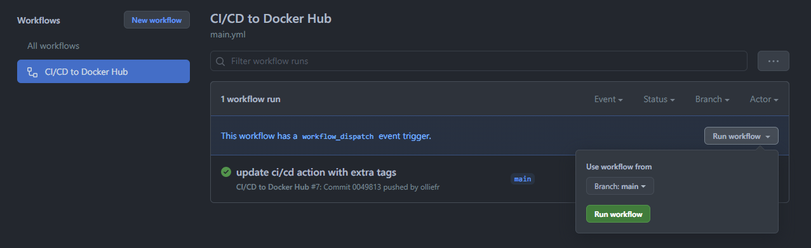
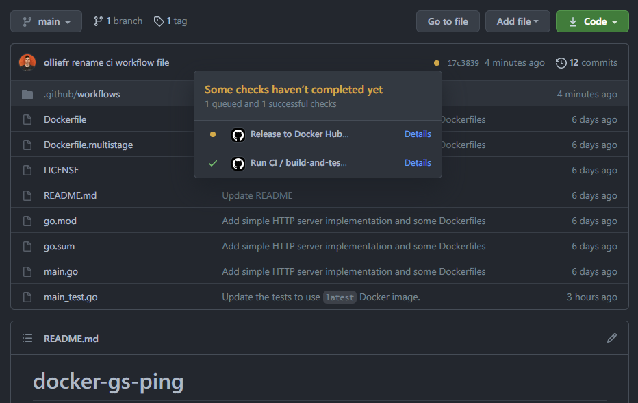
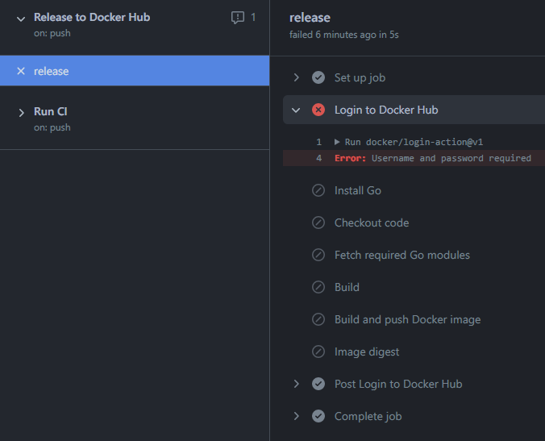
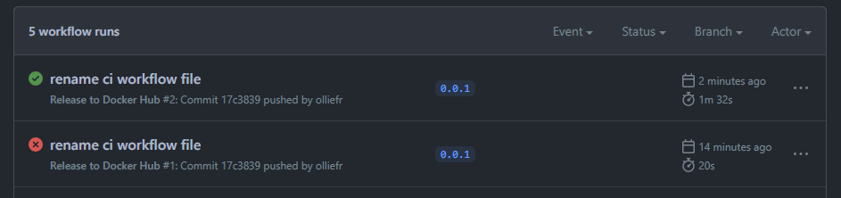



This page guides you through the process of setting up a GitHub Action CI/CD pipeline with Docker containers. Before setting up a new pipeline, we recommend that you take a look at [Ben's blog](https://www.docker.com/blog/best-practices-for-using-docker-hub-for-ci-cd/){:target="_blank" rel="noopener" class="_"} on CI/CD best practices.

This guide contains instructions on how to:

1. Set up continuous integration (CI) pipeline using GitHub Actions;
2. Enable Docker Hub access for continuous deployment (CD) tools;
3. Optimize your GitHub Actions-based CI/CD pipeline to reduce the number of pull requests and the total build time; and
4. Release only specific versions of your application to Docker Hub.

> **Note**
>
> Before we begin, it must be said that Continuous Integration (CI) and Continuous Deployment (CD) each is a _huge_ subject, with many different approaches and opinions. The approach chosen in this guide is optimised for pedagogical clarity and simplicity and is not meant to be the One True Way to test and release software.

## Choose a sample project

Let’s get started. This guide uses a simple Go project as an example. In fact, it is the same project we got acquainted with in [Build Images](build-images.md) part of this guide. The [olliefr/docker-gs-ping](https://github.com/olliefr/docker-gs-ping){:target="_blank" rel="noopener" class="_"} repository contains the full source code and the `Dockerfile`. You can either fork it or to follow along and set up one of your own Go projects in a fashion described in this section.

Thus, as long as you have a GitHub repo with a project and a `Dockerfile`, you can complete this part of the tutorial.

## Enable access to Docker Hub

The [Docker Hub](https://hub.docker.com/) is a hosted repository service provided by Docker for finding and sharing container images.

Before we can publish our Docker image to Docker Hub, we must grant GitHub Actions access to Docker Hub API.

To set up the access to Docker Hub API:

1. Create a new Personal Access Token (PAT) for Docker Hub. 

    * Go to the [Docker Hub Account Settings](https://hub.docker.com/settings/security) and then click **New Access Token**.
    * Let's call this token `docker-gs-ping-ci`. Input the name and click **Create**.
    * Copy the token value, we'll need it in a second.

2. Add your Docker ID and PAT as secrets to your GitHub repo.

    * Navigate to your GitHub repository and click **Settings** > **Secrets** > **New secret**.
    * Create a new secret with the name `DOCKER_HUB_USERNAME` and your Docker ID as value.
    * Create a new secret with the name `DOCKER_HUB_ACCESS_TOKEN` and use the token value from the step (1).

Your GitHub repository **Secrets** section would look like the following.

{:width="500px"}

Now it will be possible to refer to these two variables from our workflows. This will open up an opportunity to publish our image to Docker Hub.

## Set up the CI workflow

In the previous section, we created a PAT and added it to GitHub to ensure we can access Docker Hub from any GitHub Actions workflow. But before setting out to build the images for releasing our software, let's build a CI pipeline to run the tests first.

To set up the workflow:

1. Go to your repository in GitHub and then click **Actions** > **New workflow**.
2. Click **set up a workflow yourself** and update the starter template to match the following:

First, we will name this workflow:


```yaml
name: Run CI
```


Then, we will choose when we run this workflow. In our example, we are going to do it for every push against the main branch of our project:


```yaml
on:
  push:
    branches: [ main ]
  workflow_dispatch:
```


The `workflow_dispatch` is optional. It enables to run this workflow manually from the Actions tab.

Now, we need to specify what we actually want to happen within our workflow. A workflow run is made up of one or more _jobs_ that can run sequentially or in parallel.

The first job we would like to set up is the one to build and run our tests. Let it be run on the latest Ubuntu instance:


```yaml
jobs:
  build-and-test:
    runs-on: ubuntu-latest
```


A job is a sequence of _steps_. For this simple CI pipeline we would like to:

1. Set up Go compiler environment.
2. Check out our code from its GitHub repository.
3. Fetch Go modules used by our application.
4. (Optional) Build the binary for our application.
5. Build the Docker Image for our application.
6. Run the functional tests for our application against that Docker image.

Building the binary in step 4 is actually optional. It is a "smoke test". We don't want to be building a Docker image and attempting functional testing if our application does not even compile. If we had "unit tests" or some other small tests, we would run them between steps 4 and 5 as well.

The following sequence of `steps` achieves the goals we just set.


```yaml
    steps:
      - name: Install Go
        uses: actions/setup-go@v2
        with:
          go-version: 1.16.4

      - name: Checkout code
        uses: actions/checkout@v2

      - name: Fetch required Go modules
        run:  go mod download

      - name: Build
        run:  go build -v ./...

      - name: Build Docker image
        uses: docker/build-push-action@v2
        with:
          push: false
          tags: ${{ github.event.repository.name }}:latest, ${{ github.repository }}:latest

      - name: Run functional tests
        run:  go test -v ./...
```


As is usual with YAML files, be aware of indentation. The complete workflow file for reference is available in the project's repo, under the name of `.github/workflows/ci.yml`.

This should be enough to test our approach to CI. Change the workflow file name from `main.yml` to `ci.yml` and press **Start commit** button. Fill out the commit details in your preferred style and press **Commit new file**. GitHub Actions are saved as YAML files in `.github/workflows` directory and GitHub web interface would do that for us.

Select **Actions** from the navigation bar for your repository. Since we've enabled `workflow_dispatch` option in our Action, GitHub will have started it already. If not, select "CI/CD to Docker Hub" action on the left, and then press **Run workflow** button on the right to start the workflow.

{:width="500px"}

Should the run fail, you can click on the failing entry to see the logs and amend the workflow YAML file accordingly.

## Set up the CD workflow

Now, let’s create a GitHub Actions workflow to build and store the image for our application in Docker Hub. We can achieve this by creating two Docker actions:

1. The first action enables us to log in to Docker Hub using the secrets we stored in the GitHub Repository settings.
2. The second one is the build and push action.

In this example, let us set the push flag to `true` as we also want to push. We’ll then add a tag to specify to always go to the latest version. Lastly, we’ll echo the image digest to see what was pushed.

Now, we can add the steps required. Start a blank new workflow, just as we did before. Let's give it a file name of `release.yml` and amend the template body to match the following.


```yaml
name: Release to Docker Hub

on:
  push:
    tags:
      - "*.*.*"

jobs:
  release:
    runs-on: ubuntu-latest
    steps:
      - name: Login to Docker Hub
        uses: docker/login-action@v1
        with:
          username: ${{ secrets.DOCKER_HUB_USERNAME }}
          password: ${{ secrets.DOCKER_HUB_ACCESS_TOKEN }}

      - name: Install Go
        uses: actions/setup-go@v2
        with:
          go-version: 1.16.4

      - name: Checkout code
        uses: actions/checkout@v2

      - name: Fetch required Go modules
        run:  go mod download

      - name: Build
        run:  go build -v ./...

      - name: Build and push Docker image
        id:   docker_build
        uses: docker/build-push-action@v2
        with:
          push: true
          tags: ${{ secrets.DOCKER_HUB_USERNAME }}/${{ github.event.repository.name }}:latest

      - name: Image digest
        run: echo ${{ steps.docker_build.outputs.digest }}
```


This workflow is similar to the CI workflow, with the following changes:

* This workflow is only triggered when a git tag of the format `*.*.*` is pushed to the repo. The tag meant to be a semantic version, such as `3.5.0` or `0.0.1`.
* The very first step is to login into Docker Hub using the two secrets that we had saved in the repository settings previously.
* The _build and push_ step now has `push: true` and since we had logged into Docker Hub this will result in the latest image being published.
* The image digest step prints out the image metadata to the log.

Let's save this workflow and check the _Actions_ page for the repository on GitHub. Unlike the CI workflow, this new workflow cannot be triggered manually - this is how we set it up. So, in order to test it, we have to tag some commit. Let's tag the `HEAD` of the `main` branch:

```console
$ git tag -a 0.0.1 -m "Test release workflow"

$ git push --tags
Enumerating objects: 1, done.
Counting objects: 100% (1/1), done.
Writing objects: 100% (1/1), 169 bytes | 169.00 KiB/s, done.
Total 1 (delta 0), reused 0 (delta 0)
To https://github.com/olliefr/docker-gs-ping.git
 * [new tag]         0.0.1 -> 0.0.1
```

This means our tag was successfully pushed to the main repo. If we switch to the GitHub UI, we would see that the workflow has already been triggered:

{:width="500px"}

Plot twist! Despite having explained how to add secrets to the repository, we had forgotten to do it ourselves. And the workflow run results in error:

{:width="500px"}

That's easy to fix. We follow our own guide and add the secrets to the repository settings. But how do we re-run the workflow? We need to remove the tag and reapply it.

To remove the tag on the `remote`:

```console
$ git push origin :refs/tags/0.0.1
To https://github.com/olliefr/docker-gs-ping.git
 - [deleted]         0.0.1
```

And to re-apply it locally and push:

```console
$ git tag -fa 0.0.1 -m "Test release workflow"
Updated tag '0.0.1' (was d7d3edc)
$ git push origin --tags
Enumerating objects: 1, done.
Counting objects: 100% (1/1), done.
Writing objects: 100% (1/1), 170 bytes | 170.00 KiB/s, done.
Total 1 (delta 0), reused 0 (delta 0)
To https://github.com/olliefr/docker-gs-ping.git
 * [new tag]         0.0.1 -> 0.0.1
```

And the workflow is triggered again. This time it completes without issues:

{:width="500px"}

Since the image we've just pushed to Docker Hub is public, now it can be pulled by anyone, from anywhere:

```console
$ docker pull olliefr/docker-gs-ping
Using default tag: latest
latest: Pulling from olliefr/docker-gs-ping
540db60ca938: Already exists
adcc1eea9eea: Already exists
4c4ab2625f07: Already exists
c5e7595549f7: Pull complete
3df88182f7ac: Pull complete
56c9181b0012: Pull complete
04b91de9e9ed: Pull complete
7a1dde643d3d: Pull complete
f815a8b426ad: Pull complete
7a6b1ee48c34: Pull complete
ca1a2b73aa81: Pull complete
Digest: sha256:81bedd562952757322a07a26634b01e3916db375cc695843124f79641e433029
Status: Downloaded newer image for olliefr/docker-gs-ping:latest
docker.io/olliefr/docker-gs-ping:latest
```

We've just build a simple (maybe even naive) CI/CD workflow. There are many ways in which it can be improved. We'll look at some of these ways in the next section.

## Optimizing the workflow

Next, let’s look at how we can optimize the GitHub Actions workflow through build cache. This has two main advantages:

1. Build cache reduces the build time as it will not have to re-download all of the images, and
2. It also reduces the number of pulls we complete against Docker Hub. We need to make use of GitHub cache to make use of this.

Let us set up a Builder with a build cache. First, we need to set up the builder, and then to configure the cache. In this example, let us add the path and keys to store this under using GitHub cache for this.


```yaml
      - name: Set up Docker Buildx
        id:   buildx
        uses: docker/setup-buildx-action@v1

      - name: Cache Docker layers
        uses: actions/cache@v2
        with:
          path: /tmp/.buildx-cache
          key: ${{ runner.os }}-buildx-${{ github.sha }}
          restore-keys: |
            ${{ runner.os }}-buildx-
```


And lastly, after adding the builder and build cache snippets to the top of the Actions file, we need to add some extra attributes to the build and push step. This involves:

* Setting up the builder to use the output of the buildx step, and then
* Using the cache we set up earlier for it to store to and to retrieve


```yaml
      - name: Build and push
        id: docker_build
        uses: docker/build-push-action@v2
        with:
          builder: ${{ steps.buildx.outputs.name }}
          push: false
          load: true
          tags: ${{ github.event.repository.name }}:latest, ${{ github.repository }}:latest
          cache-from: type=local,src=/tmp/.buildx-cache
          cache-to: type=local,dest=/tmp/.buildx-cache
```


Now, run the CI workflow again and verify that it uses the build cache by checking the workflow log.

## Wrap up

GitHub Actions are an immensely powerful way to automate your CI and CD pipelines, and [there is a lot of documentation](https://docs.github.com/en/actions) to aid you in that mission. It is not, however, the _only_ way to integrate containers into your workflow. The aim of this section was to show you some of the basic things that are possible. There is a multitude of CI and CD tools on the market and you are very welcome to investigate what integration with the container ecosystem they provide. Well defined, automated CI pipelines can save you and your team a lot of effort.

## Next steps

In this module, you have learnt how to set up GitHub Actions workflow to an existing dockerized Go project, optimize your workflow to improve build times and reduce the number of pull requests, and finally, we learnt how to push only specific versions to Docker Hub.

You can also consider deploying your application to a public Cloud provider, such as Azure and AWS or to an orchestration platform such as Kubernetes.

In the next module, we’ll look into some options for doing so:

[Deploy your app](deploy.md){: .button .outline-btn}

## Feedback

Help us improve this topic by providing your feedback. Let us know what you think by creating an issue in the [Docker Docs ](https://github.com/docker/docker.github.io/issues/new?title=[Golang%20docs%20feedback]){:target="_blank" rel="noopener" class="_"} GitHub repository. Alternatively, [create a PR](https://github.com/docker/docker.github.io/pulls){:target="_blank" rel="noopener" class="_"} to suggest updates.

<br />
