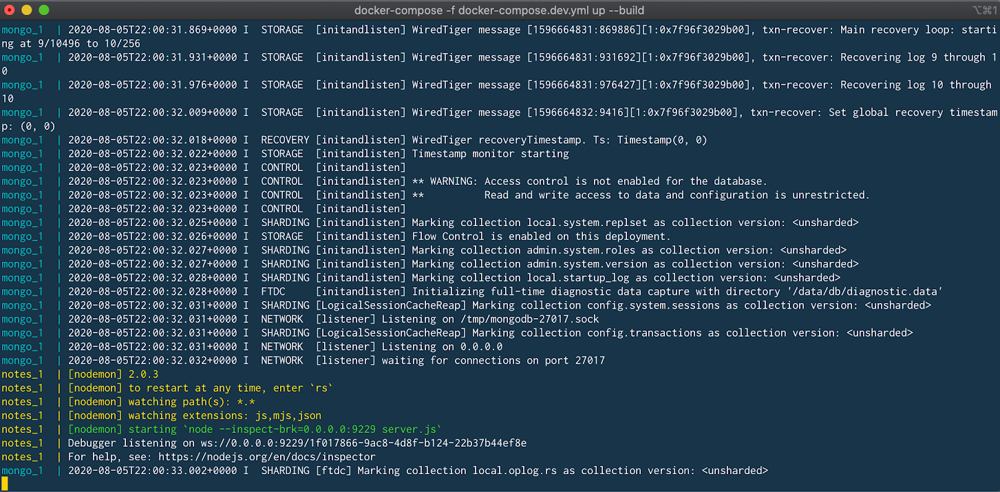



## Prerequisites

Work through the steps to build an image and run it as a containerized application in [Run your image as a container](run-containers.md).

## Introduction

In this module, we’ll walk through setting up a local development environment for the application we built in the previous modules. We’ll use Docker to build our images and Docker Compose to make everything a whole lot easier.

## Local database and containers

First, we’ll take a look at running a database in a container and how we use volumes and networking to persist our data and allow our application to talk with the database. Then we’ll pull everything together into a compose file which will allow us to setup and run a local development environment with one command. Finally, we’ll take a look at connecting a debugger to our application running inside a container.

Instead of downloading MongoDB, installing, configuring and then running the Mongo database as a service, we can use the Docker Official Image for MongoDB and run it in a container.

Before we run MongoDB in a container, we want to create a couple of volumes that Docker can manage to store our persistent data and configuration. Let's use the managed volumes feature that docker provides instead of using bind mounts. For more information, see [Use volumes](../../storage/volumes.md).

Let’s create our volumes now. We’ll create one for the data and one for configuration of MongoDB.

```console
$ docker volume create mongodb
$ docker volume create mongodb_config
```

Now we’ll create a network that our application and database will use to talk with each other. The network is called a user-defined bridge network and gives us a nice DNS lookup service which we can use when creating our connection string.

```console
$ docker network create mongodb
```

Now we can run MongoDB in a container and attach to the volumes and network we created above. Docker will pull the image from Hub and run it for you locally.

```console
$ docker run -it --rm -d -v mongodb:/data/db \
  -v mongodb_config:/data/configdb -p 27017:27017 \
  --network mongodb \
  --name mongodb \
  mongo
```

Okay, now that we have a running MongoDB, let’s update `server.js` to use MongoDB and not an in-memory data store.

```javascript
const ronin 		= require( 'ronin-server' )
const database  = require( 'ronin-database' )
const mocks 		= require( 'ronin-mocks' )

async function main() {

    try {
    await database.connect( process.env.CONNECTIONSTRING )
    
    const server = ronin.server({
            port: process.env.SERVER_PORT
        })

        server.use( '/', mocks.server( server.Router()) )

    const result = await server.start()
        console.info( result )
    
    } catch( error ) {
        console.error( error )
    }
}

main()
```

We’ve added the `ronin-database` module and we updated the code to connect to the database and set the in-memory flag to false. We now need to rebuild our image so it contains our changes.

First let’s add the `ronin-database` module to our application using npm.

```console
$ npm install ronin-database
```

Now we can build our image.

```console
$ docker build --tag node-docker .
```

Now, let’s run our container. But this time we’ll need to set the `CONNECTIONSTRING` environment variable so our application knows what connection string to use to access the database. We’ll do this right in the `docker run` command.

```console
$ docker run \
  -it --rm -d \
  --network mongodb \
  --name rest-server \
  -p 8000:8000 \
  -e CONNECTIONSTRING=mongodb://mongodb:27017/notes \
  node-docker
```

The `notes` at the end of the connection string is the desired name for our database.

Let’s test that our application is connected to the database and is able to add a note.

```console
$ curl --request POST \
  --url http://localhost:8000/notes \
  --header 'content-type: application/json' \
  --data '{"name": "this is a note", "text": "this is a note that I wanted to take while I was working on writing a blog post.", "owner": "peter"}'
```

You should receive the following json back from our service.

```json
{"code":"success","payload":{"_id":"5efd0a1552cd422b59d4f994","name":"this is a note","text":"this is a note that I wanted to take while I was working on writing a blog post.","owner":"peter","createDate":"2020-07-01T22:11:33.256Z"}}
```

## Use Compose to develop locally

In this section, we’ll create a Compose file to start our node-docker and the MongoDB with one command. We’ll also set up the Compose file to start the node-docker in debug mode so that we can connect a debugger to the running node process.

Open the notes-service in your IDE or text editor and create a new file named `docker-compose.dev.yml`. Copy and paste the below commands into the file.

```yaml
version: '3.8'

services:
 notes:
  build:
   context: .
  ports:
   - 8000:8000
   - 9229:9229
  environment:
   - SERVER_PORT=8000
   - CONNECTIONSTRING=mongodb://mongo:27017/notes
  volumes:
   - ./:/app
  command: npm run debug

 mongo:
  image: mongo:4.2.8
  ports:
   - 27017:27017
  volumes:
   - mongodb:/data/db
   - mongodb_config:/data/configdb
volumes:
 mongodb:
 mongodb_config:
```

This Compose file is super convenient as we do not have to type all the parameters to pass to the `docker run` command. We can declaratively do that in the Compose file.

We are exposing `port 9229` so that we can attach a debugger. With `volumes`,  we are also mapping our local source code into the running container so that we can make changes in our text editor and have those changes picked up in the container.

One other really cool feature of using a Compose file is that we have service resolution set up to use the service names. So we are now able to use `“mongo”` in our connection string. The reason we use mongo is because that is what we have named our MongoDB service in the Compose file as.

To start our application in debug mode, we need to add a line to our `package.json` file to tell npm how to start our application in debug mode.

Open the `package.json` file and add the following line to the scripts section:

```json
  "debug": "nodemon --inspect=0.0.0.0:9229 server.js"
```

As you can see, we are going to use nodemon. Nodemon starts our server in debug mode and also watches for files that have changed, and restarts our server. Let’s run the following command in a terminal to install nodemon into our project directory.

```json
$ npm install nodemon
```

Let’s start our application and confirm that it is running properly.

```console
$ docker-compose -f docker-compose.dev.yml up --build
```

We pass the `--build` flag so Docker compiles our image and then starts it.

If all goes well, you should see something similar:

  {:width="800px"}

Now let’s test our API endpoint. Run the following curl command:

```console
$ curl --request GET --url http://localhost:8000/notes
```

You should receive the following response:

```json
{"code":"success","meta":{"total":0,"count":0},"payload":[]}
```

## Connect a debugger

We’ll use the debugger that comes with the Chrome browser. Open Chrome on your machine and then type the following into the address bar.

`about:inspect`

It opens the following screen.

  {:width="800px"}

Click the **Open dedicated DevTools for Node** link. This opens the DevTools that are connected to the running Node.js process inside our container.

Let’s change the source code and then set a breakpoint.

Add the following code above the existing `server.use()` statement, and save the file. Make sure that the `return` statement is on a line of its own, as shown here, so you can set the breakpoint appropriately.

```js
 server.use( '/foo', (req, res) => {
   return res.json({ "foo": "bar" })
 })
```

If you take a look at the terminal where our Compose application is running, you’ll see that nodemon noticed the changes and reloaded our application.

 {:width="800px"}

Navigate back to the Chrome DevTools and set a breakpoint on the line containing the `return res.json({ "foo": "bar" })` statement, and then run the following curl command to trigger the breakpoint.

```console
$ curl --request GET --url http://localhost:8000/foo
```

You should have seen the code stop at the breakpoint and now you are able to use the debugger just like you would normally. You can inspect and watch variables, set conditional breakpoints, view stack traces, etc.

## Next steps

In this module, we took a look at creating a general development image that we can use pretty much like our normal command line. We also set up our Compose file to map our source code into the running container and exposed the debugging port.

In the next module, we’ll take a look at how to run unit tests in Docker. See:

[Run your tests](run-tests.md){: .button .primary-btn}

## Feedback

Help us improve this topic by providing your feedback. Let us know what you think by creating an issue in the [Docker Docs]({{ site.repo }}/issues/new?title=[Node.js%20docs%20feedback]){:target="_blank" rel="noopener" class="_"} GitHub repository. Alternatively, [create a PR]({{ site.repo }}/pulls){:target="_blank" rel="noopener" class="_"} to suggest updates.
