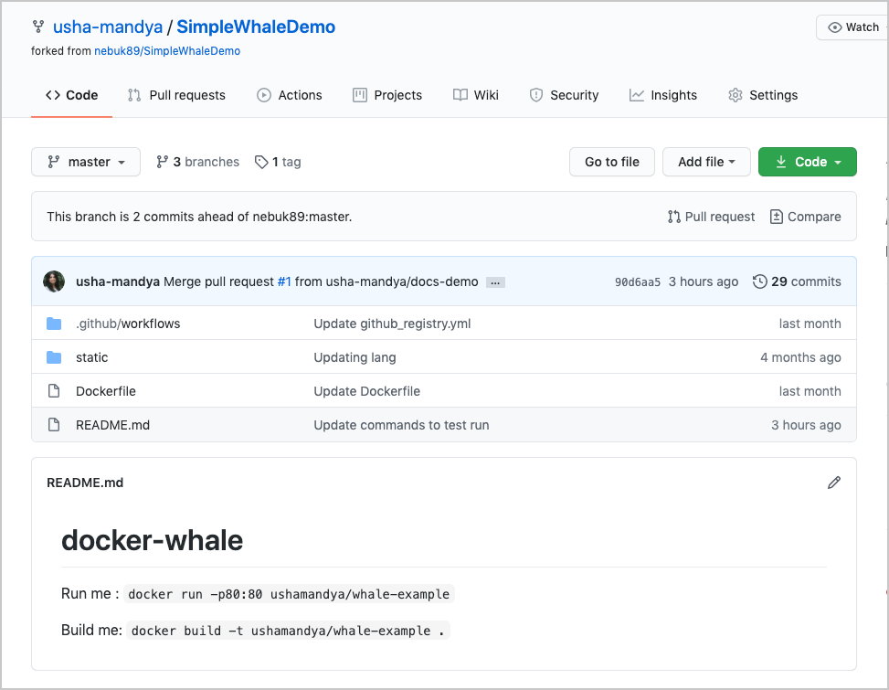
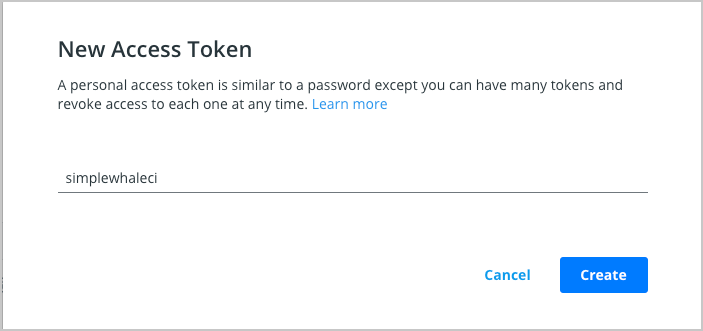
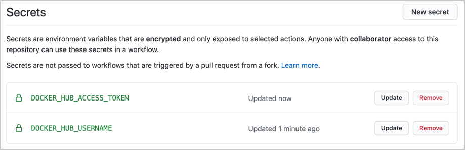
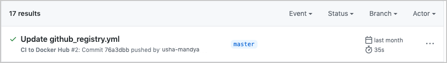
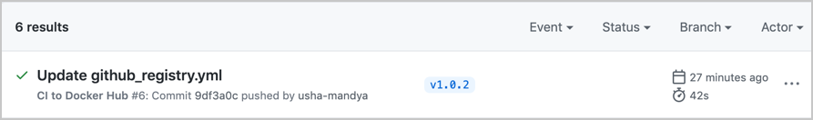
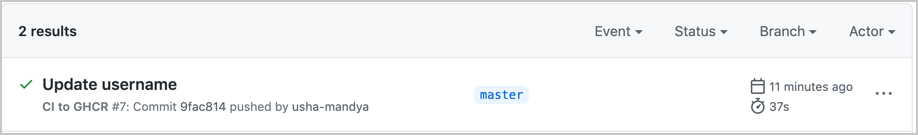



This page guides you through the process of setting up a GitHub Action CI/CD pipeline with Docker containers. Before setting up a new pipeline, we recommend that you take a look at [Ben's blog](https://www.docker.com/blog/best-practices-for-using-docker-hub-for-ci-cd/){:target="_blank" rel="noopener" class="_"} on CI/CD best practices.

This guide contains instructions on how to:

1. Use a sample Docker project as an example to configure GitHub Actions
2. Set up the GitHub Actions workflow
3. Optimize your workflow to reduce the number of pull requests and the total build time, and finally,
4. Push only specific versions to Docker Hub.

## Set up a Docker project

Let’s get started. This guide uses a simple Docker project as an example. The [SimpleWhaleDemo](https://github.com/usha-mandya/SimpleWhaleDemo){:target="_blank" rel="noopener" class="_"} repository contains an Nginx alpine image. You can either clone this repository, or use your own Docker project.

{:width="500px"}

Before we start, ensure you can access [Docker Hub](https://hub.docker.com/) from any workflows you create. To do this:

1. Add your Docker ID as a secret to GitHub. Navigate to your GitHub repository and click **Settings** > **Secrets** > **New secret**.

2. Create a new secret with the name `DOCKER_HUB_USERNAME` and your Docker ID as value.

3. Create a new Personal Access Token (PAT). To create a new token, go to [Docker Hub Settings](https://hub.docker.com/settings/security) and then click **New Access Token**.

4. Let’s call this token **simplewhaleci**.

    {:width="500px"}

5. Now, add this Personal Access Token (PAT) as a second secret into the GitHub secrets UI with the name `DOCKER_HUB_ACCESS_TOKEN`.

    {:width="500px"}

## Set up the GitHub Actions workflow

In the previous section, we created a PAT and added it to GitHub to ensure we can access Docker Hub from any workflow. Now, let’s set up our GitHub Actions workflow to build and store our images in Hub. We can achieve this by creating two Docker actions:

1. The first action enables us to log in to Docker Hub using the secrets we stored in the GitHub Repository.
2. The second one is the build and push action.

In this example, let us set the push flag to `true` as we also want to push. We’ll then add a tag to specify to always go to the latest version. Lastly, we’ll echo the image digest to see what was pushed.

To set up the workflow:

1. Go to your repository in GitHub and then click **Actions** > **New workflow**.
2. Click **set up a workflow yourself** and add the following content:

First, we will name this workflow:

```yaml
name: CI to Docker Hub
 ```

Then, we will choose when we run this workflow. In our example, we are going to do it for every push against the master branch of our project:

```yaml
on:
  push:
    branches: [ master ]
```

> **Note**
>
> The branch name may be `main` or `master`. Verify the name of the branch for your repository and update the configuration accordingly.

Now, we need to specify what we actually want to happen within our action (what jobs), we are going to add our build one and select that it runs on the latest Ubuntu instances available:

```yaml
jobs:

  build:
    runs-on: ubuntu-latest
```

Now, we can add the steps required. The first one checks-out our repository under `$GITHUB_WORKSPACE`, so our workflow can access it. The second is to use our PAT and username to log into Docker Hub. The third is the Builder, the action  uses BuildKit under the hood through a simple Buildx action which we will also setup


```yaml
    steps:

      - name: Check Out Repo 
        uses: actions/checkout@v2

      - name: Login to Docker Hub
        uses: docker/login-action@v1
        with:
          username: ${{ secrets.DOCKER_HUB_USERNAME }}
          password: ${{ secrets.DOCKER_HUB_ACCESS_TOKEN }}

      - name: Set up Docker Buildx
        id: buildx
        uses: docker/setup-buildx-action@v1

      - name: Build and push
        id: docker_build
        uses: docker/build-push-action@v2
        with:
          context: ./
          file: ./Dockerfile
          push: true
          tags: ${{ secrets.DOCKER_HUB_USERNAME }}/simplewhale:latest

      - name: Image digest
        run: echo ${{ steps.docker_build.outputs.digest }}
```


Now, let the workflow run for the first time and then tweak the Dockerfile to make sure the CI is running and pushing the new image changes:

{:width="500px"}

## Optimizing the workflow

Next, let’s look at how we can optimize the GitHub Actions workflow through build cache. This has two main advantages:

1. Build cache reduces the build time as it will not have to re-download all of the images, and
2. It also reduces the number of pulls we complete against Docker Hub. We need to make use of GitHub cache to make use of this.

Let us set up a Builder with a build cache. First, we need to set up cache for the builder.  In this example, let us add the path and keys to store this under using GitHub cache for this.


```yaml

      - name: Cache Docker layers
        uses: actions/cache@v2
        with:
          path: /tmp/.buildx-cache
          key: ${{ runner.os }}-buildx-${{ github.sha }}
          restore-keys: |
            ${{ runner.os }}-buildx-
```


And lastly, after adding the builder and build cache snippets to the top of the Actions file, we need to add some extra attributes to the build and push step. This involves:

 - Setting up the builder to use the output of the buildx step, and then
 - Using the cache we set up earlier for it to store to and to retrieve


```yaml
      - name: Login to Docker Hub
        uses: docker/login-action@v1
        with:
          username: ${{ secrets.DOCKER_HUB_USERNAME }}
          password: ${{ secrets.DOCKER_HUB_ACCESS_TOKEN }}
      - name: Build and push
        id: docker_build
        uses: docker/build-push-action@v2
        with:
          context: ./
          file: ./Dockerfile
          builder: ${{ steps.buildx.outputs.name }}
          push: true
          tags:  ${{ secrets.DOCKER_HUB_USERNAME }}/simplewhale:latest
          cache-from: type=local,src=/tmp/.buildx-cache
          cache-to: type=local,dest=/tmp/.buildx-cache
      - name: Image digest
        run: echo ${{ steps.docker_build.outputs.digest }}
```


Now, run the workflow again and verify that it uses the build cache.

## Push tagged versions to Docker Hub

Earlier, we learnt how to set up a GitHub Actions workflow to a  Docker project, how to optimize the workflow by setting up a builder with build cache. Let’s now look at how we can improve it further. We can do this by adding the ability to have tagged versions behave differently to all commits to master. This means, only specific versions are pushed, instead of every commit updating the latest version on Docker Hub.

You can consider this approach to have your commits go to a local registry to then use in nightly tests. By doing this, you can always test what is latest while reserving your tagged versions for release to Docker Hub.

This involves two steps:

1. Modifying the GitHub workflow to only push commits with specific tags to Docker Hub
2. Setting up a GitHub Actions file to store the latest commit as an image in the GitHub registry

First, let us modify our existing GitHub workflow to only push to Hub if there’s a particular tag. For example:


```yaml
on:
  push:
    tags:
      - "v*.*.*"
```


This ensures that the main CI will only trigger if we tag our commits with `Vn.n.n.` Let’s test this. For example, run the following command:

```console
$ git tag -a v1.0.2
$ git push origin v1.0.2
```

Now, go to GitHub and check your Actions

{:width="500px"}

Now, let’s set up a second GitHub action file to store our latest commit as an image in the GitHub registry. You may want to do this to:

1. Run your nightly tests or recurring tests, or
2. To share work in progress images with colleagues.

Let’s clone our previous GitHub action and add back in our previous logic for all pushes. This will mean we have two workflow files, our previous one and our new one we will now work on.
Next, change your Docker Hub login to a GitHub container registry login:


```yaml
        if: github.event_name != 'pull_request'
        uses: docker/login-action@v1
        with:
          registry: ghcr.io
          username: ${{ github.actor }}
          password: ${{ secrets.GITHUB_TOKEN }}
```


To authenticate against the [GitHub Container Registry](https://docs.github.com/en/packages/working-with-a-github-packages-registry/working-with-the-container-registry), use the [`GITHUB_TOKEN`](https://docs.github.com/en/actions/reference/authentication-in-a-workflow) for the best security and experience.

You may need to [manage write and read access of GitHub Actions](https://docs.github.com/en/packages/managing-github-packages-using-github-actions-workflows/publishing-and-installing-a-package-with-github-actions#upgrading-a-workflow-that-accesses-ghcrio) for repositories in the container settings.

You can also use a [personal access token (PAT)](https://docs.github.com/en/github/authenticating-to-github/creating-a-personal-access-token) with the [appropriate scopes](https://docs.github.com/en/packages/getting-started-with-github-container-registry/migrating-to-github-container-registry-for-docker-images#authenticating-with-the-container-registry).
Remember to change how the image is tagged. The following example keeps ‘latest’ as the only tag. However, you can add any logic to this if you prefer:


```yaml
  tags: ghcr.io/${{ github.repository_owner }}/simplewhale:latest
```


{:width="500px"}

Now, we will have two different flows: one for our changes to master, and one for our pull requests. Next, we need to modify what we had before to ensure we are pushing our PRs to the GitHub registry rather than to Docker Hub.

## Next steps

In this module, you have learnt how to set up GitHub Actions workflow to an existing Docker project, optimize your workflow to improve build times and reduce the number of pull requests, and finally, we learnt how to push only specific versions to Docker Hub. You can also set up nightly tests against the latest tag, test each PR, or do something more elegant with the tags we are using and make use of the Git tag for the same tag in our image.

You can also consider deploying your application. For detailed instructions, see:

[Deploy your app](deploy.md){: .button .primary-btn}

## Feedback

Help us improve this topic by providing your feedback. Let us know what you think by creating an issue in the [Docker Docs]({{ site.repo }}/issues/new?title=[Python%20docs%20feedback]){:target="_blank" rel="noopener" class="_"} GitHub repository. Alternatively, [create a PR]({{ site.repo }}/pulls){:target="_blank" rel="noopener" class="_"} to suggest updates.
