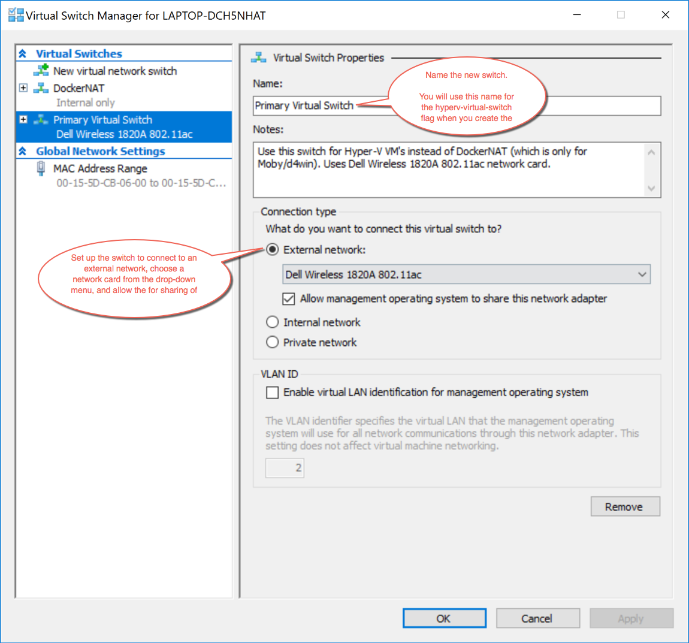

Creates a Boot2Docker virtual machine locally on your Windows machine
using Hyper-V.

Hyper-V must be enabled on your desktop system. Docker Desktop for Windows automatically
enables it upon install. See this article on the Microsoft developer network for instructions on
[how to manually enable
Hyper-V](https://msdn.microsoft.com/en-us/virtualization/hyperv_on_windows/quick_start/walkthrough_install).

> **Notes**:
>
> * You must use an Administrator level account to create and manage Hyper-V machines.
>
>* You need an existing virtual switch to use the
> driver. Hyper-V can share an external network interface (also known as
> bridging). See [this blog](http://blogs.technet.com/b/canitpro/archive/2014/03/11/step-by-step-enabling-hyper-v-for-use-on-windows-8-1.aspx) to learn more.
> If you would like to use NAT, create an internal network, and use
> [Internet Connection Sharing](http://www.packet6.com/allowing-windows-8-1-hyper-v-vm-to-work-with-wifi/).
>
> * This reference page includes an [example](hyper-v.md#example) showing you how to use an elevated (Administrator-level) PowerShell and create and use an external network switch.

## Usage

    $ docker-machine create --driver hyperv vm

## Options

-   `--hyperv-boot2docker-url`: The URL of the boot2docker ISO.
-   `--hyperv-virtual-switch`: Name of the virtual switch to use.
-   `--hyperv-disk-size`: Size of disk for the host in MB.
-   `--hyperv-memory`: Size of memory for the host in MB.
-   `--hyperv-cpu-count`: Number of CPUs for the host.
-   `--hyperv-static-macaddress`: Hyper-V network adapter's static MAC address.
-   `--hyperv-vlan-id`: Hyper-V network adapter's VLAN ID if any.
-   `--hyperv-disable-dynamic-memory`: Disable dynamic memory management.

## Environment variables and default values

| CLI option                        | Environment variable            | Default                  |
| --------------------------------- | ------------------------------- | ------------------------ |
| `--hyperv-boot2docker-url`        | `HYPERV_BOOT2DOCKER_URL`        | _Latest boot2docker url_ |
| `--hyperv-cpu-count`              | `HYPERV_CPU_COUNT`              | `1`                      |
| `--hyperv-disk-size`              | `HYPERV_DISK_SIZE`              | `20000`                  |
| `--hyperv-memory`                 | `HYPERV_MEMORY`                 | `1024`                   |
| `--hyperv-static-macaddress`      | `HYPERV_STATIC_MACADDRESS`      | _undefined_              |
| `--hyperv-virtual-switch`         | `HYPERV_VIRTUAL_SWITCH`         | _first found_            |
| `--hyperv-vlan-id`                | `HYPERV_VLAN_ID`                | _undefined_              |
| `--hyperv-disable-dynamic-memory` | `HYPERV_DISABLE_DYNAMIC_MEMORY` | `false`                  |

## Example:

#### 1. Make sure Hyper-V is enabled.

Hyper-V is automatically enabled on a Docker Desktop for Windows installation. To enable it manually, see [instructions on how to manually enable Hyper-V](https://msdn.microsoft.com/en-us/virtualization/hyperv_on_windows/quick_start/walkthrough_install) on the Microsoft developer network.

#### 2. Set up a new external network switch (Optional)

> **Note**: If you already have an external network switch, skip this setup and use that one instead.

Make sure you have Ethernet connectivity while you are doing this.

Open the **Hyper-V Manager**. (On Windows 10, search for the Hyper-V Manager in the lower left search field.)

Select the **Virtual Switch Manager** on the right-hand **Actions** panel.


Set up a new **external network switch** to use instead of DockerNAT network switch (for Moby), which is set up by default when you install Docker Desktop for Windows. If you already have another network switch set up, use that one instead but make sure it is an **external** switch.)

For this example, we created a virtual switch called `Primary Virtual Switch`.



#### 3. Reboot

See this issue on virtualbox: [Hangs on Waiting for VM to start #986](https://github.com/docker/machine/issues/986).

Reboot your desktop system to clear out any routing table problems. Without a reboot first, `docker-machine create ...` might get hung up on `Waiting for host to start...`. If you are still hung on "Waiting for host to start..." after you reboot, make sure you selected the correct network in the Virtual Switch Manager.

#### 4. Create the nodes with Docker Machine and the Microsoft Hyper-V driver

* Start an "elevated" PowerShell with administrator privileges. To do this, search for PowerShell, then right click and choose ***Run as administrator***.

* Run the `docker-machine create` commands to create machines.

    For example, if you follow along with the [Swarm mode tutorial](../../engine/swarm/swarm-tutorial/index.md)
    which asks you to create [three networked host machines](../../engine/swarm/swarm-tutorial/index.md#three-networked-host-machines),
    you can create these swarm nodes: `manager1`, `worker1`, `worker2`.

*   Use the Microsoft Hyper-V driver and reference the new virtual switch you created.

    ```shell
    docker-machine create -d hyperv --hyperv-virtual-switch <NameOfVirtualSwitch> <nameOfNode>
    ```

    Here is an example of creating a `manager1` node:

    ```shell
    PS C:\WINDOWS\system32>  docker-machine create -d hyperv --hyperv-virtual-switch "Primary Virtual Switch" manager1
    Running pre-create checks...
    Creating machine...
    (manager1) Copying C:\Users\<your_username>\.docker\machine\cache\boot2docker.iso to C:\Users\<your_username>\.docker\machine\machines\manag
    er1\boot2docker.iso...
    (manager1) Creating SSH key...
    (manager1) Creating VM...
    (manager1) Using switch "Primary Virtual Switch"
    (manager1) Creating VHD
    (manager1) Starting VM...
    (manager1) Waiting for host to start...
    Waiting for machine to be running, this may take a few minutes...
    Detecting operating system of created instance...
    Waiting for SSH to be available...
    Detecting the provisioner...
    Provisioning with boot2docker...
    Copying certs to the local machine directory...
    Copying certs to the remote machine...
    Setting Docker configuration on the remote daemon...
    Checking connection to Docker...
    Docker is up and running!
    To see how to connect your Docker Client to the Docker Engine running on this virtual machine, run: C:\Program Files\Doc
    ker\Docker\Resources\bin\docker-machine.exe env manager1
    PS C:\WINDOWS\system32>
    ```
*   Use the same process, driver, and network switch to create the other nodes.

    For our example, the commands are:

    ```shell
    docker-machine create -d hyperv --hyperv-virtual-switch "Primary Virtual Switch" worker1
    docker-machine create -d hyperv --hyperv-virtual-switch "Primary Virtual Switch" worker2
    ```

## Where to go next

As a point of interest, the virtual machines you create with
[`docker-machine create`](../reference/create.md) show up in the
Hyper-V Manager under "Virtual Machines", but you need to manage them with
[`docker-machine`](../reference/index.md) commands and not through the Hyper-V
Manager.

To get started using `docker-machine` commands, see these topics:

*  [Run containers and experiment with Machine commands](../get-started.md#run-containers-and-experiment-with-machine-commands) and the introductory topics that follow

* [Docker Machine commmand line reference](../reference/index.md)
