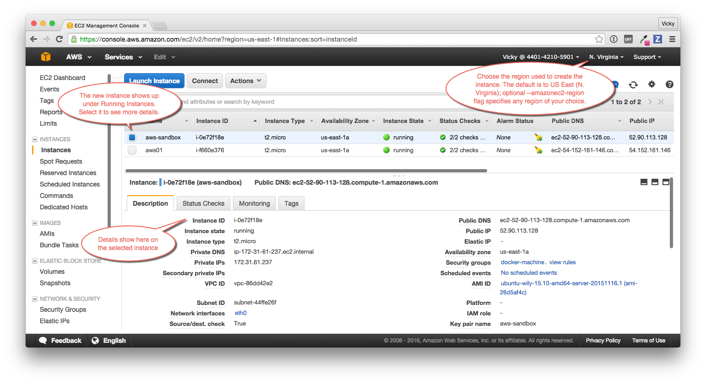

Follow along with this example to create a Dockerized [Amazon Web Services (AWS)](https://aws.amazon.com/) EC2 instance.

### Step 1. Sign up for AWS and configure credentials

1.  If you are not already an AWS user, sign up for [AWS](https://aws.amazon.com/) to create an account and get root access to EC2 cloud computers.

    If you have an Amazon account, you can use it as your root user account.

2.  Create an IAM (Identity and Access Management) administrator user, an admin group, and a key pair associated with a region.

    From the AWS menus, select **Services** > **IAM** to get started.

    To create machines on AWS, you must supply two parameters:

    * an AWS Access Key ID

    * an AWS Secret Access Key

    See the AWS documentation on [Setting Up with Amazon EC2](http://docs.aws.amazon.com/AWSEC2/latest/UserGuide/get-set-up-for-amazon-ec2.html). Follow the steps for "Create an IAM User" and "Create a Key Pair".

### Step 2. Use Machine to create the instance

1.  Optionally, create an AWS credential file.

    You can create an `~/.aws/credentials` file to hold your AWS keys so that
    you don't need to type them every time you run the `docker-machine create`
    command. Here is an example of a credentials file.

    ```conf
    [default]
    aws_access_key_id = AKID1234567890
    aws_secret_access_key = MY-SECRET-KEY
    ```

2.  Run `docker-machine create` with the `amazonec2` driver, credentials, inbound
    port, region, and a name for the new instance. For example:

    ```bash
    docker-machine create --driver amazonec2 --amazonec2-open-port 8000 --amazonec2-region us-west-1 aws-sandbox
    ```

    > **Note**: For all aws create flags, run: `docker-machine create --driver amazonec2 --help`

    **Use aws credentials file**

    If you set your keys in a credentials file, the command looks like this to
    create an instance called `aws-sandbox`:

    ```bash
    docker-machine create --driver amazonec2 aws-sandbox
    ```

    **Specify keys at the command line**

    If you don't have a credentials file, you can use the flags
    `--amazonec2-access-key` and `--amazonec2-secret-key` on the command line:

    ```bash
    docker-machine create --driver amazonec2 --amazonec2-access-key AKI******* --amazonec2-secret-key 8T93C*******  aws-sandbox
    ```

    **Expose a port**

    To expose an inbound port to the new machine, use the flag, `--amazonec2-open-port`:

    ```bash
    docker-machine create --driver amazonec2 --amazonec2-open-port 8000 aws-sandbox
    ```

    **Specify a region**

    By default, the driver creates new instances in region us-east-1 (North
    Virginia). You can specify a different region by using the
    `--amazonec2-region` flag. For example, create aws-sandbox in us-west-1
    (Northern California).

    ```bash
    docker-machine create --driver amazonec2 --amazonec2-region us-west-1 aws-sandbox
    ```

3.  Go to the AWS EC2 Dashboard to view the new instance.

    Log into AWS with your IAM credentials, and navigate to your EC2 Running Instances.

    

    > **Note**: To ensure that you see your new instance, select your region from
    > the menu in the upper right. If you did not specify a region as part of
    > `docker-machine create` (with the optional `--amazonec2-region` flag), select
    > the default, US East (N. Virginia).

4.  Ensure that your new machine is the active host.

    ```bash
    $ docker-machine ls
    NAME             ACTIVE   DRIVER         STATE     URL                         SWARM   DOCKER        ERRORS
    aws-sandbox      *        amazonec2      Running   tcp://52.90.113.128:2376            v1.10.0
    default          -        virtualbox     Running   tcp://192.168.99.100:2376           v1.10.0-rc4
    digi-sandbox       -      digitalocean   Running   tcp://104.131.43.236:2376           v1.9.1
    ```

    The new `aws-sandbox` instance is running and is the active host as
    indicated by the asterisk (\*). When you create a new machine, your command
    shell automatically connects to it. You can also check active status by
    running `docker-machine active`.

    > **Note**: If your new machine is not the active host, connect to it by
    running `docker-machine env aws-sandbox` and the returned eval command:
    `eval $(docker-machine env aws-sandbox)`.

5. Inspect the remote host. For example, `docker-machine ip <machine>` returns
the host IP address and `docker-machine inspect <machine>` lists all the
details.

    ```bash
    $ docker-machine ip aws-sandbox
    192.168.99.100

    $ docker-machine inspect aws-sandbox
    {
        "ConfigVersion": 3,
        "Driver": {
            "IPAddress": "52.90.113.128",
            "MachineName": "aws-sandbox",
            "SSHUser": "ubuntu",
            "SSHPort": 22,
            ...
          }
    }
    ```

### Step 3. Run Docker commands on the new instance
You can run docker commands from a local terminal to the active docker machine.

1.  Run docker on the active docker machine by downloading and running the
hello-world image:

    ```bash
    docker run hello-world
    ```

2. Ensure that you ran hello-world on aws-sandbox (and not localhost or some
other machine):

    Log on to aws-sandbox with ssh and list all containers. You should see
    hello-world (with a recent exited status):

    ```bash
    docker-machine ssh aws-sandbox
    sudo docker container ls -a
    exit
    ```

    Log off aws-sandbox and unset this machine as active. Then list images
    again. You should not see hello-world (at least not with the same exited
    status):

    ```bash
    eval $(docker-machine env -u)
    docker container ls -a
    ```

3. Reset aws-sandbox as the active docker machine:

    ```bash
    eval $(docker-machine env aws-sandbox)
    ```

    For a more interesting test, run a Dockerized webserver on your new machine.

    > **Note**: In this example, we use port `8000` which we added to the
    > docker-machine AWS Security Group during `docker-machine create`. To run your
    > container on another port, update the security group to reflect that.

    In this example, the `-p` option is used to expose port 80 from the `nginx`
    container and make it accessible on port `8000` of the `aws-sandbox` host:

    ```bash
    $ docker run -d -p 8000:80 --name webserver kitematic/hello-world-nginx
    Unable to find image 'kitematic/hello-world-nginx:latest' locally
    latest: Pulling from kitematic/hello-world-nginx
    a285d7f063ea: Pull complete
    2d7baf27389b: Pull complete
    ...
    Digest: sha256:ec0ca6dcb034916784c988b4f2432716e2e92b995ac606e080c7a54b52b87066
    Status: Downloaded newer image for kitematic/hello-world-nginx:latest
    942dfb4a0eaae75bf26c9785ade4ff47ceb2ec2a152be82b9d7960e8b5777e65
    ```

    In a web browser, go to `http://<host_ip>:8000` to bring up the webserver
    home page. You got the `<host_ip>` from the output of the `docker-machine ip <machine>`
    command you ran in a previous step. Use the port you exposed in the
    `docker run` command.

    

### Step 4. Use Machine to remove the instance

To remove an instance and all of its containers and images, first stop the
machine, then use `docker-machine rm`.

## Where to go next

-   [Understand Machine concepts](../concepts.md)
-   [Docker Machine driver reference](../drivers/index.md)
-   [Docker Machine subcommand reference](../reference/index.md)
-   [Provision a Docker Swarm cluster with Docker Machine](../../swarm/provision-with-machine.md)
