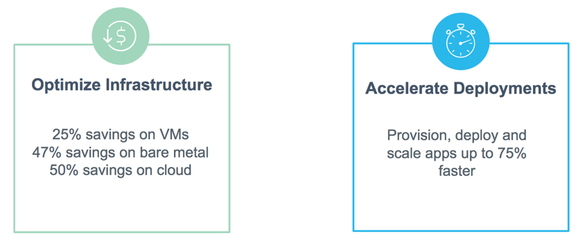
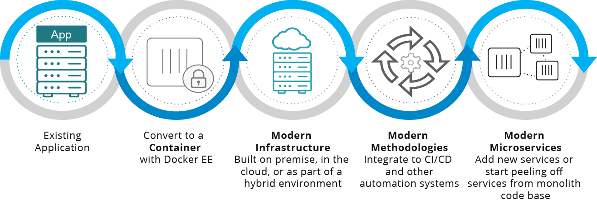

Using Docker to containerize traditional applications and migrate to the Docker
platform can help enterprises make existing apps more secure, efficient, and
readily portable to hybrid cloud infrastructures.

## Overview

Here, we identify the biggest problems with traditional applications, and show
how containerizing apps and infrastructure solves these problems. We describe in
general terms the process for Dockerizing an application, and how the resulting
Docker app behaves in deployment. We will include links out to available
runbooks for common app and infrastructure stacks as these come online, along
with best practices.

Ultimately, we encourage you to check out the Docker Modernize Traditional
Applications (MTA) program. With the MTA program, you get automated tooling and
support for converting large scale apps and infrastructure stacks to run on
[Docker Enterprise Edition](https://www.docker.com/enterprise-edition){: target="_blank"
class="_"}. Check out the [blog post introducing the Docker MTA program
here](https://blog.docker.com/2017/04/modernizing-traditional-apps-with-docker/){:
target="_blank" class="_"} to learn more.

Ready to learn more? Let's get started.

## The problem with traditional apps

IT organizations often spend 80% of their budget maintaining existing
applications and only 20% on new innovation.

Traditional apps can be any age and use any technology stack, but have some
common traits and impacts that make them expensive and time-consuming to
maintain. Typically, these include:

- No automated deployment proceses, so new releases require a lot of manual work such as copying files, updating configurations and running installers

- No test suites, so testing for regressions and validating features is manual

- Difficult to administer between deployments, needing custom logging,  management tools, and manual processes

- Frameworks, dependencies, and load balancing are complex, and VMs are  underutilized

- Lead to increasingly fragmented infrastructure landscapes with x86 servers,
mainframes, and multiple private and public clouds to manage. This puts pressure
on IT budgets, and makes it even harder to focus on innovation.

## How Docker solves the problem

Docker gives you a way to develop, package, deploy, and manage both Linux and
Windows based apps as standardized units called
[containers]([image](glossary.md?term=container)). The runtime version of a
container is called a Docker [image](glossary.md?term=image).

A container image is a lightweight, portable, executable package of software
that includes everything needed to run it: code, runtime, system tools, system
libraries, settings. Some apps might run as a single container image, others can
be distributed as microservices across multiple orchestrated containers.

Moving a traditional app to Docker gives it the powers needed thrive in the
modern landscape.

* Containerized software always runs the same, regardless of the environment.
Containerized apps are isolated from any differences between, for example,
development, staging, cloud, or data center environments.

* Containers use less resources and infrastructure than VMs.

* The Docker platform gives you the ability to add increased security, and
automate builds, testing, and deployment.

* Application stacks can run as clusters of distributed services, with load
balancing, orchestration, health monitoring, and ability to scale.

Traditional apps don't have to limit your capabilities. You can move forward on
innovation goals, and bring modern behavior to your existing apps without
changing a single line of code.

- Efficient (optimize capital expenMTAses and operating costs, reduce the
  size of infrastructure by 77%)

- Portable (infrastructure for portability and independent apps,
  deployment frequency increases 13x or more)

- Secure (reduce risk and enforce new controls, mean time to repair
  for patching is 99% faster)

Try the [Docker ROI Calculator](https://www.docker.com/roicalculator){:
target="_blank" class="_"} to estimate how much you can consolidate existing
workloads, and how much you can save by moving to Docker.

## Certified application and infrastructure stacks

As a part of Docker EE, Docker will provide certified containers and application
stacks for commonly used enterprise workloads.

Examples of available architectures for application stacks are:

- Microsoft .NET web apps
- Oracle
- IBM
- SAP

MTA Runbooks will be available for these infrastructure stacks and more:

- HPE
- Alibaba
- Azure \ AzureStack
- IBM
- Oracle
- Cisco
- Google Cloud Platform (GCP)
- AWS

## Steps to Dockerize an application

(Source for this is [Learn More](https://goto.docker.com/modernize.html?aliId=115713062){: target="_blank" class="_"} on how
to modernize apps with Docker EE from website and [MTA Solution
Brief](https://goto.docker.com/rs/929-FJL-178/images/SB_MTA_04.14.2017.pdf){:
target="_blank" class="_"}.)

Modernizing traditional apps can be approached in logical steps to gain
efficiencies and benefits at every step.

The migration process consists of these high-level steps:

1.  Package the application into a container, and validate the it.

2.  Decide where to deploy the application (for example, migrate to cloud
  or server refresh).

3.  Deploy and confirm.

4.  Integrate the container into automated builds, integration testing, and
auto-deployment to further optimize and save time.

5.  Consider splicing and reconfiguring the Dockerized app code into
microservices, or add new services to the existing container.

### Choose an infrastructure

Decide where you want to deploy, for example on in-house servers, data center, or cloud provider.

### Get Docker

Docker install platforms and overview is [here](http://docs.docker.com/engine/installation/).

### Set up your Docker Enterprise Edition (EE) with cloud templates

1.  Docker EE 30-day trial is [here](https://store.docker.com/editions/enterprise/docker-ee-trial?tab=description).

2.  Launch Docker EE

    - [Launch Docker EE on AWS](https://aws.amazon.com/marketplace/pp/B06XCFDF9K)

    - [Launch Docker EE on Azure](https://azuremarketplace.microsoft.com/en-us/marketplace/apps/docker.dockerdatacenter?tab=Overview)

    - Install [Docker for Mac](https://aws.amazon.com/marketplace/pp/B06XCFDF9K) or [Docker for Windows](https://docs.docker.com/docker-for-windows/install/)

### Port the application

1.  Select a.NET IIS for Windows Server or LAMP stack, Java or Tomcat for Linux. (It’s best to start with a single server app.)

2.  Run the appropriate Image2Docker tool for Windows Server or Linux to convert the existing app into a [Dockerfile](https://docs.docker.com/engine/reference/builder/).

    - Download [Image2Docker for Windows Server](https://github.com/docker/communitytools-image2docker-win)

    - Download [Image2Docker for Linux Server](https://github.com/docker/communitytools-image2docker-linux)

3.  Follow the instructions to build the image and run locally. Push the image to your Docker Trusted Registry.

4.  Build the image locally and push to your Docker Trusted Registry with Security Scanning activated.

### Run your app as a containerized service

Launch the app with either a [`docker run`](/engine/reference/commandline/run.md), [`docker-compose up`](/compose/reference/up.md), or [`docker stack deploy`](/engine/reference/commandline/stack_deploy.md) command.

## Certified application and infrastructure stacks

Docker will provide certified Docker EE containers and application stacks for
commonly used enterprise workloads.

Examples of available architectures for application stacks are:

- Microsoft .NET web apps
- Oracle
- IBM
- SAP

Examples of infrastructure stacks are given in [Choose an infrastructure](choose-an-infrastructure).

## Where to go next

* [Elton's .NET video series starts here](https://youtu.be/gaJ9PzihAYw){: target="_blank" class="_"}.

* [MTA blog posts](https://blog.docker.com/search/MTA){: target="_blank" class="_"}

* [Get MTA Kit and learn more](https://goto.docker.com/MTAkit.html){: target="_blank" class="_"}

* [Stack migration guides](/mta/stack-guides.md)

* [Reference architectures and best practices](arch-best-practices.md)

* [Modernizing .NET apps for IT Pros (video)](https://www.youtube.com/watch?v=gaJ9PzihAYw){: target="_blank" class="_"}

* [MTA labs for Windows developers](https://github.com/docker/labs/blob/master/windows/modernize-traditional-apps/README.md){: target="_blank" class="_"}
