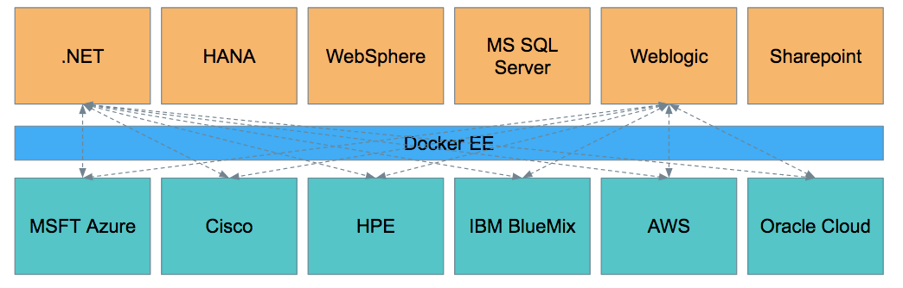

## Stack migration guides

Docker MTA stacks consist of Dockerized application stacks and infrastructure stacks, brokered by Docker EE.

All application stacks are interoperable with all infrastructure stacks.

## Blueprints for building common stacks

TBD

## Certified stacks

<table>
<tr>
<th>Component </th>
<th>Microsoft </th>
<th>IBM </th>
<th>SAP </th>
<th>Oracle </th>
<th>Cisco</th>
<th>HPE </th>
<th>AWS </th>
</tr>
<tr>
<td>Stack </td>
<td>.NET  SQL … </td>
<td> Websphere DB2  API server</td>
<td>HANA Hybris </td>
<td>Weblogic Oracle DB Coherence </td>
<td> </td>
<td> </td>
<td> </td>
</tr>
<tr>
<td>Containers </td>
<td>System Center </td>
<td> </td>
<td> </td>
<td> </td>
<td> </td>
<td>Ops agent </td>
<td> </td>
</tr>
<tr>
<td>Plugins </td>
<td>CloudStor </td>
<td> </td>
<td> </td>
<td> </td>
<td>Contiv </td>
<td>3PAR </td>
<td>EBS, EFS (rexray)</td>
</tr>
<tr>
<td>Infrastructure </td>
<td>Azure Edition </td>
<td>IBM Cloud
Edition </td>
<td>SAP Cloud </td>
<td>Oracle Cloud </td>
<td>CVD </td>
<td>Reference Architecture </td>
<td>AWS Edition</td>
</tr>

</table>
