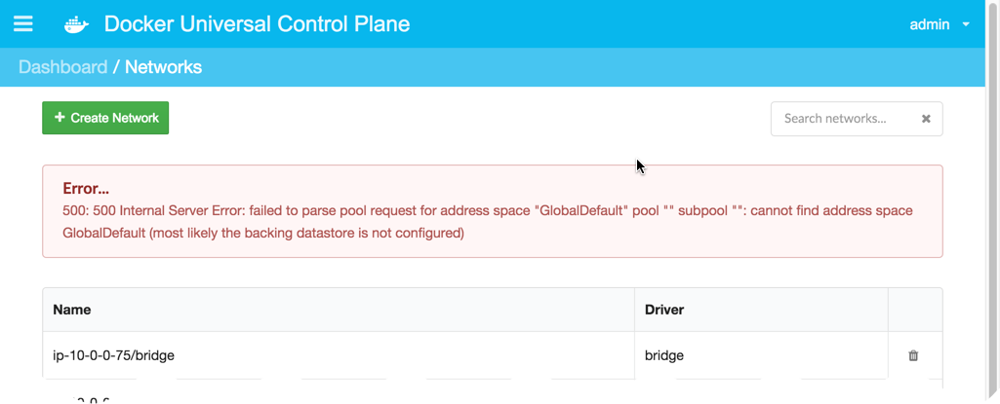

<!--[metadata]>
+++
title ="Set up container networking"
description="Docker Universal Control Plane"
[menu.main]
parent="mn_ucp"
+++
<![end-metadata]-->

# Set up container networking with UCP

Beginning in release 1.9, the Docker Engine updated and expanded its networking
subsystem. Along with host and bridge networks, you can now create custom
networks that encompass multiple hosts running Docker Engine. This last feature
is known as multi-host networking.

- [Multi-host networking and UCP](#multi-host-networking-and-ucp)
- [Prerequisites](#prerequisites)
- [Configure networking and restart the daemon](#configure-networking-and-restart-the-daemon)
- [Troubleshoot the daemon configuration](#troubleshoot-the-daemon-configuration)

#### About these installation instructions

These installation instructions were written using the Ubuntu 14.0.3 operating system. This means that the file paths and commands used in the instructions are specific to Ubuntu 14.0.3. If you are installing on another operating system, the steps are the same but your commands and paths may differ.

## Multi-host networking and UCP

You create a multi-host network using the Docker client or the UCP administration console.  Multi-host networks rely on the `overlay` network plugin driver. To create a network, using the CLI.

```
$ docker network create -d overlay my-custom-network
```

For the UCP beta, enabling multi-host networking is a manual process. You must
enable it after you install UCP on all your nodes. If you do not have
networking enabled, the Docker client returns the following error when you try
to create a network with the overlay driver:

```
$ docker network create -d overlay my-custom-network
Error response from daemon: failed to parse pool request for address space "GlobalDefault" pool "" subpool "": cannot find address space GlobalDefault (most likely the backing datastore is not configured)
```

If you attempt the same operation from UCP's web administration, you receive
the same error.



This error returns because the networking features rely on a key-value store. In
a UCP environment, that key-value store is configured through UCP and protected
by the Swarm TLS certificate chain. To avoid this error, you need to manually
configure the Docker daemon to use UCP's key-value store in a secure manner.

This page explains how to configure the Docker Engine daemon startup options.
Once the daemon is configured and restarted, the `docker network` CLI and the
resources they create will use the Swarm TLS certificate chain managed by UCP.

You'll do this configuration on all Engine installations within your UCP
deployment. Once you configure and restart the Engine daemon, you'll have secure
communication within your cluster as you create custom multi-host networks on
the controller or nodes.


## Prerequisites

You must install UCP on your entire cluster (controller and nodes), before
following these instructions.  Make sure you have run on the `install` and
`join` on each node as appropriate. Then, enable mult-host networking on every
node in your cluster using the instructions in this page.

UCP requires that all clients, including Docker Engine, use a Swarm TLS
certificate chain signed by the UCP Swarm Root CA. You configured these
certificates at bootstrap time either interactively or by passing the `--san`
(subject alternative sames) option to `install` or `join`.

To continue with this procedure, you need to know the SAN values you used on
each controller or node. Because you can pass a SAN either as an IP address or
fully-qualified hostname, make sure you know how to find these.

### Get public IP addresses

If you used public IP addresses, do the following:

1. Log into a host in your UCP cluster (controller or one of your nodes).

2. Run these two commands to get the public IP:

          $ IP_ADDRESS=$(ip -o -4 route get 8.8.8.8 | cut -f8 -d' ')
          $ echo ${IP_ADDRESS}

    If your cluster is installed on a cloud provider, the public IP may not be
    the same as the IP address returned by this command. Confirm through your
    cloud provider's console or command line that this value is indeed the
    public IP. For example, the AWS console shows these values to you:

    

3. Note the host's IP address.

4. Repeat steps 1-3 on the remaining hosts in your cluster.

### Get fully-qualified domain name

If you used a fully-qualified domain name (DNS) for SANs, you use them again
configure multi-host networking. If you don't recall the name you used for each
node, then:

* If your hosts are on a private network, ask your system administrator for their fully-qualified domain service names.
* If your hosts are from a cloud provider, use the provider's console or other facility to get the name.

An easy way to get the controller's SAN values is to examine its certificate
through your browser. Each browser has a different way to view a website's
certificate. To do this on Chrome:

1. Open the browser to the UCP console.

2. In the address bar, click on the connection icon.

    

    The browser opens displays the connection information. Depending on your Chrome version the dialog may be slightly different.

3. Click the **Certificate Information**.

4. Open the **Details** view and scroll down to the **Subject Alternative Name** section.

    


## Configure networking and restart the daemon

If you followed the prerequisites, you should have a list of the SAN values you used `docker/ucp install` to create the controller and `join` each node. With these values in hand, do the following:

1. Log into the host running the UCP controller.

2. Leave the UCP processes running.

3. Determine the Docker daemon's startup configuration file.

    Each Linux distribution have different approaches for configuring daemon
    startup (init) options. On Centos/RedHat systems that rely on systemd, the
    Docker daemon startup options are stored in the
    `/lib/systemd/system/docker.service` file. Ubuntu 14.04 stores these in the
    `/etc/default/docker` file.

4. Open the configuration file with your favorite editor.

    **Ubuntu**:

        $ sudo vi /etc/default/docker

    **Centos/Redhat**:

      1. Create a drop-in directory.

        $ sudo mkdir -p /etc/systemd/system/docker.service.d

      2. Create a new systemd drop-in file.

        $ sudo vi /etc/systemd/system/docker.service.d/10-execstart.conf

5. Set the start options.

    **Ubuntu**:
      Uncomment the `DOCKER_OPTS` line and add the following options.

          --cluster-advertise CURRENT_HOST_PUBLIC_IP_OR_DNS:12376
          --cluster-store etcd://CONTROLLER_PUBLIC_IP_OR_DNS:12379
          --cluster-store-opt kv.cacertfile=/var/lib/docker/discovery_certs/ca.pem
          --cluster-store-opt kv.certfile=/var/lib/docker/discovery_certs/cert.pem
          --cluster-store-opt kv.keyfile=/var/lib/docker/discovery_certs/key.pem

      Replace `CURRENT_HOST_PUBLIC_IP` with the IP of the host whose file you
      are configuration. Replace `CONTROLLER_PUBLIC_IP_OR_DOMAIN` with the IP
      address of the UCP controller. When you are done, the line should look
      similar to the following:

          DOCKER_OPTS="--dns 8.8.8.8 --dns 8.8.4.4 --cluster-advertise 52.70.180.235:12376 --cluster-store etcd://52.70.188.239:12379 --cluster-store-opt kv.cacertfile=/var/lib/docker/discovery_certs/ca.pem --cluster-store-opt kv.certfile=/var/lib/docker/discovery_certs/cert.pem --cluster-store-opt kv.keyfile=/var/lib/docker/discovery_certs/key.pem"

    **Centos/Redhat**:

          [Service]
          ExecStart=
          ExecStart=/usr/bin/docker daemon -H fd://
          --cluster-advertise CURRENT_HOST_PUBLIC_IP_OR_DNS:12376
          --cluster-store etcd://CONTROLLER_PUBLIC_IP_OR_DNS:12379
          --cluster-store-opt
          kv.cacertfile=/var/lib/docker/discovery_certs/ca.pem
          --cluster-store-opt
          kv.certfile=/var/lib/docker/discovery_certs/cert.pem
          --cluster-store-opt kv.keyfile=/var/lib/docker/discovery_certs/key.pem

      >**Note**: This drop-in file overrides any existing Docker `ExecStart`
      options. If you have existing `ExecStart` options, you should modify these
      appropriately. For detailed information on these options, see [Custom
      Docker daemon
      options](https://docs.docker.com/engine/articles/systemd/#custom-docker-daemon-options)

6. Save and close the Docker configuration file.

6. Restart the Docker daemon.

    **Ubuntu**:

        $ sudo service docker restart

    **Centos/RedHat**:

        $ sudo systemctl daemon-reload
        $ sudo systemctl restart docker.service

7. Review the Docker logs to check the restart.

    **Ubuntu**:

        $ sudo tail -f /var/log/upstart/docker.log

    **Centos/RedHat**:

        $ sudo journalctl -fu docker.service

8. Verify that you can create and delete a custom network.

        $ docker network create -d overlay my-custom-network
        $ docker network ls
        $ docker network rm my-custom-network

9. Repeat steps 1-8 on the remaining nodes in your cluster.

## High availability and networking

If you are using high availability with container networking, you must  enter in all of the `etcd` IP addresses (master and replicas):

```
--cluster-store etcd://[etcd_IP1:port],[etcd_IP2:port],[etcd_IP3:port]
```

This configuration ensures that, if the master `etcd` fails, UCP and Swarm
know where to look up a replica's key-value store.


## Troubleshoot the daemon configuration

If you have trouble, try these troubleshooting measures:

* Review the daemon logs to ensure the daemon was started.
* Add the `-D` (debug) to the Docker daemon start options.
* Check your daemon configuration to ensure that `--cluster-advertise eth0:12376` is set properly.  
* Check your daemon configuration `--cluster-store` options is point to the
key-store `etcd://CONTROLLER_PUBLIC_IP_OR_DOMAIN:12379` on the UCP controller.
* Make sure the controller is accessible over the network, for example `ping CONTROLLER_PUBLIC_IP_OR_DOMAIN`.
A ping requires that inbound ICMP requests are allowed on the controller.
* Stop the daemon and start it manually from the command line.

        sudo /usr/bin/docker daemon -D --cluster-advertise eth0:12376 --cluster-store etcd://CONTROLLER_PUBLIC_IP_OR_DOMAIN:12379 --cluster-store-opt kv.cacertfile=/var/lib/docker/discovery_certs/ca.pem --cluster-store-opt kv.certfile=/var/lib/docker/discovery_certs/cert.pem --cluster-store-opt kv.keyfile=/var/lib/docker/discovery_certs/key.pem

Remember, you'll need to restart the daemon each time you change the start options.
