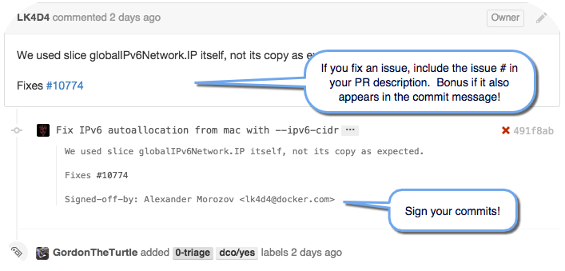

If you'd like to improve the code of any of Docker's projects, we would love to
have your contributions. All of our projects' code <a href="https://github.com/docker" target="_blank">repositories are on GitHub</a>.

If you want to contribute to the `docker/docker` repository you should be
familiar with or invested in learning Go or the Markdown language.  If you
know other languages, investigate our other repositories&mdash;not all of them
run on Go.

# Code contribution workflow

Below is the general workflow for contributing Docker code or documentation.
If you are an experienced open source contributor you may be familiar with this
workflow. If you are new or just need reminders, the steps below link to more
detailed documentation in Docker's project contributors guide.

1. <a href="/opensource/project/software-required/"
target="_blank">Get the software</a> you need.

	This explains how to install a couple of tools used in our development
	environment.  What you need (or don't need) might surprise you.

2. <a href="/opensource/project/set-up-git/"
target="_blank">Configure Git and fork the repo</a>.

	Your Git configuration can make it easier for you to contribute.
	Configuration is especially key if you are new to contributing or to Docker.

3. <a href="/opensource/project/set-up-dev-env/"
target="_blank">Learn to work with the Docker development container</a>.

	Docker developers run `docker` in `docker`.  If you are a geek,
	this is a pretty cool experience.
4. <a href="/opensource/workflow/find-an-issue/"
target="_blank">Claim an issue</a> to work on.

	We created a filter listing <a href="http://goo.gl/Hsp2mk" target="_blank">all open
	and unclaimed issues</a> for Docker.

5. <a
href="/opensource/workflow/work-issue/" target="_blank">Work on the
issue</a>.

	If you change or add code or docs to a project, you should test your changes
	as you work. This page explains <a
	href="/opensource/project/test-and-docs/" target="_blank">how to
	test in our development environment</a>.

	Also, remember to always **sign your commits** as you work! To sign your
	commits, include the `-s` flag in your commit like this:

		$ git commit -s -m "Add commit with signature example"

	If you don't sign <a href="https://twitter.com/gordontheturtle"
	target="_blank">Gordon</a> will get you!

6. <a href="/opensource/workflow/create-pr/" target="_blank">Create a
pull request</a>.

	If you make a change to fix an issue, add reference to the issue in the pull
	request. Here is an example of a perfect pull request with a good description,
	issue reference, and signature in the commit:

	

	We also have checklist that describes [what each pull request
	needs](code.md#what-is-the-pre-pull-request-checklist).

7. <a href="/opensource/workflow/review-pr/"
target="_blank">Participate in the pull request review</a> till a successful
merge.