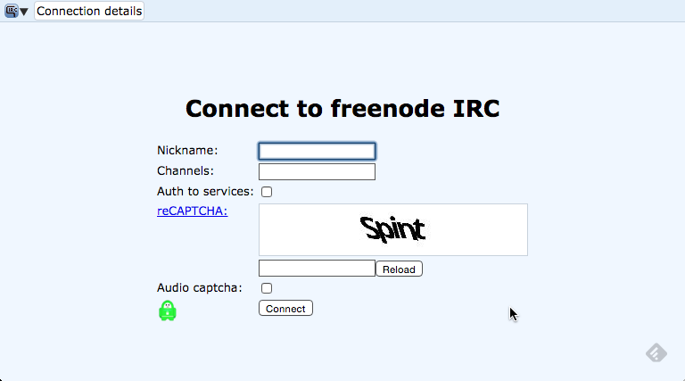
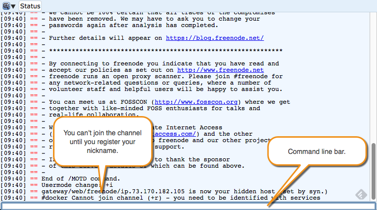
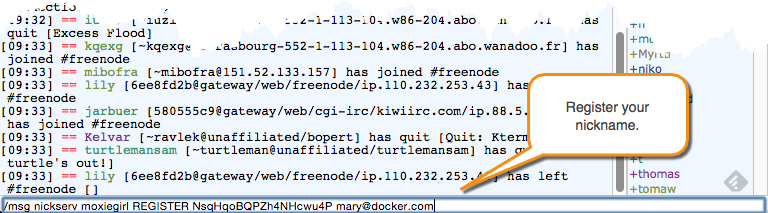
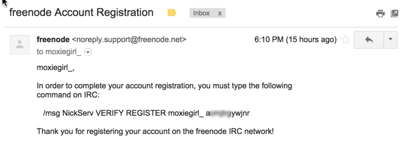
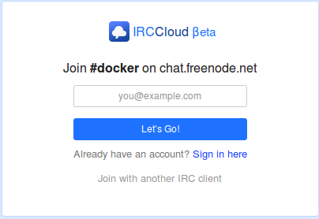
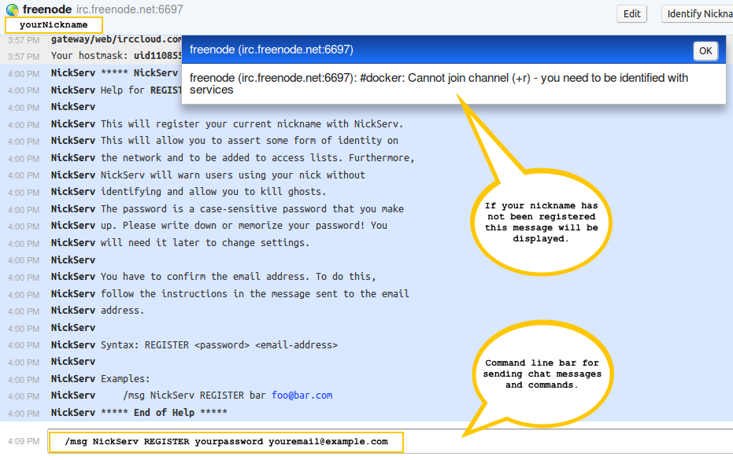
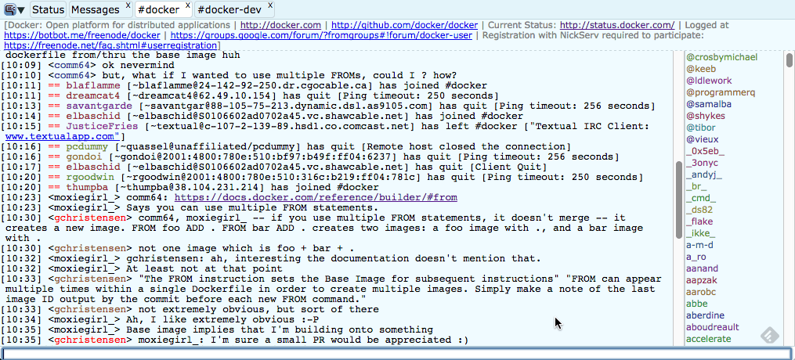

<style type="text/css">
/* @TODO add 'no-zebra' table-style to the docs-base stylesheet */
/* Table without "zebra" striping */
.content-body table.no-zebra tr {
  background-color: transparent;
}
</style>

There are several communications channels you can use to chat with Docker
community members and developers.

<table>
  <col width="25%">
  <col width="75%">
    <tr>
    <td>Forum</td>
    <td>
      The <a href="https://forums.docker.com/"
      target="_blank">Docker Community Forum</a> is for contributors and others working with Docker software or projects.
    </td>
  </tr>
  <tr>
    <td>Internet Relay Chat (IRC)</td>
    <td>
      <p>
        IRC a direct line to our most knowledgeable Docker users.
        The <code>#docker</code> and <code>#docker-dev</code> group on
        <strong>chat.freenode.net</strong>. IRC was first created in 1988.
        So, it is a rich chat protocol but it can overwhelm new users. You can search
        <a href="https://botbot.me/freenode/docker/#" target="_blank">our chat archives</a>.
      </p>
      Use our IRC quickstart guide below for easy ways to get started with IRC.
    </td>
  </tr>
  <tr>
    <td>Twitter</td>
    <td>
      You can follow <a href="https://twitter.com/docker/" target="_blank">Docker's twitter</a>
      to get updates on our products. You can also tweet us questions or just
      share blogs or stories.
    </td>
  </tr>
  <tr>
    <td>Stack Overflow</td>
    <td>
      Stack Overflow has over 7000K Docker questions listed. We regularly
      monitor <a href="http://stackoverflow.com/search?tab=newest&q=docker" target="_blank">Docker questions</a>
      and so do many other knowledgeable Docker users.
    </td>
  </tr>
</table>


# IRC Quickstart

The following instructions show you how to register with two web based IRC
tools. Use one illustrated here or find another. While these instructions are
only for two IRC web clients there are many IRC Clients available on most
platforms.

## Webchat

Using Webchat from Freenode.net is a quick and easy way to get chatting. To
register:

1.  In your browser open
    [https://webchat.freenode.net](https://webchat.freenode.net){: target="_blank" class="_" }.

    

2.  Fill out the form.

    | Field     | Value                                                        |
    |-----------|--------------------------------------------------------------|
    | Nickname  | The short name you want to be known as on IRC chat channels. |
    | Channels  | The list of channels to join. Start with `#docker`.          |
    | reCAPTCHA | A field to protect against spammers. Enter the value shown.  |

3.  Click on the "Connect" button.

    The browser connects you to Webchat. You'll see a lot of text. At the bottom of
    the Webchat web page is a command line bar. Just above the command line bar
    a message is shown asking you to register.

    

4.  Register your nickname by entering the following command in the
    command line bar:

    ```none
    /msg NickServ REGISTER yourpassword youremail@example.com
    ```

    

    This command line bar is also the entry field that you will use for entering
    chat messages into IRC chat channels after you have registered and joined a
    chat channel.

    After entering the `REGISTER` command, an email is sent to the email address
    that you provided. This email will contain instructions for completing
    your registration.

5.  Open your email client and look for the email.

    

6.  Back in the browser, complete the registration according to the email by entering
    the following command into the webchat command line bar:

    ```none
    /msg NickServ VERIFY REGISTER yournickname somecode
    ```

    Your nickname is now registered to chat on freenode.net.

[Jump ahead to tips to join a docker channel and start chatting](get-help.md#tips).

## IRCCloud

IRCCloud is a web-based IRC client service that is hosted in the cloud. This is
a Freemium product, meaning the free version is limited and you can pay for more
features. To use IRCCloud:

1.  Click
    [here](https://www.irccloud.com/invite?channel=%23docker&amp;hostname=chat.freenode.net&amp;port=6697){: target="_blank" class="_" }
    to join the `#docker` channel on chat.freenode.net.

    The following web page is displayed in your browser:

    

2.  If this is your first time using IRCCloud, enter a valid email address in the
    form.
    
    If you already registered with IRCCloud, select the **sign in here** link.
    
    You may have a cookie stored on your web browser that enables a quick
    start **let's go** link instead of the above form. In this case, select the
    **let's go** link and [jump ahead to start chatting](get-help.md#start-chatting).

3.  After entering your email address in the form, check your email for an invite
    from IRCCloud and follow the instructions provided in the email.

4.  The instructions in the invite email take you to an IRCCloud Client web page in
    your browser:

    

    The message shown above indicates that you need to register your
    nickname.

5.  To register your nickname, enter the following command into the command line bar
    at the bottom of the IRCCloud client:

    ```none
    /msg NickServ REGISTER yourpassword youremail@example.com
    ```

    This command line bar is for chatting and entering in IRC commands.

6.  Check your email for an invite to `freenode.net`:

    

7.  Complete the registration according to the email.

    ```none
    /msg NickServ VERIFY REGISTER yournickname somecode
    ```

## Tips

The procedures in this section apply to both IRC clients.

### Set a nickname

Next time you return to log into chat, you may need to re-enter your password
on the command line using this command:

```none
/msg NickServ identify <password>
```

With Webchat if you forget or lose your password you'll need to join the
`#freenode` channel and request them to reset it for you.

### Join a Docker Channel

Join the `#docker` group using the following command in the command line bar of
your IRC Client:

```none
/j #docker
```

You can also join the `#docker-dev` group.

### Start chatting

To ask questions to the group, type messages in the command line bar:



## Learn more about IRC

This quickstart gets started with IRC. If you find
IRC useful, there is more to learn. Drupal, another open source project,
has
[a great IRC guide](https://www.drupal.org/irc/setting-up){: target="_blank" class="_" }.
(thanks Drupal!).
