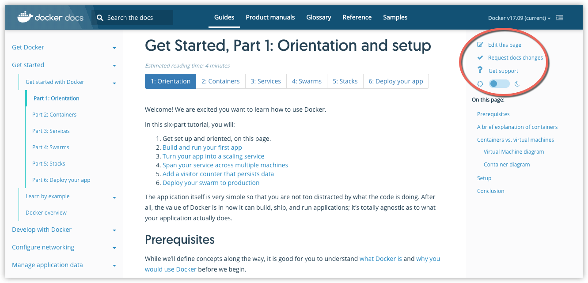

Contributing to the Docker documentation can be a rewarding experience. When you
offer feedback, questions, edits, or new content, you help us, the projects you
work on, and the larger Docker community.

We welcome your particpation to help make the documentation better!

## How to contribute to the docs

The Docker product documentation is published at
[docs.docker.com](https://docs.docker.com/).

There are many ways to contribute:

- Edit, rate, or file an issue or question directly on the site by
using the links available on the right-side menu on every page
at [docs.docker.com](https://docs.docker.com/).

  

- File a documentation issue on GitHub at
[https://github.com/docker/docker.github.io/issues](https://github.com/docker/docker.github.io/issues).

- Fork the documentation, make changes or add new content on your local branch, and submit a pull request (PR) to the master branch for the docs.

To learn more, see these topics:

- [README on docker/docker.github.io](https://github.com/docker/docker.github.io/blob/master/README.md)

- [Docs Test page](https://docs.docker.com/test/) - This is on the
published site. It explains how to use Docs components, resources, and
formats, and gives us a way to test and demo them.

## Looking for the open source Moby project?

Docker [introduced the Moby
project](https://blog.docker.com/2017/04/introducing-the-moby-project/) to
promote continued collaboration, experimentation, and development of
container-based systems in a broader community of system builders.

You can read about the Moby project, the open framework, and components at
[mobyproject.org](https://mobyproject.org/).

The Moby project lives [here](https://github.com/moby/moby).

See [Contribute to the Moby
project](https://github.com/moby/moby/blob/master/CONTRIBUTING.md) to learn how
to help work on the codebase.

### Legacy fun

For practice with GitHub and contributing to a codebase, read through
[Contribute to Kitematic](/opensource/kitematic/index.md) which incorporates the
kind of walkthrough that we originally provided as a contributor guide here.
See also, the [Kitematic
README](https://github.com/docker/kitematic/blob/master/README.md), and the
[Kitematic user guide](/kitematic/userguide.md).
