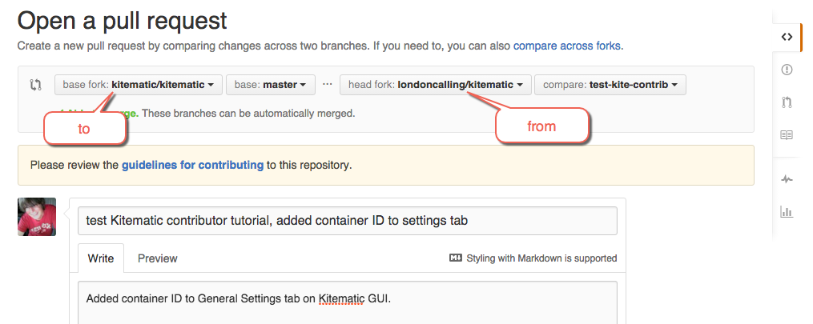
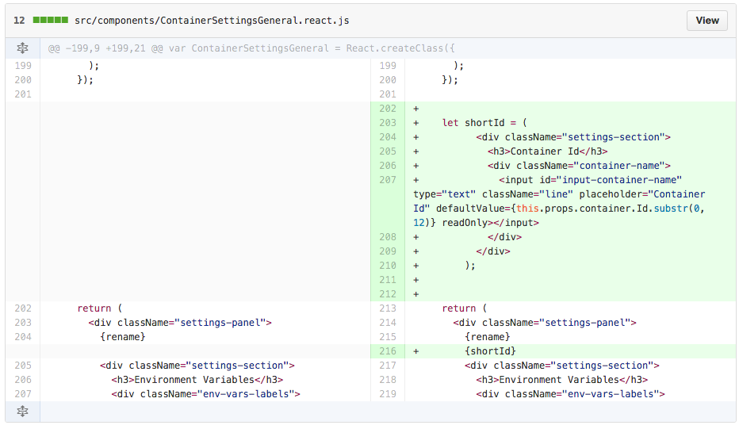
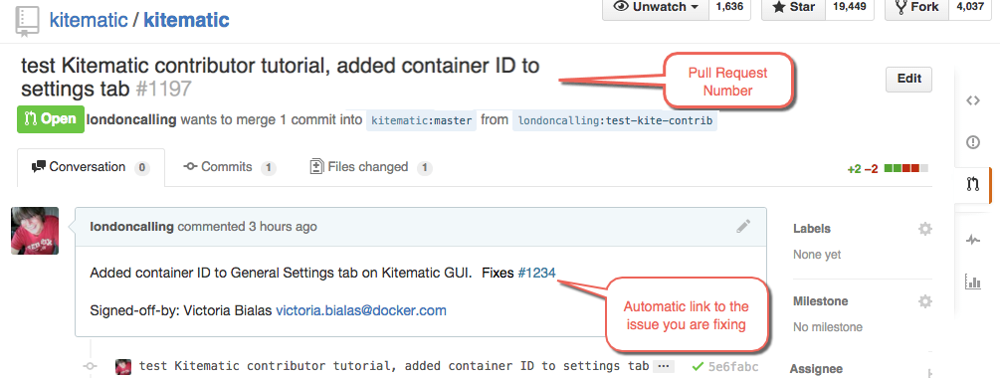

Make sure you follow the [rebase
guidelines](/opensource/workflow/create-pr/#rebase-your-branch) before you make
a pull request. Rebasing helps verify that your commit is clean, and allows for
an easier and faster merge of your code.

Once you've cleaned up your commits:

1. Push your code to your repository under the same name as your local branch (in the case of this example, 1191-branch).

        $ git push origin 1191-branch:1191-branch

2. Open a web browser to your fork on GitHub.

    You should see the latest activity from your branch.

3. Click **Compare & pull request**.

    The system displays the pull request dialog.

    

    The pull request compares your changes to the `master` branch on the
    `kitematic/kitematic` repository.

4. Edit the pull request description and add a reference to the issue you are fixing.

    GitHub helps you out by searching for the issue as you type.

    

5. Scroll down and verify the PR contains the commits and changes you expect.

    For example, is the file count correct? Are the changes in the files what
    you expect?

    

6. Click **Create pull request**.

    The system creates the request and opens it for you in the `kitematic/kitematic`
    repository.

    

## Where to go next

Congratulations! You've created your first pull request to Kitematic!

The next step in this process is to participate in your PR's review. To learn more, and try another development exercise, see [where to learn more](next_steps.md).
