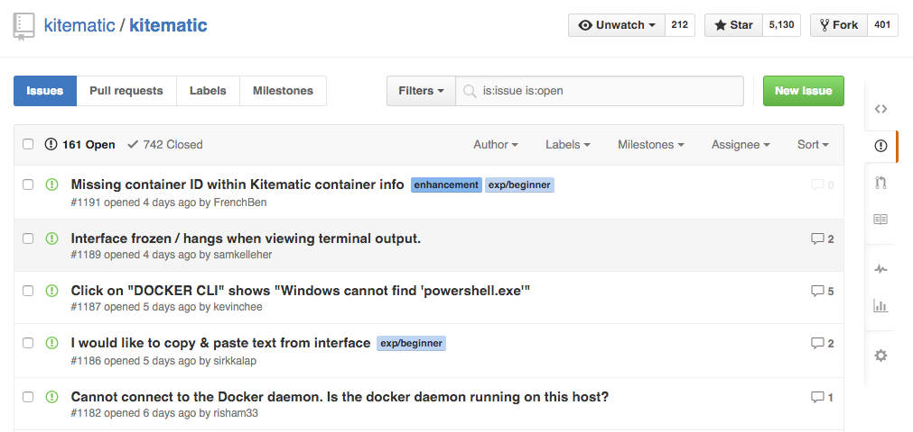

Currently, the Kitematic GUI shows the name of a selected container, but not the
ID. The tour shows you how to improve the GUI by adding the container ID to the
display items, and integrate the updates into the codebase.

To find and claim an issue you want to work on:

1. Go to the `docker/kitematic` <a href="https://github.com/docker/kitematic" target="_blank">repository</a>.

2. Click the **Issues** link.

    A list of the open issues appears.

    

3. From the "Labels" drop-down, select <strong class="gh-label beginner">exp/beginner</strong>.

    The system filters to show only open <strong class="gh-label beginner">exp/beginner</strong> issues.

4. Open an issue that interests you.

    The comments on the issues describe the problem and can provide information for a potential solution.

    For this exercise we will select the issue <a href="https://github.com/docker/kitematic/issues/1191" target="_blank">#1191 Missing container id</a>.

5. When you find an open issue that both interests you and is unclaimed, add a
`#dibs` comment. Make sure that no other user has chosen to work on the issue.

    The project does not permit external contributors to assign issues to themselves. Read the comments to find if a user claimed the issue by leaving a `#dibs` comment on the issue.

6. Make a note of the issue number; you will need it for later.

## Where to go next

Go to next section to learn [Set up your Kitematic development
environment](set_up_dev.md).

(For more about working with open source issues in Docker, see <a href="/opensource/workflow/find-an-issue/" target="_blank">Find an issue</a> and <a href="https://github.com/moby/moby/blob/master/CONTRIBUTING.md" target="_blank"> Docker Contributing Guidelines</a>.)