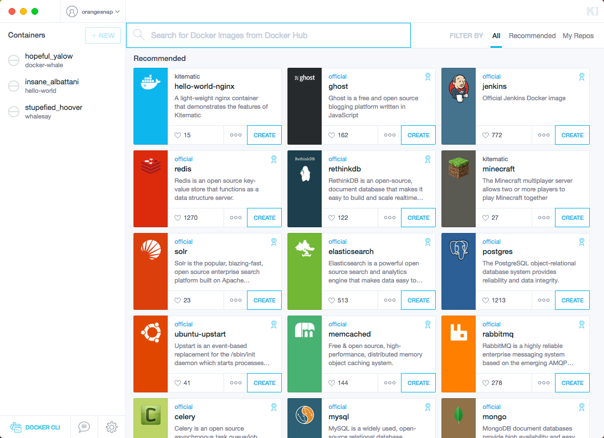

Kitematic is an open source project that simplifies the Docker experience. It
automates Docker installation and setup, and provides an interactive graphical
user interface (GUI) for working with containers. You can use Kitematic to create, run, and manage Docker containers, and find public images on Docker Hub.

See the <a href="/kitematic/userguide" target="_blank"> Kitematic user guide</a> to learn more about it from a user perspective.

## We welcome your contributions!

We'd like to see Kitematic evolve
with community contributed add-ons, extensions, themes, plug-ins, and cool, new
features.

## Start the developer tour

If you're new to working with Docker open source projects or new to
the Kitematic codebase, this quick tour will help you get started. Follow along with these steps to set up your Kitematic development environment and practice working on an example issue.

1. [Find a Kitematic issue on GitHub and fork](find_issue.md)
2. [Set up your Kitematic development environment and clone the repository](set_up_dev.md)
3. [Develop in Kitematic (work on an issue)](work_issue.md)
4. [Review your branch and create a pull request (PR)](create_pr.md)
5. [Where to learn more](next_steps.md)

## Where to go next

[Find an issue on GitHub](find_issue.md) to get started.