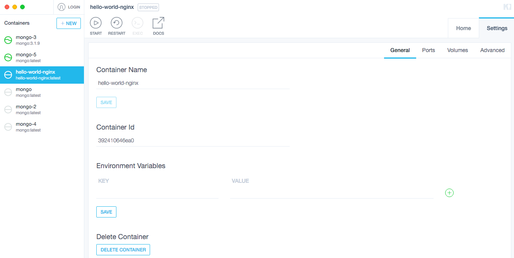

You've just created your first pull request to Kitematic!

The next
step is to learn how to <a href="/opensource/workflow/review-pr/" target="_blank">participate in your PR's
review</a>.

## Take the development challenge

Now that you’ve had some practice, try adding another feature to Kitematic on your own.

As you learned in the previous exercise, adding the container id to the container Settings tab is fairly simple.

Let's provide another missing piece of information for Kitematic users:

"_When I look at an active container in Kitematic, I want to know what command the container is currently running_."

In a terminal window, users can get this by looking at running containers with: `docker ps`

As an exercise, implement the code changes needed to display the current container's running command. When you are ready to share the new mini feature, create a PR for it.

## Learn more about open source
To learn more about contributing to Docker open source projects, see:

* <a href="/opensource/project/who-written-for/" target="_blank">
 README First</a>

* <a href="/opensource/code/" target="_blank"> Quick Start contribution </a>

* <a href="/opensource/workflow/make-a-contribution/" target="_blank"> Understand how to contribute </a>