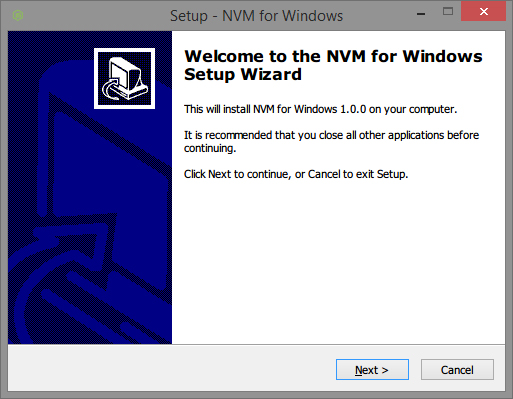

Kitematic is built on top of:

* <a href="http://electron.atom.io/" target="_blank"> Electron </a>

* <a href="https://nodejs.org" target="_blank"> Node.js </a>

* <a href="https://facebook.github.io/react/" target="_blank"> React </a> and <a href="https://facebook.github.io/react/" target="_blank"> AltJS </a> (which follows the Flux pattern)

## Download and install NVM

To get started, you will need to install Node.js v4.2.1. Using Node Version Manager (NVM) makes the Node.js install easy.

### Windows:

1.  Download <a href="https://github.com/coreybutler/nvm-windows/releases/"
target="_blank">latest release</a>.

2.  Follow the installer steps to get NVM installed. Please note, you need to
uninstall any existing versions of node.js before installing NVM for Windows;
the above installer link will have an uninstaller available.

    

### macOS/Linux:

1.  Open a terminal window.

2.  Copy and paste the following install script:

    ```
    curl -o- https://raw.githubusercontent.com/creationix/nvm/v0.29.0/install.sh | bash
    ```

3.  To activate nvm, close the terminal window and re-open a new one.

    (Alternatively, you can source nvm from your current shell with the command `. ~/.nvm/nvm.sh`.)

(To learn more about working with NVM, see <a href="https://github.com/creationix/nvm" target="_blank">macOS/Linux official nvm repo</a>, <a href="https://github.com/coreybutler/nvm-windows" target="_blank">Windows official nvm repo</a>, and <a href="https://www.digitalocean.com/community/tutorials/how-to-install-node-js-with-nvm-node-version-manager-on-a-vps" target="_blank">How To Install Node.js with NVM ON A VPS</a>.)

## Install Node.js

1.  Install the proper Node.js version.

    ```
    $ nvm install v4.2.1
    ```

2.  Make this version the default.

    ```
    $ nvm alias default v4.2.1
    ```

3.  Run `node --version` to confirm that you are now using the proper Node.js version.

    ```
    $ node --version
    ```

## Fork the master branch of Kitematic

To fork the master branch of Kitematic:

1.  Go to the <a href="https://github.com/docker/kitematic" target="_blank">docker/kitematic repository </a>.

2.  Click **Fork** in the upper right corner of the GitHub interface.

    GitHub forks the repository to your GitHub account. The original
    `docker/kitematic` repository becomes a new fork `YOUR_ACCOUNT/kitematic`
    under your account.

3.  Copy your fork's clone URL from GitHub.

    GitHub allows you to use HTTPS or SSH protocols for clones. You can use the `git` command line or clients like Subversion to clone a repository. This guide assume you are using the HTTPS protocol and the `git` command line. If you are comfortable with SSH and some other tool, feel free to use that instead. You'll need to convert what you see in the guide to what is appropriate to your tool.

## Clone your repository locally and create a branch

To clone your repository and create a branch for the issue:

1.  Open a terminal window on your local host and change to your home directory.

    ```
    $ cd ~
    ```

    In Windows, you'll work in your Docker Quickstart Terminal window instead of Powershell or a `cmd` window.

2.  Create a directory for your new repository and change into that directory.

3.  From the root of your repository, clone the fork to your local host.

    ```
    $ git clone https://github.com/YOUR_USERNAME/kitematic.git
    ```

4. Create and checkout a branch for the issue you will be working on.

    ```
    $ git checkout -b 1191-branch
    ```

    As previously mentioned, issue <a href="https://github.com/docker/kitematic/issues/1191" target="_blank">#1191</a> is set up as an example to use for this exercise.

## Set up your signature and upstream remote

You can set your signature globally or locally.

1.  Set your `user.name` for the repository.

    ```
    $ git config --local user.name "FirstName LastName"
    ```

2.  Set your `user.email` for the repository.

    ```
    $ git config --local user.email "emailname@mycompany.com"
    ```

3.  Check the result in your `git` configuration.

    ```
    $ git config --local --list
    ```

4.  Set your local repository to track changes upstream, on the `kitematic` repository.

    ```
    $ git remote add upstream https://github.com/docker/kitematic.git
    ```

(To learn more, see <a
href="/opensource/project/set-up-git/#set-your-signature-and-an-upstream-remote" target="_blank"> Set up your signature and an upstream remote</a>.)

## Install dependencies, start Kitematic, and verify your setup
Your Node.js install includes npm for package management. You'll use it to install supporting packages and start the app.

1.  Verify that the package manager is running and check the version (at the time of this writing, v2.14.7).

    ```
    $ npm --version
    ```

2.  Install the package dependencies.

    ```
    $ npm install
    ```

3.  From the root of your kitematic repository, use the package manager to start Kitematic and confirm everything went well.

    ```
    $ npm start
    ```

All of the core files in Kitematic are in the `src` folder, which then
follows the AltJS structure of:

```
kitematic/
|--src/
    |--actions/
    |  |--MyActions.js
    |--stores/
    |  |--MyStore.js
    |--components/
    |  |--MyComponent.react.js
```

The `components` folder is where the layout files are, the `stores` represent the application logic, and `actions` are the dispatcher for actions taken within the `components`.

## Where to go next

You are ready to start working on the issue. Go to [Develop in Kitematic (work
on an issue)](work_issue.md).
