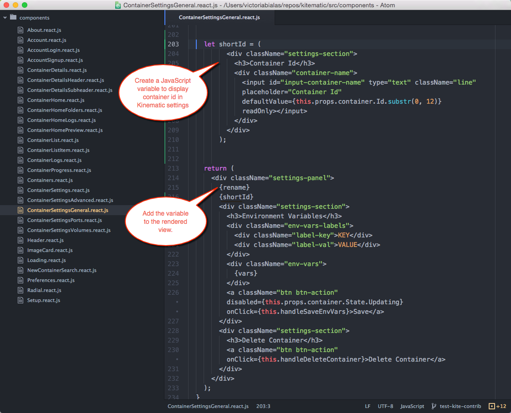

For this tutorial, we will work on issue <a href="https://github.com/docker/kitematic/issues/1191" target="_blank"> #1191</a> which is a request to display the container id in Kitematic for easy identification. (Currently, Kitematic shows the container name but not the id.)

To do this, edit the container `General Settings` layout.

1.  Open the project in your favorite editor - We recommend using <a href="https://atom.io/" target="_blank"> Atom</a> as it's a full featured editor with great <a href="http://eslint.org/" target="_blank"> ES lint</a> support to keep your code organized.

2.  Open the `ContainerSettingsGeneral.react.js` file which is found under the `src/components/` folder and look for the following piece of code, which is in fact the layout (like HTML in the browser) circa line ~200:

    ```
    return (
        <div className="settings-panel">
        ...
    ```


3.  Above this code we will create a javascript variable that will allow us to display  our container id:

    ```
    let shortId = (
        <div className="settings-section">
            <h3>Container Id</h3>
            <div className="container-name">
                <input id="input-container-name" type="text" className="line" placeholder="Container Id" defaultValue={this.props.container.Id.substr(0, 12)} readOnly></input>
            </div>
        </div>
    );
    ```

    This snippet has been saved as a <a href="https://gist.github.com/FrenchBen/0f514e7b3c584e8d46b5" target="_blank">GitHub gist</a>.

4.  We then need to add the variable to the rendered view, by adding it below the `{rename}` tag. The new render code should look something like:

    ```
    return (
        <div className="settings-panel">
            {rename}
            {shortId}
    ```

    At this point, the updated code should look similar to this:

    

5.  Save the code changes, re-start Kitematic.

    ```
    $ npm start
    ```

    Now, the container ID should show on the General Settings tab, along with the container name.

    

    *Note that the container ID in Kitematic matches the ID shown as output to the `docker ps` command.*

6.  You can close the Kitematic application now, and kill the running process in the terminal via CTRL+c.

7.  Stage your changes by adding them.

    ```
    $ git add src/components/ContainerSettingsGeneral.react.js
    ```

8.  Commit your code changes with a comment that explains what this fixes or closes.

    ```
    $ git commit -s -m "added container ID to show on settings tab, fixes issue #1191"
    ```

    (See <a href="https://github.com/docker/docker/blob/master/CONTRIBUTING.md#coding-style" target="_blank">Coding Style</a> in the general guidelines on <a href="https://github.com/docker/docker/blob/master/CONTRIBUTING.md" target="_blank">Contributing to Docker</a>.)

## Where to go next

At this point, you are ready to [Review your branch and create a pull request](create_pr.md) to merge your new feature into Kitematic.