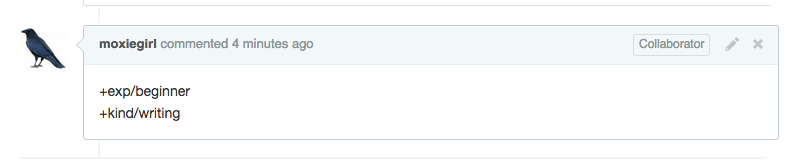

The Docker projects use GitHub issues to record issues and feature requests that
come in from contributors. Help us organize our work by triaging. Triage is the
process of reviewing incoming issue tickets, gathering more information about
the issue, and verifying whether or not the issue is valid.

You should triage if you want to discover which Docker features other contributors
think are important. Triage is a great choice if you have an interest
or experience in software product management or project management.

## What kind of issues can I triage?

Docker users and contributors create new issues if they want to:

* report a problem they had with Docker software
* request a new feature
* ask a question

## How do I triage?

Follow these steps:

1. Sign up for a [Github account](https://github.com).

2. Visit a Docker repository and press the **Watch** button.

   This tells GitHub to notify you of new issues. Depending on your settings,
   notification go to your GitHub or email inbox. Some of repositories you can watch are:

   | Repository | Description |
   |----------  |-------------|
   | [moby/moby](https://github.com/moby/moby) | Moby is the open-source application container engine, not including the API or CLI. |
   | [docker/cli](https://github.com/docker/cli) | Docker API and CLI source code and documentation generation scripts. |
   | [docker/machine](https://github.com/docker/machine) | Software for the easy and quick creation of Docker hosts on your computer, on cloud providers, and inside your own data center. |
   | [kitematic/kitematic](https://github.com/kitematic/kitematic) | Kitematic is a simple application for managing Docker containers on macOS and Windows. |
   | [docker/swarmkit](https://github.com/docker/swarmkit) | Orchestration for Docker. Deploy services and stacks (declarative definitions of groups of containers) to a cluster of Docker hosts. |
   | [docker/compose](https://github.com/docker/compose) | Define and run complex applications using one or many interlinked containers. |

   See [the complete list of Docker repositories](https://github.com/docker) on GitHub.

3. Choose an issue from the [list of untriaged issues](https://github.com/moby/moby/issues?q=is%3Aopen+is%3Aissue+-label%3Akind%2Fproposal+-label%3Akind%2Fenhancement+-label%3Akind%2Fbug+-label%3Akind%2Fcleanup+-label%3Akind%2Fgraphics+-label%3Akind%2Fwriting+-label%3Akind%2Fsecurity+-label%3Akind%2Fquestion+-label%3Akind%2Fimprovement+-label%3Akind%2Ffeature).

4. Follow [the triage process](https://github.com/moby/moby/blob/master/project/ISSUE-TRIAGE.md) to triage the issue.

   The triage process asks you to add both a `kind/` and a `exp/` label to each
   issue. Because you are not a Docker maintainer, you add these through comments.
   Simply add a `+label` keyword to an issue comment:

   

   For example, the `+exp/beginner` and `+kind/writing` labels would triage an issue as
   beginner writing task. For descriptions of valid labels, see [the triage process](https://github.com/moby/moby/blob/master/project/ISSUE-TRIAGE.md).

5. Triage another issue.
