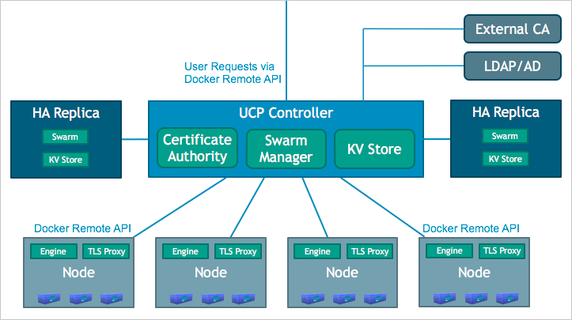

<!--[metadata]>
+++
title = "Plan a production installation"
description = "Learn about the Docker Universal Control Plane architecture, and the requirements to install it on production."
keywords = ["docker, ucp, install, checklist"]
[menu.main]
parent="mn_ucp"
weight=-90
+++
<![end-metadata]-->

# Plan a production installation

This article gives you an overview of the Docker Universal Control Plane (UCP)
architecture and its components. Here you'll also find all the information
you need to plan a UCP installation on a production environment.

The following topics are covered:

* [UCP architecture](#ucp-architecture)
* [The UCP installation](#the-ucp-installation)
* [Understand your installation options](#understand-your-installation-options)
* [Security Considerations](#security-considerations)
* [Docker Engine Configuration](#docker-engine-configuration)
* [Installation checklist](#installation-checklist)

## UCP architecture

Docker UCP is a cluster with multiple nodes, each running the
Commercially Supported (CS) Docker Engine.
In this cluster, there are 3 different types of nodes:

* [UCP controller node](#UCP-controller-node): the node that handles user
requests,
* [UCP replica nodes](#ucp-replica-nodes): replicas of the controller node
that can take its place if it fails,
* [UCP nodes](#ucp-nodes): the nodes that run your own containers.

#### UCP controller node

This is the node that handles user requests to UCP. Users interact with UCP
using a web browser, or a CLI client.

Below is a list of the containers that are deployed to the controller node,
when running the `ucp install` command:

| Container name    | Description                                                                               |
|:------------------|:------------------------------------------------------------------------------------------|
| ucp-controller    | Manages UCP resources, admin configuration, and user commands.                            |
| ucp-swarm-manager | Accepts requests the from UCP controller.                                                 |
| ucp-kv            | Internal node discovery, cluster configuration, and support for HA.                       |
| ucp-ca            | Allow external systems to reach UCP. Proxy for TLS.                                       |
| ucp-swarm-ca      | Allow external systems to reach UCP, Swarm, and Engine, using credentials. Proxy for TLS. |

#### UCP replica nodes

Docker UCP has support for high availability. You can configure replica nodes
to stand by, and be ready to take the place of the controller if it fails.

A cluster with N controller and replica nodes can only tolerate (N-1)/2 node
failures. So be sure to set up at least two replicas, when installing UCP for
production.

Below is a list of the containers that are deployed to the controller node,
when running the `ucp join --replica` command:

| Container name    | Description                                                         |
|:------------------|:--------------------------------------------------------------------|
| ucp-controller    | Manages UCP resources, admin configuration, and user commands.      |
| ucp-swarm-manager | Accepts requests from the UCP controller.                           |
| ucp-kv            | Internal node discovery, cluster configuration, and support for HA. |
| ucp-proxy         | Manages TLS and requests from swarm manager.                        |
| ucp-swarm-join    | Heartbeat for Swarm nodes to ensure they are running.               |

In UCP v1.0 the controller serves as root CA, and no other nodes are able to
sign certificates. If the controller fails, it might not be possible to add new
nodes to the cluster. [Learn more about high availability](understand_ha.md)

#### UCP nodes

These are the nodes that run your own containers. When you deploy
your containers using UCP, it spreads the load across these nodes. You can
configure the strategies used by UCP to deploy the containers across multiple
nodes.

Below is a list of the containers that are deployed to the controller node,
when running the `ucp join` command:

| Container name | Description                                           |
|:---------------|:------------------------------------------------------|
| ucp-proxy      | Manages TLS and requests from swarm manager.          |
| ucp-swarm-join | Heartbeat for Swarm nodes to ensure they are running. |

## The UCP installation

The UCP installation consists of using the Docker Engine CLI to run the `ucp`
tool. The `ucp` tool is a Docker image that can run subcommands like `install`
to install UCP on a node, or `join` to join a node to a UCP cluster.

The general format of these commands is:

| Docker client | run command with options | ucp image    | Subcommand with options |
|:--------------|:-------------------------|:-------------|:------------------------|
| `docker`      | `run --rm -it`           | `docker/ucp` | `install --help`        |
| `docker`      | `run --rm -it`           | `docker/ucp` | `join --help`           |
| `docker`      | `run --rm -it`           | `docker/ucp` | `uninstall --help`      |

You can use the `ucp` tool interactively, by passing them the `-i` option, or
non-interactively, by passing command-line options.

To list all the possible subcommands for the `ucp` tool, use:

    $ docker run --rm -it docker/ucp  --help

You can also find more information about the `ucp` command at the
[UCP tool reference page](reference/index.md).

The `ucp` tool pulls several images from Docker Hub, and runs them in
containers. The only change the `ucp` tool makes to your system, is
creating certificates under the
[data volumes you create when installing](#data-volumes-used).

## Understand your installation options

The best way to test-drive UCP is to install and run it on a sandbox.
The default options of the `ucp install` command, make it easy to test UCP.
[Learn how to install UCP on your local machine](evaluation-install.md).

When installing UCP for production, you'll want to ensure your installation
scales and is secure. You'll need to:

* Set up UCP for high availability,
* Customize some of the ports used,
* Customize the data volumes used,
* Use your own certificates.

[Learn how to install UCP in production](production-install.md).

## Installation checklist

Before installing UCP, make sure you have the following requirements:

* [Hardware and sofware requirements](#hardware-and-software-requirements)
* [Ports used](#ports-used)
* [IP addresses and fully-qualified domain names](#ip-addresses-and-fully-qualified-domain-names)
* [Subject alternative names (SANs)](#subject-alternative-names-sans)
* [Data volumes used](#data-volumes-used)

### Hardware and software requirements

You can install UCP on-premises or on a cloud provider such AWS or Digital
Ocean. To install UCP, all nodes must have:

* 1.50 GB of RAM
* 3.00 GB of available disk space
* One of the supported operating systems installed:
    * RHEL 7.0, 7.1
    * Ubuntu 14.04 LTS
    * CentOS 7.1
* Kernel version 3.10 or higher
* CS Docker Engine installed

If the `ucp` tool detects that your system doesn't have these
requirements, it displays a warning message.

### Ports used

The following ports are using on UCP installation:

| Hosts                       | Direction | Port                | Purpose                                                     |
|:----------------------------|:---------:|:--------------------|:------------------------------------------------------------|
| controller, replicas        |    in     | 443  (configurable) | web app and CLI client access to UCP.                       |
| controller, replicas        |    in     | 2376 (configurable) | swarm manager accepts requests from UCP controller.         |
| controller, replicas, nodes |    in     | 2375                | heartbeat for nodes, to ensure they are running.            |
| controller, replicas, nodes |    in     | 12376               | proxy for TLS, provides access to UCP, Swarm, and Engine.   |
| controller, replicas        |    in     | 12379               | internal node configuration, cluster configuration, and HA. |
| controller, replicas        |    in     | 12380               | internal node configuration, cluster configuration, and HA. |
| controller                  |    in     | 12381               | proxy for TLS, provides access to UCP.                      |
| controller                  |    in     | 12382               | manages TLS and requests from swarm manager.                |
| controller, replicas        |    out    | 443                 | send anonymous usage reports to Docker.                     |

UCP collects anonymous data on the usage of UCP and reports to Docker.
This data is entirely anonymous and does not identify your company or users.
You can disable this at any time on the UCP settings screen.

### IP addresses and fully-qualified domain names

The `ucp install` command tries to use your network configurations to find
the fully-qualified domain names (FQDN) of your hosts.

If you haven't set up your network with FQDNs, the installer might not be able
to find the FQDN for the host. If that happens, you'll be prompted for an
accessible host address. You can also use the `--host-address` option to
specify the FQDN to the install command.

If you're installing UCP on a cloud provider such as AWS or Digital Ocean,
you might need to create a private network for you UCP installation. In that
case, make sure all nodes of the cluster can communicate using their private
IPs.

If the nodes in the cluster cannot communicate using the private IPs,
you'll need to use public IPs or Fully Qualified Domain Names.
[Check the ports used](#ports-used) by UCP.

If you are using a cloud provider such as AWS or Digital Ocean, you may need to
create a private network for your UCP installation. You can use this network
as long as the controller and nodes can communicate via
their private IPs. If the private IPs do not support communication among the
UCP cluster, using public IPs or full-qualified domain names are required. For
more information about what ports and protocols are required see
[Step 2: Configure your network for UCP](#step-2-configure-your-network-for-ucp).

### Subject alternative names (SANs)

All the communication between the nodes is protected by mutual TLS. The UCP
installation configures TLS for you automatically.

For that, UCP requires that all clients, including the Docker Engine, use a
Swarm TLS certificate chain signed by the UCP Swarm Root CA. You provide the
certificate system with subject alternative names or SANs. The SANs are used to
set up individual "leaf certificates."

When using the `ucp install` or `ucp join` commands interactively, you are
prompted for the subject alternative names of the host. This can be a public
IP address, or fully-qualified domain name.
You can also send the `--san` option to specify the SANs for a host.

### Data volumes used

UCP uses named volumes for persistence of data. When installing UCP for
production, you need to create the following volumes:

| Volume name                | Data                                                                                                           |
|:---------------------------|:---------------------------------------------------------------------------------------------------------------|
| ucp-root-ca                | The certificate and key for the UCP root CA. Do not create this volume if you are using your own certificates. |
| ucp-swarm-root-ca          | The certificate and key for the Swarm root CA.                                                                 |
| ucp-server-certs           | The controller certificates for the UCP controllers web server.                                                |
| ucp-swarm-node-certs       | The Swarm certificates for the current node (repeated on every node in the cluster).                           |
| ucp-swarm-kv-certs         | The Swarm KV client certificates for the current node (repeated on every node in the cluster).                 |
| ucp-swarm-controller-certs | The UCP Controller Swarm client certificates for the current node.                                             |
| ucp-kv                     | Key value store persistence.                                                                                   |

If you don't create these volumes, the `ucp install` command creates them for
you with the default volume driver and flags.

## Where to go next

* [Test-drive Docker UCP by installing it on a sandbox](evaluation-install.md)
* [Install Docker UCP on production](production-install.md)
