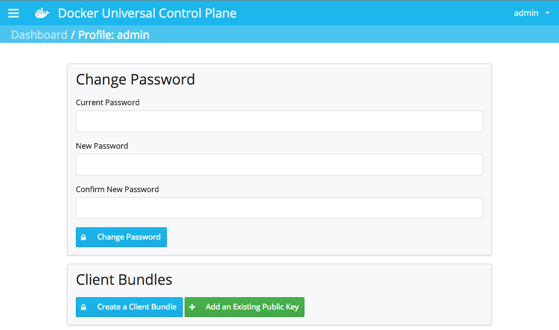

<!--[metadata]>
+++
title = "Install UCP for production"
description = "Learn how to install Docker Universal Control Plane on production"
keywords = ["Universal Control Plane, UCP, install"]
[menu.main]
parent="mn_ucp"
weight=-85
+++
<![end-metadata]-->

# Install UCP for production

This page explains how to install Docker Universal Control Plane (UCP) on a
production environment. A Docker UCP installation, consists of:

* A controller node where UCP is running,
* Replicas of the controller node, for high-availability,
* One or more nodes used to run your containers.

The controller node can serve as a controller and also run your containers.
These instructions show you how to install both a controller and a node. It
contains the following sections:

- [Step 1: Prepare your installation](#step-1-prepare-your-installation)
- [Step 2: Configure your network for UCP](#step-2-configure-your-network-for-ucp)
- [Step 3: Install Docker CS Engine on each node](#step-3-install-docker-cs-engine-on-each-node)
- [Step 4: Create user-named volumes](#step-4-customize-user-named-volumes-optional)
- [Step 5: Customize the CA used](#step-5-customize-the-ca-used-optional)
- [Step 6: Install the UCP controller](#step-6-install-the-ucp-controller)
- [Step 7: License your installation](#step-7-license-your-installation)
- [Step 8: Add controller replicas to the UCP cluster](#step-8-add-controller-replicas-to-the-ucp-cluster)
- [Step 9: Add more nodes to the UCP cluster](#step-9-add-more-nodes-to-the-ucp-cluster)
- [Step 10: Set up certificates for the Docker CLI](#step-10-set-up-certificates-for-the-docker-cli)
- [Disable collection of usage metrics](#disable-collection-of-usage-metrics)
- [Uninstall](#uninstall)
- [Where to go next](#where-to-go-next)

## About these installation instructions

These installation instructions were written using Ubuntu 14.0.3 running on
Amazon AWS, with Elastic IPs configured for all the hosts.

If you're installing UCP on another operating system, the paths and commands
might differ.

## Step 1: Prepare your installation

Before installing UCP, read the
[Plan a production installation](plan-production-install.md) guide.
If you haven't read the planning guide stop here, and go read it first.
There you'll find more information about the architecture of UCP, and the
requirements to install UCP for production.


The UCP installation consists of using the Docker Engine CLI to run the `ucp`
tool. The `ucp` tool is a Docker image that can run subcommands like `install`
to install UCP on a node, or `join` to join a node to a UCP cluster.
The general format of these commands is:

| Docker client | run command with options | ucp image    | Subcommand with options |
|:--------------|:-------------------------|:-------------|:------------------------|
| `docker`      | `run --rm -it`           | `docker/ucp` | `install --help`        |
| `docker`      | `run --rm -it`           | `docker/ucp` | `join --help`           |
| `docker`      | `run --rm -it`           | `docker/ucp` | `uninstall --help`      |

You can use the `ucp` tool interactively, by passing them the `-i` option, or
non-interactively, by passing command-line options. This guide uses the
interactive version.

To list all the possible subcommands for the `ucp` tool, use:


    $ docker run --rm -it docker/ucp  --help


## Step 2: Configure your network for UCP

Before installing UCP, you need to make sure all nodes in the cluster can
communicate. Configure your network to make sure these ports are open:

| Hosts                       | Direction | Port                | Purpose                                                     |
|:----------------------------|:---------:|:--------------------|:------------------------------------------------------------|
| controller, replicas        |    in     | 443  (configurable) | web app and CLI client access to UCP.                       |
| controller, replicas        |    in     | 2376 (configurable) | swarm manager accepts requests from UCP controller.         |
| controller, replicas, nodes |    in     | 2375                | heartbeat for nodes, to ensure they are running.            |
| controller, replicas, nodes |    in     | 12376               | proxy for TLS, provides access to UCP, Swarm, and Engine.   |
| controller, replicas        |    in     | 12379               | internal node configuration, cluster configuration, and HA. |
| controller, replicas        |    in     | 12380               | internal node configuration, cluster configuration, and HA. |
| controller                  |    in     | 12381               | proxy for TLS, provides access to UCP.                      |
| controller                  |    in     | 12382               | manages TLS and requests from swarm manager.                |
| controller, replicas        |    out    | 80                  | send anonymous usage reports to Docker.                     |

Some of the ports used, are customizable. Check the
[UCP install command reference](reference/install.md) for more
information on this. This guide uses the default ports.

## Step 3: Install Docker CS Engine on each node

UCP requires you to install Docker CS Engine 1.10 or above on all nodes of
your UCP cluster, including the controller node.

For each node, follow the Docker CS Engine installation instructions for your
particular operating system:

* [Red Hat Linux and CentOs installation
instructions](https://docs.docker.com/docker-trusted-registry/install/install-csengine/#centos-7-1-rhel-7-0-7-1-yum-based-systems)
* [Ubuntu installation
instructions](https://docs.docker.com/docker-trusted-registry/install/install-csengine/#install-on-ubuntu-14-04-lts)

## Step 4: Customize user-named volumes (optional)

UCP uses named volumes to persist user data:

| Volume name                 | Data                                                                                                           |
|:----------------------------|:---------------------------------------------------------------------------------------------------------------|
| ucp-client-root-ca          | The certificate and key for the UCP root CA. Do not create this volume if you are using your own certificates. |
| ucp-cluster-root-ca         | The certificate and key for the Swarm root CA.                                                                 |
| ucp-controller-server-certs | The controller certificates for the UCP controllers web server.                                                |
| ucp-node-certs              | The Swarm certificates for the current node (repeated on every node in the cluster).                           |
| ucp-kv-certs                | The Swarm KV client certificates for the current node (repeated on every node in the cluster).                 |
| ucp-controller-client-certs | The UCP Controller Swarm client certificates for the current node.                                             |
| ucp-kv                      | Key value store persistence.                                                                                   |

The `ucp install` command creates these volumes for you with the default
volume driver and flags.
If you want to use custom volume drivers, create these named-volumes before
installing UCP.


## Step 5: Customize the CA used (optional)

To protect your UCP cluster against unauthorized access, all components of
the cluster use mutual TLS. That way, for two components to talk, both need
to identify using certificates.

For this, UCP uses two different root Certificate Authorities:

* One CA is used to secure and authenticate the communications between
users and UCP,
* Another CA is used to secure the communications between all nodes that are
part of your UCP cluster.

All this is done automatically when installing UCP.

You can also customize UCP to use certificates signed by an external
Certificate Authority, for the UCP controller. That way you can
use a certificate from a CA that your browsers and client tools already trust.

To install UCP with your own external root CA:

1. Log into the machine where you intend to install UCP.

2. Make sure you have created a named volume called `ucp-controller-server-certs`.

3. Add the following files to the volume's top-level directory:

    | File     | Description                                                    |
    |:---------|:---------------------------------------------------------------|
    | ca.pem   | Your Root CA Certificate chain (including any intermediaries). |
    | cert.pem | Your signed UCP controller certificate.                        |
    | key.pem  | Your UCP controller private key.                               |

## Step 6: Install the UCP controller

During UCP installation, you will be prompted for the following information:

* A password to use for the UCP `admin` account.
* At least one Subject Alternative Name (SAN). This is the IP address or
fully-qualified domain name where you can reach this controller.

Be sure to have this information at hand before starting the installation.
If you're installing UCP on a cloud provider such as AWS, make sure your
instance has a public IP or hostname, as displayed below.


On the controller node, install UCP:

1. Review the options available on the `ucp install` command.

        $ docker run --rm -it docker/ucp install --help

    You can also find the documentation for these option on
    the [UCP install command reference](reference/install.md).

2. Run the `ucp` command interactively.

        $ docker run --rm -it --name ucp -v /var/run/docker.sock:/var/run/docker.sock docker/ucp install -i

    If you are using server certs signed by an external CA, include the `--external-server-cert` option at
    the end of the command.

    The command pulls several images from Docker Hub, and prompts you for the
    installation values it needs.
    When the installation is complete, the command asks you to log into UCP.

        INFO[0053] Login to UCP at https://52.70.188.239:443

## Step 7: License your installation

Now that your UCP controller is installed, download and apply the
license to your installation:

1. Navigate to [Docker Hub](https://hub.docker.com/) to download your license.
On the top-right menu, choose **Settings**.

    

2. Navigate to the **Licenses** tab.

    

    Download the license by clicking on it.

3. **Navigate to UCP** to apply the license.

    In your browser, navigate to the IP of the node where you installed the
    UCP controller. In this example, it's `https://52.70.188.239`.

    

    Your browser may warn that the connection to UCP is not secure. The warning
    appears because you are accessing UCP with HTTPS, but the certificates used
    by UCP were issued during the installation by a built-in certificate
    authority.

    If you're concerned about security, check the installation messages.
    You can use the server fingerprint displayed during the installation,
    and compare it with the certificate displayed on your browser.

4. **Login** with the admin username and the password you chose during
the installation.

    If you installed non-interactively, the default administrator
    credentials are *admin/orca*.

5. Apply your license file.

    After logging in, you're redirected to the licensing page. Click the
    **Upload License** button, and choose your license file.

    

6. Check the **Dashboard** page.

    After applying the license, you're redirected to the UCP dashboard. It
    should show that there's only a single node in your cluster:
    the controller node.

    

## Step 8: Add controller replicas to the UCP cluster

Docker UCP has support for high-availability. You set other nodes to be
replicas of the UCP controller, that way you can load-balance user requests
across the controller and replica nodes.

For High Availability (HA) installations:

* Configure the controller and replicas before adding additional nodes
to the cluster.
* Configure at least two replicas in addition to the controller.

    Keep in mind that with N controller and replicas, a cluster can only
    tolerate up to (N-1)/2 node failures.

    Also, in UCP v1.0 the controller serves as root CA. During a controller
    failure, it might not be possible to add more nodes to the cluster.
    [Learn more about high availability](understand_ha.md).


When adding replica nodes to your installation, you will be prompted for
the following information:

* The URL of the UCP controller node, for example `https://52.70.188.239`.
* The username/password of an UCP administrator account.
* At least one SAN value which is an accessible IP address or
fully-qualified domain name for the node.

Be sure to have this information at hand before using the `ucp join`
command to join the replica nodes to the cluster.

Review the options available on the `ucp join` command.

    $ docker run --rm -it docker/ucp join --help

You can also find the documentation for the `ucp join` command at
the [UCP join command reference](reference/join.md) page.

For each node that you want to turn into a controller replica:

1. Log into that node.

2. Run the `ucp join` command:

        $ docker run --rm -it --name ucp -v /var/run/docker.sock:/var/run/docker.sock docker/ucp join --replica -i

    The `join` command pulls several images and prompts you for the
    installation values it needs. When it completes, the command notifies
    you that it is starting Docker Swarm.

        INFO[0005] Verifying your system is compatible with UCP
        INFO[0011] Sending add host request to UCP server
        INFO[0011] Starting local swarm containers

3. Repeat steps 1 through 3 on the other nodes you want to set up as replicas.

    For high availability, make sure to configure a minimum of 3 controllers:
    a primary controller and two replicas. Never run a cluster with only
    the primary controller and a single replica.  

4. Log into UCP.

    The Dashboard page should now display your new replica nodes. In the
    bottom of the screen, you can see the health of the controller and replicas.

      


## Step 9: Add more nodes to the UCP cluster

Now you can add additional nodes to your UCP cluster. These are the nodes that
will be running your containers.

When adding nodes to your cluster, you will be prompted for the following
information:

* The URL of the UCP controller, for example `https://52.70.188.239`.
* The username/password of an UCP administrator account.
* At least one SAN value which is the actual external, publicly-accessible IP
address or fully-qualified domain name for node.

So be sure to have this information at hand. If you're installing UCP on a cloud
provider such as AWS, make sure your instance has a public IP or hostname.

Review the options available on the `ucp join` command:

    $ docker run --rm -it docker/ucp join --help

You can also find the documentation for the `ucp join` command on
the [UCP join command reference](reference/join.md) page.

For each node that you want to add to your UCP cluster:

1. Log into that node.

2. Run the `ucp join` command.

        $ docker run --rm -it --name ucp -v /var/run/docker.sock:/var/run/docker.sock docker/ucp join -i

    The `join` command pulls several images and prompts you for the
    installation values it needs. When it completes, the command notifies
    you that it is starting Docker Swarm.

        INFO[0005] Verifying your system is compatible with UCP
        INFO[0011] Sending add host request to UCP server
        INFO[0011] Starting local swarm containers

3. Repeat steps 1 and 2 on the other nodes you want to add to your UCP cluster.

4. Log into UCP with your browser and navigate to the **Nodes** page.

    The nodes page should now display all the nodes of your cluster.

    

## Step 10: Set up certificates for the Docker CLI

After installing UCP, you can run the `docker` command, against UCP
cluster nodes.
Since all traffic between users and UCP nodes is secure and authenticated,
when using the Docker CLI client, you'll need to provide client certificates.

You have two ways of downloading a bundle that contains the client certificates
for a user:

- Download them from the UCP web app, or
- Download them from the REST API, using the `curl` command.

### Download the client bundle from the UCP web app

1. If you haven't already done so, log into UCP.

2. Navigate to your profile.

    As an example, if you're logged in as the `Admin` user,
    on the right-hand menu, navigate to **Admin > Profile**.

3. Click the **Create Client Bundle** button.

    The browser downloads the `ucp-bundle-admin.zip` file.

### Download the client bundle using the REST API

You can download the client certificate bundle, using the UCP REST API. In
this example we'll be using `curl` for making the web requests to the API, and
`jq` to parse the responses from the API.

1. In the command line, log into a machine with network access to
the UCP controller.

    You might log into the controller node itself, or any machine that
    can `ping` it.

2. Install the `curl`, `zip`, `jq` packages if you don't have them.

    On Ubuntu, the installation looks like this:

    ```
    $ sudo apt-get install zip curl jq
    Reading package lists... Done
    Building dependency tree       
    Reading state information... Done
    The following extra packages will be installed:
      libcurl3
    The following NEW packages will be installed:
      jq zip
    The following packages will be upgraded:
      curl libcurl3
      ----output snipped----
    ```

3. Create an environment variable to hold your user security token.

    To connect to the UCP controller with `curl`, you must export your user
    security token from the UCP controller.

        $ AUTHTOKEN=$(curl -sk -d '{"username":"admin","password":"<password>"}' https://<ducp-0 IP>/auth/login | jq -r .auth_token)

4. Curl the client bundle down to your node.

        $ curl -k -H "Authorization: Bearer $AUTHTOKEN" https://<ducp-0 IP>/api/clientbundle -o bundle.zip

    Curl downloads a `bundle.zip` file to your working directory.

### Install the certificate bundle

Once you download the bundle, you can unzip and use it.

1. Make sure you have `zip` installed.

        $ which unzip
        /usr/bin/unzip

    If you don't, install it before continuing.

2. Open the folder containing the bundle file.

4. Unzip the file to reveal its contents.

    ```bash
    ucp-bundle
    ├── ca.pem
    ├── cert.pem
    ├── cert.pub
    ├── env.sh
    └── key.pem
    ```

5.  Set up your environment by running the `env.sh` file.

        $ source env.sh

6.  Use the `docker info` command to get the location of the Swarm
managers and engines.

    ```
    $ docker info
    Containers: 9
    Images: 9
    Role: primary
    Strategy: spread
    Filters: health, port, dependency, affinity, constraint
    Nodes: 1
     node1: 192.168.122.7:12376
      └ Containers: 9
      └ Reserved CPUs: 0 / 1
      └ Reserved Memory: 0 B / 2.054 GiB
      └ Labels: executiondriver=native-0.2, kernelversion=4.0.9-boot2docker, operatingsystem=Boot2Docker 1.8.1 (TCL 6.3); master : eb5571f - Thu Sep  3 22:18:54 UTC 2015, provider=kvm, storagedriver=aufs
    Cluster Managers: 1
     192.168.122.7: Healthy
      └ Orca Controller: https://192.168.122.7
      └ Swarm Manager: tcp://192.168.122.7:3376
      └ KV: etcd://192.168.122.7:12379
    CPUs: 1
    Total Memory: 2.054 GiB
    Name: node1
    ID: PNLT:MFCO:DDWL:MSLF:YVHU:35Z3:66KM:DFZM:OPBK:D4BQ:EKNT:6DXA
    Labels:
     com.docker.ucp.license_key=unlicensed
     com.docker.ucp.license_max_engines=0
     com.docker.ucp.license_expires=EXPIRED
    ```

### Client bundles with an externally managed CA

When using UCP with an external Certificate Authority, client bundles
for non-admin users won't be signed automatically. It is still possible to
manually issue certificates signed by the Certificate Authority, that UCP users
can use to interact with UCP with the CLI client.

1. Generate a 2048-bit RSA private key.

        $ openssl genrsa -out key.pem 2048

2. Generate a Certificate Signing Request (CSR).

    The output `cert.csr` should be provided to your organization's CA
    owner to be signed, with a minimum of client authentication usage.

        $ openssl req -new -sha256 -key key.pem -out cert.csr


3. Your CA owner signs the CSR, and provides the `cert.pem` and `ca.pem` files.

4. Extract the public key from the signed certificate:

        $ openssl x509 -pubkey -noout -in cert.pem  > cert.pub

5. Add the content of the `cert.pub` to your UCP profile.

    In the UCP web app, navigate to your **profile**, and click the **Add an
    Existing Public Key** button.

    

    Set a name, and the contents of the `cert.pub` file.

6. Set the necessary environment variables.

    Now that you have linked the public key to you account, you need to
    configure your CLI client. Set the following environment variables:

    ```
    export DOCKER_TLS_VERIFY=1
    export DOCKER_CERT_PATH=$(pwd)
    export DOCKER_HOST=tcp://<ucp-hostname>:443
    ```

## Disable collection of usage metrics

UCP collects anonymous usage metrics, to help us improve it.
These metrics are entirely anonymous, don't identify your company, users,
applications, or any other sensitive information.

To disable usage reporting:

1. Log into Docker UCP

2. Navigate to the **Settings** screen

3. In the **Anonymous Usage Reporting** section, toggle:
    * Enable hourly usage reporting, to send sending usage reports.
    * Enable API tracking, to send sending metrics on each API call.

4. Click the **Update Usage Reporting** button, to save your changes.

## Uninstall

To uninstall Docker UCP, use the `ucp uninstall` command. This command only
removes the UCP containers, and doesn't affect any other containers.
When uninstalling UCP from a cluster, leave the UCP controller node for last.

Review the options available on the `ucp uninstall` command.

    $ docker run --rm -it docker/ucp uninstall --help

You can also find the documentation for the `ucp uninstall` command at
the [UCP uninstall command reference](reference/uninstall.md) page.

To uninstall UCP from a node:

1. Login into the node you want to remove UCP from

2. Run the the following command:

    ```
    $ docker run --rm -it -v /var/run/docker.sock:/var/run/docker.sock --name ucp docker/ucp uninstall -i

    INFO[0000] Removing UCP Containers
    INFO[0001] Removing UCP images
    INFO[0007] Removing UCP volumes
    ```

    After uninstalling UCP, you can remove the `docker/ucp` images that
    were pulled from Docker Hub when installing UCP.

3. Repeat steps 1 and 2 on each node of the cluster. Make sure to save
the controller for last.

## Where to go next

* Read more [about Docker UCP](https://www.docker.com/universal-control-plane)
* Read more [about the Docker CLI client](http://docs.docker.com/reference/commandline/cli/)
* Learn [about Docker Swarm](http://docs.docker.com/swarm/)
